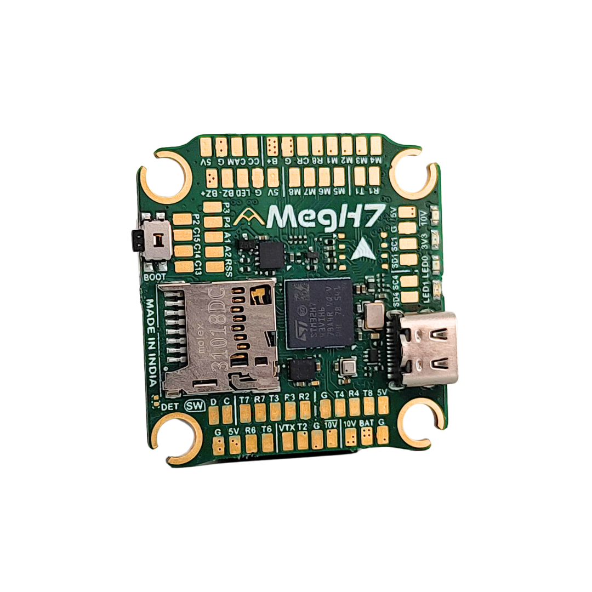

# Agam MegH7

<Badge type="tip" text="main (PX4 v2.0)" />

::: warning
PX4 does not manufacture this (or any) autopilot.
Contact the [manufacturer](https://www.agamrobotics.com/) for hardware support or compliance issues.
:::

The [Agam MegH7](https://www.agamrobotics.com/agammegh7) is an STM32H743 flight controller from [Agam Robotics](https://www.agamrobotics.com/), in a 30.5 x 30.5 mm form factor, with an onboard IMU, barometer, analog OSD, microSD slot, CAN bus and seven UARTs.
This page describes hardware revision v1.2.

The board has no internal magnetometer, and provides two external I2C buses for a GPS/compass module or other peripherals.



::: info
This flight controller is [manufacturer supported](../flight_controller/autopilot_manufacturer_supported.md).
:::

## Specifications {#specifications}

### Processor {#processor}

- **Main FMU processor:** [STM32H743VI](https://www.st.com/en/microcontrollers-microprocessors/stm32h743vi.html) (32-bit Arm Cortex-M7, 480 MHz, 2 MB flash, 1 MB RAM)

### Sensors {#sensors}

- **IMU:** ICM-45686 (SPI2)
- **Barometer:** BMP390 (I2C2)
- **Magnetometer:** none (connect an external compass to `GPS` or `I2C4`)
- **OSD:** AT7456E (SPI3)

### Interfaces {#interfaces}

- **PWM outputs:** 8, plus an addressable LED strip output on `B/LD`
- **Serial ports:** 7 (GPS1, TELEM1–TELEM4, RC, ESC telemetry)
- **I2C buses:** 3 (I2C2 internal; I2C1 on `GPS` and I2C4 external)
- **SPI buses:** SPI4 external on the `SPI4` connector
- **CAN buses:** 1
- **USB:** Type-C
- **RC input:** serial RC on `RX` (USART6)
- **Parameter storage:** microSD card (a card is required)
- **SD card:** microSD slot
- **ESC connector:** JST-SH 1.0 mm 8-pin (single or 4-in-1 ESCs, x8/octocopter compatible)
- **HD video connector:** JST-SH 1.0 mm 6-pin, for systems such as Caddx Vista and DJI Air Unit
- Optional onboard W25Q128 SPI flash on SPI1 (assembly option, not fitted on every board, not used by PX4)

### Electrical data {#electrical_data}

- **Input voltage:** 2S-8S
- **BEC outputs:** 5 V, 3 A continuous; 10 V, 3 A continuous
- **Power monitoring:** 1 analog battery voltage and current input

### Mechanical data {#mechanical_data}

- **Dimensions:** 37.5 x 39 x 8.8 mm
- **Weight:** 10 g
- **Mounting hole spacing:** 30.5 x 30.5 mm (Φ4 mm holes, with Φ3 mm grommets)

## Where to Buy {#store}

The board can be bought from:

- [Agam Robotics](https://www.agamrobotics.com/shop)

## Connectors

The `GPS`, `TELEM`, `CAN` and `RX` connectors are JST-GH 1.25 mm.
The `ESC`, `DIGI VTX`, `SPI4`, `I2C4` and `B/LD` connectors are JST-SH 1.0 mm.
Signal pins are 3.3 V.

| Connector  | Type         | Function                                          |
| ---------- | ------------ | ------------------------------------------------- |
| USB Type-C |              | Firmware and configuration                        |
| microSD    |              | Logging and parameter storage                     |
| ESC        | JST-SH 8-pin | Motor outputs, current sense, ESC telemetry       |
| GPS        | JST-GH 6-pin | GPS and I2C1                                      |
| TELEM      | JST-GH 6-pin | Telemetry, with flow control                      |
| RX         | JST-GH 4-pin | Serial RC input                                   |
| CAN        | JST-GH 4-pin | CAN bus                                           |
| DIGI VTX   | JST-SH 6-pin | HD video system, with 10 V supply                 |
| SPI4       | JST-SH 8-pin | External SPI, with interrupt and data-ready lines |
| I2C4       | JST-SH 4-pin | External I2C                                      |
| B/LD       | JST-SH 4-pin | Buzzer and addressable LED strip                  |

The same signals are also broken out as solder pads on the bottom of the board, along with the analog camera and VTX pads, the analog inputs `RSS`, `A1` and `A2`, and the spare user IO pads `P2`, `P3`, `C13`, `C14` and `C15`.

::: info
The buzzer and LED strip outputs are powered from the 5 V BEC, so neither is active when the board is powered from USB alone.
:::

PX4 drives only the first LED of a strip connected to `B/LD`, and uses it as the RGB status LED.

The 10 V supply on `DIGI VTX` pin 1 and on the analog VTX `10V` pad is switched by the processor (PE5).
PX4 turns it on at boot.

## Pinouts {#pinouts}

### ESC

| Pin | Signal                   | MCU pin |
| --- | ------------------------ | ------- |
| 1   | VBAT                     |         |
| 2   | GND                      |         |
| 3   | Current sense            | PC1     |
| 4   | ESC telemetry (UART8 RX) | PE0     |
| 5   | M1                       | PB0     |
| 6   | M2                       | PB1     |
| 7   | M3                       | PA0     |
| 8   | M4                       | PA1     |

### GPS

| Pin | Signal    | MCU pin |
| --- | --------- | ------- |
| 1   | +5V       |         |
| 2   | USART1 TX | PA9     |
| 3   | USART1 RX | PA10    |
| 4   | I2C1 SCL  | PB6     |
| 5   | I2C1 SDA  | PB7     |
| 6   | GND       |         |

### TELEM

| Pin | Signal    | MCU pin |
| --- | --------- | ------- |
| 1   | +5V       |         |
| 2   | UART7 TX  | PE8     |
| 3   | UART7 RX  | PE7     |
| 4   | UART7 CTS | PE10    |
| 5   | UART7 RTS | PE9     |
| 6   | GND       |         |

### RX

| Pin | Signal    | MCU pin |
| --- | --------- | ------- |
| 1   | USART6 TX | PC6     |
| 2   | USART6 RX | PC7     |
| 3   | +5V       |         |
| 4   | GND       |         |

### CAN {#can_pinout}

| Pin | Signal | MCU pin                       |
| --- | ------ | ----------------------------- |
| 1   | +5V    |                               |
| 2   | CAN H  | CAN1 via transceiver (PD1 TX) |
| 3   | CAN L  | CAN1 via transceiver (PD0 RX) |
| 4   | GND    |                               |

### DIGI VTX

| Pin | Signal                             | MCU pin |
| --- | ---------------------------------- | ------- |
| 1   | +10V (switched by PE5)             |         |
| 2   | GND                                |         |
| 3   | USART2 TX                          | PD5     |
| 4   | USART2 RX                          | PD6     |
| 5   | GND                                |         |
| 6   | USART3 RX (SBUS from the air unit) | PD9     |

### SPI4

| Pin | Signal | MCU pin |
| --- | ------ | ------- |
| 1   | +5V    |         |
| 2   | SCK    | PE12    |
| 3   | MISO   | PE13    |
| 4   | MOSI   | PE14    |
| 5   | CS     | PB12    |
| 6   | DRDY   | PD4     |
| 7   | EXTI   | PD3     |
| 8   | GND    |         |

### I2C4

| Pin | Signal   | MCU pin |
| --- | -------- | ------- |
| 1   | +5V      |         |
| 2   | I2C4 SCL | PD12    |
| 3   | I2C4 SDA | PD13    |
| 4   | GND      |         |

### B/LD

| Pin | Signal                            | MCU pin |
| --- | --------------------------------- | ------- |
| 1   | +5V                               |         |
| 2   | Buzzer, switched low side (`BZ-`) | PA15    |
| 3   | LED strip data                    | PA8     |
| 4   | GND                               |         |

### Analog Inputs

The `A1` and `A2` pads connect directly to the processor, with no voltage divider, so their input must not exceed 3.3 V.

| Pad   | MCU pin | Use in PX4                                                                                                                                                  |
| ----- | ------- | ----------------------------------------------------------------------------------------------------------------------------------------------------------- |
| `RSS` | PC5     | Analog RSSI input. Used only if the receiver does not report RSSI and `RC_RSSI_PWM_CHAN` is not set. PX4 starts using it once the input has exceeded 2.5 V. |
| `A1`  | PC4     | Analog airspeed sensor, enabled by setting [SENS_DPRES_ANSC](../advanced_config/parameter_reference.md#SENS_DPRES_ANSC)                                     |
| `A2`  | PA4     | Not used                                                                                                                                                    |

## Power {#power}

The battery connects either through the `ESC` connector (pin 1 `VBAT`, pin 2 `GND`) or to the `BAT` and `G` pads.
The board accepts 2S-8S LiPo, and its BECs supply 5 V and 10 V at up to 3 A each.

Battery voltage and current are measured by analog inputs, with current from the ESC's current sensor on `ESC` pin 3.
PX4 sets [BAT1_V_DIV](../advanced_config/parameter_reference.md#BAT1_V_DIV) to `11` and [BAT1_A_PER_V](../advanced_config/parameter_reference.md#BAT1_A_PER_V) to `40` by default.
Set `BAT1_A_PER_V` to match your ESC's current sensor, and see [Battery Estimation Tuning](../config/battery.md) to calibrate both.

## PWM Outputs {#pwm_outputs}

`M1`-`M4` are on the `ESC` connector, and all of `M1`-`M8` are also exposed as solder pads.
All outputs support [DShot](../peripherals/dshot.md).
[Bidirectional DShot](../peripherals/dshot.md#bidirectional-dshot-telemetry) works on `M1`-`M7` only: use `M8` for plain DShot or PWM.

Outputs that share a timer form a group, and must use the same output rate and protocol (PWM or DShot).

| Output | MCU pin | Timer group |
| ------ | ------- | ----------- |
| M1     | PB0     | 1 (TIM3)    |
| M2     | PB1     | 1 (TIM3)    |
| M3     | PA0     | 2 (TIM5)    |
| M4     | PA1     | 2 (TIM5)    |
| M5     | PA2     | 2 (TIM5)    |
| M6     | PA3     | 2 (TIM5)    |
| M7     | PD14    | 3 (TIM4)    |
| M8     | PD15    | 3 (TIM4)    |

## SD Card {#sd_card}

The board has a microSD card slot.
PX4 stores both flight logs and parameters on the card, so a card must be fitted: without one, parameter changes are lost at reboot.
See [SD Cards](../getting_started/px4_basic_concepts.md#sd-cards-removable-memory) for recommended cards.

## Serial Port Mapping {#serial_port_mapping}

| UART   | Device       | Port                                                   | Flow Control |
| ------ | ------------ | ------------------------------------------------------ | ------------ |
| USART1 | `/dev/ttyS0` | GPS1 (`GPS` connector)                                 | No           |
| USART2 | `/dev/ttyS1` | TELEM2 (`DIGI VTX` connector)                          | No           |
| USART3 | `/dev/ttyS2` | TELEM3 (`T3` / `R3` pads, RX also on `DIGI VTX` pin 6) | No           |
| UART4  | `/dev/ttyS3` | TELEM4 (`T4` / `R4` pads)                              | No           |
| USART6 | `/dev/ttyS4` | RC input (`RX` connector)                              | No           |
| UART7  | `/dev/ttyS5` | TELEM1 (`TELEM` connector)                             | Yes          |
| UART8  | `/dev/ttyS6` | EXT2 (ESC telemetry, DShot)                            | No           |

## Assembly {#assembly}

### Radio Control {#radio_control}

A remote control (RC) radio system is required if you want to manually control your vehicle (PX4 does not require a radio system for autonomous flight modes).

Connect the RC receiver to the `RX` port (USART6).
PX4 detects SBUS, DSM, ST24, SUMD, CRSF and GHST receivers on this port automatically.
PPM receivers are not supported, and the board cannot power-cycle Spektrum receivers for binding.

::: tip
To use SBUS from a DJI or Caddx air unit on `DIGI VTX` pin 6 instead, set [RC_PORT_CONFIG](../advanced_config/parameter_reference.md#RC_PORT_CONFIG) to `TELEM 3` (see [DIGI VTX](#digi-vtx)).
:::

See [Radio Control Systems](../getting_started/rc_transmitter_receiver.md) for more information about selecting a radio system and receiver.

### GPS & Compass {#gps_compass}

Connect a GPS/compass module to the `GPS` connector (GPS1 on USART1, compass on I2C1).
The board has no internal magnetometer, so an external compass is needed for most flight modes.
PX4 also probes for an external compass on `I2C4`.
See [Mounting a Compass](../assembly/mount_gps_compass.md) for placement.

### Telemetry Radios (Optional) {#telemetry}

Connect a telemetry radio to the `TELEM` connector (TELEM1, with flow control).
MAVLink runs on TELEM1 by default, so no configuration is needed.
See [Telemetry Radios](../telemetry/index.md).

### CAN {#can}

The `CAN` connector provides one CAN bus for [DroneCAN](../dronecan/index.md) peripherals.
DroneCAN is disabled by default: enable it with [UAVCAN_ENABLE](../advanced_config/parameter_reference.md#UAVCAN_ENABLE).

### OSD {#osd}

The onboard AT7456E analog OSD overlays flight data on the video from the analog camera pad (`CAM`) to the VTX pad (`VTX`).
It is disabled by default: set [OSD_ATXXXX_CFG](../advanced_config/parameter_reference.md#OSD_ATXXXX_CFG) to `1` (NTSC) or `2` (PAL) to match your camera, and reboot.

## PX4 Bootloader Update {#bootloader}

The board ships with non-PX4 firmware pre-installed.
Before PX4 firmware can be installed, the _PX4 bootloader_ must be flashed.
Download the [agam_megh7_bootloader.bin](https://github.com/PX4/PX4-Autopilot/raw/main/boards/agam/megh7/extras/agam_megh7_bootloader.bin) bootloader binary and read [this page](../advanced_config/bootloader_update_from_betaflight.md) for flashing instructions.

## Building Firmware {#building_firmware}

::: tip
Most users will not need to build this firmware from PX4 v2.0.
It will be pre-built and automatically installed by _QGroundControl_ when appropriate hardware is connected.
:::

To [build PX4](../dev_setup/building_px4.md) for this target:

```sh
make agam_megh7_default
```

## Installing PX4 Firmware

Firmware can be installed in any of the normal ways:

- Build and upload the source:

  ```sh
  make agam_megh7_default upload
  ```

- [Load the firmware](../config/firmware.md) using _QGroundControl_.
  You can use either pre-built firmware or your own custom firmware.

## PX4 Configuration

In addition to the [basic configuration](../config/index.md), the following parameters are important:

| Parameter                                                            | Setting                                                                                                              |
| -------------------------------------------------------------------- | -------------------------------------------------------------------------------------------------------------------- |
| [SYS_HAS_MAG](../advanced_config/parameter_reference.md#SYS_HAS_MAG) | Disabled by default, since the board has no internal magnetometer. Enable it if you attach an external magnetometer. |

## Debug Port {#debug_port}

### System Console

There is no serial console on this board.
The NSH shell is available over USB through the [MAVLink Shell](../debug/mavlink_shell.md), for example the **MAVLink Console** in _QGroundControl_.

### SWD

The [SWD interface](../debug/swd_debug.md) (JTAG) pins are exposed as the two pads marked `D` and `C` beneath the boxed `SW` label on the bottom of the board:

- `SWDIO`: pad marked `D`
- `SWCLK`: pad marked `C`
- `GND`: as marked on the board
- `VDD_3V3`: as marked on the board

## Further Information {#further_information}

- [Agam MegH7 product page](https://www.agamrobotics.com/agammegh7)
