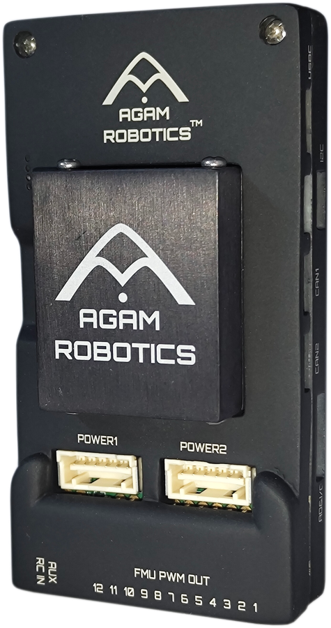

# Agam Autopilot v6X-RT

::: warning
PX4 does not manufacture this (or any) autopilot.
Contact the [manufacturer](https://www.agamrobotics.com/) for hardware support or compliance issues.
:::

The Agam Autopilot v6X-RT is [Agam Robotics'](https://www.agamrobotics.com/) flight controller, a commercial implementation of the [NXP-led FMUv6X-RT reference design](https://dronecode.org/announcing-the-pixhawk-fmuv6x-rt/).

It builds on its own PX4 target, [`boards/agam-robotics/fmu-v6xrt`](https://github.com/PX4/PX4-Autopilot/pull/28285).



::: info
This flight controller is [manufacturer supported](../flight_controller/autopilot_manufacturer_supported.md).
:::

## Where To Buy {#store}

Order from the [Agam Robotics store](https://www.agamrobotics.com/product-page/agam-pixhawk-6x-full-set).

## Sensors

- [Invensense ICM-42688-P IMU](https://www.invensense.tdk.com/products/motion-tracking/6-axis/icm-42688-p/)
- [Bosch BMI088 IMU](https://www.bosch-sensortec.com/products/motion-sensors/imus/bmi088/)
- 2x [Bosch BMP388 Barometer](https://www.bosch-sensortec.com/en/products/environmental-sensors/pressure-sensors/bmp390/)
- [Bosch BMM150 Magnetometer](https://www.bosch-sensortec.com/media/boschsensortec/downloads/datasheets/bst-bmm150-ds001.pdf)

## Microprocessor

- [NXP i.MX RT1176 (MIMXRT1176DVMAA)](https://www.nxp.com/products/i.MX-RT1170)
  - Arm® Cortex®-M7 core @ 1GHz
  - Arm® Cortex®-M4 core @ 400MHz (secondary core)
  - 2MB SRAM
  - 64MB external Octal SPI flash

## Other Features

- NXP EdgeLock SE051 hardware secure element (field-updatable)
- Triple redundant IMU (2 sensors on a shock-mounted, heated sensor board, 1 on the FMU board itself) and dual redundant barometer, each on separate buses
- 256Kbit FRAM
- 3x CAN
- 4x I2C
- 12 PWM/DShot outputs (8 DShot-capable, 4 PWM-only)
- 100BASE-T1 Ethernet (single 2-wire port)
- USB 2.0
- microSD card slot
- Dual redundant power input (5V via Molex connectors)

## Power Requirements

- Voltage Ratings:
  - Max input voltage: 6V
  - USB Power Input: 4.75\~5.25V
  - Servo Rail Input: 0\~36V
- Current Ratings:
  - `TELEM1` output current limiter: 1.5A
  - All other port combined output current limiter: 1.5A

## Additional Information

- Flight controller module: 39 x 32 x 16 mm
- Baseboard: 95 x 50 x 19 mm
- Weight: 90 g
- Operating temperature: -40°C to 85°C

## Pinout

Agam Autopilot v6X-RT is a Pixhawk-standard v6X-RT board, electrically and mechanically identical to the NXP reference design, differing from it only in enclosure — its pinout is the same as other v6X-RT-family boards:

- [DS-012 Pixhawk Autopilot v6X Standard](https://github.com/pixhawk/Pixhawk-Standards/blob/master/DS-012%20Pixhawk%20Autopilot%20v6X%20Standard.pdf)
- [DS-010 Pixhawk Autopilot Bus Standard](https://github.com/pixhawk/Pixhawk-Standards/blob/master/DS-010%20Pixhawk%20Autopilot%20Bus%20Standard.pdf)
- [DS-009 Pixhawk Connector Standard](https://github.com/pixhawk/Pixhawk-Standards/blob/master/DS-009%20Pixhawk%20Connector%20Standard.pdf)

## Serial Port Mapping

| UART     | Device     | Port    |
| -------- | ---------- | ------- |
| LPUART1  | /dev/ttyS0 | Console |
| LPUART3  | /dev/ttyS1 | GPS     |
| LPUART4  | /dev/ttyS2 | TELEM1  |
| LPUART5  | /dev/ttyS3 | GPS2    |
| LPUART6  | /dev/ttyS4 | PX4IO   |
| LPUART8  | /dev/ttyS5 | TELEM2  |
| LPUART10 | /dev/ttyS6 | TELEM3  |
| LPUART11 | /dev/ttyS7 | EXT2    |

## Building Firmware

```sh
make agam-robotics_fmu-v6xrt_default
```

## See Also

- [Agam Autopilot v6X-RT Documentation](https://agamrobotics.gitbook.io/docs/autopilots-flight-controller/quickstart) (Agam Robotics Docs)
- [Announcing the Pixhawk FMUv6X-RT](https://dronecode.org/announcing-the-pixhawk-fmuv6x-rt/) (Dronecode Foundation)
