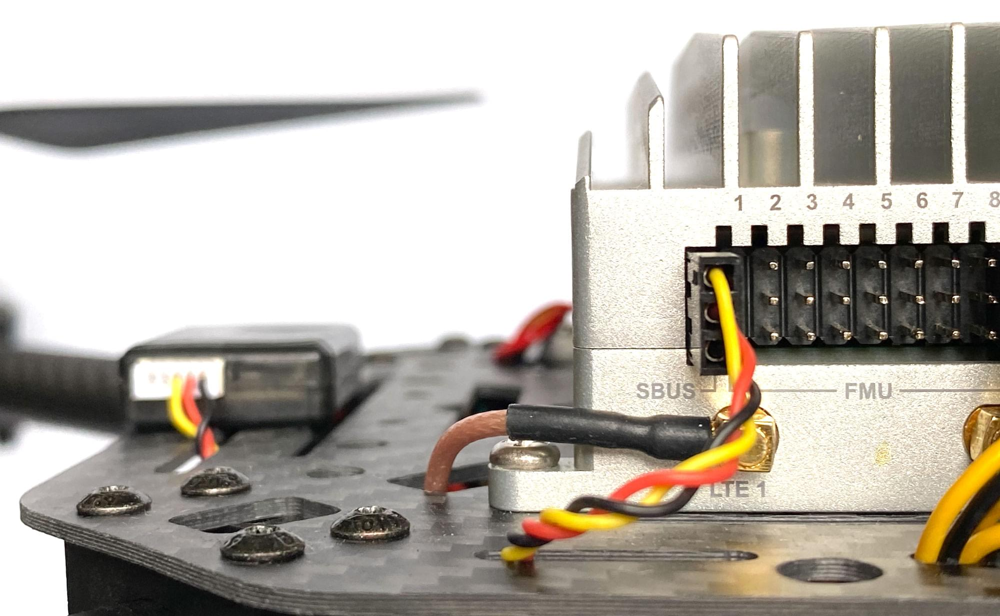

# Sky-Drones AIRLink

:::warning
PX4 does not manufacture this (or any) autopilot.
Contact the [manufacturer](https://sky-drones.com/) for hardware support or compliance issues.
:::

[AIRLink](https://sky-drones.com/airlink) stands for Artificial Intelligence & Remote Link. The unit includes a cutting-edge drone autopilot, AI mission computer and LTE/5Gs connectivity unit. AIRLink helps to reduce the time to market for new drone manufacturers from years and months down to weeks.


::: info
This flight controller is [manufacturer supported](../flight_controller/autopilot_manufacturer_supported.md).
:::

AIRLink has two computers and integrated LTE Module:

- The flight control computer (autopilot) has a triple-redundant vibration-dampened and temperature-stabilized IMU.
- The powerful AI mission computer enables advanced drone software features like computer vision and obstacle avoidance, digital HD video streaming, and payload data streaming.
- LTE/5G and WiFi connectivity modules provide permanent broadband internet connection which is enabler for remote workflows.

## Feature Highlights

<lite-youtube videoid="VcBx9DLPN54" title="SmartAP AIRLink - The Most Advanced AI Drone Avionics"/>

## Specifications

- **Sensors**

  - 3x Accelerometers, 3x Gyroscopes, 3x Magnetometers, 3x Pressure sensorss
  - GNSS, Rangefinders, Lidars, Optical Flow, Cameras
  - 3x-redundant IMU
  - Vibration dampening
  - Temperature stabilization

- **Flight Controller**

  - STM32F7, ARM Cortex M7 with FPU, 216 MHz, 2MB Flash, 512 kB RAM
  - STM32F1, I/O co-processor
  - Ethernet, 10/100 Mbps
  - LAN with AI Mission Computer
  - 8x UARTs: Telemetry 1, Telemetry 2 (AI Mission Computer), Telemetry 3, GPS 1, GPS 2, Extra UART, Serial Debug Console, IO
  - 2x CAN: CAN1, CAN2
  - USB with MAVLink
  - Serial console for debugging
  - RC Input, SBUS input, RSSI input, PPM input
  - 16x PWM servo outputs (8 from IO, 8 from FMU)
  - 3x I2C ports
  - High-powered piezo buzzer driver
  - High-power RGB LED
  - Safety switch / LED option

- **AI Mission Computer**

  - 6-Core CPU: Dual-Core Cortex-A72 + Quad-Core Cortex-A53
  - GPU Mali-T864, OpenGL ES1.1/2.0/3.0/3.1
  - VPU with 4K VP8/9, 4K 10bits H265/H264 60fps Decoding
  - Remote power control, software reset, power down, RTC Wake-Up, sleep mode
  - RAM Dual-Channel 4GB LPDDR4
  - 16GB eMMC
  - MicroSD up to 256GB
  - Ethernet 10/100/1000 Native Gigabit
  - WiFi 802.11a/b/g/n/ac, Bluetooth
  - USB 3.0 Type C
  - 2x Video: 4-Lane MIPI CSI (FPV Camera) and 4-Lane MIPI CSI with HMDI Input (Payload Camera)

- **LTE/5G Connectivity Module**

  - Up to 600 Mbps bandwidth
  - 5G sub-6 and mmWave, SA and NSA operations
  - 4G Cat 20, up to 7xCA, 256-QAM DL/UL, 2xCA UL
  - 4 x 4 MIMO for 4G and 5G (sub-6 bands)
  - 3G HSPA+
  - Approved by JRL/JTBL, FCC, PTCRB, RED, GCF
  - Antenna, 4x4 MIMO
  - Bands: Worldwide

## Where to Buy

Purchase from the original Sky-Drones Store (worldwide shipping with 1-2 days order processing time):

- [Buy AIRLink Enterprise 4G](https://sky-drones.com/sets/airlink-enterprise-set.html)
- [Buy AIRLink Enterprise 5G](https://sky-drones.com/sets/airlink-5g-enterprise-set.html)
- [Buy AIRLink Core 4G](https://sky-drones.com/autopilots/airlink-core.html)
- [Buy AIRLink Core 5G](https://sky-drones.com/store/airlink-5g-core.html)

## AIRLink Enterprise Kit Accessories

<lite-youtube videoid="lex7axW8WQg" title="SmartAP AIRLink - Unboxing"/>

AIRLink Enterprise arrives with everything needed to setup the autopilot system.

The standard set contains:

- 1x AIRLink Enterprise unit
- 1x FPV camera with CSI cable
- 1x WiFi antenna with MMCX connector
- 2x/4x LTE/5G antenna with MMCX connector
- 1x HDMI to mini HDMI cable1x set of cables (7 cables for all connectors)

[AIRLink Telemetry](https://sky-drones.com/sets/airlink-telemetry-set.html) based on the Microhard LAN/IP-based RF micromodule is available as an add-on and is fully compatible with AIRLink.

## Editions

There are AIRLink editions that offer different integration levels required by drone manufacturers: _Enterprise_ and _Core_.
AIRLink Enterprise is ideal for a quick start, evaluation and prototyping while Core is optimised for deep integration and mid-high volume manufacturing.

**AIRLink Enterprise**

SmartAP AIRLink's Enterprise edition is intended for prototyping and low to medium volume drone production.
Quick and easy installation thanks to the dedicated mounting holes and integrated heatsink for power dissipation.


**AIRLink Core**

SmartAP AIRLink's Core edition is intended for medium to high volume production and deep integration with customer's hardware. It weighs only 89 g and can be attached to a metal frame for optimum cooling.


| Parameter           | AIRLink Enterprise                                          | AIRLink Core                                                                        |
| ------------------- | ----------------------------------------------------------- | ----------------------------------------------------------------------------------- |
| Enclosure           | Aluminum, with integrated heatsink and fan mounting option. | External heatsink or reasonable power dissipation should be provided by the design. |
| Dimensions          | L103 x W61 x H37 mm                                         | L100 x W57 x H22 mm                                                                 |
| Weight              | 198 g                                                       | 89 g                                                                                |
| Ambient temperature | -40°C-..+50°C                                               | -40°C-..+50°C                                                                       |

## Key Features

- **Easy to mount**

  

- **FPV camera comes as standard**

  

## Interfaces

### Left Side


- **Left side interfaces:**

  - Power input with voltage & current monitoring
  - AI Mission Computer micro SD card
  - Flight Controller micro SD card
  - AI Mission Computer USB Type-C
  - PPM input, SBUS output, RSSI monitor

- **POWER - JST GH SM10B-GHS-TB**

  | Pin number | Pin name    | Direction | Voltage | Function                   |
  | ---------- | ----------- | --------- | ------- | -------------------------- |
  | 1          | 12V         | IN        | +12V    | Main power input           |
  | 2          | 12V         | IN        | +12V    | Main power input           |
  | 3          | 12V         | IN        | +12V    | Main power input           |
  | 4          | BAT_CURRENT | IN        | +3.3V   | Battery current monitoring |
  | 5          | BAT_VOLTAGE | IN        | +3.3V   | Battery voltage monitoring |
  | 6          | 3V3         | OUT       | +3.3V   | 3.3V output                |
  | 7          | PWR_KEY     | IN        | +3.3V   | Power key input            |
  | 8          | GND         | Ground    |
  | 9          | GND         | Ground    |
  | 10         | GND         | Ground    |

- **CPU SD card - microSD**
- **CPU USB - USB Type C**
- **RC Connector - JST GH SM06B-GHS-TB**

  | Pin number | Pin name | Direction | Voltage | Function    |
  | ---------- | -------- | --------- | ------- | ----------- |
  | 1          | 5V       | OUT       | +5V     | 5V output   |
  | 2          | PPM_IN   | IN        | +3.3V   | PPM input   |
  | 3          | RSSI_IN  | IN        | +3.3V   | RSSI input  |
  | 4          | FAN_OUT  | OUT       | +5V     | Fan output  |
  | 5          | SBUS_OUT | OUT       | +3.3V   | SBUS output | 6 | GND | Ground |

* **FMU SD card - microSD**

### Right Side


- **Right side interfaces:**

  - Ethernet port with power output
  - Telemetry port
  - Second GPS port
  - Spare I2C / UART port
  - Flight controller USB Type-C
  - Micro SIM Card
  - HDMI input port (payload camera)

- **ETHERNET - JST GH SM08B-GHS-TB**

  | Pin number | Pin name | Direction | Voltage | Function                   |
  | ---------- | -------- | --------- | ------- | -------------------------- |
  | 1          | 5V       | OUT       | +5V     | Radio module power supply  |
  | 2          | 5V       | OUT       | +5V     | Radio module power supply  |
  | 3          | ETH_TXP  | OUT       | +3.3V   | Ethernet transmit positive |
  | 4          | ETH_TXN  | OUT       | +3.3V   | Ethernet transmit negative |
  | 5          | ETH_RXP  | IN        | +3.3V   | Ethernet receive positive  |
  | 6          | ETH_RXN  | IN        | +3.3V   | Ethernet receive negative  |
  | 7          | GND      | Ground    |
  | 8          | GND      | Ground    |

- **TEL3 - JST GH SM06B-GHS-TB**

  | Pin number | Pin name   | Direction | Voltage | Function            |
  | ---------- | ---------- | --------- | ------- | ------------------- |
  | 1          | 5V         | OUT       | +5V     | Power supply output |
  | 2          | USART2_TX  | OUT       | +3.3V   | Telemetry 3 TX      |
  | 3          | USART2_RX  | IN        | +3.3V   | Telemetry 3 RX      |
  | 4          | USART2_CTS | IN        | +3.3V   | Telemetry 3 CTS     |
  | 5          | USART2_RTS | OUT       | +3.3V   | Telemetry 3 RTS     |
  | 6          | GND        | Ground    |

- **I2C3 / UART4 - JST GH SM06B-GHS-TB**

  | Pin number | Pin name  | Direction | Voltage | Function            |
  | ---------- | --------- | --------- | ------- | ------------------- |
  | 1          | 5V        | OUT       | +5V     | Power supply output |
  | 2          | USART4_TX | OUT       | +3.3V   | UART 4 TX           |
  | 3          | USART4_RX | IN        | +3.3V   | UART 4 RX           |
  | 4          | I2C3_SCL  | I/O       | +3.3V   | I2C3 Clock          |
  | 5          | I2C3_SDA  | I/O       | +3.3V   | I2C3 Data           |
  | 6          | GND       | Ground    |

- **GPS2 - JST GH SM06B-GHS-TB**

  | Pin number | Pin name  | Direction | Voltage | Function            |
  | ---------- | --------- | --------- | ------- | ------------------- |
  | 1          | 5V        | OUT       | +5V     | Power supply output |
  | 2          | USART8_TX | OUT       | +3.3V   | UART 8 TX           |
  | 3          | USART8_RX | IN        | +3.3V   | UART 8 RX           |
  | 4          | I2C2_SCL  | I/O       | +3.3V   | I2C2 Clock          |
  | 5          | I2C2_SDA  | I/O       | +3.3V   | I2C2 Data           |
  | 6          | GND       | Ground    |

- **FMU USB - USB Type C**
- **SIM Card - micro SIM**
- **HDMI - mini HDMI**

### Front Side


- **Front side interfaces:**

  - Main GNSS and compass port
  - Main telemetry port
  - CSI camera input
  - CAN 1
  - CAN 2

- **TEL1 - JST GH SM06B-GHS-TB**

  | Pin number | Pin name   | Direction | Voltage | Function            |
  | ---------- | ---------- | --------- | ------- | ------------------- |
  | 1          | 5V         | OUT       | +5V     | Power supply output |
  | 2          | USART7_TX  | OUT       | +3.3V   | Telemetry 1 TX      |
  | 3          | USART7_RX  | IN        | +3.3V   | Telemetry 1 RX      |
  | 4          | USART7_CTS | IN        | +3.3V   | Telemetry 1 CTS     |
  | 5          | USART7_RTS | OUT       | +3.3V   | Telemetry 1 RTS     |
  | 6          | GND        | Ground    |

- **GPS1 - JST GH SM10B-GHS-TB**

  | Pin number | Pin name   | Direction | Voltage | Function            |
  | ---------- | ---------- | --------- | ------- | ------------------- |
  | 1          | 5V         | OUT       | +5V     | Power supply output |
  | 2          | USART1_TX  | OUT       | +3.3V   | GPS 1 TX            |
  | 3          | USART1_RX  | IN        | +3.3V   | GPS 1 RX            |
  | 4          | I2C1_SCL   | I/O       | +3.3V   | Mag 1 Clock         |
  | 5          | I2C1_SDA   | I/O       | +3.3V   | Mag 1 Data          |
  | 6          | SAFETY_BTN | IN        | +3.3V   | Safety button       |
  | 7          | SAFETY_LED | OUT       | +3.3V   | Safety LED          |
  | 8          | +3V3       | OUT       | +3.3V   | 3.3V output         |
  | 9          | BUZZER     | OUT       | +5V     | Buzzer output       |
  | 10         | GND        | Ground    |

- **CAN1 - JST GH SM04B-GHS-TB**

  | Pin number | Pin name | Direction | Voltage | Function            |
  | ---------- | -------- | --------- | ------- | ------------------- |
  | 1          | 5V       | OUT       | +5V     | Power supply output |
  | 2          | CAN1_H   | I/O       | +5V     | CAN 1 High (120Ω)   |
  | 3          | CAN1_L   | I/O       | +5V     | CAN 1 Low (120Ω)    |
  | 4          | GND      | Ground    |

- **CAN2 - JST GH SM04B-GHS-TB**

  | Pin number | Pin name | Direction | Voltage | Function            |
  | ---------- | -------- | --------- | ------- | ------------------- |
  | 1          | 5V       | OUT       | +5V     | Power supply output |
  | 2          | CAN2_H   | I/O       | +5V     | CAN 2 High (120Ω)   |
  | 3          | CAN2_L   | I/O       | +5V     | CAN 2 Low (120Ω)    |
  | 4          | GND      | Ground    |

- **CAMERA - FPC 30 pin, 0.5mm pitch**

### Rear Side


- **Rear side interfaces:**

  - SBUS input
  - 16 PWM output channels
  - 2x LTE antenna sockets (MIMO)
  - WiFi antenna socket (AP & Station modes)

# Serial Mapping

AIRLink has a large number of internal and external serial ports:

| Serial   | UART    | Function                                            |
| -------- | ------- | --------------------------------------------------- |
| Serial 0 | USB     | Console                                             |
| Serial 1 | UART 7  | Telemetry 1                                         |
| Serial 2 | UART 5  | Telemetry 2 (used internally with Mission Computer) |
| Serial 3 | USART 1 | GPS 1                                               |
| Serial 4 | UART 8  | GPS 2                                               |
| Serial 5 | USART 3 | Debug console (internal connector)                  |
| Serial 6 | USART 2 | Telemetry 3                                         |
| Serial 7 | UART 4  | External UART                                       |

## RC Input

RC input is configured on the SBUS pin and is connected to IO MCU via an inverter internally.
For PPM receivers please use RC Connector PPM pin located on the left side of the unit.



## Outputs

AIRLink has 16 PWM ouputs. Main outputs 1-8 and connected to IO MCU. AUX outputs 1-8 are connected to FMU.

| Output | Timer    | Channel   |
| ------ | -------- | --------- |
| AUX 1  | Timer 1  | Channel 4 |
| AUX 2  | Timer 1  | Channel 3 |
| AUX 3  | Timer 1  | Channel 2 |
| AUX 4  | Timer 1  | Channel 1 |
| AUX 5  | Timer 4  | Channel 2 |
| AUX 6  | Timer 4  | Channel 3 |
| AUX 7  | Timer 12 | Channel 1 |
| AUX 8  | Timer 12 | Channel 2 |

[DShot](../peripherals/dshot.md) can be used on the first four AUX pins.

## Building Firmware

:::tip
Most users will not need to build this firmware!
It is pre-built and automatically installed by _QGroundControl_ when appropriate hardware is connected.
:::

To [build PX4](../dev_setup/building_px4.md) for this target:

```
make sky-drones_smartap-airlink
```

## Peripherals

- [SmartAP GPS](../gps_compass/gps_smartap.md) - GPS module with compass, pressure sensor and RGB LED
- [SmartAP PDB](../power_module/sky-drones_smartap-pdb.md) - Power Distribution Board

## Reference Design


AIRLink CAD model is available [here](https://docs.sky-drones.com/airlink/cad-model)

AIRLink Reference design can be provided by request.
Get in touch at [Sky-Drones contact page](https://sky-drones.com/contact-us)

## More Information

For more information and instructions on setting up and using the AIRLink system see [AIRLink Documentation](https://docs.sky-drones.com/airlink/).

For technical help, support and customization please get in touch at [Sky-Drones contact page](https://sky-drones.com/contact-us).

More information can be found at [www.sky-drones.com](https://sky-drones.com).

Frequently asked questions are answered in [FAQ](https://docs.sky-drones.com/airlink/faq).

## Useful Links

- [AIRLink product page](https://sky-drones.com/airlink)
- [AIRLink documentation](https://docs.sky-drones.com/avionics/airlink)
- [AIRLink datasheet](https://3182378893-files.gitbook.io/~/files/v0/b/gitbook-x-prod.appspot.com/o/spaces%2F-MTMlWysgDtJq8Hid1v7%2Fuploads%2F8AiuNNSwLYnZSscj7uIV%2FAIRLink-Datasheet.pdf?alt=media&token=cbf0c4bf-9ab1-40c5-a0af-c6babdddb690)
- [Buy AIRLink Enterprise 4G](https://sky-drones.com/sets/airlink-enterprise-set.html)
- [Buy AIRLink Enterprise 5G](https://sky-drones.com/sets/airlink-5g-enterprise-set.html)
- [Buy AIRLink Core 4G](https://sky-drones.com/autopilots/airlink-core.html)
- [Buy AIRLink Core 5G](https://sky-drones.com/store/airlink-5g-core.html)
