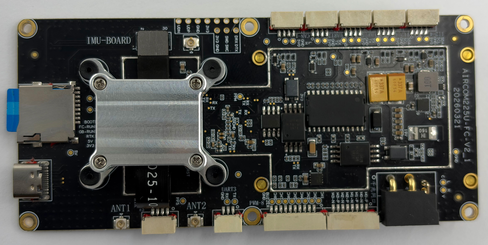
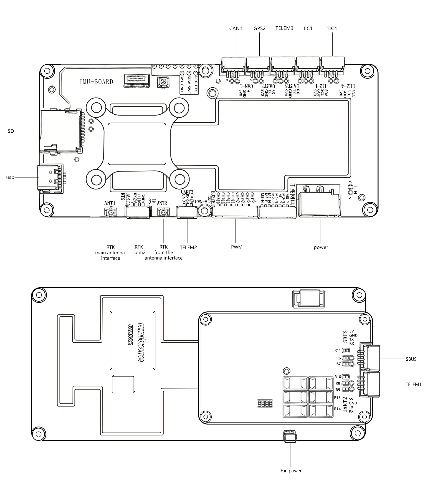

# Amovlab Flycore

<Badge type="tip" text="PX4 v1.18" />

::: warning
PX4 does not manufacture this (or any) autopilot.
Contact the [manufacturer](https://amovlab.com/) for hardware support or compliance issues.
:::

The Amovlab Flycore is an STM32H743-based flight controller for PX4-powered vehicles.
It integrates a UM982 GNSS module on the primary GPS interface, has dual onboard IMUs, an onboard barometer, 10 FMU PWM outputs, dual CAN, USB, three telemetry ports, an external GPS2 port, an external RC port, a standard SD card slot, and exposed buzzer and SWD pads.



::: info
This flight controller is intended for inclusion in the [manufacturer supported](../flight_controller/autopilot_manufacturer_supported.md) board list.
:::

## Specifications {#specifications}

- **Processor**
  - **Main FMU processor:** STM32H743 (32-bit Arm® Cortex®-M7, 480 MHz, 2 MB flash, 1 MB RAM)
  - **IO processor:** None. This board does not have a PX4IO coprocessor.
- **Sensors**
  - **IMU:** Bosch BMI088 (SPI), InvenSense ICM-42688P (SPI)
  - **Barometer:** MS5611 (SPI)
  - **GNSS:** Onboard UM982 module connected to `GPS1`
  - **Magnetometer:** None fitted by default. `GPS1` and `GPS2` do not include compass I2C lines.
- **Interfaces**
  - **PWM outputs:** 10 FMU outputs
  - **Serial ports:** 7
  - **Telemetry ports:** 3 (`TELEM1`, `TELEM2`, `TELEM3`)
  - **GPS ports:** 2
    - `GPS1`: internal connection to the onboard UM982 GNSS module
    - `GPS2`: external GPS connector
  - **I2C ports:** 2 external buses configured in firmware (`I2C1`, `I2C4`)
  - **SPI buses:** 3
    - `SPI1`: BMI088 IMU and MS5611 barometer
    - `SPI2`: ICM-42688P IMU
    - `SPI4`: onboard flash
  - **CAN buses:** 2
  - **USB:** Yes
  - **RC input:** Yes, on the FMU `RC` port
  - **Supported RC protocols:** SBUS, DSM/DSMX, CRSF, GHST, PPM
  - **Analog battery inputs:** 1 voltage input and 1 current input
  - **Additional analog inputs:** None exposed to users
  - **Buzzer:** Exposed pads
  - **SWD:** Exposed pads
  - **SD card:** Standard SD card slot
- **Electrical data**
  - **Power input:** XT30 connector, 15-28 V
  - **Minimum input current:** 0.1 A
  - **Battery voltage sensing range:** 3S-6S LiPo
  - **Battery current sensing range:** 1-60 A
  - **Servo/PWM output rail:** Externally powered. The board only provides PWM signal outputs.
- **Mechanical data**
  - **Dimensions:** 120 mm x 55 mm x 26.3 mm
  - **Weight:** 60 g
  - **Mounting:** 50 mm x 115 mm hole spacing, 2.5 mm hole diameter

## Where to Buy {#store}

For purchasing, contact [shudajun@amovauto.com](mailto:shudajun@amovauto.com).

## Connections

The board includes the following main external connections:

- `POWER`: XT30, 15-28 V input
- `USB`
- `TELEM1`
- `TELEM2`
- `TELEM3`
- `GPS2`: external GPS connector, without compass I2C
- `RC`
- `CAN1`
- `CAN2`
- `I2C1`
- `I2C4`
- `PWM OUT 1-10`
- Standard SD card slot
- Buzzer pads
- SWD pads
- UART8 debug console pads

The external peripheral signal connectors use JST GH connectors with 1.25 mm pitch.
Flycore uses Pixhawk-style port names for common interfaces such as `TELEM`, `GPS`, `CAN`, `I2C`, and `RC`, but the fitted connectors and pin assignments are board-specific and are not claimed to fully comply with the DS-009 Pixhawk Connector Standard.
Use the [Pinouts](#pinouts) section as the authoritative connector definition for this board.
This does not apply to `POWER` (XT30), USB, the SD card slot, RTK antenna interfaces, or the exposed buzzer, SWD, and UART8 debug console pads.

`GPS1` is not exposed as an external connector on the flight controller.
It is connected internally to the onboard UM982 GNSS module and does not include safety-switch pins or compass I2C lines.

## Schematic Diagram



## Pinouts

The following pinouts use the signal names from the manufacturer interface definition.
Pin 1 starts from the right side of the connector, as shown below:


### CAN1 Port

| Pin | Signal |
| --- | ------ |
| 1   | CAN_L  |
| 2   | CAN_H  |
| 3   | GND    |
| 4   | VCC    |

### GPS2 Port

| Pin | Signal |
| --- | ------ |
| 1   | RX     |
| 2   | TX     |
| 3   | GND    |
| 4   | VCC    |

### TELEM3 Port

| Pin | Signal |
| --- | ------ |
| 1   | RX     |
| 2   | TX     |
| 3   | GND    |
| 4   | VCC    |

### I2C1 Port

| Pin | Signal |
| --- | ------ |
| 1   | SDA    |
| 2   | SCL    |
| 3   | GND    |
| 4   | VCC    |

### I2C4 Port

| Pin | Signal |
| --- | ------ |
| 1   | SDA    |
| 2   | SCL    |
| 3   | GND    |
| 4   | VCC    |

### PWM Port

| Pin | Signal  |
| --- | ------- |
| 1   | GND     |
| 2   | BUZZER  |
| 3   | FMU_CH8 |
| 4   | FMU_CH7 |
| 5   | FMU_CH6 |
| 6   | FMU_CH5 |
| 7   | FMU_CH4 |
| 8   | FMU_CH3 |
| 9   | FMU_CH2 |
| 10  | FMU_CH1 |

### TELEM2 Port

| Pin | Signal |
| --- | ------ |
| 1   | GND    |
| 2   | RX     |
| 3   | TX     |

### RTK COM2 Port

| Pin | Signal |
| --- | ------ |
| 1   | RX     |
| 2   | TX     |
| 3   | GND    |
| 4   | PPS    |

## Sensor and Bus Configuration

The default Flycore PX4 port matches the hardware as shipped:

- **Onboard sensors:** BMI088, ICM-42688P, and MS5611.
- **Onboard GNSS:** UM982 connected to `GPS1`.
- **External GPS:** `GPS2` is available for an external GPS receiver, but does not provide compass I2C lines.
- **Default firmware:** `rc.board_sensors` starts only the onboard IMUs and barometer. It does not start magnetometers or other external sensors that are not fitted by default.

Flycore has no onboard magnetometer and its GPS connectors do not include compass I2C.
If a magnetometer is required, use a supported external magnetometer connected through `I2C1`, `I2C4`, or another compatible interface provided by the vehicle setup.

Without a magnetometer, yaw in flight relies on GPS course when available and other estimator settings as configured in QGroundControl.
Plan missions accordingly for GPS-denied operation.

## Power {#power}

The flight controller can be powered from the **POWER** connector.

Power ports:

- `POWER`: XT30 connector, 15-28 V input, 0.1 A minimum input current

::: warning
The PWM output ports are not powered by the POWER port.
The output rail must be [separately powered](../peripherals/pwm_escs_and_servo.md) if it needs to power servos or other hardware.
This is generally true for VTOL and fixed-wing vehicles, but not necessarily true for multicopters.
:::

The battery voltage sensing range is 3S-6S LiPo.

The battery current sensing range is 1-60 A.

PX4 configures analog battery monitoring using `BAT1_V_DIV=10.89` and `BAT1_A_PER_V=36.367515152` by default.
The board only provides PWM signal outputs; provide external rail power before connecting servos or other payloads that need power from the output rail.

For battery and power module configuration see [Battery and Power Module Setup](../config/battery.md).

## Serial Port Mapping

| UART   | Device     | Port            | Flow Control |
| ------ | ---------- | --------------- | :----------: |
| USART2 | /dev/ttyS0 | `TELEM1`        |     Yes      |
| USART3 | /dev/ttyS1 | `TELEM2`        |      No      |
| UART4  | /dev/ttyS2 | `GPS1`          |      No      |
| UART5  | /dev/ttyS3 | `TELEM3`        |      No      |
| USART6 | /dev/ttyS4 | `RC`            |      No      |
| UART7  | /dev/ttyS5 | `GPS2`          |      No      |
| UART8  | /dev/ttyS6 | `Debug Console` |      No      |

`GPS1` is used by the onboard UM982 GNSS module.
`GPS2` is the external GPS port.
The debug console is exposed on UART8 pads; no connector is fitted by default. The UART8 pad pinout is board-specific.

## Radio Control {#radio_control}

A remote control (RC) radio system is required if you want to _manually_ control your vehicle (PX4 does not require a radio system for autonomous flight modes).

You will need to [select a compatible transmitter/receiver](../getting_started/rc_transmitter_receiver.md) and then _bind_ them so that they communicate (read the instructions that come with your specific transmitter/receiver).

The RC port is connected to the FMU, not to a PX4IO coprocessor.

The `RC` port supports SBUS, DSM/DSMX, CRSF, GHST, and PPM receivers.
The board configuration enables PX4 RC input and maps the RC serial port to `/dev/ttyS4`.

For PPM and S.Bus receivers, a single signal wire carries all channels.
If your receiver outputs individual PWM signals (one wire per channel) it must be connected via a PPM encoder.
For more information, see [RC receivers](../getting_started/rc_transmitter_receiver.md).

## GPS & Compass {#gps_compass}

PX4 supports GPS modules connected to the GPS port(s) listed below.
GPS modules should be [mounted on the frame](../assembly/mount_gps_compass.md) as far away from other electronics as possible, with the direction marker pointing towards the front of the vehicle.

The GPS ports are:

- `GPS1` (FMU): Internal connection to the onboard UM982 GNSS module. This is not exposed as an external connector and does not include safety-switch pins or compass I2C lines.
- `GPS2` (FMU): External GPS connector. This port does not include compass I2C lines.

Flycore has no onboard magnetometer.
The `GPS1` and `GPS2` interfaces do not provide compass I2C, so a GPS/compass module connected to `GPS2` will only use the GPS serial interface unless the compass is connected through another compatible external interface.

## Telemetry Radios (Optional) {#telemetry}

[Telemetry radios](../telemetry/index.md) may be used to communicate and control a vehicle in flight from a ground station (for example, you can direct the UAV to a particular position, or upload a new mission).

The vehicle-based radio should be connected to a TELEM port — **TELEM1**, **TELEM2**, or **TELEM3**.
If connected to **TELEM1**, no further configuration is required.
The other radio is connected to your ground station computer or mobile device (usually by USB).

## PWM Outputs {#pwm_outputs}

This flight controller supports up to 10 FMU PWM outputs (`MAIN`).

Outputs 1-7 support [DShot](../peripherals/dshot.md) and [Bidirectional DShot](../peripherals/dshot.md#bidirectional-dshot-telemetry).

Outputs 8-10 do not support DShot.

The 10 outputs are split into 3 groups:

- Outputs 1-4 are in group 1, using Timer 1.
- Outputs 5-7 are in group 2, using Timer 3.
- Outputs 8-10 are in group 3, using Timer 4.

All outputs within the same group must use the same output protocol and rate.

## SD Card

This board has a standard SD card slot.

## Building Firmware

To [build PX4](../dev_setup/building_px4.md) for this target:

```sh
make amovlab_flycore_default
```

Build and upload via USB:

```sh
make amovlab_flycore_default upload
```

Build the bootloader:

```sh
make amovlab_flycore_bootloader
```

## Bootloader / Board ID

- **Board ID:** 106 (`boards/amovlab/flycore/firmware.prototype`)
- **Bootloader USB product string:** `PX4 BL AMOV FLYCORE`

## Default Airframe

For hardware type `FLYCORE0000`, `rc.board_defaults` sets `SYS_AUTOSTART` to **4014** (generic multicopter airframe class).

Adjust the airframe in QGroundControl to match your vehicle.

Amovlab recommends this flight controller for the Amovlab SU17 platform.

## Debug Port

The PX4 system console is exposed on UART8 pads.
No connector is fitted by default.

The UART8 pad pinout is board-specific and does not use a standard fitted connector.

## Supported Platforms / Airframes

The Flycore can be used with airframes supported by the selected PX4 configuration, including multicopters and other vehicles that match the available PWM, CAN, serial, and sensor interfaces.

Amovlab recommends Flycore for the Amovlab SU17 platform.

## Maintenance

- **Vendor:** Amovlab
- **PX4 board target:** `amovlab_flycore_default`
- **PX4 hardware architecture:** `AMOVLAB_FLYCORE`
- **PX4 hardware type:** `FLYCORE000000`
- **Hardware version/revision:** `0x000` / `0x000`
