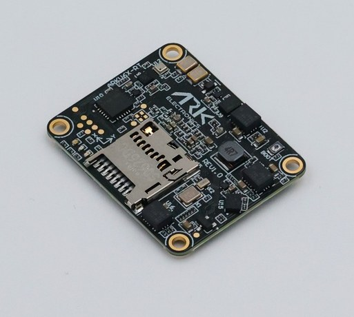
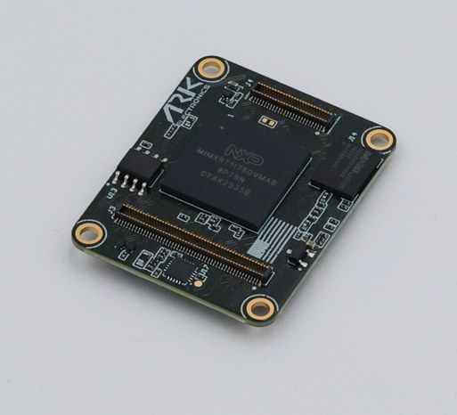

# ARK Electronics ARKV6X-RT

<Badge type="tip" text="main (PX4 v2.0)" />

::: warning
PX4 does not manufacture this (or any) autopilot.
Contact the [manufacturer](https://arkelectron.com/contact-us/) for hardware support or compliance issues.
:::

The USA-built ARKV6X-RT flight controller is an NXP i.MX RT1176 variant of the [ARKV6X](../flight_controller/ark_v6x.md), derived from the [FMUv6X-RT and Pixhawk Autopilot Bus open source standards](https://github.com/pixhawk/Pixhawk-Standards).

With triple synced IMUs, data averaging, voting, and filtering is possible.





::: info
This flight controller is [manufacturer supported](../flight_controller/autopilot_manufacturer_supported.md).
:::

::: tip
This flight controller is a module and requires a carrier board to work.
The Pixhawk Autopilot Bus (PAB) form factor enables the ARKV6X-RT to be used on any [PAB-compatible carrier board](../flight_controller/pixhawk_autopilot_bus.md), such as the [ARK Pixhawk Autopilot Bus Carrier](../flight_controller/ark_pab.md).
Which ports and outputs are physically broken out depends on the carrier.
:::

## Where to Buy {#store}

Order from [ARK Electronics](https://arkelectron.com/product/arkv6xrt) (US).

## Specifications {#specifications}

- **Processor**
  - **Main FMU processor:** [NXP i.MX RT1176](https://www.nxp.com/products/i.MX-RT1170) (Arm® Cortex®-M7 at 996 MHz, 2 MB RAM). The second Cortex-M4 core is unused by PX4.
  - **Code store:** no internal flash. Code executes in place from a 64 MB external octal NOR on FlexSPI1, of which PX4 uses the first 4 MB.
  - **IO processor:** PX4IO v2, on carriers that fit one.
- **Sensors**
  - **IMU:** [InvenSense ICM-45686](https://invensense.tdk.com/products/motion-tracking/6-axis/icm-45686/) (SPI1), [InvenSense IIM-20670](https://invensense.tdk.com/products/motion-tracking/6-axis/iim-20670/) (SPI2), [ST LSM6DSV80X](https://www.st.com/en/mems-and-sensors/lsm6dsv80x.html) (SPI3)
  - **Barometer:** [Bosch BMP390](https://www.bosch-sensortec.com/en/products/environmental-sensors/pressure-sensors/bmp390/) (I2C2)
  - **Magnetometer:** [ST IIS2MDC](https://www.st.com/en/mems-and-sensors/iis2mdc.html) (I2C3)
  - **Heater:** closed loop on the ICM-45686 die temperature
- **Interfaces**
  - **PWM outputs:** 12 FMU outputs, plus 8 more from PX4IO on carriers that fit one
  - **Serial ports:** 8 (`GPS1`, `GPS2`, `TELEM1`, `TELEM2`, `TELEM3`, `TELEM4`, PX4IO/`RC`, Debug Console)
  - **I2C buses:** 4 (I2C3 internal, the rest external)
  - **SPI buses:** 4, of which SPI6 is external with 2 chip selects and 2 data-ready lines
  - **CAN buses:** 2 enabled by default. PAB pins out a third; no ARK carrier breaks it out.
  - **Ethernet:** 100BASE-T (ENET2)
  - **USB:** Yes
  - **RC input:** Yes
  - **Parameter storage:** FRAM (FM25V02A) on FlexSPI2
  - **SD card:** MicroSD slot
- **Electrical data**
  - **Input voltage:** 5 V
  - **Current draw:** 500 mA (300 mA main system, 200 mA heater)
  - **Power monitoring:** 2 digital power bricks, INA226 by default
- **Mechanical data**
  - **Dimensions:** 3.6 x 2.9 x 0.5 cm
  - **Weight:** 5.0 g
  - **Form factor:** [Pixhawk Autopilot Bus (PAB)](https://github.com/pixhawk/Pixhawk-Standards/blob/master/DS-010%20Pixhawk%20Autopilot%20Bus%20Standard.pdf)

## IMUs {#imus}

Each IMU sits on its own SPI bus with an independent power rail and data-ready line:

| IMU        | Bus  | Full scale          | Publish rate |
| ---------- | ---- | ------------------- | ------------ |
| ICM-45686  | SPI1 | ±32 g / ±4000 dps   | 800 Hz       |
| IIM-20670  | SPI2 | ±65.5 g / ±1966 dps | 1000 Hz      |
| LSM6DSV80X | SPI3 | ±16 g / ±4000 dps   | 768 Hz       |

The ICM-45686 is the primary.
The IIM-20670 is started last deliberately: its on-chip gyro low-pass cannot be set above 60 Hz, which is too much group delay for the rate loop, so it serves as a navigation and fallback IMU.

The LSM6DSV80X publishes its ±16 g accelerometer; the part's ±80 g high-g element is unused.

[HEATER1_SENS_ID](../advanced_config/parameter_reference.md#HEATER1_SENS_ID) defaults to the ICM-45686.
Run the [accelerometer calibration](../config/accelerometer.md) only after `heater status` reports the setpoint has been reached.

## Pinout

For the pinout of the ARKV6X-RT see the [DS-010 Pixhawk Autopilot Bus Standard](https://github.com/pixhawk/Pixhawk-Standards/blob/master/DS-010%20Pixhawk%20Autopilot%20Bus%20Standard.pdf).

## Serial Port Mapping

| UART     | Device     | Port            | Flow Control |
| -------- | ---------- | --------------- | :----------: |
| LPUART1  | /dev/ttyS0 | `Debug Console` |      No      |
| LPUART3  | /dev/ttyS1 | `GPS1`          |      No      |
| LPUART4  | /dev/ttyS2 | `TELEM1`        |     Yes      |
| LPUART5  | /dev/ttyS3 | `GPS2`          |      No      |
| LPUART6  | /dev/ttyS4 | PX4IO / `RC`    |      No      |
| LPUART8  | /dev/ttyS5 | `TELEM2`        |     Yes      |
| LPUART10 | /dev/ttyS6 | `TELEM3`        |     Yes      |
| LPUART11 | /dev/ttyS7 | `TELEM4`        |      No      |

::: info
The mapping above applies to the running PX4 firmware.
The ARKV6X-RT bootloader enables only `LPUART8` (`TELEM2`), so when flashing firmware over UART with [`px4_uploader.py`](https://github.com/PX4/PX4-Autopilot/blob/main/Tools/px4_uploader.py) you must connect to the `TELEM2` port — no other UART will respond in bootloader mode.
:::

## PWM Outputs {#pwm_outputs}

The module provides 12 FMU PWM outputs, and 8 more from PX4IO on carriers that fit one.
How many reach a connector depends on the carrier board.

FMU outputs 1-8 support [DShot](../peripherals/dshot.md) and [Bidirectional DShot](../peripherals/dshot.md#bidirectional-dshot-telemetry); outputs 9-12 are PWM only.

Each FMU output has its own FlexPWM submodule, so unlike an STM32 target there are no output groups: protocol and rate can be set per output.

## Radio Control {#radio_control}

A remote control (RC) radio system is required if you want to _manually_ control your vehicle (PX4 does not require a radio system for autonomous flight modes).

You will need to [select a compatible transmitter/receiver](../getting_started/rc_transmitter_receiver.md) and then _bind_ them so that they communicate (read the instructions that come with your specific transmitter/receiver).

RC shares LPUART6 with PX4IO.
On a carrier fitted with PX4IO, the IO processor decodes SBUS, PPM, and DSM/DSMX.
CRSF is decoded on the FMU instead and is enabled by default ([RC_CRSF_PRT_CFG](../advanced_config/parameter_reference.md#RC_CRSF_PRT_CFG) is set to the `RC` port); [RC_SBUS_PRT_CFG](../advanced_config/parameter_reference.md#RC_SBUS_PRT_CFG) is off so that the FMU driver does not contend with PX4IO.

## GPS & Compass {#gps_compass}

PX4 supports GPS modules connected to the GPS ports listed below.
The module should be [mounted on the frame](../assembly/mount_gps_compass.md) as far away from other electronics as possible, with the direction marker pointing towards the front of the vehicle.

The GPS ports are:

- `GPS1` (LPUART3): safety switch, buzzer, LED, and compass I2C on a PAB carrier
- `GPS2` (LPUART5): basic GPS port

The onboard IIS2MDC is on an internal bus and is intended as a backup.
An external compass in a GPS/compass module is normally used for yaw.

## Power {#power}

The module is powered from the carrier board over the PAB connector, so the power connector type and its ratings are properties of the carrier.
The voltage the module itself accepts is under [Specifications](#specifications).

Two digital power bricks are supported.
[SENS_EN_INA226](../advanced_config/parameter_reference.md#SENS_EN_INA226) is enabled by default; the INA228 and INA238 drivers are also built in for carriers that fit those parts.
An ADS1115 external ADC can be enabled with [ADC_ADS1115_EN](../advanced_config/parameter_reference.md#ADC_ADS1115_EN) for analog monitoring instead.

For battery and power module configuration see [Battery and Power Module Setup](../config/battery.md).

## Debug Port {#debug_port}

The [PX4 System Console](../debug/system_console.md) runs on LPUART1, and the [SWD interface](../debug/swd_debug.md) is brought out alongside it, both on the carrier's FMU Debug connector.

## Building Firmware

To [build PX4](../dev_setup/building_px4.md) for this target:

```sh
make ark_fmu-v6xrt_default
```

Uploading over USB works as it does on any other board once a bootloader is present:

```sh
make ark_fmu-v6xrt_default upload
```

A board with no bootloader — or a wiped NOR — has to be recovered over SWD.
Because the RT1176 has no internal flash, this needs NXP's device family pack for the flash algorithm and a FlexSPI preconditioning step; see the [board README](https://github.com/PX4/PX4-Autopilot/blob/main/boards/ark/fmu-v6xrt/README.md) for the procedure.

## See Also

- [ARK Electronics ARKV6X](../flight_controller/ark_v6x.md)
- [ARK Electronics Pixhawk Autopilot Bus Carrier](../flight_controller/ark_pab.md)
