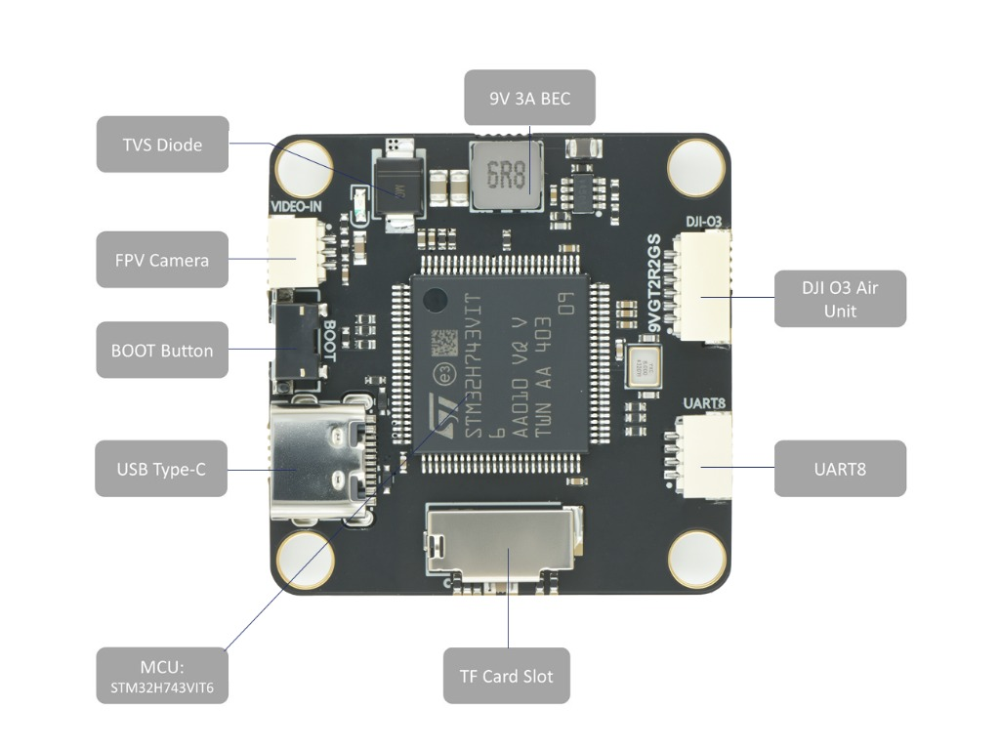
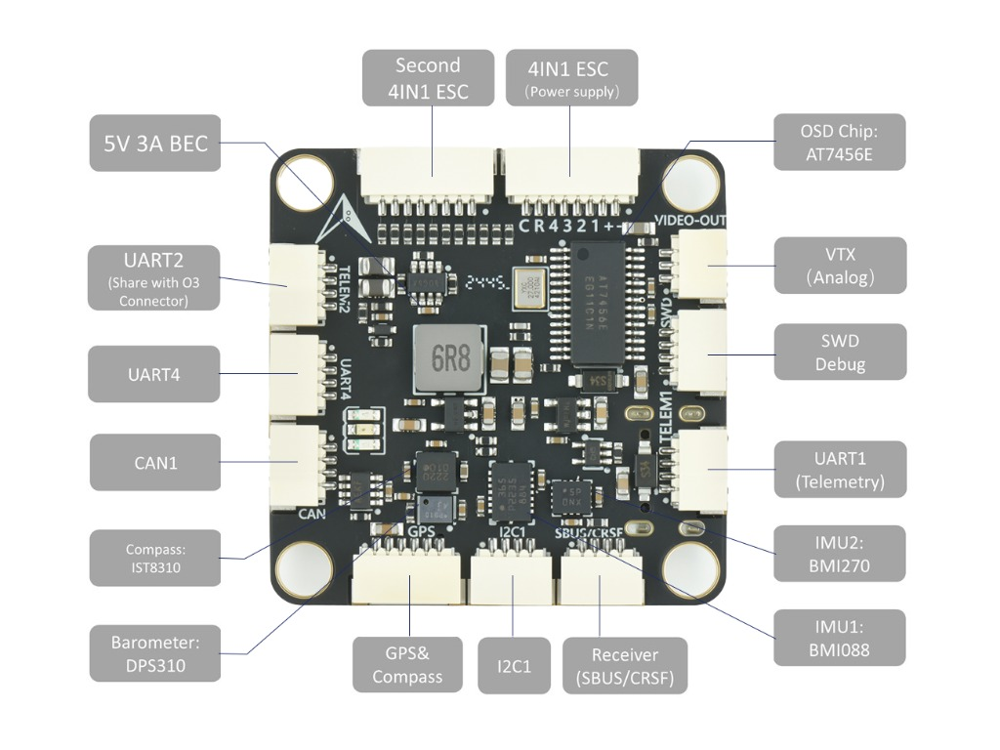
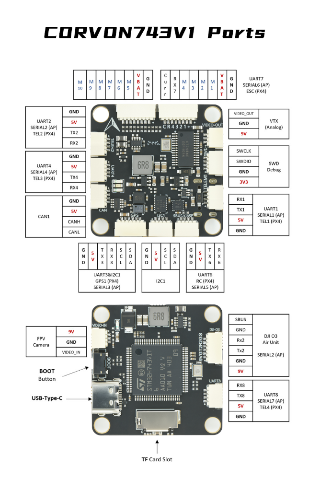

# CORVON 743v1

<Badge type="tip" text="PX4 v1.18" />

:::warning
PX4 does not manufacture this (or any) autopilot. Contact the manufacturer for hardware support or compliance issues.
:::

The _CORVON 743v1_ is a flight controller designed by Feikong Technology Co., Ltd under the CORVON brand.
It features a powerful STM32H743 processor, dual high-performance IMUs (BMI088/BMI270), and an extensive array of interfaces.

With its highly integrated 36x36mm footprint and 9g weight, and specialized interfaces like a direct plug-and-play DJI O3 Air Unit connector, this flight controller is optimized for space-constrained FPV builds and agile multirotors that require top-tier processing power and sensor redundancy.

The board uses [Pixhawk Autopilot Standard Connections](https://docs.px4.io/main/en/flight_controller/autopilot_pixhawk_standard.html).

 

::: info
This flight controller is [manufacturer supported](../flight_controller/autopilot_manufacturer_supported.md).
:::
## Key Features

- **MCU:** STM32H743VIT6 MCU (32 Bit Arm® Cortex®-M7, 480MHz, 2MB Flash, 1MB RAM)
- **IMU:** Bosch BMI088, BMI270 (Dual IMU redundancy)
- **Barometer:** DPS310
- **Magnetometer:** IST8310
- **OSD:** Onboard AT7456E
- **Interfaces:**
  - 7x UARTs
  - 1x CAN (UAVCAN)
  - 1x I2C
  - Dedicated RC Input (UART6)
  - 10x PWM outputs (DShot & Bi-Directional DShot supported)
  - Dedicated DJI O3 Air Unit connector
- **Power:** 
  - 9V 3A BEC
  - 5V 3A BEC
  - ADC for battery voltage (up to 6S) and current monitoring

## Where to Buy

Order from [CORVON](https://corvon.tech).

## Physical / Mechanical

- **Mounting:** 30.5 x 30.5mm, Φ4mm
- **Dimensions:** 36 x 36 x 8 mm
- **Weight:** 9g

## Specifications

### Processors & Sensors

- **FMU Processor:** STM32H743
  - 32 Bit Arm® Cortex®-M7, 480MHz
  - 2MB Flash, 1MB RAM
- **On-board Sensors:**
  - Accel/Gyro: Bosch BMI088, BMI270
  - Barometer: DPS310
  - Compass: IST8310

### Power Configuration

The board has an internal voltage sensor and connections on the ESC connector for an external current sensor.
- The voltage sensor handles up to 6S LiPo batteries.
- Two onboard BECs provide robust peripheral power (9V 3A and 5V 3A).

## Connectors & Pinouts

The following image shows the port connection details, including RC, UARTs, CAN, I2C, SWD Debug, and VTX connections.



### Standard Serial Port Mapping

| UART   | PX4 Target Config | Default Usage |
| ------ | ----------------- | ------------- |
| USART1 | TELEM1            | MAVLink       |
| UART4  | TELEM2            | MAVLink       |
| USART2 | GPS1              | GPS           |
| USART3 | TELEM3            |               |
| UART8  | URT6              |               |
| USART6 | RC                | RC Input      |
| UART7  | TELEM4            | ESC Telemetry |

### Debug Port 

The board features a **4-pin SWD Debug** interface located on the right side of the board. This includes `SWCLK`, `SWDIO`, `3V3`, and `GND` for full hardware debugging. While a dedicated UART isn't strictly reserved for the NSH console by default, the full-speed USB connection provides MAVLink Console access out of the box.

### RC Input

RC Input is mapped to **UART6** via the explicit `SBUS/CRSF` connector block. 
- It fully supports PX4's standard `RC_INPUT` module protocols.
- The connector exposes both `RX6` and `TX6`, which makes it fully capable of bidirectional receiver protocols such as TBS Crossfire (CRSF), ELRS, and FPort, as well as traditional single-wire standards like SBUS (which operates inverted on RX6). 

## Building/Loading Firmware

::: tip
Most users will not need to build this firmware (from PX4 v1.18).
It is pre-built and automatically installed by _QGroundControl_ when appropriate hardware is connected.
:::

To [build PX4](../dev_setup/building_px4.md) for this target from source:

```sh
make corvon_743v1_default
```

Initial firmware flashing can be done over USB via QGroundControl. The bootloader status aligns with standard generic PX4 LED indications (Red = Bootloader/Error, Blue = Active/Activity, Green = Powered).
