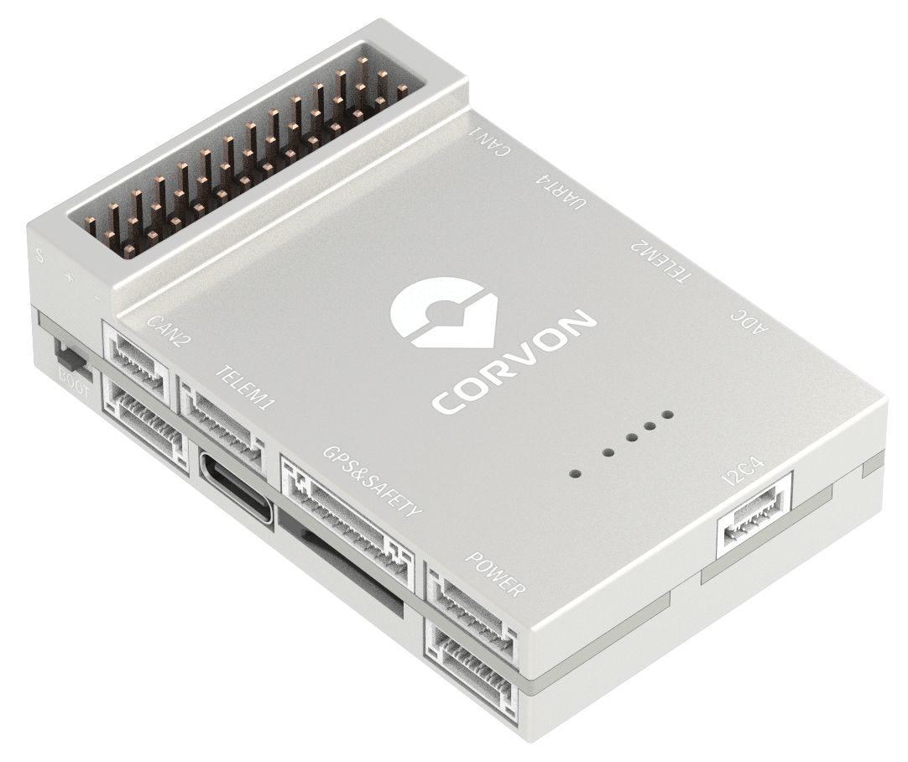
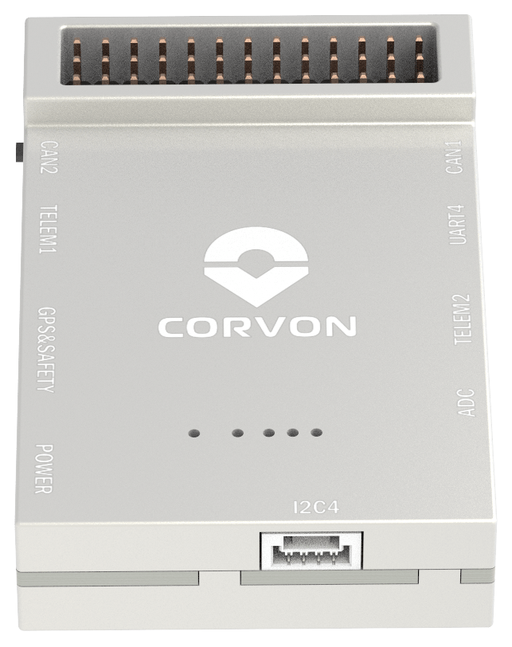
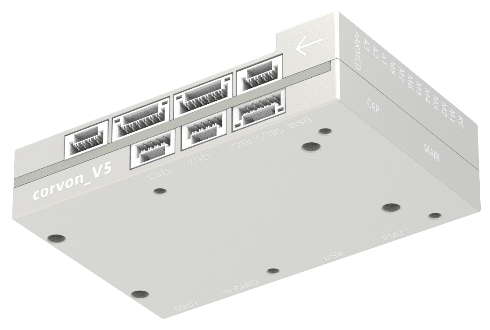

# CORVON V5 Autopilot

<Badge type="tip" text="main (planned for: PX4 v1.18)" />

:::warning
PX4 does not manufacture this (or any) autopilot.
Contact the [manufacturer](https://corvon.tech) for hardware support or compliance issues.
:::

The CORVON V5 is based on the Pixhawk FMUv5 design standard and runs PX4 on NuttX.



:::info
This flight controller is [manufacturer supported](autopilot_manufacturer_supported.md).
:::

## Quick Summary

- **Main FMU Processor:** STM32F765IIK
  - 32 Bit Arm® Cortex®-M7, 216MHz, 2MB memory, 512KB RAM

- **On-board sensors:**
  - Accel/Gyro: ICM-20689
  - Accel/Gyro: ICM-20602
  - Accel/Gyro: BMI088
  - Magnetometer: IST8310
  - Barometer: MS5611

- **Interfaces:**
  - 8 PWM outputs
  - 3 dedicated PWM/Capture inputs on FMU
  - Dedicated R/C input for CPPM
  - Dedicated R/C input for Spektrum / DSM and S.Bus
  - Analog / PWM RSSI input
  - 4 general purpose serial ports
  - 3 I2C ports
  - 4 SPI buses
  - 2 CAN Buses
  - Analog inputs for voltage / current of battery
  - 2 additional analog inputs
  - Supports nARMED

- **Power System:**
  - Power Brick Input: 4.75~5.5V
  - USB Power Input: 4.75~5.25V

- **Weight and Dimensions:**
  - Weight: 42.1g
  - Dimensions: 61.2 x 40 x 15.9mm

- **Other Characteristics:**
  - Operating temperature: -20 ~ 85°C (Measured value)

## Where to Buy {#store}

- [CORVON Store](https://corvon.tech)

## Connectors and Interfaces


## Pinouts

Download Corvon V5 pinouts from here: [corvon_v5_pinout.xlsx](https://github.com/PX4/PX4-Autopilot/raw/main/docs/assets/flight_controller/corvon_v5/corvon_v5_pinout.xlsx)

## Serial Port Mapping

| UART   | Device       | Port                                     |
| ------ | ------------ | ---------------------------------------- |
| UART1  | `/dev/ttyS0` | GPS                                      |
| USART2 | `/dev/ttyS1` | TELEM1                                   |
| USART3 | `/dev/ttyS2` | TELEM2                                   |
| UART4  | `/dev/ttyS3` | TELEM4                                   |
| USART6 | `/dev/ttyS4` | TX is RC input from SBUS_RC connector    |
| UART7  | `/dev/ttyS5` | Debug Console                            |
| UART8  | `/dev/ttyS6` | Reserved for optional onboard RTK module |

::: info
UART8 is reserved for an optional onboard UM982 module footprint and is not intended for general external use.
:::

## Radio Control

RC inputs (both CPPM and Spektrum/S.Bus) are physically connected directly to the FMU. The `rc` and `spektrum` drivers are enabled by default for this board.

- S.Bus and Spektrum / DSM receivers connect to the **SBUS_RC** port.
- CPPM receivers connect to the dedicated CPPM input.

For more information about selecting and connecting a radio receiver, see [Radio Control Registration](../getting_started/rc_transmitter_receiver.md).

<a id="debug_port"></a>

## Debug Port

The [PX4 System Console](../debug/system_console.md) and [SWD interface](../debug/swd_debug.md) operate on the **FMU Debug** port (`DSU7`).

The debug port (`DSU7`) has the following pinout:

| Pin | Signal         | Volt  |
| --- | -------------- | ----- |
| 1   | GND            | GND   |
| 2   | FMU_SWCLK      | +3.3V |
| 3   | FMU_SWDIO      | +3.3V |
| 4   | DEBUG RX       | +3.3V |
| 5   | DEBUG TX       | +3.3V |
| 6   | 5V+            | +5V   |

:::warning
The 5V+ pin (6) provides 5V, but the CPU logic runs at 3.3V!

Some JTAG/SWD adapters (like SEGGER J-Link) may use the Vref voltage pin to set the logic level on the SWD data lines. Connecting 5V to the adapter's `Vtref` can damage the CPU.
For a direct connection to a *Segger Jlink*, we recommend you use a 3.3V source to provide `Vtref` to the JTAG adapter (i.e. providing 3.3V and *NOT* 5V).
:::

## Voltage Ratings

CORVON V5 must be powered from the **POWER** connector during flight, and may also be powered from **USB** for bench testing.

- **POWER input:** 4.75~5.5V
- **USB input:** 4.75~5.25V

The **PM2** connector **cannot power** the flight controller.
On PX4, **do not use** this interface.

## Building Firmware

To build PX4 for this target:

```sh
make corvon_v5_default
```

## Installing PX4 Firmware

The firmware can be installed in any of the normal ways:

- **Build and upload the source**

  ```sh
  make corvon_v5_default upload
  ```

- **Load the firmware using _QGroundControl_.** You can use either pre-built firmware or your own custom firmware.

:::info
If this target is not listed in _QGroundControl_, build and upload from source or load a custom firmware file (see [Installing PX4 Main, Beta or Custom Firmware](../config/firmware.md#installing-px4-main-beta-or-custom-firmware)).
:::

## Supported Platforms / Airframes

Any multicopter / airplane / rover or boat that can be controlled with normal RC servos or Futaba S-Bus servos.
The complete set of supported configurations can be seen in the [Airframes Reference](../airframes/airframe_reference.md).

## Images





## Further Information

- [Corvon Tech](https://corvon.tech)
