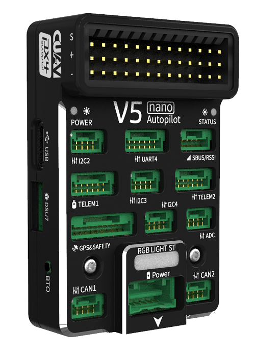

# CUAV V5 nano Autopilot

:::warning
PX4 does not manufacture this (or any) autopilot.
Contact the [manufacturer](https://store.cuav.net/) for hardware support or compliance issues.
:::

**V5 nano**<sup>&reg;</sup> is an autopilot for space-constrained applications, designed by CUAV<sup>&reg;</sup> in collaboration with the PX4 team.

The autopilot is small enough to use in 220mm racing drones, but remains powerful enough for most drone use.



::: info
The V5 nano is similar to the [CUAV V5+](../flight_controller/cuav_v5_plus.md), but has an all-in-one form factor, fewer PWM ports (can't be used for [airframes](../airframes/airframe_reference.md) that use AUX ports), and does not have internal damping.
:::

Some of its main features include:

- Full compatibility with the [Pixhawk project](https://pixhawk.org/) **FMUv5** design standard and uses the [Pixhawk Connector Standard](https://pixhawk.org/pixhawk-connector-standard/) for all external interfaces.
- More advanced processor, RAM and flash memory than FMU v3, along with more stable and reliable sensors.
- Firmware-compatible with PX4.
- Generous 2.6mm spacing for I/O pins, making it easier to use all the interfaces.

::: info
This flight controller is [manufacturer supported](../flight_controller/autopilot_manufacturer_supported.md).
:::

### Quick Summary

Main FMU Processor: STM32F765◦32 Bit Arm® Cortex®-M7, 216MHz, 2MB memory, 512KB RAM

- On-board sensors:

  - Accel/Gyro: ICM-20689
  - Accel/Gyro: ICM-20602
  - Accel/Gyro: BMI055
  - Magnetometer: IST8310
  - Barometer: MS5611

- Interfaces: 8 PWM outputs

  - 3 dedicated PWM/Capture inputs on FMU
  - Dedicated R/C input for CPPM
  - Dedicated R/C input for Spektrum / DSM and S.Bus
  - Analog / PWM RSSI input
  - 4 general purpose serial ports
  - 3 I2C ports
  - 4 SPI buses
  - 2 CAN Buses
  - Analog inputs for voltage / current of battery
  - 2 additional analog inputs
  - Supports nARMED

- Power System: Power Brick Input: 4.75~5.5V
- USB Power Input: 4.75~5.25V

- Weight and Dimensions:
  - Dimensions: 60\*40\*14mm
- Other Characteristics:
  - Operating temperature: -20 ~ 85°C （Measured value）

## Where to Buy

[CUAV Store](https://store.cuav.net/shop/v5-nano/)

[CUAV Aliexpress](https://www.aliexpress.com/item/33050770314.html?storeId=3257035&spm=2114.12010612.8148356.9.dbe6790bjW2hpH) (international users)

[CUAV Taobao](https://item.taobao.com/item.htm?spm=a230r.1.14.8.26ab5258veQJRu&id=569404317857&ns=1&abbucket=13#detail) (China Mainland users)

::: info
Autopilot may be purchased with included Neo GPS module
:::

<a id="connection"></a>

## Connections (Wiring)

[V5 nano Wiring Quickstart](../assembly/quick_start_cuav_v5_nano.md)

## Pinouts

Download **V5 nano** pinouts from [here](http://manual.cuav.net/V5-Plus.pdf).

## Building Firmware

:::tip
Most users will not need to build this firmware!
It is pre-built and automatically installed by _QGroundControl_ when appropriate hardware is connected.
:::

To [build PX4](../dev_setup/building_px4.md) for this target:

```
make px4_fmu-v5_default
```

<a id="debug_port"></a>

## Debug Port

The [PX4 System Console](../debug/system_console.md) and [SWD interface](../debug/swd_debug.md) operate on the **FMU Debug** port (`DSU7`).
The board does not have an I/O debug interface.


The debug port (`DSU7`) uses a [JST BM06B](https://www.digikey.com.au/product-detail/en/jst-sales-america-inc/BM06B-GHS-TBT-LF-SN-N/455-1582-1-ND/807850) connector and has the following pinout:

| Pin     | Signal         | Volt  |
| ------- | -------------- | ----- |
| 1 (red) | 5V+            | +5V   |
| 2 (blk) | DEBUG TX (OUT) | +3.3V |
| 3 (blk) | DEBUG RX (IN)  | +3.3V |
| 4 (blk) | FMU_SWDIO      | +3.3V |
| 5 (blk) | FMU_SWCLK      | +3.3V |
| 6 (blk) | GND            | GND   |

The product package includes a convenient debug cable that can be connected to the `DSU7` port.
This splits out an FTDI cable for connecting the [PX4 System Console](../debug/system_console.md) to a computer USB port, and SWD pins used for SWD/JTAG debugging.
The provided debug cable does not connect to the SWD port `Vref` pin (1).


:::warning
The SWD Vref pin (1) uses 5V as Vref but the CPU is run at 3.3V!

Some JTAG adapters (SEGGER J-Link) will use the Vref voltage to set the voltage on the SWD lines.
For direct connection to _Segger Jlink_ we recommended you use the 3.3 Volts from pin 4 of the connector marked `DSM`/`SBUS`/`RSSI` to provide `Vtref` to the JTAG (i.e. providing 3.3V and _NOT_ 5V).

For more information see [Using JTAG for hardware debugging](#using-jtag-for-hardware-debugging).
:::

## Serial Port Mapping

| UART   | Device     | Port                                  |
| ------ | ---------- | ------------------------------------- |
| UART1  | /dev/ttyS0 | GPS                                   |
| USART2 | /dev/ttyS1 | TELEM1 (flow control)                 |
| USART3 | /dev/ttyS2 | TELEM2 (flow control)                 |
| UART4  | /dev/ttyS3 | TELEM4                                |
| USART6 | /dev/ttyS4 | TX is RC input from SBUS_RC connector |
| UART7  | /dev/ttyS5 | Debug Console                         |
| UART8  | /dev/ttyS6 | Not connected (no PX4IO)              |

<!-- Note: Got ports using https://github.com/PX4/PX4-user_guide/pull/672#issuecomment-598198434 -->

## Voltage Ratings

_V5 nano_ must be powered from the `Power` connector during flight, and may also/alternatively be powered from `USB` for bench testing.

::: info
The `PM2` connector cannot not be used for powering the _V5 nano_ (see [this issue](#compatibility_pm2)).
:::

::: info
The Servo Power Rail is neither powered by, nor provides power to the FMU.
However, the pins marked **+** are all common, and a BEC may be connected to any of the servo pin sets to power the servo power rail.
:::

## Over Current Protection

The _V5 nano_ has no over current protection.

<a id="Optional-hardware"></a>

## Peripherals

- [Digital Airspeed Sensor](https://item.taobao.com/item.htm?spm=a1z10.3-c-s.w4002-16371268452.37.6d9f48afsFgGZI&id=9512463037)
- [Telemetry Radio Modules](https://cuav.taobao.com/category-158480951.htm?spm=2013.1.w5002-16371268426.4.410b7a821qYbBq&search=y&catName=%CA%FD%B4%AB%B5%E7%CC%A8)
- [Rangefinders/Distance sensors](../sensor/rangefinders.md)

## Supported Platforms / Airframes

Any multicopter / airplane / rover or boat that can be controlled with normal RC servos or Futaba S-Bus servos.
The complete set of supported configurations can be seen in the [Airframes Reference](../airframes/airframe_reference.md).

## Compatibility

CUAV adopts some differentiated designs and is incompatible with some hardware, which will be described below.

<a id="compatibility_gps"></a>

#### Neo v2.0 GPS not compatible with other devices

The _Neo v2.0 GPS_ that is recommended for use with _CUAV V5+_ and _CUAV V5 nano_ is not fully compatible with other Pixhawk flight controllers (specifically, the buzzer part is not compatible and there may be issues with the safety switch).

The UAVCAN [NEO V2 PRO GNSS receiver](http://doc.cuav.net/gps/neo-series-gnss/en/neo-v2-pro.html) can also be used, and is compatible with other flight controllers.

<a id="compatibility_jtag"></a>

#### Using JTAG for hardware debugging

`DSU7` FMU Debug Pin 1 is 5 volts - not the 3.3 volts of the CPU.

Some JTAG probes use this voltage to set the IO levels when communicating to the target.

For direct connection to _Segger Jlink_ we recommended you use the 3.3 Volts of DSM/SBUS/RSSI pin 4 as Pin 1 on the debug connector (`Vtref`).

<a id="compatibility_pm2"></a>

#### PM2 cannot power the flight controller

`PM2` can only measure battery voltage and current, but **not** power the flight controller.

:::warning
PX4 does not support this interface.
:::

## Known Issues

The issues below refer to the _batch number_ in which they first appear.
The batch number is the four-digit production date behind V01 and is displayed on a sticker on the side of the flight controller.
For example, the serial number Batch V011904((V01 is the number of V5, 1904 is the production date, that is, the batch number).

<a id="pin1_unfused"></a>

#### SBUS / DSM / RSSI interface Pin1 unfused

:::warning
This is a safety issue.
:::

Please do not connect other equipment (except RC receiver) on SBUS / DSM / RSSI interface - this can lead to equipment damage!

- _Found:_ Batches V01190904xxxx
- _Fixed:_ Batches later than V01190904xxxx

## Further Information

- [V5 nano manual](http://manual.cuav.net/V5-nano.pdf) (CUAV)
- [FMUv5 reference design pinout](https://docs.google.com/spreadsheets/d/1-n0__BYDedQrc_2NHqBenG1DNepAgnHpSGglke-QQwY/edit#gid=912976165) (CUAV)
- [CUAV Github](https://github.com/cuav) (CUAV)
- [Airframe build-log using CUAV v5 nano on a DJI FlameWheel450](../frames_multicopter/dji_f450_cuav_5nano.md)
