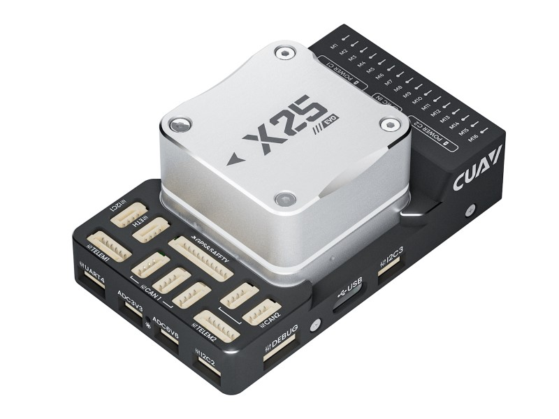

# CUAV X25-EVO

:::warning
PX4 does not manufacture this (or any) autopilot.
Contact the [manufacturer](https://store.cuav.net/) for hardware support or compliance issues.
:::

The _X25-EVO_ is an advanced autopilot manufactured by CUAV<sup>&reg;</sup>.

The autopilot is recommended for commercial system integration but is also suitable for academic research and any other applications.



The X25-EVO brings you ultimate performance, stability, and reliability in every aspect.

::: info
These flight controllers are [manufacturer supported](../flight_controller/autopilot_manufacturer_supported.md).
:::

### Features

- Arm® Cortex-M7® processor (STM32H743XI) with Floating-Point Unit (FPU), operating at 480MHz, and featuring 2MB Flash memory. Enables developers to enhance productivity and efficiency, allowing for more complex algorithms and models.
- Automotive-grade RM3100 compass. Designed for better stability and anti-interference capability.
- Triple-redundant IMUs and dual-redundant barometers located on separate buses. If the PX4 autopilot detects a sensor failure, the system seamlessly switches to another sensor to maintain flight control reliability.
- Independent LDO power control supplies power to each sensor group. A vibration isolation system filters high-frequency vibrations and reduces noise to ensure accurate readings, enabling better overall flight performance for the vehicle.
- Integrated Microchip Ethernet PHY for high-speed communication with onboard devices like mission computers via Ethernet.
- Dual temperature compensation systems, located on the IMU board and FMU board respectively. Temperature is controlled by onboard heating resistors to achieve the optimal operating temperature for the IMUs.
- PWM servo output voltage switchable between 3.3V or 5V.
- Modular design for DIY carrier boards.

### Processors & Sensors

- Main Processor: STM32H743XI
  - 32-bit Arm® Cortex®-M7, 480MHz, 2MB Flash, 1MB RAM
- Onboard Sensors:
  - Accel/Gyro: IIM42652\*2
  - Accel/Gyro: IIM42653
  - Magnetometer: RM3100
  - Barometer: BMP581
  - Barometer: ICP-20100

### Electrical Data

- Rated Voltage:
  - Input Voltage: 10~18V
  - USB Power Input: 4.75~5.25V
  - Servo Rail Input: 0~9.9V
- Rated Current:
  - Total Output Max Current: 10A
  - TELEM1 and TELEM2 Output Current limiter: 4A
  - CAN1 and CAN2 Output Current limiter: 2.4A
  - Other Ports Output Current limiter: 1.5A

### Interfaces

- 16x PWM Servo Outputs
- 1x Dedicated R/C Input for Spektrum / DSM and S.Bus
- 1x Analog/PWM RSSI Input
- 2x TELEM Ports (with full flow control)
- 1x UART4 Port
- 2x GPS Ports
  - 1x Full GPS plus Safety Switch Port (GPS1)
  - 1x Basic GPS Port (with I2C, GPS2)
- 1x USB Port (TYPE-C)
- 1x Ethernet Port
  - Transformerless application
  - 100Mbps
- 3x I2C Bus Ports
- 1x SPI Bus
  - 1x Chip Select Line
  - 1x Data Ready Line
  - 1x SPI Reset Line
- 5x CAN Ports for CAN Peripherals
  - 3x CAN1 Bus Multiplexed Ports
  - 2x CAN2 Bus Multiplexed Ports
- 2x Power Input Ports
  - DroneCAN/UAVCAN Power Input
- 2x AD Ports
  - Analog Input (3.3V)
  - Analog Input (6.6V - not supported by PX4)
- 1x Dedicated Debug Port
  - FMU Debug

### Mechanical Data

 - Not provided.

## Purchase Channels

Order from [CUAV](https://store.cuav.net/).

## Assembly/Setup

 - Not provided.

## Pin Definitions

 - Not provided.

## Serial Port Mapping

| UART   | Device     | Port          |
| ------ | ---------- | ------------- |
| USART1 | /dev/ttyS0 | GPS1          |
| USART2 | /dev/ttyS1 | GPS2          |
| USART3 | /dev/ttyS2 | Debug Console |
| UART4  | /dev/ttyS3 | UART4         |
| UART5  | /dev/ttyS4 | TELEM2        |
| USART6 | /dev/ttyS5 | RC            |
| UART7  | /dev/ttyS6 | TELEM1        |

## Voltage Ratings

The _X25-EVO_ achieves triple redundancy on power supplies if three power sources are provided. The three power rails are POWERC1, POWERC2, and USB.
- **POWER C1** and **POWER C2** are DroneCAN/UAVCAN battery interfaces.

**Normal Operation Maximum Ratings**

Under these conditions, all power sources will be used to power the system in the following order:
1. **POWER C1** and **POWER C2** Inputs (10V to 18V)
2. USB Input (4.75V to 5.25V)

**Voltage monitoring**

Digital DroneCAN/UAVCAN battery monitoring is enabled by default.

## Building Firmware

:::tip
Most users do not need to build this firmware!
It is pre-built and installed automatically by _QGroundControl_ when the appropriate hardware is connected.
:::

To [build PX4](../dev_setup/building_px4.md) for this target, execute:

```
make cuav_x25-evo_default
```

<a id="debug_port"></a>

## Debug Port

The [PX4 System Console](../debug/system_console.md) and [SWD Interface](../debug/swd_debug.md) operate on the **FMU Debug** port.

| Pin      | Signal           | Volt  |
| -------- | ---------------- | ----- |
| 1 (red)  | 5V+              | +5V   |
| 2 (blk)  | DEBUG TX (OUT)   | +3.3V |
| 3 (blk)  | DEBUG RX (IN)    | +3.3V |
| 4 (blk)  | FMU_SWDIO        | +3.3V |
| 5 (blk)  | FMU_SWCLK        | +3.3V |
| 6 (blk)  | GND              | GND   |

## Supported Platforms / Airframes

Any multirotor/airplane/rover or boat that can be controlled using normal RC servos or Futaba S-Bus servos. The complete set of supported configurations can be found in the [Airframe Reference](../airframes/airframe_reference.md).

## Further info

- [CUAV Docs](https://doc.cuav.net/)
