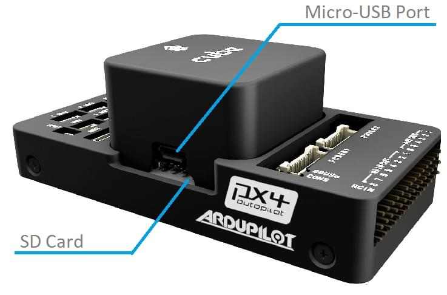

# CubePilot Cube Orange Flight Controller

:::warning
PX4 does not manufacture this (or any) autopilot.
Contact the [manufacturer](https://cubepilot.org/#/home) for hardware support or compliance issues.
:::

The [Cube Orange](https://www.cubepilot.com/#/cube/features) flight controller is a flexible autopilot intended primarily for manufacturers of commercial systems.


The controller is designed to be used with a domain-specific carrier board in order to reduce the wiring, improve reliability, and ease of assembly.
For example, a carrier board for a commercial inspection vehicle might include connections for a companion computer, while a carrier board for a racer could includes ESCs for the frame of the vehicle.

The ADS-B carrier board includes a customized 1090MHz ADSB-In receiver from uAvionix.
This provides attitude and location of commercial manned aircraft within the range of Cube.
This is automatically configured and enabled in the default PX4 firmware.

Cube includes vibration isolation on two of the IMU's, with a third fixed IMU as a reference / backup.

:::tip
The manufacturer [Cube Docs](https://docs.cubepilot.org/user-guides/autopilot/the-cube-module-overview) contain detailed information, including an overview of the [Differences between Cube Colours](https://docs.cubepilot.org/user-guides/autopilot/the-cube-module-overview#differences-between-cube-colours).
:::

## Key Features

- 32bit STM32H753VI (32bit [ARM Cortex M7](https://en.wikipedia.org/wiki/ARM_Cortex-M#Cortex-M7), 400 MHz, Flash 2MB, RAM 1MB).
- 32 bit STM32F103 failsafe co-processor
- 14 PWM / Servo outputs (8 with failsafe and manual override, 6 auxiliary, high-power compatible)
- Abundant connectivity options for additional peripherals (UART, I2C, CAN)
- Integrated backup system for in-flight recovery and manual override with dedicated processor and stand-alone power supply (fixed-wing use)
- Backup system integrates mixing, providing consistent autopilot and manual override mixing modes (fixed-wing use)
- Redundant power supply inputs and automatic failover
- External safety switch
- Multicolor LED main visual indicator
- High-power, multi-tone piezo audio indicator
- microSD card for high-rate logging over extended periods of time

<a id="stores"></a>

## Where to Buy

- [Reseller list](https://www.cubepilot.com/#/reseller/list)

## Assembly

[Cube Wiring Quickstart](../assembly/quick_start_cube.md)

## Specifications

- **Processor:**
  - STM32H753VI (32bit [ARM Cortex M7](https://en.wikipedia.org/wiki/ARM_Cortex-M#Cortex-M7))
  - 400 MHz
  - 1 MB RAM
  - 2 MB Flash \(fully accessible\)
- **Failsafe co-processor:** <!-- inconsistent info on failsafe processor: 32 bit STM32F103 failsafe co-processor http://www.proficnc.com/all-products/191-pixhawk2-suite.html -->
  - STM32F103 (32bit _ARM Cortex-M3_)
  - 24 MHz
  - 8 KB SRAM
- **Sensors:** (all connected via SPI)
  - **Accelerometer:** (3) ICM20948, ICM20649, ICM20602
  - **Gyroscope:** (3) ICM20948, ICM20649, ICM20602
  - **Compass:** (1) ICM20948
  - **Barometric Pressure Sensor:** (2) MS5611
- **Operating Conditions:**
  - **Operating Temp:** -10C to 55C
  - **IP rating/Waterproofing:** Not waterproof
  - **Servo rail input voltage:** 3.3V / 5V
  - **USB port input:**
    - Voltage: 4V - 5.7V
    - Rated current: 250 mA
  - **POWER:**
    - Input voltage: 4.1V - 5.7V
    - Rated input current: 2.5A
    - Rated input/output power: 14W
- **Dimensions:**
  - **Cube:** 38.25mm x 38.25mm x 22.3mm
  - **Carrier:** 94.5mm x 44.3mm x 17.3mm
- **Interfaces**
  - IO Ports: 14 PWM servo outputs (8 from IO, 6 from FMU)
  - 5x UART (serial ports), one high-power capable, 2x with HW flow control
  - 2x CAN (one with internal 3.3V transceiver, one on expansion connector)
  - **R/C inputs:**
    - Spektrum DSM / DSM2 / DSM-X® Satellite compatible input
    - Futaba S.BUS® compatible input and output
    - PPM-SUM signal input
  - RSSI (PWM or voltage) input
  - I2C
  - SPI
  - 3.3v ADC input
  - Internal microUSB port and external microUSB port extension

## Ports

### Top-Side (GPS, TELEM etc)


## Pinouts

#### TELEM1, TELEM2 ports

| Pin     | Signal    | Volt  |
| ------- | --------- | ----- |
| 1 (red) | VCC       | +5V   |
| 2 (blk) | TX (OUT)  | +3.3V |
| 3 (blk) | RX (IN)   | +3.3V |
| 4 (blk) | CTS (IN)  | +3.3V |
| 5 (blk) | RTS (OUT) | +3.3V |
| 6 (blk) | GND       | GND   |

#### GPS1 port

| Pin     | Signal        | Volt  |
| ------- | ------------- | ----- |
| 1 (red) | VCC           | +5V   |
| 2 (blk) | TX (OUT)      | +3.3V |
| 3 (blk) | RX (IN)       | +3.3V |
| 4 (blk) | SCL I2C2      | +3.3V |
| 5 (blk) | SDA I2C2      | +3.3V |
| 6 (blk) | Safety Button | GND   |
| 7 (blk) | Button LED    | GND   |
| 8 (blk) | GND           | GND   |

<!-- check is i2c2 -->

#### GPS2 port

| Pin     | Signal   | Volt  |
| ------- | -------- | ----- |
| 1 (red) | VCC      | +5V   |
| 2 (blk) | TX (OUT) | +3.3V |
| 3 (blk) | RX (IN)  | +3.3V |
| 4 (blk) | SCL I2C1 | +3.3V |
| 5 (blk) | SDA I2C1 | +3.3V |
| 6 (blk) | GND      | GND   |

#### ADC

| Pin     | Signal | Volt        |
| ------- | ------ | ----------- |
| 1 (red) | VCC    | +5V         |
| 2 (blk) | ADC IN | up to +6.6V |
| 3 (blk) | GND    | GND         |

#### I2C

| Pin     | Signal | Volt           |
| ------- | ------ | -------------- |
| 1 (red) | VCC    | +5V            |
| 2 (blk) | SCL    | +3.3 (pullups) |
| 3 (blk) | SDA    | +3.3 (pullups) |
| 4 (blk) | GND    | GND            |

#### CAN1 & CAN2

| Pin     | Signal | Volt |
| ------- | ------ | ---- |
| 1 (red) | VCC    | +5V  |
| 2 (blk) | CAN_H  | +12V |
| 3 (blk) | CAN_L  | +12V |
| 4 (blk) | GND    | GND  |

#### POWER1 & POWER2

| Pin     | Signal          | Volt  |
| ------- | --------------- | ----- |
| 1 (red) | VCC             | +5V   |
| 2 (red) | VCC             | +5V   |
| 3 (blk) | CURRENT sensing | +3.3V |
| 4 (blk) | VOLTAGE sensing | +3.3V |
| 5 (blk) | GND             | GND   |
| 6 (blk) | GND             | GND   |

#### USB

| Pin     | Signal        | Volt            |
| ------- | ------------- | --------------- |
| 1 (red) | VCC           | +5V             |
| 2 (blk) | OTG_DP1       | +3.3V           |
| 3 (blk) | OTG_DM1       | +3.3V           |
| 4 (blk) | GND           | GND             |
| 5 (blk) | BUZZER        | Battery voltage |
| 6 (blk) | FMU Error LED |

#### SPKT

| Pin     | Signal | Volt  |
| ------- | ------ | ----- |
| 1 (blk) | IN     |
| 2 (blk) | GND    | GND   |
| 3 (red) | OUT    | +3.3V |

#### TELEM1, TELEM2

| Pin     | Signal    | Volt        |
| ------- | --------- | ----------- |
| 1 (red) | VCC       | +5V         |
| 2 (blk) | TX (OUT)  | +3.3V to 5V |
| 3 (blk) | RX (IN)   | +3.3V to 5V |
| 4 (blk) | CTS (OUT) | +3.3V to 5V |
| 5 (blk) | RTS (IN)  | +3.3V to 5V |
| 6 (blk) | GND       | GND         |

## Serial Port Mapping

| UART   | Device     | Port                  |
| ------ | ---------- | --------------------- |
| USART2 | /dev/ttyS0 | TELEM1 (flow control) |
| USART3 | /dev/ttyS1 | TELEM2 (flow control) |
| UART4  | /dev/ttyS2 | GPS1                  |
| USART6 | /dev/ttyS3 | PX4IO                 |
| UART7  | /dev/ttyS4 | CONSOLE/ADSB-IN       |
| UART8  | /dev/ttyS5 | GPS2                  |

<!-- Note: Got ports using https://github.com/PX4/PX4-user_guide/pull/672#issuecomment-598198434 -->
<!-- https://github.com/PX4/PX4-Autopilot/blob/main/boards/cubepilot/cubeorange/default.px4board -->
<!-- https://github.com/PX4/PX4-Autopilot/blob/main/boards/cubepilot/cubeorange/nuttx-config/nsh/defconfig#L188-L197 -->

### USB/SDCard Ports



## Building Firmware

:::tip
Most users will not need to build this firmware!
It is pre-built and automatically installed by _QGroundControl_ when appropriate hardware is connected.
:::

To [build PX4](../dev_setup/building_px4.md) for this target, open up the terminal and enter:

```
make cubepilot_cubeorange
```

## Schematics

Board schematics and other documentation can be found here: [The Cube Project](https://github.com/proficnc/The-Cube).

## Further Information/Documentation

- [Cube Wiring Quickstart](../assembly/quick_start_cube.md)
- Cube Docs (Manufacturer):
  - [Cube Module Overview](https://docs.cubepilot.org/user-guides/autopilot/the-cube-module-overview)
  - [Cube User Manual](https://docs.cubepilot.org/user-guides/autopilot/the-cube-user-manual)
  - [Mini Carrier Board](https://docs.cubepilot.org/user-guides/carrier-boards/mini-carrier-board)
