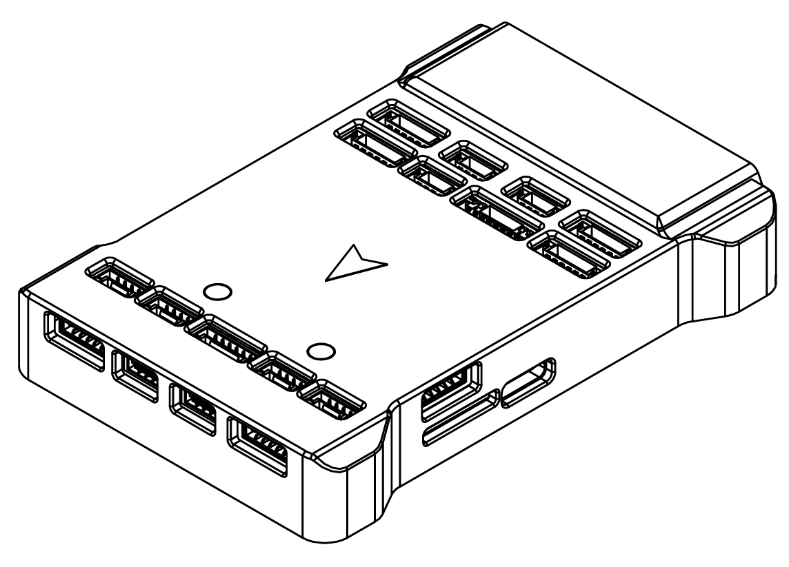
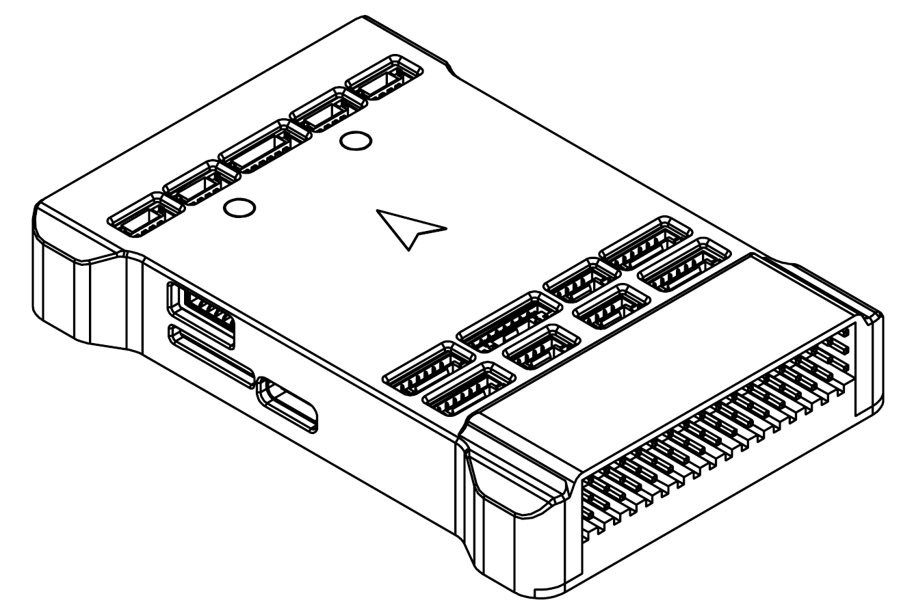
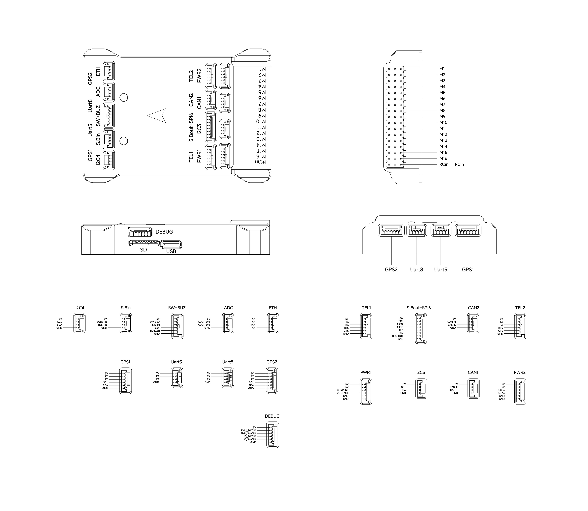

# CyberX-v10

::: warning
PX4 does not manufacture this (or any) autopilot.
:::

## Introduction

The CyberX-v10 is an advanced autopilot manufactured by [CyberCraft International Limited](http://int.woocoo.vip/).

The autopilot is recommended for commercial system integration, but is also suitable for academic research and any other applications.
It brings you ultimate performance, stability, and reliability in every aspect.



::: info
These flight controllers are [manufacturer supported](../flight_controller/autopilot_manufacturer_supported.md).
:::

## Technical Specification

### Processors & Sensors

- FMU Processor: STM32H743IIK6
  - 32 Bit Arm® Cortex®-M7, 400MHz, 2MB flash memory, 1MB RAM
- IO Processor: STM32F103
  - 32 Bit Arm® Cortex®-M3, 72MHz, 128KB Flash, 20KB SRAM
- On-board sensors
  - Accel/Gyro: BMI088
  - Accel/Gyro: ICM-42688-P
  - Accel/Gyro: ICM-20689
  - Mag: IST8310
  - Barometer: BMP581, ICP-20100

### Interfaces

- 16x PWM Servo Outputs (8 IO + 8 FMU)
- 1x Dedicated R/C Input for Spektrum / DSM and S.Bus
- 1x Analog/PWM RSSI Input
- 2x TELEM Ports (with full flow control)
- 6x UART Ports (TEL1/TEL2 with flow control) plus dedicated RC input
- 2x GPS Ports
  - 2x Basic GPS Port (with I2C, GPS1 and GPS2)
- 1x USB Port (TYPE-C)
- 1x Ethernet Port
  - Transformer application
  - 100Mbps
- 2x I2C Bus Ports
- 1x SPI Bus
  - 2x Chip Select Line
- 2x CAN Ports
- 2x Power Input Ports
  - ADC Power Input
  - I2C Power Input
- 2x AD Ports
  - Analog Input (3.3V)
  - Analog Input (6.6V)
- 1x Dedicated Debug Port
  - FMU Debug
  - IO Debug
- 1x microSD card slot

### Dimensions

- size: 83mm x 57mm x 15.1mm
- weight: 72.4g

## Purchase Channels {#store}

Order from [CyberCraft International Limited](http://int.woocoo.vip/).

## Radio Control

A Radio Control (RC) system is required if you want to manually control your vehicle (PX4 does not require a radio system for autonomous flight modes).

You will need to select a compatible transmitter/receiver and then bind them so that they communicate (read the instructions that come with your specific transmitter/receiver).

Spektrum/DSM receivers connect to the DSM/SBUS RC input.
PPM or SBUS receivers connect to the RCIN input port.
CRSF receiver must be wired to a spare port (UART) on the Flight Controller. Then you can bind the transmitter and receiver together.

## Serial Port Mapping

| UART   | Device     | Port          |
| ------ | ---------- | ------------- |
| USART1 | /dev/ttyS0 | GPS1          |
| USART2 | /dev/ttyS1 | TELEM1        |
| USART3 | /dev/ttyS2 | TELEM2        |
| UART4  | /dev/ttyS3 | GPS2          |
| UART5  | /dev/ttyS4 | TELEM2        |
| USART6 | /dev/ttyS5 | PX4IO         |
| UART7  | /dev/ttyS6 | EXT2          |
| UART8  | /dev/ttyS7 | RC            |

## PWM Output

The CyberX-v10 supports up to 16 PWM outputs. The first 8 outputs (labelled M1 to M8) are controlled by the dedicated STM32F103 IO controller. The remaining 8 outputs (labelled M9 to M16) are the "auxiliary" outputs directly attached to the STM32H743 FMU.

All 16 outputs support normal PWM. All outputs support DShot except M15 and M16, which are PWM-only (no DMA). Outputs M9 and M11 support bi-directional DShot.

The 8 IO PWM outputs are in 3 groups:

- Outputs M1, M2 in group 1
- Outputs M3, M4 in group 2
- Outputs M5, M6, M7, M8 in group 3

The 8 FMU PWM outputs are in 3 groups:

- Outputs M9, M10, M11 and M12 in group1
- Outputs M13 and M14 in group2
- Outputs M15 and M16 in group3

Channels within the same group need to use the same output rate.
If any channel in a group uses DShot then all channels in the group need to use DShot.

## Electrical data

- Voltage Ratings:
  - Max input voltage: 5.5V
  - USB Power Input: 4.75 ~ 5.25V
- Current Ratings:
  - TELEM1 and TELEM2 combined output current limiter: 1.5A
  - All other port combined output current limiter: 1.5A

## Battery Monitoring

The board has connectors for 2 power monitors.

- POWER1 -- ADC
- POWER2 -- I2C

The board is configure by default for a analog power monitor, and also has I2C power monitor default configured which is enabled.

The default PDB included with the v10 is analog and must be connected to `POWER1`.

## Building Firmware

To [build PX4](../dev_setup/building_px4.md) for this target, execute:

```sh
make cyberx_v10_default
```

## Debug Port

The debug port interface uses the JST GH1.25-6p.

| Pin     | Signal         | Volt  |
| ------- | -------------- | ----- |
| 1 (red) | 5V+            | +5V   |
| 2 (blk) | FMU_SWDIO      | +3.3V |
| 3 (blk) | FMU_SWCLK      | +3.3V |
| 4 (blk) | IO_SWDIO       | +3.3V |
| 5 (blk) | IO_SWCLK       | +3.3V |
| 6 (blk) | GND            | GND   |

## Pinouts






## Supported Platforms / Airframes

Any multi-rotor/airplane/rover or boat that can be controlled using normal RC servos or Futaba S-Bus servos.
The complete set of supported configurations can be found in the [Airframe Reference](../airframes/airframe_reference.md).
