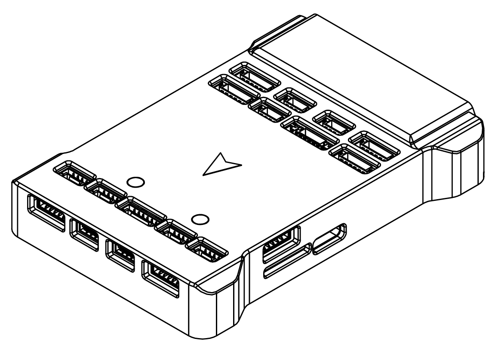
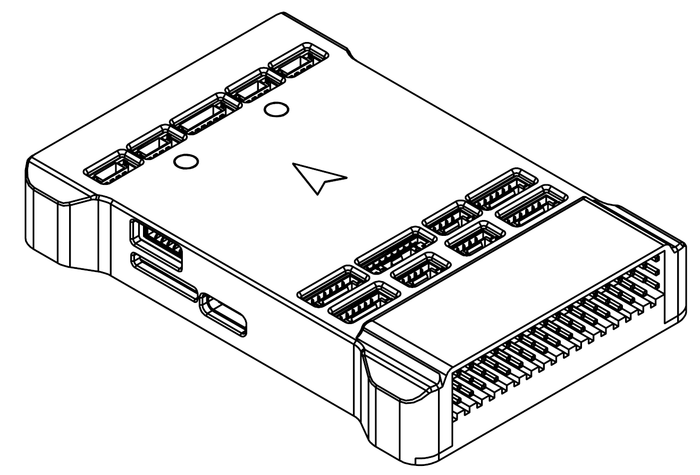
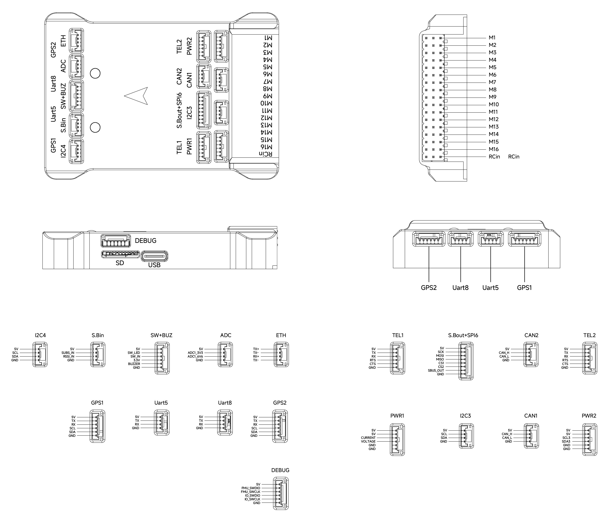
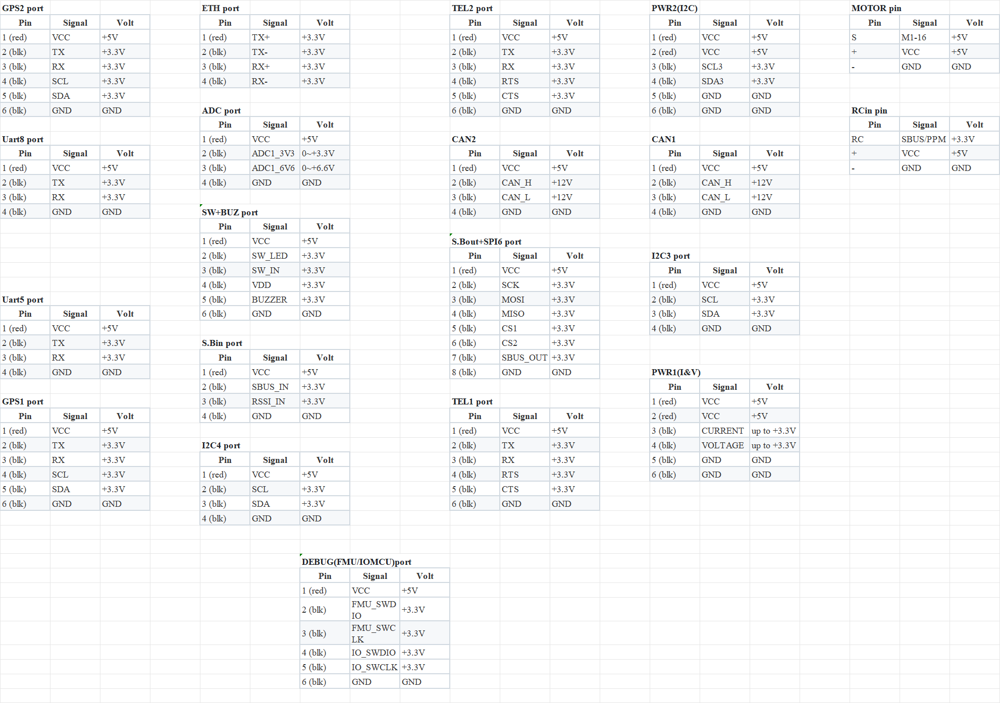

# CyberCraft CyberX-v10

<Badge type="tip" text="main (PX4 v2.0)" />

::: warning
PX4 does not manufacture this (or any) autopilot.
Contact the [manufacturer](https://int.woocoo.vip/) for hardware support or compliance issues.
:::

The CyberX-v10 is an advanced autopilot manufactured by [CyberCraft International Limited](https://int.woocoo.vip/).

The autopilot is recommended for commercial system integration, but is also suitable for academic research and other applications.
It brings you ultimate performance, stability, and reliability in every aspect.



::: info
This flight controller is [manufacturer supported](../flight_controller/autopilot_manufacturer_supported.md).
:::

## Specifications {#specifications}

### Processor {#processor}

- **Main FMU processor:** STM32H743IIK6 (32 Bit Arm® Cortex®-M7, 480MHz, 2MB Flash, 1MB RAM)
- **IO processor:** STM32F103 (32 Bit Arm® Cortex®-M3, 72MHz, 128KB Flash, 20KB SRAM)

### Sensors {#sensors}

- **IMU:** ICM-20689 (SPI1), BMI088 (SPI3), ICM-42688-P (SPI4)
- **Barometer:** BMP581 (SPI2), ICP-20100 (I2C4)
- **Magnetometer:** IST8310 (I2C3)

### Interfaces {#interfaces}

- **PWM outputs:** 16 (8 IO + 8 FMU)
- **Serial ports:** 6 (`GPS1`, `GPS2`, `TEL1`, `TEL2`, `Uart5`, `Uart8`), `TEL1` and `TEL2` with flow control
- **I2C buses:** 4 (I2C1 and I2C2 on the `GPS1` and `GPS2` ports; I2C3 and I2C4 shared between on-board sensors and the `I2C3` and `I2C4` ports)
- **SPI buses:** 6, of which SPI6 is external with 2 chip select lines
- **CAN buses:** 2 (`CAN1`, `CAN2`)
- **Ethernet:** 100Mbps, with transformer
- **USB:** Type-C
- **RC input:** Dedicated RC input for Spektrum / DSM and SBUS
- **RSSI input:** 1 analog/PWM
- **Analog inputs:** 2 on the `ADC` port (3.3V and 6.6V)
- **Power inputs:** 2 (`PWR1` ADC, `PWR2` I2C)
- **Parameter storage:** FRAM (FM25V02A) on SPI5
- **SD card:** microSD card slot
- **Debug port:** 1 (`DEBUG`, FMU and IO debug)

### Electrical Data {#electrical_data}

- **Max input voltage:** 5.7V
- **USB power input:** 4.75 ~ 5.25V
- **Output current limits:** `TEL1` and `TEL2` combined 1.5A; all other ports combined 1.5A

### Mechanical Data {#mechanical_data}

- **Size:** 83mm x 57mm x 15.1mm
- **Weight:** 72.4g

## Where to Buy {#store}

Order from [CyberCraft International Limited](https://int.woocoo.vip/).

## Pinouts {#pinouts}








## Power {#power}

## Voltage Ratings

CyberX-v10 can be triple-redundant on the power supply if three power sources are supplied.
The three power rails are: **PWR1**, **PWR2** and **USB**.

**Normal Operation Maximum Ratings**

Under these conditions all power sources will be used in this order to power the system:

1. **PWR1** and **PWR2** inputs (4.75V to 5.5V)
2. **USB** input (4.75V to 5.25V)

**Absolute Maximum Ratings**

Under these conditions the system will not draw any power (will not be operational), but will remain intact.

1. **PWR1** and **PWR2** inputs (operational range 4.7V to 5.7V, 0V to 10V undamaged)
2. **USB input** (operational range 4.7V to 5.7V, 0V to 6V undamaged)
3. **Servo input:** `MOTOR` pin of **FMU PWM OUT** and **I/O PWM OUT** (0V to 42V undamaged)

warning: The PWM output ports are not powered by the POWER port. The output rail must be separately powered if it needs to power servos or other hardware.

**Voltage monitoring**

The board has connectors for 2 power monitors.

- `PWR1` -- ADC
- `PWR2` -- I2C

The board is configured by default for an analog power monitor on `PWR1`.
An INA228 I2C power monitor (address 0x40) on `PWR2` is also started by default.
Other I2C power monitors, such as the INA226 or INA238, must be started manually.

The default PDB included with the v10 is analog and must be connected to `PWR1`.

See [Battery Estimation Tuning (Power Setup)](../config/battery.md) for how to configure the battery and power monitor.

## PWM Outputs {#pwm_outputs}

The cyberx_v10 supports up to 16 PWM outputs.
The first 8 outputs (labelled `M1` to `M8`) are controlled by the dedicated STM32F103 IO controller.
The remaining 8 outputs (labelled `M9` to `M16`) are the "auxiliary" outputs directly attached to the STM32H743 FMU.

All 16 outputs support normal PWM.
The FMU outputs `M9` to `M14` support [DShot](../peripherals/dshot.md).
The IO outputs `M1` to `M8`, and the FMU outputs `M15` and `M16` (no DMA), PWM-only.
Outputs `M9` to `M14` support [Bidirectional DShot](../peripherals/dshot.md).

The 8 IO PWM outputs are in 3 groups:

- Outputs `M1`, `M2` in group 1
- Outputs `M3`, `M4` in group 2
- Outputs `M5`, `M6`, `M7`, `M8` in group 3

The 8 FMU PWM outputs are in 3 groups:

- Outputs `M9`, `M10`, `M11` and `M12` in group 1
- Outputs `M13` and `M14` in group 2
- Outputs `M15` and `M16` in group 3

Channels within the same group need to use the same output rate.
If any channel in a group uses DShot then all channels in the group need to use DShot.

## Ethernet {#ethernet}

The board has a 100Mbps Ethernet port with an on-board transformer, on the 4-pin `ETH` connector (TX+, TX-, RX+, RX-).

MAVLink is enabled on Ethernet by default ([MAV_2_CONFIG](../advanced_config/parameter_reference.md#MAV_2_CONFIG) is set to `1000`), broadcasting on UDP port 14550.
See [PX4 Ethernet Setup](../advanced_config/ethernet_setup.md) for how to configure the network.

## SD Card (Optional) {#sd_card}

The board has a microSD card slot, on the side of the case beside the `USB` and `DEBUG` ports.
SD cards are used for [log files and for storing missions](../getting_started/px4_basic_concepts.md#sd-cards-removable-memory).

## Serial Port Mapping {#serial_port_mapping}

| UART   | Device     | Port               | Flow Control |
| ------ | ---------- | ------------------ | ------------ |
| USART1 | /dev/ttyS0 | `GPS1`             | No           |
| USART2 | /dev/ttyS1 | `TEL1`             | Yes          |
| USART3 | /dev/ttyS2 | `TEL2`             | Yes          |
| UART4  | /dev/ttyS3 | `GPS2`             | No           |
| UART5  | /dev/ttyS4 | `Uart5`            | No           |
| USART6 | /dev/ttyS5 | PX4IO              | No           |
| UART7  | /dev/ttyS6 | EXT2               | No           |
| UART8  | /dev/ttyS7 | `Uart8` (RC input) | No           |

## Assembly {#assembly}

### Radio Control {#radio_control}

A Radio Control (RC) system is required if you want to manually control your vehicle (PX4 does not require a radio system for autonomous flight modes).

You will need to [select a compatible transmitter/receiver](../getting_started/rc_transmitter_receiver.md) and then bind them so that they communicate (read the instructions that come with your specific transmitter/receiver).

SBUS receivers connect to the `S.Bin` port.
PPM receivers connect to the `RCin` pin on the servo rail.
Spektrum/DSM and CRSF receivers connect to the `Uart8` port.
If your receiver outputs individual PWM signals (one wire per channel) it must be connected via a [PPM encoder](../getting_started/rc_transmitter_receiver.md#connecting-receivers).
CRSF receivers must be wired to a spare UART port on the flight controller.
You can then bind the transmitter and receiver together.

### GPS & Compass {#gps_compass}

PX4 supports GPS modules connected to the GPS ports listed below.
GPS modules should be [mounted on the frame](../assembly/mount_gps_compass.md) as far away from other electronics as possible, with the direction marker pointing towards the front of the vehicle.

The GPS ports are:

- `GPS1`: 6-pin port with UART and I2C (for an external compass).
- `GPS2`: 6-pin port with UART and I2C (for an external compass).

The GPS ports do not include safety switch, LED or buzzer pins.
These are on the separate `SW+BUZ` port.

The board has an on-board IST8310 magnetometer.

### Telemetry Radios (Optional) {#telemetry}

[Telemetry radios](../telemetry/index.md) may be used to communicate and control a vehicle in flight from a ground station (for example, you can direct the UAV to a particular position, or upload a new mission).

The vehicle-based radio should be connected to the `TEL1` or `TEL2` port.
If connected to `TEL1`, no further configuration is required.
The other radio is connected to your ground station computer or mobile device (usually by USB).

### CAN {#can}

The board has two CAN ports, `CAN1` and `CAN2`, which can be used for [DroneCAN](../dronecan/index.md) peripherals.

## Building Firmware {#building_firmware}

::: tip
Most users will not need to build this firmware from PX4 v2.0.
It will be pre-built and automatically installed by _QGroundControl_ when appropriate hardware is connected.
:::

To [build PX4](../dev_setup/building_px4.md) for this target, execute:

```sh
make cyberx_v10_default
```

## Debug Port {#debug_port}

The `DEBUG` port provides the [SWD interface](../debug/swd_debug.md) for both the FMU and the IO processor.
It uses a 6-pin JST GH (1.25mm pitch) connector with the pinout below, which is not a [Pixhawk Debug](../debug/swd_debug.md#pixhawk-standard-debug-ports) port.
The port does not include the [PX4 System Console](../debug/system_console.md) UART.

| Pin     | Signal    | Voltage |
| ------- | --------- | ------- |
| 1 (red) | 5V+       | +5V     |
| 2 (blk) | FMU_SWDIO | +3.3V   |
| 3 (blk) | FMU_SWCLK | +3.3V   |
| 4 (blk) | IO_SWDIO  | +3.3V   |
| 5 (blk) | IO_SWCLK  | +3.3V   |
| 6 (blk) | GND       | GND     |

## Supported Platforms / Airframes

Any multi-rotor/airplane/rover or boat that can be controlled using normal RC servos or Futaba SBUS servos.
The complete set of supported configurations can be found in the [Airframe Reference](../airframes/airframe_reference.md).
