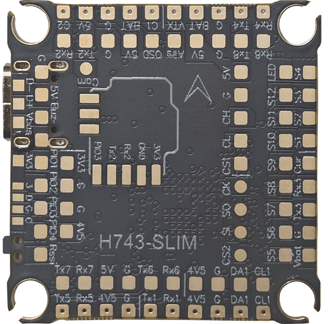
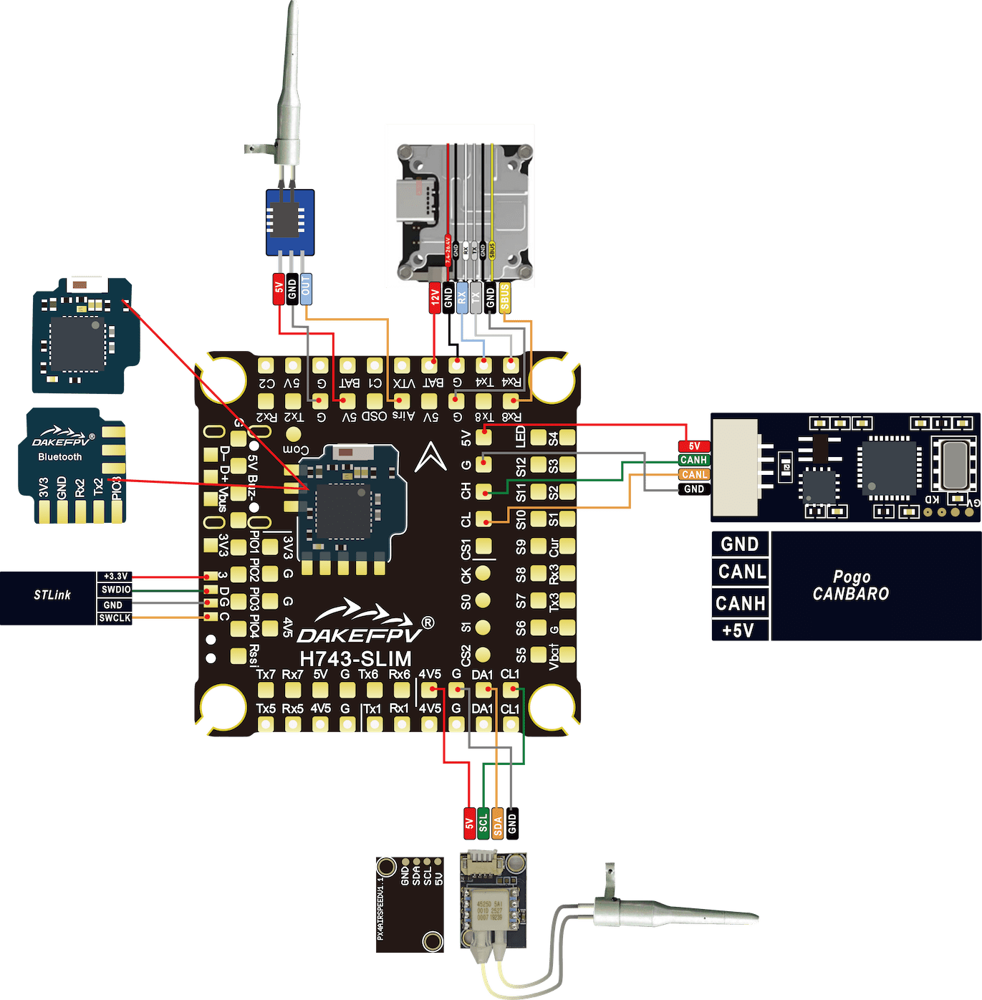
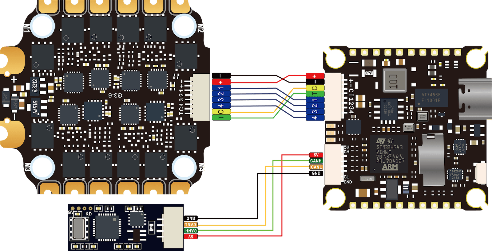
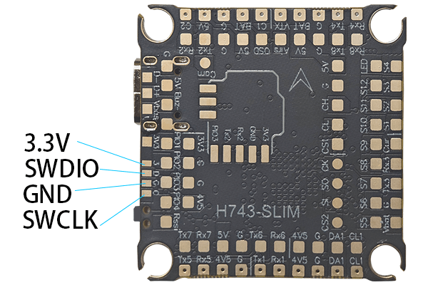

# DAKEFPV H743-SLIM

<Badge type="tip" text="PX4 v1.18" />

::: warning
PX4 does not manufacture this (or any such) autopilot system. For hardware support or compliance issues, please contact the [manufacturer](http://dakefpv.com/).
:::

The [DAKEFPV H743-SLIM](http://dakefpv.com/pd.jsp?id=89) integrates numerous features, including a plug-and-play 4-in-1 ESC interface, barometer, OSD functionality, 8 UART interfaces, a black box MicroSD card slot, 5V BEC, convenient soldering layout, LED and buzzer pads, and I2C pads (SDA and SCL) for connecting an external GPS/magnetometer, among many other features.


::: tip
This flight controller is [supported by the manufacturer](../flight_controller/autopilot_manufacturer_supported.md).
:::

## Key Features

- Main Control Chip: STM32H743 32-bit processor with a running frequency of 480 MHz
- Gyroscope: MPU6000
- Barometer: BMP280
- OSD: AT7456E
- On-board Bluetooth module: Disabled when used with PX4
- 1x JST-SH1.0_8pin interface (for single ESC or 4-in-1 ESC)
- 1x GH1.25-4Pin Interface (CAN Bus)
- Battery Input Voltage: 2S - 12S
- BEC 5V 2A continuous power supply.
- Mounting Hole Spacing: 30.5 mm × 30.5 mm / holes with a diameter of 4 mm
- Size: 35x35mm
- Weight: 8g

## Purchase Channels

This board can be purchased from one of the stores listed below (for example):

- [DAKEFPV Official Website](http://dakefpv.com/pd.jsp?id=89)

::: Tip
The _DAKEFPV H743-SLIM_ is designed to be used with the _BX 6S 55A_ 4-in-1 ESC, and the two can be purchased as a set.
:::

## Interfaces and Pads

This is a top view of the DAKEFPVH743_SLIM, showing the top pads of the circuit board:



| Pin             | Function                                                                  | PX4 Default         |
| --------------- | ------------------------------------------------------------------------- | ------------------- |
| Vbat            | Battery positive voltage (2S-12S)                                         |                     |
| BAT             | Vbat ==> BAT                                                              |                     |
| SA1, CL1        | I2C peripheral interface                                                  |                     |
| 5V              | 5V output (2A max) BEC power supply (TypeC does not supply power)         |                     |
| 4V5             | 4.5V output (2A max) BEC power supply or TypeC power supply               |                     |
| 3V3             | 3.3V output (0.25A max)                                                   |                     |
| VTX             | Video output to VTX                                                       |                     |
| Airs            | Simulated airspeed indicator ADC pad                                      |                     |
| Cur             | Ammeter ADC input pad (also located in the jack for use with 4-in-1 ESC)  |                     |
| OSD             | Camera control                                                            |                     |
| C1, C2 or Cam   | Video input from FPV camera                                               |                     |
| G               | Battery negative/ground level                                             |                     |
| Rssi            | Analog RSSI (0-3.3V) input from receiver                                  |                     |
| D-, D+ and Vbus | USB pad                                                                   |                     |
| SI, SO and CLK  | External SPI Bus MOSI, MISO and CLK                                       |                     |
| CS1, CS2        | External SPI Bus CS1 and CS2                                              |                     |
| R1, T1          | UART1 RX and TX                                                           | GPS                 |
| R2, T2          | UART2 RX and TX                                                           | TEL1                |
| R3, T3          | UART3 RX and TX (RX is also located in the jack for use with 4-in-1 ESC)  | ESC Telemetry       |
| R4, T4          | UART4 RX and TX                                                           | TEL2                |
| R5, T5          | UART5 RX and TX                                                           | RC port             |
| R6, T6          | UART6 RX and TX                                                           | TEL3                |
| R7, T7          | UART7 RX and TX                                                           | NuttX Debug Console |
| R8, T8          | UART8 RX and TX                                                           | TEL4                |
| CH, CL          | CAN Bus CH and CL                                                         |                     |
| Buz-            | Piezo buzzer negative pin (connect the buzzer positive pin to the 5V pad) |                     |
| S1 to S4        | Motor signal output terminals                                             |                     |
| S5 to S8        | Motor signal output terminals                                             |                     |
| S5 to S8        | Motor signal output terminals                                             |                     |
| LED             | WS2182 addressable LED signal line (untested)                             |                     |

## Sample Wiring Diagram






## PX4 Bootloader Update {#bootloader}

This board comes pre-installed with [Betaflight](https://github.com/betaflight/betaflight/wiki) firmware. Before installing PX4 firmware, the PX4 bootloader must be flashed. Download the [kakuteh7_bl.hex](https://github.com/PX4/PX4-Autopilot/raw/main/docs/assets/flight_controller/kakuteh7/holybro_kakuteh7_bootloader.hex) bootloader binary file and refer to [this page](../advanced_config/bootloader_update_from_betaflight.md) for flashing instructions.

## Compile Firmware

Build the [PX4](../dev_setup/building_px4.md) system for this target:

```sh
make dake_h743-slim_default
```

## Install PX4 Firmware

Firmware can be installed in any of the usual ways:

- Build and upload the source code

  ```sh
  make dake_h743-slim_default upload
  ```

- Load the firmware using _QGroundControl_ [Loading Firmware](../config/firmware.md). You can choose either the pre-built firmware or use your own custom firmware.

::: info
If you are loading pre-built firmware via QGroundcontrol, you must use QGC Daily or a version of QGC later than 4.1.7.
:::

## PX4 Configuration

In addition to the [basic configuration](../config/index.md), the following parameters are critical:

| Parameter                                                            | Setting                                                                                                             |
| -------------------------------------------------------------------- | ------------------------------------------------------------------------------------------------------------------- |
| [SYS_HAS_MAG](../advanced_config/parameter_reference.md#SYS_HAS_MAG) | This should be disabled as the board has no built-in compass. If you attach an external compass, it can be enabled. |

## Serial Port Mapping

| UART   | Device     | Port          |
| ------ | ---------- | ------------- |
| USART1 | /dev/ttyS0 | GPS1          |
| USART2 | /dev/ttyS1 | TELEM1        |
| USART3 | /dev/ttyS2 | ESC Telemetry |
| UART4  | /dev/ttyS3 | TELEM2        |
| UART5  | /dev/ttyS4 | RC SBUS       |
| USART6 | /dev/ttyS5 | TELEM3        |
| UART7  | /dev/ttyS6 | Debug Console |
| UART8  | /dev/ttyS7 | TELEM4        |

## Debug Interfaces

### System Console

The receive and transmit ports of UART7 are configured to be used as the [system console](../debug/system_console.md).

### SWD

The SWD (JTAG) pins are as follows:

- `SWCLK`: Test Point 2 (Pin 72 on the CPU)
- `SWDIO`: Test Point 3 (Pin 76 on the CPU)
- `GND`: As indicated on the board
- `VDD_3V3`: As indicated on the board

The relevant content is listed below:


