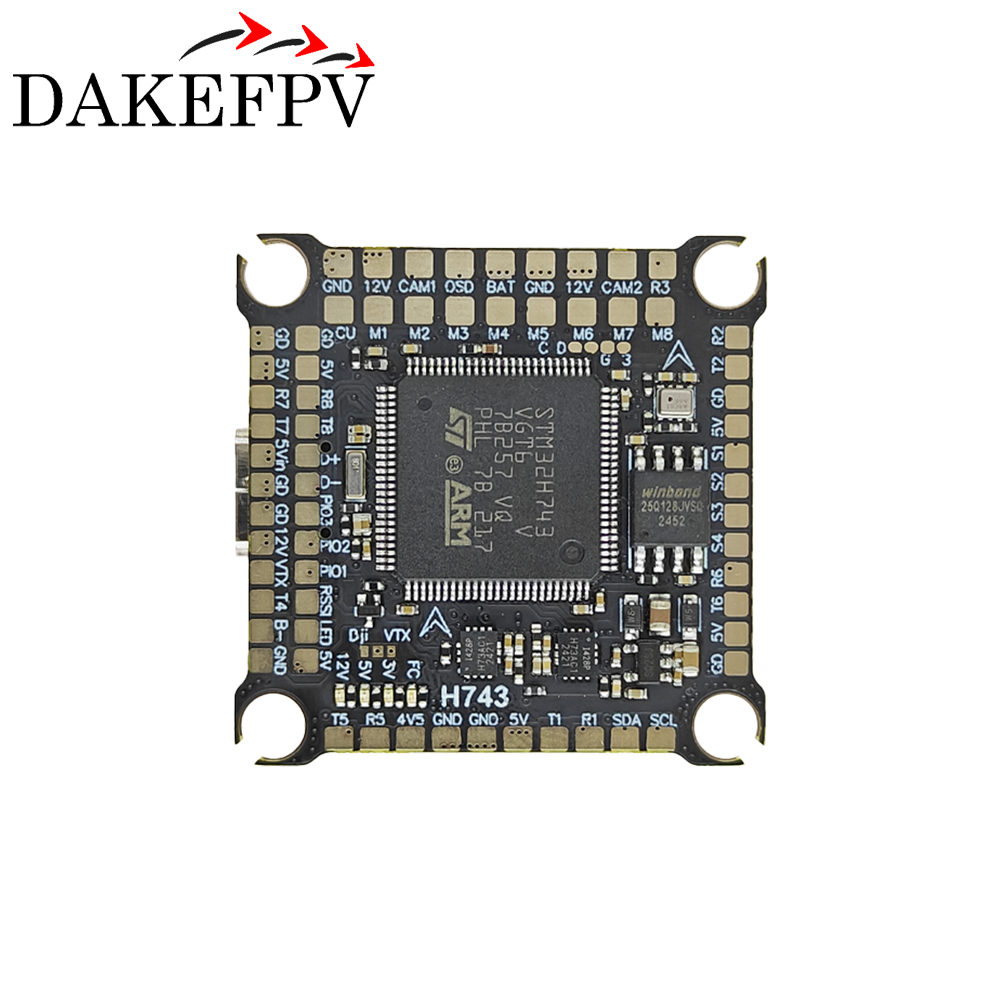
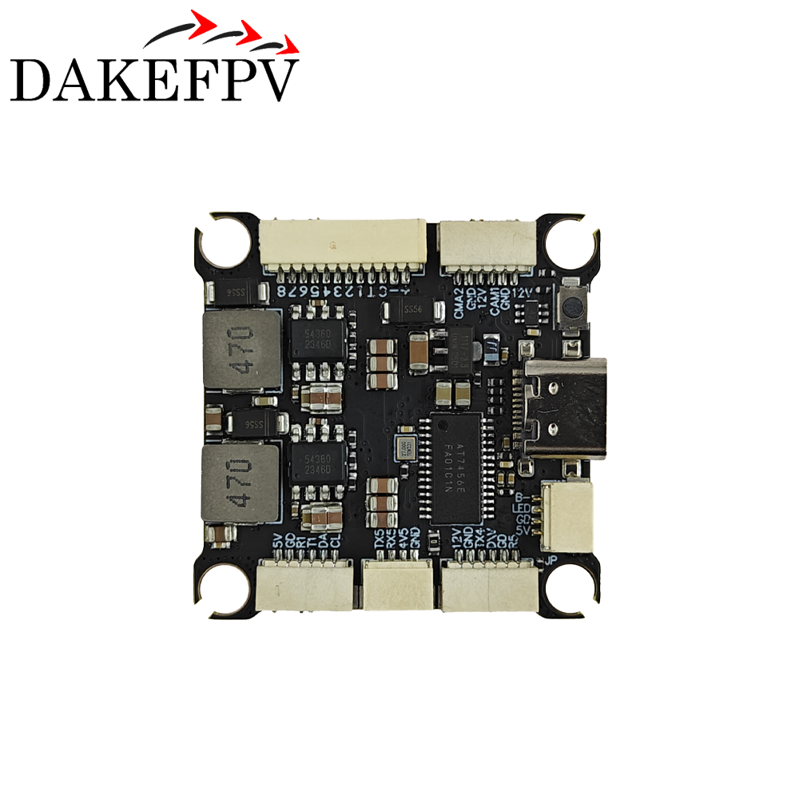
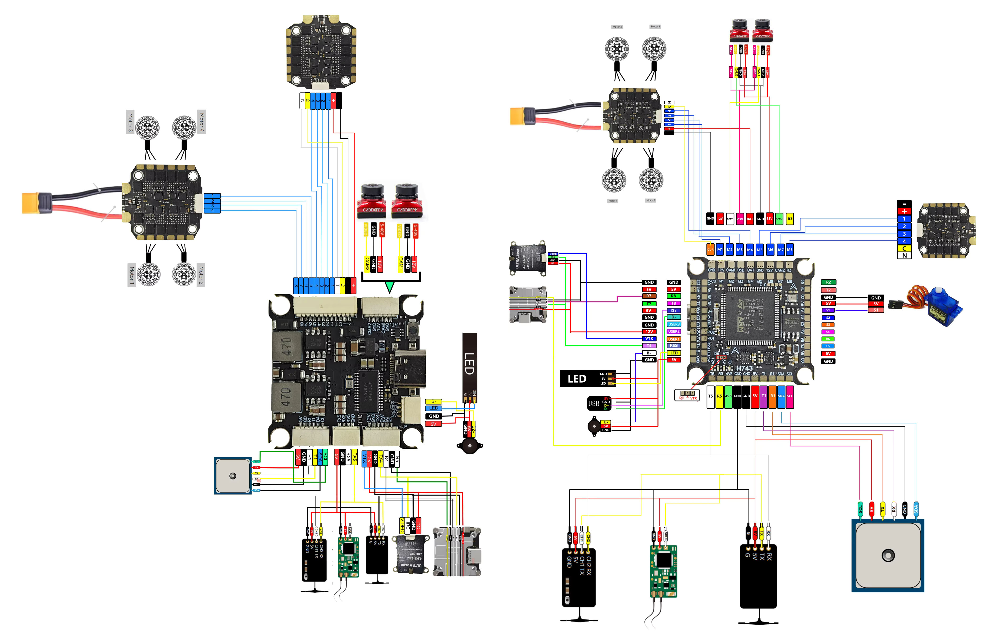
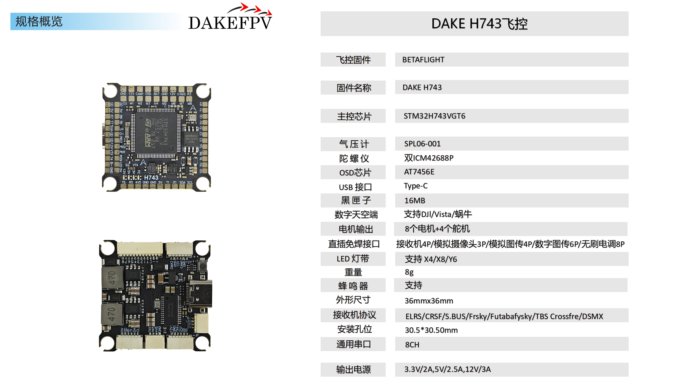

# DAKEFPV H743

::: warning
PX4 does not manufacture this (or any) autopilot.
Contact the [manufacturer](https://www.dakefpv.com/) for hardware support or compliance issues.
:::

::: info
This flight controller is [manufacturer supported](../flight_controller/autopilot_manufacturer_supported.md).
:::

The DAKEFPV H743 is a compact STM32H743-based flight controller aimed at FPV racing and freestyle builds.
It features dual ICM-42688P IMUs, an SPL06 barometer, an AT7456E OSD, 16 MB onboard flash for blackbox logging, and supports 12S LiPo input.

## Key Features

- **MCU:** STM32H743, Cortex-M7 @ 480 MHz
- **IMU:** Dual ICM-42688P (independent SPI buses, hardware vibration isolation)
- **Barometer:** SPL06 (I2C2)
- **OSD:** AT7456E (SPI2)
- **Blackbox storage:** 16 MB SPI flash (onboard, no SD card slot)
- **UARTs:** 8
- **PWM outputs:** 12 motor outputs + 1 LED strip pad
- **DShot:** M1–M8 and S3–S4 support bidirectional DShot
- **Battery input:** 4S–12S LiPo
- **BEC 5V:** 3A
- **BEC 12V:** 3A (GPIO-controlled, for VTX)
- **Dual switchable camera inputs**
- **Mounting:** 30.5 × 30.5 mm

## Where to Buy

[DAKEFPV store](https://www.dakefpv.com/)

## Pinout




## Wiring Diagram



## Specifications



## Serial Port Mapping

| UART   | Device     | PX4 default | DMA   |
| ------ | ---------- | ----------- | ----- |
| USART1 | /dev/ttyS0 | GPS1        | RX+TX |
| USART2 | /dev/ttyS1 | TELEM1      | —     |
| USART3 | /dev/ttyS2 | TELEM2      | —     |
| USART6 | /dev/ttyS3 | TELEM3      | RX+TX |
| UART5  | /dev/ttyS4 | RC input    | RX+TX |
| UART7  | /dev/ttyS5 | TELEM4      | RX+TX |
| UART4  | —          | Available   | —     |
| UART8  | —          | Available   | —     |

All four assigned UARTs use full-duplex DMA (DMA2). USART2 and USART3 are interrupt-driven (ArduPilot marks them NODMA). UART4/UART8 have no current assignment.

## PWM Output Groups

Channels within the same group must use the same output rate. If any channel in a group uses DShot, all channels in that group must use DShot.

| Group | Outputs | Timer | DShot |
| ----- | ------- | ----- | ----- |
| 1     | M1–M4   | TIM2  | ✓     |
| 2     | M5–M8   | TIM4  | ✓     |
| 3     | S1–S2   | TIM15 | ✗     |
| 4     | S3–S4   | TIM8  | ✓     |
| 5     | LED     | TIM1  | ✗     |

## RC Input

RC input is on UART5 (`/dev/ttyS4`) with full-duplex DMA. Supported protocols: CRSF/ELRS, SBUS, DSM, SRXL2.

SBUS is supported via a dedicated inverter tied to the RC pad.
For CRSF/ELRS, connect to the RX5/TX5 pads — TX is required for telemetry back to the receiver.

## OSD

The AT7456E OSD is enabled by default on SPI2. Simultaneous analog OSD and digital HD OSD (via UART4 DisplayPort) is supported.

## Camera Switching and VTX Power

| GPIO | Function                                   | Default state |
| ---- | ------------------------------------------ | ------------- |
| 81   | Camera switch (low = CAM2, high = CAM1)    | High (CAM1)   |
| 82   | VTX 12V power (low = off, high = on)       | High (on)     |

## Battery Monitoring

Built-in voltage sensor and current sensor input (up to 130A). Recommended PX4 parameters:

| Parameter            | Value |
| -------------------- | ----- |
| `SENS_BATT_VOLT_PIN` | 11    |
| `SENS_BATT_CURR_PIN` | 10    |
| `BAT_V_DIV`          | 16.0  |
| `BAT_A_PER_V`        | 83.3  |

## RSSI

Analog RSSI input on ADC channel 8 (PC5). Set `RSSI_TYPE = 1` and `RSSI_ANA_PIN = 8`.
For CRSF/ELRS embedded RSSI, use `RSSI_TYPE = 3`.

## Compass

No built-in compass. Attach an external compass via the I2C2 pads (SCL = PB10, SDA = PB11).
Set `SYS_HAS_MAG = 0` if no external compass is connected.

## PX4 Bootloader

The board ships with Betaflight. Flash the PX4 bootloader before loading PX4 firmware.

Put the board in DFU mode (hold BOOT button while plugging USB), then:

```sh
dfu-util -a 0 -s 0x08000000:leave \
  -D boards/dakefpv/h743/extras/dakefpv_h743_bootloader.bin
```

The bootloader binary is included in the PX4 source tree at `boards/dakefpv/h743/extras/`.

## Building Firmware

To [build PX4](../dev_setup/building_px4.md) for this target:

```sh
make dakefpv_h743_default
```

## Installing PX4 Firmware

Once the PX4 bootloader is running, upload firmware with:

```sh
make dakefpv_h743_default upload
```

Or load via QGroundControl using a pre-built `.px4` file.

## Debug Port

The SWD debug interface pins are exposed on pads:

- `SWDIO`: PA13
- `SWCLK`: PA14
- `GND`: GND pad
