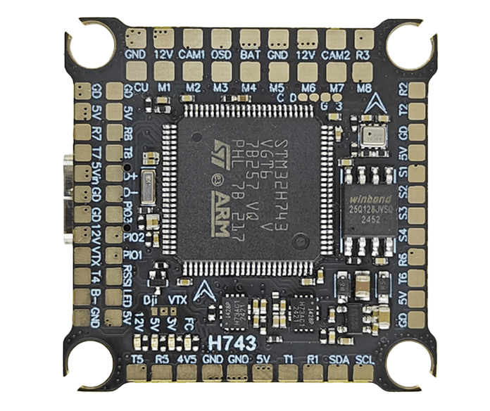
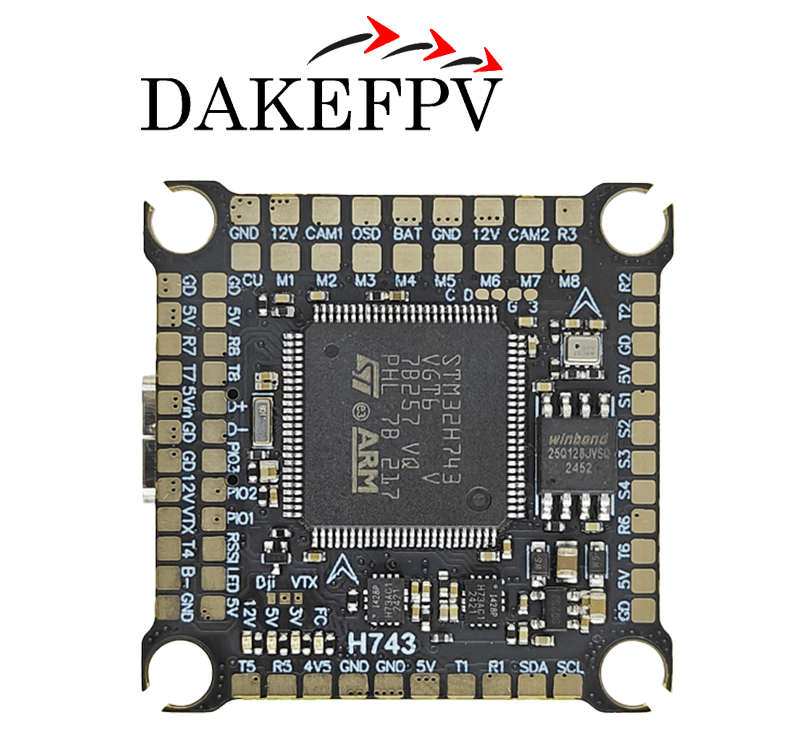
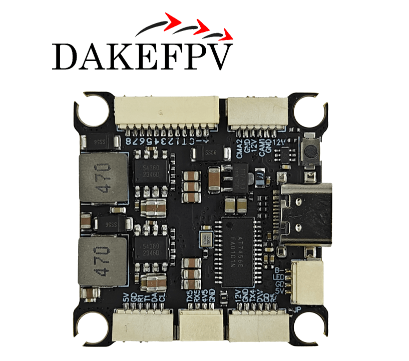
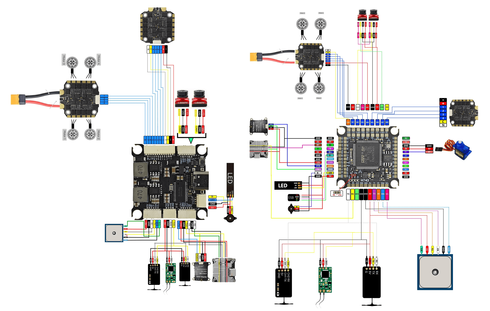

# DAKEFPV H743

<Badge type="tip" text="main (PX4 v2.0)" />

::: warning
PX4 does not manufacture this (or any) autopilot.
Contact the [manufacturer](https://www.dakefpv.com/) for hardware support or compliance issues.
:::

The [DAKEFPV H743](https://www.dakefpv.com/pd.jsp?id=66) is a compact STM32H743-based flight controller aimed at FPV racing and freestyle builds, manufactured by [DAKEFPV](https://www.dakefpv.com/).
It features dual ICM-42688P IMUs, an SPL06 barometer, an AT7456E OSD, 16 MB onboard flash for blackbox logging, and supports 12S LiPo input.



::: info
This flight controller is [manufacturer supported](../flight_controller/autopilot_manufacturer_supported.md).
:::

## Specifications {#specifications}

### Processor {#processor}

- **Main FMU processor:** STM32H743 (Arm Cortex-M7, 480 MHz, 2 MB flash, 1 MB RAM)

### Sensors {#sensors}

- **IMU:** 2x ICM-42688-P (SPI1, SPI4)
- **Barometer:** SPL06-001 (I2C2)
- **Magnetometer:** none (external compass optional)

### Interfaces {#interfaces}

- **PWM outputs:** 12 (8 motor `M1`–`M8`, 4 servo `S1`–`S4`)
- **Serial ports:** 8
- **I2C buses:** 1 (I2C2, shared with the onboard barometer)
- **USB:** USB-C
- **OSD:** AT7456E analog OSD, and MSP DisplayPort for digital VTX (DJI, Vista, Walksnail)
- **Logging:** 16 MB onboard SPI flash (no SD card)
- **Plug-in connectors:** receiver (4-pin), analog camera (3-pin), analog VTX (4-pin), digital VTX (6-pin), ESC (8-pin)
- **Buzzer:** yes
- **Parameter storage:** processor flash

### Electrical data {#electrical_data}

- **Battery input:** 4S–12S LiPo
- **BEC 3.3V:** 2A
- **BEC 5V:** 2.5A
- **BEC 12V:** 3A (GPIO-controlled, for VTX)
- **Power monitoring:** analog battery voltage and current

### Mechanical data {#mechanical_data}

- **Dimensions:** 36 × 36 mm
- **Mounting hole spacing:** 30.5 × 30.5 mm
- **Weight:** 8 g

## Where to Buy {#store}

[DAKEFPV H743](https://www.dakefpv.com/pd.jsp?id=66) (DAKEFPV store)

## Pinouts {#pinouts}




## Power {#power}

The board is powered from a 4S–12S LiPo battery (see [Electrical data](#electrical_data) for the BEC outputs).

Battery voltage and current are measured by the board's analog inputs, with a current sensor input of up to 130 A.
The default scaling is [BAT1_V_DIV](../advanced_config/parameter_reference.md#BAT1_V_DIV) = `16.0` and [BAT1_A_PER_V](../advanced_config/parameter_reference.md#BAT1_A_PER_V) = `83.3`; check these against your battery and ESC as described in [Battery Estimation Tuning](../config/battery.md).

## PWM Outputs {#pwm_outputs}

All outputs within the same group must use the same output protocol and rate.

| Group | Outputs   | Timer | DShot |
| ----- | --------- | ----- | ----- |
| 1     | `M1`–`M4` | TIM2  | ✓     |
| 2     | `M5`–`M8` | TIM4  | ✓     |
| 3     | `S1`–`S2` | TIM15 | ✗     |
| 4     | `S3`–`S4` | TIM8  | ✓     |

[Bidirectional DShot](../peripherals/dshot.md#bidirectional-dshot-telemetry) with eRPM telemetry works on `M1`–`M7` and `S3`–`S4`.
`M8` (TIM4 CH4) can send bidirectional DShot but can't read eRPM telemetry back, and `S1`–`S2` don't support DShot.

The `LED` pad (for a WS2812 LED strip) is not supported by PX4.

## Blackbox Storage {#blackbox_storage}

Logs are written to the onboard 16 MB SPI NOR flash (SPI3), mounted as a littlefs filesystem at `/fs/microsd`.
There is no SD card slot.

Missions, geofences and rally points are kept in RAM ([SYS_DM_BACKEND](../advanced_config/parameter_reference.md#SYS_DM_BACKEND) = `1`), so they are lost on reboot.

::: info Two different flash parts are fitted
These boards have shipped with either of two 16 MB parts, and the two need different NuttX drivers, so PX4 probes for both at start-up and uses whichever answers:

| JEDEC ID   | Part                 | Driver |
| ---------- | -------------------- | ------ |
| `ef 40 18` | Winbond W25Q128      | `w25`  |
| `20 ba 18` | Micron MT25Q/N25Q128 | `m25p` |

Neither driver accepts the other's manufacturer ID, so a build supporting only one leaves half the boards with no usable storage.
The detected ID is reported at boot, visible with `dmesg`:

```
[boot] flash: chip ok (JEDEC ef 40 18), registering MTD...
```

If a board reports `chip not recognised`, that line gives the ID the part actually returned.
All-`00` or all-`ff` means the SPI transaction failed rather than the chip being unknown.
:::

## Serial Port Mapping {#serial_port_mapping}

| UART   | Device       | Port           | Board pads |
| ------ | ------------ | -------------- | ---------- |
| USART1 | `/dev/ttyS0` | `GPS1`         | `T1`/`R1`  |
| USART2 | `/dev/ttyS1` | `TELEM1`       | `T2`/`R2`  |
| USART3 | `/dev/ttyS2` | `TELEM2`       | `T3`/`R3`  |
| UART4  | `/dev/ttyS3` | `TELEM3`       | `T4`/`R4`  |
| UART5  | `/dev/ttyS4` | RC input       | `T5`/`R5`  |
| USART6 | `/dev/ttyS5` | `TELEM4`       | `T6`/`R6`  |
| UART7  | `/dev/ttyS6` | System console | `T7`/`R7`  |
| UART8  | `/dev/ttyS7` | `GPS2`         | `T8`/`R8`  |

::: warning
The pads are silkscreened by UART number, so `T4`/`R4` is UART4 — which PX4 exposes as `TELEM3`, not `TELEM4`.
:::

`TELEM3` (UART4, `/dev/ttyS3`) is on PD0/PD1 and is the default MSP DisplayPort / digital-VTX port (`MSP_OSD_CONFIG 103`).

## Assembly {#assembly}

### Wiring Diagram {#wiring_diagram}



### Radio Control {#radio_control}

A remote control (RC) radio system is required if you want to _manually_ control your vehicle (PX4 does not require a radio system for autonomous flight modes).
You will need to [select a compatible transmitter/receiver](../getting_started/rc_transmitter_receiver.md) and then _bind_ them so that they communicate (read the instructions that come with your specific transmitter/receiver).

Connect the receiver to the `T5`/`R5` pads (UART5, `/dev/ttyS4`), which go directly to the flight controller.
PX4 detects the protocol automatically, with no configuration needed: CRSF/ELRS, GHST, S.BUS, DSM, SUMD and ST24 are supported.
For CRSF, ELRS and GHST, connect both `T5` and `R5` so that telemetry can be sent back to the receiver.

PPM receivers are not supported, as the board has no PPM input.
To use a different serial port for RC, set [RC_PORT_CONFIG](../advanced_config/parameter_reference.md#RC_PORT_CONFIG).

### RSSI {#rssi}

The analog RSSI pad (PC5) is not used by PX4.
RSSI is reported automatically for receivers that send it in their protocol, such as CRSF/ELRS.
For other receivers, set [RC_RSSI_PWM_CHAN](../advanced_config/parameter_reference.md#RC_RSSI_PWM_CHAN) to the RC channel that carries RSSI.

### GPS & Compass {#gps_compass}

Connect a [GPS/compass module](../gps_compass/index.md) to `GPS1` (`T1`/`R1` pads), with its compass on the `SDA`/`SCL` pads (I2C2: PB11/PB10).
A second GPS can be connected to `GPS2` (`T8`/`R8`).

The board has no built-in compass, so compass use is disabled by default ([SYS_HAS_MAG](../advanced_config/parameter_reference.md#SYS_HAS_MAG) = `0`, [EKF2_MAG_TYPE](../advanced_config/parameter_reference.md#EKF2_MAG_TYPE) = `5` (None)).
If you connect an external compass, set `SYS_HAS_MAG` to `1` and `EKF2_MAG_TYPE` to `0` (Automatic), then reboot.

### Telemetry Radios (Optional) {#telemetry}

[Telemetry radios](../telemetry/index.md) connect to `TELEM1` (`T2`/`R2` pads), which runs MAVLink by default and needs no further configuration.
`TELEM2` (`T3`/`R3`) and `TELEM4` (`T6`/`R6`) are also free for other serial peripherals; `TELEM3` is used by the digital VTX by default.

### OSD {#osd}

The AT7456E analog OSD is on SPI2 and is enabled by default for PAL ([OSD_ATXXXX_CFG](../advanced_config/parameter_reference.md#OSD_ATXXXX_CFG) = `2`).
Set it to `1` for NTSC, or `0` to disable the analog OSD; a reboot is required.
Analog OSD and digital HD OSD can run at the same time.

The digital VTX (DJI/HDZero/OpenIPC) connects to the `T4`/`R4` pads — UART4, PX4 `TELEM3` (`/dev/ttyS3`), which is the `MSP_OSD_CONFIG 103` default.

MSP DisplayPort only uses the flight controller's TX line, so `T4` and a ground are enough; `R4` is not needed unless the VTX also talks back.

::: info UART4 pin mapping
UART4 is on PD0 (RX) and PD1 (TX) on this variant, and no peripheral swap is applied.
(The H743 Pro places UART4 on PB8/PB9 and does swap it to match its HD VTX connector; see its board page.)
:::

::: info `Dji`/`VTX` solder jumper
The three-pad solder jumper silkscreened `Dji` and `VTX` selects what the HD VTX connector's `RX4` pin carries: UART4 RX for a digital air unit, or the analog composite video signal when the connector drives an analog VTX.
It is not in the OSD's transmit path, so it does not affect MSP DisplayPort output.
:::

### Camera Switching and VTX Power {#camera_vtx_power}

Two MCU pins switch the camera input and the 12V VTX supply:

| MCU pin | Function                                    | State at boot |
| ------- | ------------------------------------------- | ------------- |
| PE2     | Camera switch (low = `CAM2`, high = `CAM1`) | Low (`CAM2`)  |
| PE3     | VTX 12V power (low = off, high = on)        | Low (off)     |

PX4 has no parameter for these pins.
Set them with the `gpio` command in the [MAVLink Shell](../debug/mavlink_shell.md), for example `gpio write E3 1` to turn on the VTX power.
To apply a setting at every boot, add the command to `/fs/microsd/etc/extras.txt`.

## PX4 Bootloader Update {#bootloader}

The board ships with Betaflight.
Before PX4 firmware can be installed, the _PX4 bootloader_ must be flashed.
Download the [dakefpv_h743_bootloader.bin](https://github.com/PX4/PX4-Autopilot/blob/main/boards/dakefpv/h743/extras/dakefpv_h743_bootloader.bin) bootloader binary and follow the [DFU Bootloader Update](../advanced_config/bootloader_update_from_betaflight.md#dfu-bootloader-update) instructions.

## Building Firmware {#building_firmware}

:::tip
From PX4 v2.0, most users will not need to build this firmware!
It is pre-built and automatically installed by _QGroundControl_ when appropriate hardware is connected.
:::

To [build PX4](../dev_setup/building_px4.md) for this target:

```sh
make dakefpv_h743_default
```

## Installing PX4 Firmware {#installing_firmware}

Once the PX4 bootloader is running, upload firmware with:

```sh
make dakefpv_h743_default upload
```

Alternatively, [load the firmware](../config/firmware.md) using _QGroundControl_, using either pre-built firmware or your own custom build.

## Debug Port {#debug_port}

The [PX4 System Console](../debug/system_console.md) runs on UART7 (`T7`/`R7` pads).

The FMU [SWD interface](../debug/swd_debug.md) is on solder pads (there is no Pixhawk debug connector):

- SWDIO: PA13
- SWCLK: PA14
- GND
