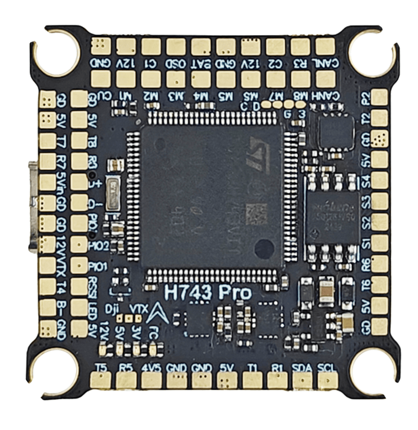
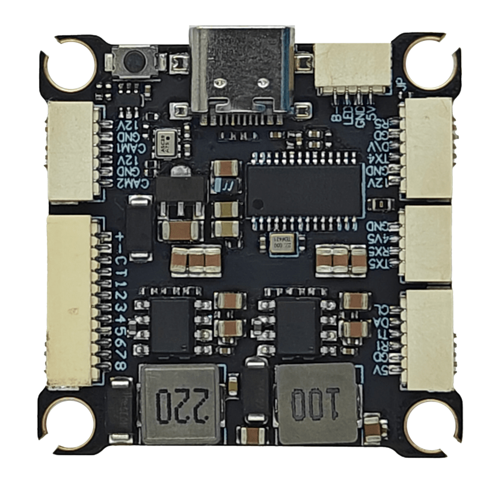
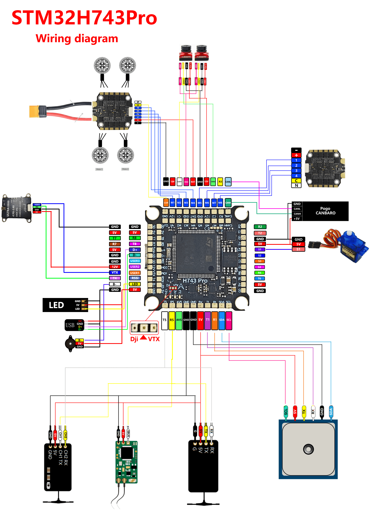

# DAKEFPV H743 Pro

<Badge type="tip" text="PX4 v1.18" />

::: warning
PX4 does not manufacture this (or any) autopilot.
Contact the [manufacturer](https://www.dakefpv.com/) for hardware support or compliance issues.
:::

The DAKEFPV H743 Pro is an STM32H743-based flight controller for FPV racing and freestyle with CAN bus support.
It shares the same sensor suite as the [DAKEFPV H743](dakefpv_h743.md) and adds a CAN port with independent DShot timer groups for M5–M8.

::: info
This flight controller is [manufacturer supported](../flight_controller/autopilot_manufacturer_supported.md).
:::




## Key Features

- **MCU:** STM32H743 @ 480 MHz
- **IMUs:** 2x ICM-42688P (SPI1 and SPI4, independent power supply)
- **Barometer:** SPL06 on I2C2 (requires battery power)
- **OSD:** AT7456E
- **Blackbox storage:** 16 MB SPI NOR flash (no SD card slot)
- **CAN:** 1x CAN port (PD0/PD1)
- **UARTs:** 8
- **PWM outputs:** 8x motor (DShot) + 4x servo + 1x LED
- **Battery input:** 4S–12S LiPo
- **BEC 5V:** 3A
- **BEC 12V:** 3A (GPIO-controlled for VTX)
- **Mounting:** 30.5 × 30.5 mm, M4

## Where to Buy

[DAKEFPV store](https://www.dakefpv.com/)

## Wiring Diagram




## Serial Port Mapping

| UART   | Device     | PX4 default |
| ------ | ---------- | ----------- |
| USART1 | /dev/ttyS0 | GPS1        |
| USART2 | /dev/ttyS1 | TELEM1      |
| USART3 | /dev/ttyS2 | TELEM2      |
| USART6 | /dev/ttyS3 | TELEM3      |
| UART5  | /dev/ttyS4 | RC input    |
| UART7  | /dev/ttyS5 | TELEM4      |
| UART4  | /dev/ttyS6 | Available   |
| UART8  | /dev/ttyS7 | Available   |

::: info
UART4 is on PB8/PB9. PD0/PD1 are used by CAN1 on the Pro (UART4 on the non-Pro).
:::

## PWM Output Groups

| Group | Outputs | Timer | DShot |
| ----- | ------- | ----- | ----- |
| 1     | M1–M4   | TIM2  | ✓     |
| 2     | M5–M6   | TIM1  | ✓     |
| 3     | M7–M8   | TIM8  | ✓     |
| 4     | S1–S4   | TIM4  | ✓     |
| 5     | LED     | TIM3  | ✗     |

::: info
M5–M6 and M7–M8 are in separate timer groups on the Pro, allowing independent DShot rates.
On the non-Pro they share one group (TIM4).
:::

## RC Input

RC input is on UART5 (`/dev/ttyS4`). Supported: CRSF/ELRS, SBUS, DSM, SRXL2.

## CAN

CAN1 is on PD0 (RX) and PD1 (TX) with a silent pin on PD2. Enable DroneCAN peripherals via the `UAVCAN_ENABLE` parameter.

## PX4 Bootloader Update {#bootloader}

The board ships with Betaflight. Flash the PX4 bootloader before loading PX4 firmware.

Put the board in DFU mode (hold BOOT button while connecting USB), then:

```sh
dfu-util -a 0 -s 0x08000000:mass-erase:force:leave \
  -D boards/dakefpv/h743pro/extras/dakefpv_h743pro_bootloader.bin
```

## Building Firmware

```sh
make dakefpv_h743pro_default
```

## Installing PX4 Firmware

```sh
make dakefpv_h743pro_default upload
```

## PX4 Configuration

| Parameter                                                             | Setting                                                                        |
| --------------------------------------------------------------------- | ------------------------------------------------------------------------------ |
| [SYS_HAS_MAG](../advanced_config/parameter_reference.md#SYS_HAS_MAG) | Disabled by default (no internal mag). Enable if an external mag is connected. |

## Debug Port

SWD pads are available on the board:

- `SWDIO`: PA13
- `SWCLK`: PA14
- `GND`: GND pad
