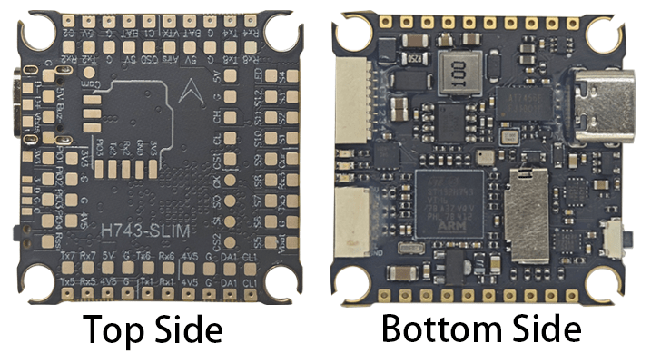
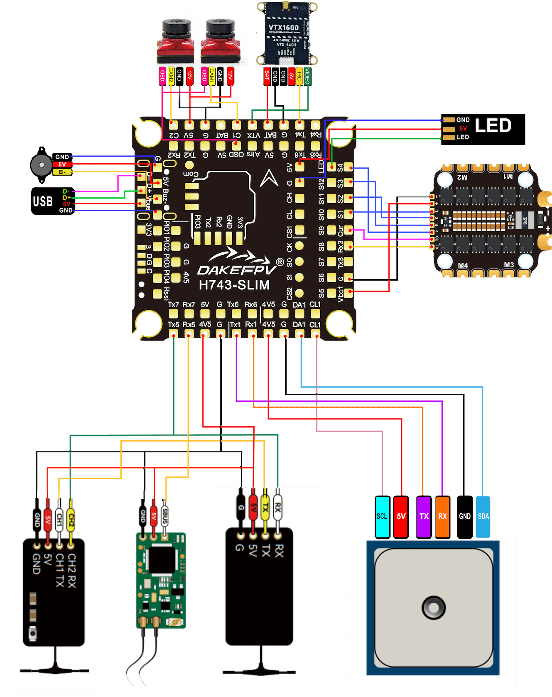

# DAKEFPV H743 Slim

<Badge type="tip" text="PX4 v1.16" />

::: warning
PX4 does not manufacture this (or any) autopilot.
Contact the [manufacturer](https://www.dakefpv.com/) for hardware support or compliance issues.
:::

The [DAKEFPV H743 Slim](https://www.dakefpv.com/) is an STM32H743-based flight controller for FPV racing and freestyle. It features a plug-and-play 4-in-1 ESC interface, barometer, OSD, 8 UARTs, a microSD card slot for blackbox logging, CAN bus, 5V BEC, LED and buzzer pads, and I2C pads for an external GPS/magnetometer.



::: info
This flight controller is [manufacturer supported](../flight_controller/autopilot_manufacturer_supported.md).
:::

## Key Features

- **MCU:** STM32H743 @ 480 MHz
- **IMUs:** 2x ICM-42688P (SPI1 and SPI4, independent power supply)
- **Barometer:** SPL06 on I2C2 (requires battery power)
- **OSD:** AT7456E
- **Storage:** microSD card (SDMMC2)
- **CAN:** 1x CAN port (PD0/PD1)
- **UARTs:** 8
- **PWM outputs:** 8x motor (DShot) + 4x servo + 1x LED
- **Battery input:** 2S–12S LiPo
- **BEC 5V:** 2A
- **Mounting:** 30.5 × 30.5 mm, M4
- **Weight:** 8 g

## Where to Buy

[DAKEFPV store](https://www.dakefpv.com/)

## Connectors and Pins


| Pin          | Function                                                                  | PX4 Default         |
| ------------ | ------------------------------------------------------------------------- | ------------------- |
| Vbat         | Battery positive voltage (2S–12S)                                        |                     |
| SA1, CL1     | I2C peripheral interface (SDA/SCL)                                       |                     |
| 5V           | 5V output (2A max) BEC power supply                                      |                     |
| 4V5          | 4.5V output or USB power supply                                          |                     |
| 3V3          | 3.3V output (0.25A max)                                                  |                     |
| Airs         | Airspeed ADC input (PC4)                                                  |                     |
| Cur          | Battery current ADC input (PC0)                                          |                     |
| Rssi         | Analog RSSI input (PC5)                                                  |                     |
| SI, SO, CLK  | External SPI bus MOSI/MISO/CLK                                           |                     |
| CS1, CS2     | External SPI bus CS1 (PA15) and CS2 (PD3)                                |                     |
| R1, T1       | UART1 RX/TX                                                              | GPS                 |
| R2, T2       | UART2 RX/TX                                                              | TELEM1              |
| R3, T3       | UART3 RX/TX                                                              | TELEM2              |
| R4, T4       | UART4 RX/TX (PB8/PB9)                                                   | Available           |
| R5, T5       | UART5 RX/TX                                                              | RC input            |
| R6, T6       | UART6 RX/TX                                                              | TELEM3              |
| R7, T7       | UART7 RX/TX                                                              | TELEM4              |
| R8, T8       | UART8 RX/TX                                                              | Available           |
| CH, CL       | CAN bus                                                                  |                     |
| Buz-         | Buzzer negative pin (PE10)                                               |                     |
| S1–S4        | Motor outputs (TIM1: PE9/PE11/PE13/PE14)                                 |                     |
| S5–S8        | Motor outputs (TIM2: PA0–PA3)                                            |                     |
| LED          | WS2812 LED strip (TIM3_CH3, PB0)                                         |                     |

## Wiring Diagrams




## Serial Port Mapping

| UART   | Device     | PX4 default |
| ------ | ---------- | ----------- |
| USART1 | /dev/ttyS0 | GPS1        |
| USART2 | /dev/ttyS1 | TELEM1      |
| USART3 | /dev/ttyS2 | TELEM2      |
| USART6 | /dev/ttyS3 | TELEM3      |
| UART5  | /dev/ttyS4 | RC input    |
| UART7  | /dev/ttyS5 | TELEM4      |
| UART4  | /dev/ttyS6 | Available   |
| UART8  | /dev/ttyS7 | Available   |

::: info
UART4 is on PB8/PB9. PD0/PD1 are used by CAN1.
:::

## PWM Output Groups

| Group | Outputs | Timer | DShot |
| ----- | ------- | ----- | ----- |
| 1     | M1–M4   | TIM1  | ✓     |
| 2     | M5–M8   | TIM2  | ✓     |
| 3     | S1–S4   | TIM4  | ✓     |
| 4     | LED     | TIM3  | ✗     |

## RC Input

RC input is on UART5 (`/dev/ttyS4`). Supported: CRSF/ELRS, SBUS, DSM, SRXL2.

## CAN

CAN1 is on PD0 (RX) and PD1 (TX) with a silent pin on PD2. Enable DroneCAN peripherals via the `UAVCAN_ENABLE` parameter.

## PX4 Bootloader Update {#bootloader}

The board ships with Betaflight. Flash the PX4 bootloader before loading PX4 firmware.

Put the board in DFU mode (hold BOOT button while connecting USB), then:

```sh
dfu-util -a 0 -s 0x08000000:mass-erase:force:leave \
  -D boards/dakefpv/h743slim/extras/dakefpv_h743slim_bootloader.bin
```

## Building Firmware

```sh
make dakefpv_h743slim_default
```

## Installing PX4 Firmware

```sh
make dakefpv_h743slim_default upload
```

## PX4 Configuration

| Parameter                                                             | Setting                                                                        |
| --------------------------------------------------------------------- | ------------------------------------------------------------------------------ |
| [SYS_HAS_MAG](../advanced_config/parameter_reference.md#SYS_HAS_MAG) | Disabled by default (no internal mag). Enable if an external mag is connected. |

## Debug Port


- `SWDIO`: PA13
- `SWCLK`: PA14
- `GND`: GND pad
