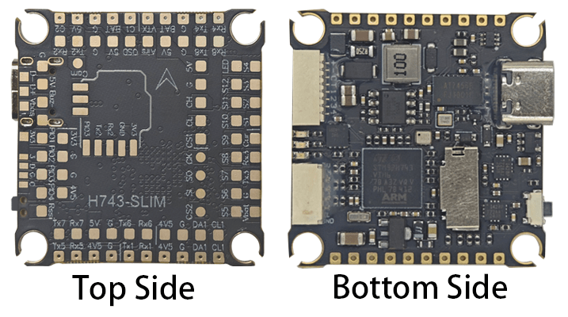
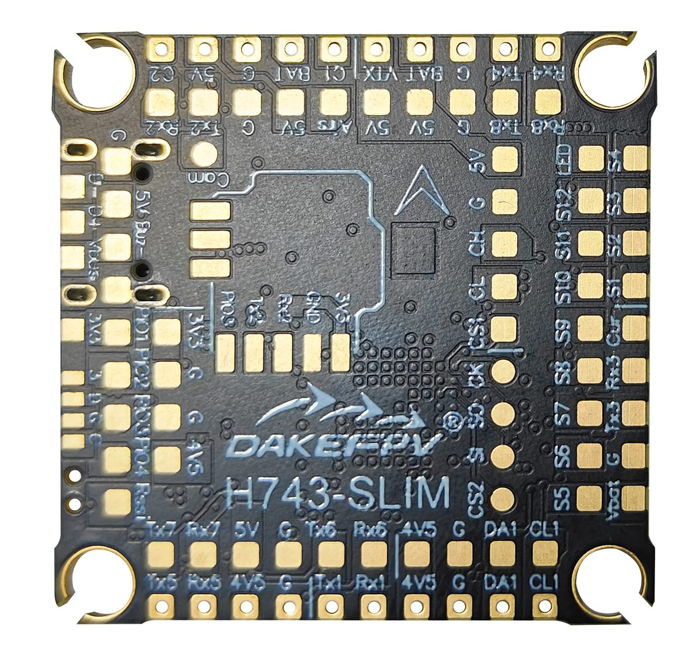
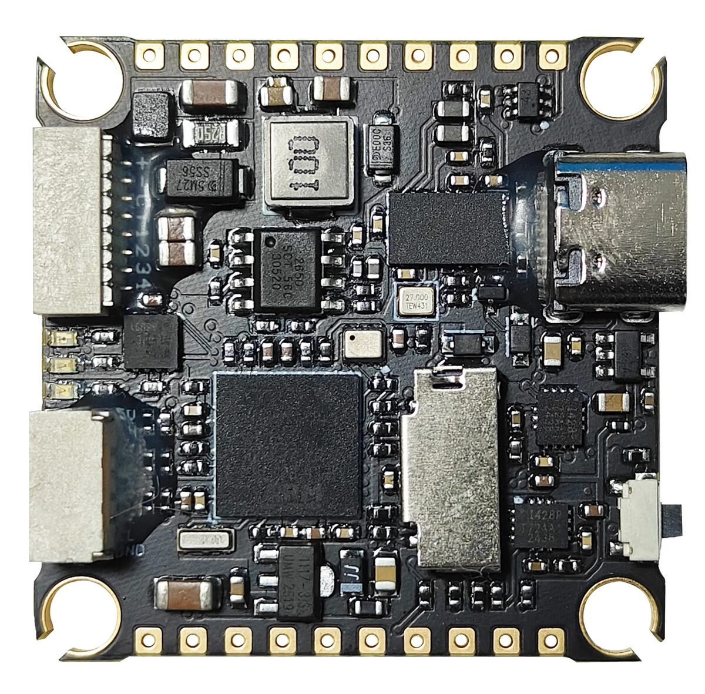
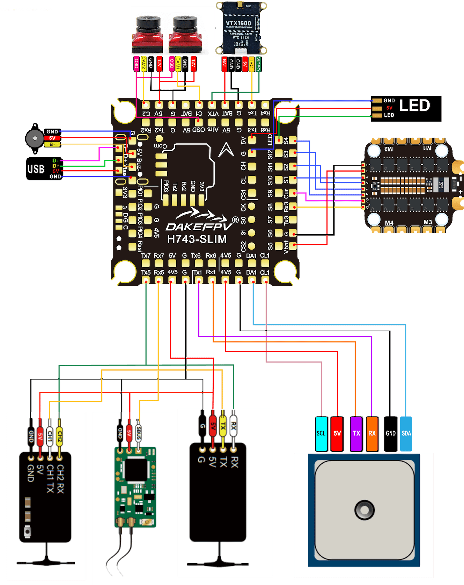
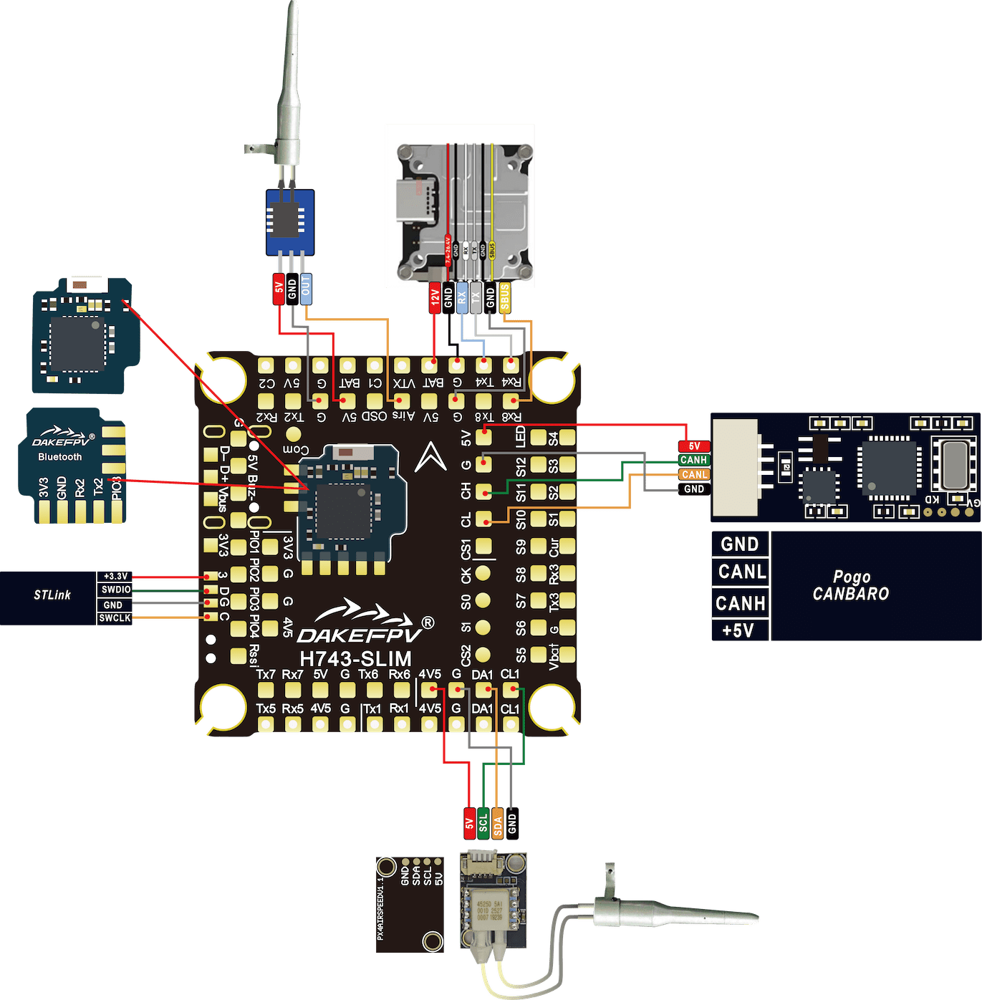
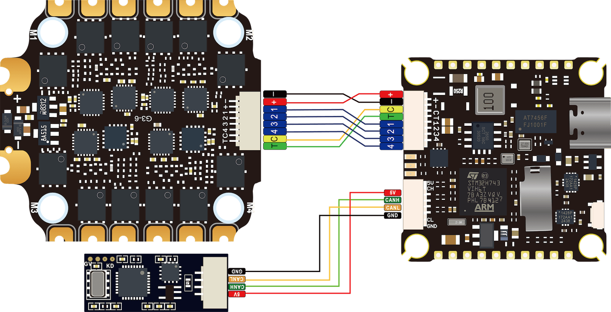
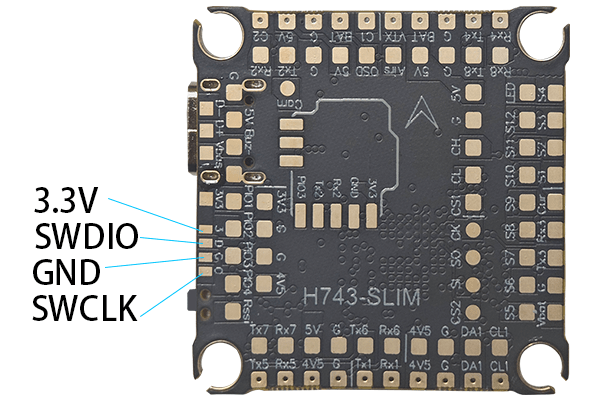

# DAKEFPV H743 Slim

<Badge type="tip" text="main (PX4 v2.0)" />

::: warning
PX4 does not manufacture this (or any) autopilot.
Contact the [manufacturer](https://www.dakefpv.com/) for hardware support or compliance issues.
:::

The [DAKEFPV H743 Slim](https://www.dakefpv.com/pd.jsp?id=89) is an STM32H743-based flight controller for FPV racing and freestyle, manufactured by [DAKEFPV](https://www.dakefpv.com/).
It features a plug-and-play 4-in-1 ESC interface, barometer, OSD, 8 UARTs, a microSD card slot for blackbox logging, CAN bus, 5V BEC, LED and buzzer pads, and I2C pads for an external GPS/magnetometer.



::: info
This flight controller is [manufacturer supported](../flight_controller/autopilot_manufacturer_supported.md).
:::

## Specifications {#specifications}

### Processor {#processor}

- **Main FMU processor:** STM32H743 (Arm Cortex-M7, 480 MHz, 2 MB flash, 1 MB RAM)

### Sensors {#sensors}

- **IMU:** 2x ICM-42688-P (SPI1, SPI4; independent power supply)
- **Barometer:** SPL06 (I2C2; requires battery power)
- **Magnetometer:** none (external compass optional)

### Interfaces {#interfaces}

- **PWM outputs:** 12
- **Serial ports:** 8
- **I2C buses:** 1 (I2C2, shared with the onboard barometer)
- **CAN buses:** 1 (PD0/PD1)
- **USB:** USB-C
- **OSD:** AT7456E analog OSD, and MSP DisplayPort for digital VTX
- **SD card:** microSD (SDMMC2)
- **Parameter storage:** processor flash

### Electrical data {#electrical_data}

- **Battery input:** 3S–12S LiPo
- **BEC 5V:** 2A
- **Power monitoring:** analog battery voltage and current

### Mechanical data {#mechanical_data}

- **Mounting hole spacing:** 30.5 × 30.5 mm, M4
- **Weight:** 8 g

## Where to Buy {#store}

[DAKEFPV H743 Slim](https://www.dakefpv.com/pd.jsp?id=89) (DAKEFPV store)

## Pinouts {#pinouts}





The component side has the USB-C port, the microSD slot and two JST connectors: the 8-pin 4-in-1 ESC connector and a 4-pin CAN connector (`5V`, `CH`, `CL`, `GND`).

| Pin              | Function                                               | PX4 Default    |
| ---------------- | ------------------------------------------------------ | -------------- |
| `Vbat`           | Battery positive voltage (3S–12S)                      |                |
| `DA1`, `CL1`     | I2C peripheral interface (SDA/SCL)                     |                |
| `5V`             | 5V output (2A max) BEC power supply                    |                |
| `4V5`            | 4.5V output or USB power supply                        |                |
| `3V3`            | 3.3V output (0.25A max)                                |                |
| `Airs`           | Airspeed ADC input (PC4)                               |                |
| `Cur`            | Battery current ADC input (PC0)                        |                |
| `Rssi`           | Analog RSSI input (PC5), not used by PX4               |                |
| `SI`, `SO`, `CK` | External SPI bus MOSI/MISO/CLK                         |                |
| `CS1`, `CS2`     | External SPI bus CS1 (PA15) and CS2 (PD3)              |                |
| `Rx1`, `Tx1`     | UART1 RX/TX                                            | `GPS1`         |
| `Rx2`, `Tx2`     | UART2 RX/TX                                            | `TELEM1`       |
| `Rx3`, `Tx3`     | UART3 RX/TX                                            | `TELEM2`       |
| `Rx4`, `Tx4`     | UART4 RX/TX (PB8/PB9)                                  | `TELEM3`       |
| `Rx5`, `Tx5`     | UART5 RX/TX                                            | RC input       |
| `Rx6`, `Tx6`     | UART6 RX/TX                                            | `TELEM4`       |
| `Rx7`, `Tx7`     | UART7 RX/TX                                            | System console |
| `Rx8`, `Tx8`     | UART8 RX/TX                                            | `GPS2`         |
| `CH`, `CL`       | CAN bus                                                |                |
| `Buz-`           | Buzzer negative pin (PE10)                             |                |
| `S1`–`S4`        | Motor outputs (TIM1: PE9/PE11/PE13/PE14)               |                |
| `S5`–`S8`        | Motor outputs (TIM2: PA0–PA3)                          |                |
| `S9`–`S12`       | Servo outputs (TIM4: PD12–PD15)                        |                |
| `LED`            | WS2812 LED strip (TIM3_CH3, PB0), not supported by PX4 |                |
| `C1`, `C2`       | Analog camera inputs, selected by `PIO1`               |                |
| `VTX`            | Analog video output to the VTX (with OSD overlay)      |                |
| `PIO1`           | Camera switch (PE2): high selects `C1`, low `C2`       |                |
| `PIO2`           | User-defined output (PE3)                              |                |
| `PIO3`           | Bluetooth module enable (PE4)                          |                |
| `PIO4`           | CAN1 transceiver silent control (PD2)                  |                |

## Power {#power}

The board is powered from a 3S–12S LiPo battery (see [Electrical data](#electrical_data) for the BEC outputs).

Battery voltage and current are measured by the board's analog inputs, with the current from the `Cur` pad.
The default scaling is [BAT1_V_DIV](../advanced_config/parameter_reference.md#BAT1_V_DIV) = `16.0` and [BAT1_A_PER_V](../advanced_config/parameter_reference.md#BAT1_A_PER_V) = `83.3`; check these against your battery and ESC as described in [Battery Estimation Tuning](../config/battery.md).

## PWM Outputs {#pwm_outputs}

All outputs within the same group must use the same output protocol and rate.

| Group | Outputs    | PX4 outputs | Timer | DShot |
| ----- | ---------- | ----------- | ----- | ----- |
| 1     | `S1`–`S4`  | 1–4         | TIM1  | ✓     |
| 2     | `S5`–`S8`  | 5–8         | TIM2  | ✓     |
| 3     | `S9`–`S12` | 9–12        | TIM4  | ✓     |

[Bidirectional DShot](../peripherals/dshot.md#bidirectional-dshot-telemetry) with eRPM telemetry works on `S1`–`S11`.
`S12` (TIM4 CH4) can send bidirectional DShot but can't read eRPM telemetry back.

The `LED` pad (for a WS2812 LED strip) is not supported by PX4.

## SD Card (Optional) {#sd_card}

The board has a microSD card slot, used for flight logs and mission storage (see [SD Cards](../getting_started/px4_basic_concepts.md#sd-cards-removable-memory)).
The card isn't needed to fly, but without one no flight logs are recorded and missions can't be stored.

## Serial Port Mapping {#serial_port_mapping}

| UART   | Device       | Port           | Board pads  |
| ------ | ------------ | -------------- | ----------- |
| USART1 | `/dev/ttyS0` | `GPS1`         | `Tx1`/`Rx1` |
| USART2 | `/dev/ttyS1` | `TELEM1`       | `Tx2`/`Rx2` |
| USART3 | `/dev/ttyS2` | `TELEM2`       | `Tx3`/`Rx3` |
| UART4  | `/dev/ttyS3` | `TELEM3`       | `Tx4`/`Rx4` |
| UART5  | `/dev/ttyS4` | RC input       | `Tx5`/`Rx5` |
| USART6 | `/dev/ttyS5` | `TELEM4`       | `Tx6`/`Rx6` |
| UART7  | `/dev/ttyS6` | System console | `Tx7`/`Rx7` |
| UART8  | `/dev/ttyS7` | `GPS2`         | `Tx8`/`Rx8` |

::: warning
The pads are silkscreened by UART number, so `Tx4`/`Rx4` is UART4 — which PX4 exposes as `TELEM3`, not `TELEM4`.
The digital VTX connects to `Tx4`, so its PX4 port is `TELEM3` (`MSP_OSD_CONFIG 103`).
:::

::: info
UART4 (`TELEM3`) is on PB8/PB9.
PD0/PD1 are used by CAN1.
:::

## Assembly {#assembly}

### Wiring Diagrams {#wiring_diagram}







### Radio Control {#radio_control}

A remote control (RC) radio system is required if you want to _manually_ control your vehicle (PX4 does not require a radio system for autonomous flight modes).
You will need to [select a compatible transmitter/receiver](../getting_started/rc_transmitter_receiver.md) and then _bind_ them so that they communicate (read the instructions that come with your specific transmitter/receiver).

Connect the receiver to the `Tx5`/`Rx5` pads (UART5, `/dev/ttyS4`), which go directly to the flight controller.
PX4 detects the protocol automatically, with no configuration needed: CRSF/ELRS, GHST, S.BUS, DSM, SUMD and ST24 are supported.
For CRSF, ELRS and GHST, connect both `Tx5` and `Rx5` so that telemetry can be sent back to the receiver.

PPM receivers are not supported, as the board has no PPM input.
To use a different serial port for RC, set [RC_PORT_CONFIG](../advanced_config/parameter_reference.md#RC_PORT_CONFIG).

### GPS & Compass {#gps_compass}

Connect a [GPS/compass module](../gps_compass/index.md) to `GPS1` (`Tx1`/`Rx1` pads), with its compass on the `DA1`/`CL1` pads (I2C2).
A second GPS can be connected to `GPS2` (`Tx8`/`Rx8`).

The board has no built-in compass, so compass use is disabled by default ([SYS_HAS_MAG](../advanced_config/parameter_reference.md#SYS_HAS_MAG) = `0`, [EKF2_MAG_TYPE](../advanced_config/parameter_reference.md#EKF2_MAG_TYPE) = `5` (None)).
If you connect an external compass, set `SYS_HAS_MAG` to `1` and `EKF2_MAG_TYPE` to `0` (Automatic), then reboot.

### Telemetry Radios (Optional) {#telemetry}

[Telemetry radios](../telemetry/index.md) connect to `TELEM1` (`Tx2`/`Rx2` pads), which runs MAVLink by default and needs no further configuration.
`TELEM2` (`Tx3`/`Rx3`) and `TELEM4` (`Tx6`/`Rx6`) are also free for other serial peripherals; `TELEM3` is used by the digital VTX by default.

### CAN {#can}

Connect [DroneCAN](../dronecan/index.md) peripherals to the 4-pin CAN connector or the `CH`/`CL` pads (CAN1).
DroneCAN is disabled by default: set [UAVCAN_ENABLE](../advanced_config/parameter_reference.md#UAVCAN_ENABLE) to enable it.

### OSD {#osd}

The AT7456E analog OSD is on SPI2 and is enabled by default for PAL ([OSD_ATXXXX_CFG](../advanced_config/parameter_reference.md#OSD_ATXXXX_CFG) = `2`).
Set it to `1` for NTSC, or `0` to disable the analog OSD; a reboot is required.
Analog OSD and digital HD OSD can run at the same time.

The digital VTX (DJI/HDZero/OpenIPC) uses MSP DisplayPort on the `Tx4`/`Rx4` pads — UART4, PX4 `TELEM3` (`/dev/ttyS3`), which is the `MSP_OSD_CONFIG 103` default.

MSP DisplayPort only uses the flight controller's TX line, so `Tx4` and a ground are enough; `Rx4` is not needed unless the VTX also talks back.

::: info `Dji`/`VTX` solder jumper
The three-pad solder jumper silkscreened `Dji` and `VTX` selects what the HD VTX connector's RX4 pin carries: UART4 RX for a digital air unit, or the analog composite video signal when the connector drives an analog VTX.
It is not in the OSD's transmit path, so it does not affect MSP DisplayPort output.
:::

::: info
UART4 is on PB8/PB9, the same as on the H743 Pro, but this variant has no HD VTX connector.
The `Tx4`/`Rx4` pads are wired straight through (`Tx4` is TX), so PX4 does not swap UART4 here, unlike on the [H743 Pro](dakefpv_h743pro.md).
:::

## PX4 Bootloader Update {#bootloader}

The board ships with Betaflight.
Before PX4 firmware can be installed, the _PX4 bootloader_ must be flashed.
Download the [dakefpv_h743slim_bootloader.bin](https://github.com/PX4/PX4-Autopilot/blob/main/boards/dakefpv/h743slim/extras/dakefpv_h743slim_bootloader.bin) bootloader binary and follow the [DFU Bootloader Update](../advanced_config/bootloader_update_from_betaflight.md#dfu-bootloader-update) instructions.

## Building Firmware {#building_firmware}

:::tip
From PX4 v2.0, most users will not need to build this firmware!
It is pre-built and automatically installed by _QGroundControl_ when appropriate hardware is connected.
:::

To [build PX4](../dev_setup/building_px4.md) for this target:

```sh
make dakefpv_h743slim_default
```

## Installing PX4 Firmware {#installing_firmware}

Once the PX4 bootloader is running, upload firmware with:

```sh
make dakefpv_h743slim_default upload
```

Alternatively, [load the firmware](../config/firmware.md) using _QGroundControl_, using either pre-built firmware or your own custom build.

## Debug Port {#debug_port}

The [PX4 System Console](../debug/system_console.md) runs on UART7 (`Tx7`/`Rx7` pads).

The FMU [SWD interface](../debug/swd_debug.md) is on four solder pads on the left edge of the board (there is no Pixhawk debug connector):



- `D`: SWDIO (PA13)
- `C`: SWCLK (PA14)
- `G`: GND
- `3`: 3.3 V
