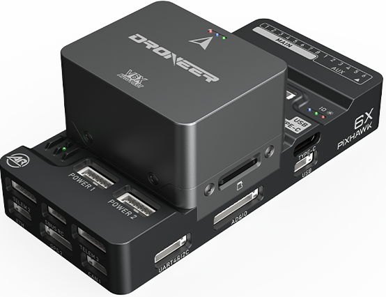
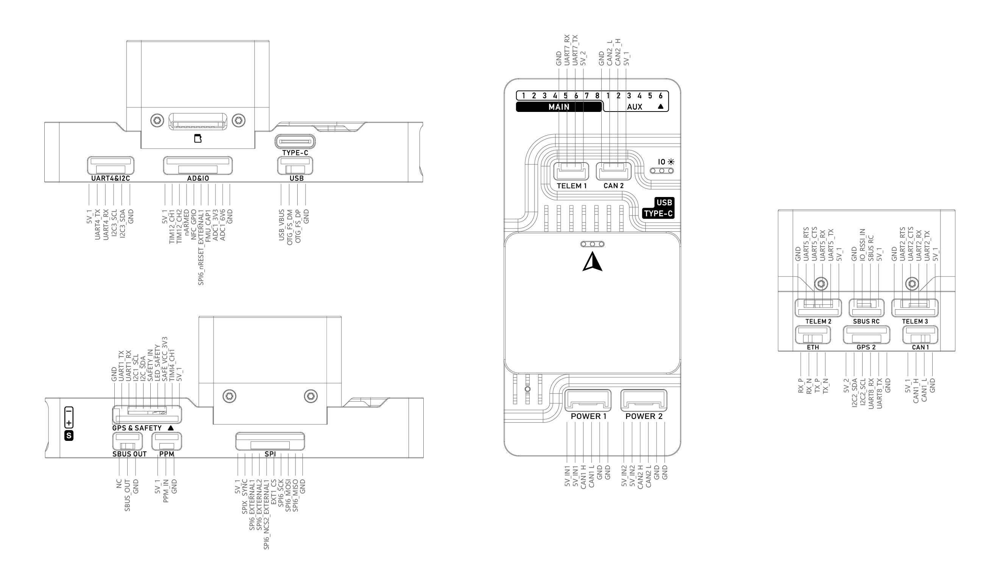

# DroneerX6 Flight Controller

<Badge type="tip" text="PX4 main (v2.0)" />

::: warning
PX4 does not manufacture this (or any) autopilot.
Contact the [manufacturer](https://www.droneer.com) for hardware support or compliance issues.
:::

The DroneerX6 is a series of flight controllers manufactured by Droneer, which is based on the open-source FMU v6X architecture and Pixhawk Autopilot Bus open source specifications.


## Where To Buy {#store}

::: info
This flight controller is [manufacturer supported](../flight_controller/autopilot_manufacturer_supported.md).
:::
[Droneer](https://www.droneer.com)

## Key Features

### Microprocessor

- FMU Processor: STM32H753
  - 32 Bit Arm® Cortex®-M7, 480MHz, 2MB flash memory, 1MB RAM
- IO Processor: STM32F103
  - 32 Bit Arm® Cortex®-M3, 72MHz, 20KB SRAM

### Sensors

- IMU1-ICM45686(With vibration isolation)
- IMU2-ICM45686(With vibration isolation)
- IMU3-ICM45686(No vibration isolation)
- Magnetometer: RM3100
- Barometer: 2x ICP-20100

### Electrical data

- Voltage Ratings:
  - Max input voltage: 5.7V
  - USB Power Input: 4.75\~5.25V
  - Servo Rail Input: 0\~9.9V
- Current Ratings:
  - TELEM1 and GPS2 combined output current limiter: 1.5A
  - All other port combined output current limiter: 1.5A
  
### Interfaces

- 16- PWM servo outputs
- 1 Dedicated R/C input for Spektrum / DSM and S.Bus with analog / PWM RSSI input
- 3 TELEM Ports（with full flow control）
- 1 UART4(Serial and I2C)
- 2 GPS ports
  - 1 full GPS plus Safety Switch Port(GPS1)
  - 1 basic GPS port(with I2C,GPS2)
- 2 USB Ports
  - 1 TYPE-C
  - JST GH1.25
- 1 Ethernet port
  - Transformerless Applications
  - 100Mbps
- 1 SPI bus
  - 2 chip select lines
  - 2 data-ready lines
  - 1 SPI SYNC line
  - 1 SPI reset line
- 2 CAN Buses for CAN peripheral
  - CAN Bus has individual silent controls or ESC RX-MUX control
- 4 power input ports
  - 2 Dronecan/UAVCAN power inputs
  - 2 SMBUS/I2C power inputs
- 1 AD & IO port
  - 2 additional analog input(3.3 and 6.6v）
  - 1 PWM/Capture input
  
### Other Features

- FRAM
- [Pixhawk Autopilot Bus (PAB) Form Factor](https://github.com/pixhawk/Pixhawk-Standards/blob/master/DS-010%20Pixhawk%20Autopilot%20Bus%20Standard.pdf)
- LED Indicators
- MicroSD Slot
- USA Built
- Designed with a 1W heater. Keeps sensors warm in extreme conditions

### Mechanical data

- Weight
  - Flight Controller Module: 89g
- Operating & storage temperature: -20 ~ 85°c

## Power Requirements

- 5V
- 500mA
  - 300ma for main system
  - 200ma for heater

## Pinout



## Serial Port Mapping

| UART   | Device     | Port          |
| ------ | ---------- | ------------- |
| USART1 | /dev/ttyS0 | GPS           |
| USART2 | /dev/ttyS1 | TELEM3        |
| USART3 | /dev/ttyS2 | Debug Console |
| UART4  | /dev/ttyS3 | UART4 & I2C   |
| UART5  | /dev/ttyS4 | TELEM2        |
| USART6 | /dev/ttyS5 | PX4IO/RC      |
| UART7  | /dev/ttyS6 | TELEM1        |
| UART8  | /dev/ttyS7 | GPS2          |

## PWM Output

The DroneerX6 flight controller supports up to 16 PWM outputs.
All 16 outputs support normal PWM output formats. All 16 outputs support DShot, except 15 and 16.

The 8 MAIN PWM outputs are in 4 groups:

- Outputs 1 and 2 in group1
- Outputs 3 and 4 in group2
- Outputs 5, 6, 7 and 8 in group3

The 8 AUX PWM outputs are in 4 groups:

- Outputs AUX1-4 in group1
- Outputs AUX5-6 in group2
- Outputs 7 and 8 in group3 (TIM12_CH1/2 has no DMA, so only can be PWM output protocols)

Channels within the same group need to use the same output rate. If any channel in a group uses DShot then all channels in the group need to use DShot.

## Building Firmware

```sh
make droneer_x6_default
```
