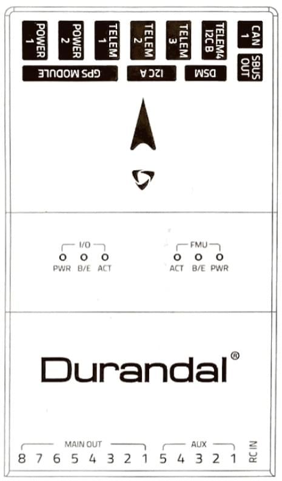
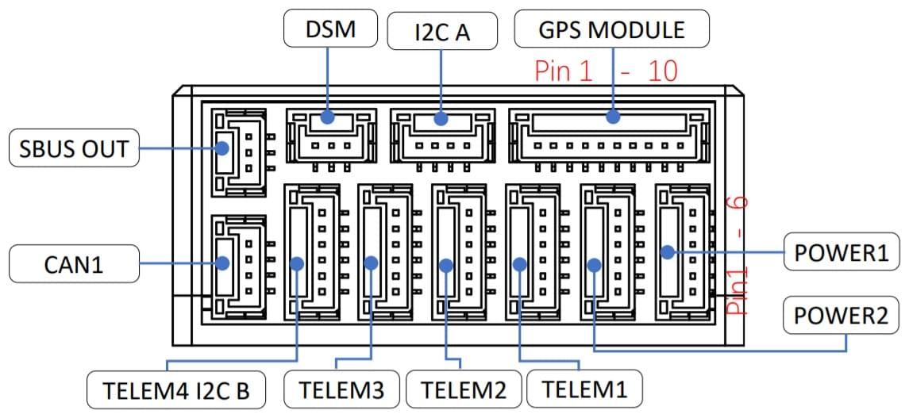
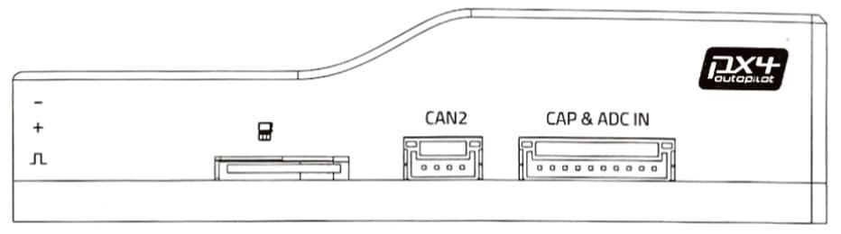
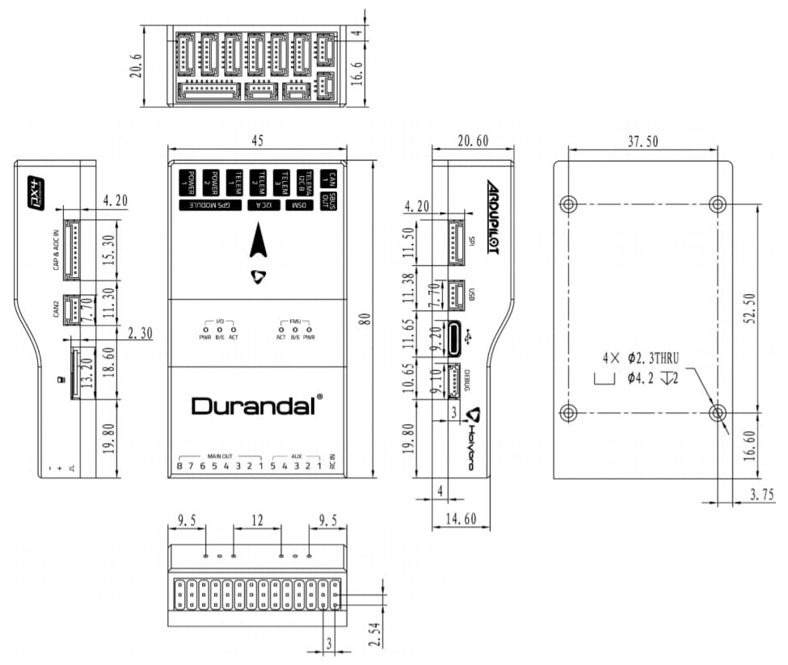

# Holybro Durandal

:::warning
PX4 does not manufacture this (or any) autopilot.
Contact the [manufacturer](https://holybro.com/) for hardware support or compliance issues.
:::

_Durandal_<sup>&reg;</sup> is the latest update to the successful family of Holybro flight controllers.
It was designed and developed by Holybro.


At high level, some of the key features are:

- Integrated temperature control for sensors.
- Powerful STM32H7 microcontroller running at 480MHz.
  2 MB of Flash memory and 1 MB of RAM.
- New sensors with higher temperature stability.
- Internal vibration isolation system.
- Dual high-performance, low-noise IMUs on board are designed for demanding stabilization applications.

A summary of the key features, [assembly](../assembly/quick_start_durandal.md), and [purchase](#purchase) links can be found below.

::: info
This flight controller is [manufacturer supported](../flight_controller/autopilot_manufacturer_supported.md).
:::

## Quick Summary

#### Technical Specifications

- Main FMU Processor: STM32H743
  - 32 Bit Arm ® Cortex® -M7, 480MHz, 2MB memory, 1MB RAM
- IO Processor: STM32F100
  - 32 Bit Arm ® Cortex® -M3, 24MHz, 8KB SRAM
- On-board sensors
  - Accel/Gyro: ICM-20689
  - Accel/Gyro: BMI088 or ICM20602
  - Mag: IST8310
  - Barometer: MS5611
- GPS: u-blox Neo-M8N GPS/GLONASS receiver; integrated magnetometer IST8310

#### Interfaces

- 8-13 PWM servo outputs (8 from IO, 5 from FMU)
- 6 dedicated PWM/Capture inputs on FMU
- Dedicated R/C input for Spektrum / DSM
- Dedicated R/C input for CPPM and S.Bus
- Dedicated S.Bus servo output and analog / PWM RSSI input
- 5 general purpose serial ports
  - 3 with full flow control
  - 1 with separate 1.5A current limit
- 3 I2C ports
- 4 SPI buses
  - 1 internal high speed SPI sensor bus with 4 chip selects and 6 DRDYs
  - 1 internal low noise SPI bus dedicated for XXX
  - Barometer with 2 chip selects, no DRDYs
  - 1 internal SPI bus dedicated for FRAM
  - Supports temperature control located on sensor module
  - 1 external SPI buses
- Up to 2 CANBuses for dual CAN
  - Each CANBus has individual silent controls or ESC RX-MUX control
- Analog inputs for voltage / current of 2 batteries
- 2 additional analog inputs

#### Electrical Data

- Power module output: 4.9~5.5V
- Max input voltage: 6V
- Max current sensing: 120A
- USB Power Input: 4.75~5.25V
- Servo Rail Input: 0~36V

#### Mechanical Data

- Dimensions: 80x45x20.5mm
- Weight: 68.8g

#### Other Characteristics

- Operating temperature: ~40~85C
- Storage temperature: -40~85C
- CE
- FCC
- RoHS compliant (lead-free)

For more information see: [Durandal Technical Data Sheet](https://cdn.shopify.com/s/files/1/0604/5905/7341/files/Durandal_technical_data_sheet_90f8875d-8035-4632-a936-a0d178062077.pdf).

<a id="purchase"></a>

## Where to Buy

Order from [Holybro](https://holybro.com/collections/autopilot-flight-controllers/products/durandal).

<a id="connections"></a>

## Connections

The locations of ports/connections are shown here (and below in the [pinouts section](#pinouts)).

### Top



### Front



### Back


### Right



### Left


## Dimensions

All dimensions are in millimeters.



<!--
## Voltage Ratings

*Pixhawk 4* can be triple-redundant on the power supply if three power sources are supplied. The three power rails are: **POWER1**, **POWER2** and **USB**.

::: info
The output power rails **FMU PWM OUT** and **I/O PWM OUT** (0V to 36V) do not power the flight controller board (and are not powered by it).
You must supply power to one of **POWER1**, **POWER2** or **USB** or the board will be unpowered.
:::

**Normal Operation Maximum Ratings**

Under these conditions all power sources will be used in this order to power the system:
1. **POWER1** and **POWER2** inputs (4.9V to 5.5V)
1. **USB** input (4.75V to 5.25V)
-->

<!--
**Absolute Maximum Ratings**

Under these conditions the system will not draw any power (will not be operational), but will remain intact.
1. **POWER1** and **POWER2** inputs (operational range 4.1V to 5.7V, 0V to 10V undamaged)
1. **USB** input (operational range 4.1V to 5.7V, 0V to 6V undamaged)
1. Servo input: VDD_SERVO pin of **FMU PWM OUT** and **I/O PWM OUT** (0V to 42V undamaged)

-->

## Assembly/Setup

The [Durandal Wiring Quick Start](../assembly/quick_start_durandal.md) provides instructions on how to assemble required/important peripherals including GPS, Power Management Board etc.

## Building Firmware

:::tip
Most users will not need to build this firmware!
It is pre-built and automatically installed by _QGroundControl_ when appropriate hardware is connected.
:::

To [build PX4](../dev_setup/building_px4.md) for this target:

```
make holybro_durandal-v1_default
```

## Serial Port Mapping

| UART   | Device     | Port          |
| ------ | ---------- | ------------- |
| USART1 | /dev/ttyS0 | GPS1          |
| USART2 | /dev/ttyS1 | TELEM1        |
| USART3 | /dev/ttyS2 | TELEM2        |
| UART4  | /dev/ttyS3 | TELEM4/GPS2   |
| USART6 | /dev/ttyS4 | TELEM3        |
| UART7  | /dev/ttyS5 | Debug Console |
| UART8  | /dev/ttyS6 | PX4IO         |

<!-- Note: Got ports using https://github.com/PX4/PX4-user_guide/pull/672#issuecomment-598198434 -->

<a id="debug_port"></a>

## Debug Port

The [PX4 System Console](../debug/system_console.md) and [SWD interface](../debug/swd_debug.md) run on the _Debug Port_.

The pinouts and connector comply with the [Pixhawk Debug Mini](../debug/swd_debug.md#pixhawk-debug-mini) interface defined in the [Pixhawk Connector Standard](https://github.com/pixhawk/Pixhawk-Standards/blob/master/DS-009%20Pixhawk%20Connector%20Standard.pdf).

For wiring and debugging information see the above links.

::: info
No Debug port is exposed for the I/O board.
:::

## Peripherals

- [Digital Airspeed Sensor](https://store-drotek.com/793-digital-differential-airspeed-sensor-kit-.html)
- [Telemetry Radio Modules](../telemetry/index.md)
- [Rangefinders/Distance sensors](../sensor/rangefinders.md)

## Supported Platforms / Airframes

Any multicopter / airplane / rover or boat that can be controlled with normal RC servos or Futaba S-Bus servos.

The complete set of supported configurations can be seen in the [Airframes Reference](../airframes/airframe_reference.md).

## Pinouts

_Durandal_ pinouts are listed below.
These can also be downloaded from [here](https://holybro.com/collections/autopilot-flight-controllers/products/Durandal-Pinouts).

### Top Pinouts


### Front Pinouts


#### SUBS Out port

| Pin        | Signal           | Volt  |
| ---------- | ---------------- | ----- |
| 1 (red)    | -                | -     |
| 2 (yellow) | SBUS_OUT/RSSI_IN | +3.3V |
| 3 (black)  | GND              | GND   |

#### DSM RC port

| Pin        | Signal  | Volt  |
| ---------- | ------- | ----- |
| 1 (red)    | VDD_3V3 | +3.3V |
| 2 (yellow) | DSM_IN  | +3.3V |
| 3 (black)  | GND     | GND   |

#### I2C A port

| Pin       | Signal | Volt  |
| --------- | ------ | ----- |
| 1 (red)   | VCC    | +5V   |
| 2 (black) | SCL4   | +3.3V |
| 3 (black) | SDA4   | +3.3V |
| 4 (black) | GND    | GND   |

#### CAN1 port

| Pin       | Signal | Volt  |
| --------- | ------ | ----- |
| 1 (red)   | VCC    | +5V   |
| 2 (black) | CAN H  | +3.3V |
| 3 (black) | CAN L  | +3.3V |
| 4 (black) | GND    | GND   |

<a id="gps"></a>

#### GPS port

| Pin        | Signal            | Volt  |
| ---------- | ----------------- | ----- |
| 1 (red)    | VCC               | +5V   |
| 2 (black)  | TX (out)          | +3.3V |
| 3 (black)  | RX (in)           | +3.3V |
| 4 (black)  | SCL1              | +3.3V |
| 5 (black)  | SDA1              | +3.3V |
| 6 (black)  | SAFETY_SWITCH     | +3.3V |
| 7 (black)  | SAFETY_SWITCH_LED | +3.3V |
| 8 (black)  | VDD_3V3           | +3.3V |
| 9 (black)  | BUZZER            | +5V   |
| 10 (black) | GND               | GND   |

<a id="telem4_i2cb"></a>

#### TELEM4 I2CB ports

| Pin       | Signal   | Volt  |
| --------- | -------- | ----- |
| 1 (red)   | VCC      | +5V   |
| 2 (black) | TX (out) | +3.3V |
| 3 (black) | RX (in)  | -     |
| 4 (black) | SCL2     | -     |
| 5 (black) | SDA2     | +3.3V |
| 6 (black) | GND      | GND   |

<a id="telem1_2_3"></a>

#### TELEM3, TELEM2, TELEM1 port

| Pin       | Signal    | Volt  |
| --------- | --------- | ----- |
| 1 (red)   | VCC       | +5V   |
| 2 (black) | TX (out)  | +3.3V |
| 3 (black) | RX (in)   | +3.3V |
| 4 (black) | CTS (in)  | +3.3V |
| 5 (black) | RTS (out) | +3.3V |
| 6 (black) | GND       | GND   |

<a id="power"></a>

#### POWER port

| Pin       | Signal  | Volt  |
| --------- | ------- | ----- |
| 1 (red)   | VCC     | +5V   |
| 2 (black) | VCC     | +5V   |
| 3 (black) | CURRENT | +3.3V |
| 4 (black) | VOLTAGE | +3.3V |
| 5 (black) | GND     | GND   |
| 6 (black) | GND     | GND   |

### Back Pinouts


#### MAIN Out

| Pin | Signal | Volt  | +         | -   |
| --- | ------ | ----- | --------- | --- |
| 1   | IO_CH1 | +3.3V | VDD_SERVO | GND |
| 2   | IO_CH2 | +3.3V | VDD_SERVO | GND |
| 3   | IO_CH3 | +3.3V | VDD_SERVO | GND |
| 4   | IO_CH4 | +3.3V | VDD_SERVO | GND |
| 5   | IO_CH5 | +3.3V | VDD_SERVO | GND |
| 6   | IO_CH6 | +3.3V | VDD_SERVO | GND |
| 7   | IO_CH7 | +3.3V | VDD_SERVO | GND |
| 8   | IO_CH8 | +3.3V | VDD_SERVO | GND |

#### AUX Out

| Pin | Signal  | Volt  | +         | -   |
| --- | ------- | ----- | --------- | --- |
| 1   | FMU_CH1 | +3.3V | VDD_SERVO | GND |
| 2   | FMU_CH2 | +3.3V | VDD_SERVO | GND |
| 3   | FMU_CH3 | +3.3V | VDD_SERVO | GND |
| 4   | FMU_CH4 | +3.3V | VDD_SERVO | GND |
| 5   | FMU_CH5 | +3.3V | VDD_SERVO | GND |

#### RC IN

| Pin | Signal         | Volt  |
| --- | -------------- | ----- |
| S   | SBUS_IN/PPM_IN | +3.3V |
| +   | VCC            | +5V   |
| -   | GND            | GND   |

### Right-side Pinouts


#### CAN2 port

| Pin       | Signal | Volt  |
| --------- | ------ | ----- |
| 1 (red)   | VCC    | +5V   |
| 2 (black) | CAN H  | +3.3V |
| 3 (black) | CAN L  | +3.3V |
| 4 (black) | GND    | GND   |

#### CAP & ADC IN port

| Pin        | Signal       | Volt                     |
| ---------- | ------------ | ------------------------ |
| 1 (red)    | VCC          | +5V                      |
| 2 (black)  | FMU_CAP6     | +3.3V                    |
| 3 (black)  | FMU_CAP5     | +3.3V                    |
| 4 (black)  | FMU_CAP4     | +3.3V                    |
| 5 (black)  | FMU_CAP3     | +3.3V                    |
| 6 (black)  | FMU_CAP2     | +3.3V                    |
| 7 (black)  | FMU_CAP1     | +3.3V                    |
| 8 (black)  | ADC1_SPARE_1 | +3.3V [++](#warn_sensor) |
| 9 (black)  | ADC1_SPARE_2 | +6.6V [++](#warn_sensor) |
| 10 (black) | GND          | GND                      |

<a id="warn_sensor"></a>

:::warning
\++ Sensors connected to pins 8, 9 must not send a signal exceeding the indicated voltage.
:::

### Left-side Pinouts


<a id="debug_port"></a>

#### DEBUG port

| Pin       | Signal | Volt  |
| --------- | ------ | ----- |
| 1 (red)   | VT     | +3.3V |
| 2 (black) | TX     | +3.3V |
| 3 (black) | RX     | +3.3V |
| 4 (black) | SWDIO  | +3.3V |
| 5 (black) | SWCLK  | +3.3V |
| 6 (black) | GND    | GND   |

#### SPI port

| Pin       | Signal | Volt  |
| --------- | ------ | ----- |
| 1 (red)   | VCC    | +5V   |
| 2 (black) | SCK    | +3.3V |
| 3 (black) | MISO   | +3.3V |
| 4 (black) | MOSI   | +3.3V |
| 5 (black) | CS1    | +3.3V |
| 6 (black) | CS2    | +3.3V |
| 7 (black) | GND    | GND   |

#### USB port

| Pin       | Signal | Volt  |
| --------- | ------ | ----- |
| 1 (red)   | VBUS   | +5V   |
| 2 (black) | DM     | +3.3V |
| 3 (black) | DP     | +3.3V |
| 4 (black) | GND    | GND   |

## Further info

- [Durandal Wiring QuickStart](../assembly/quick_start_durandal.md)
- [Durandal Technical Data Sheet](https://cdn.shopify.com/s/files/1/0604/5905/7341/files/Durandal_technical_data_sheet_90f8875d-8035-4632-a936-a0d178062077.pdf)
- [Durandal Pinouts](https://holybro.com/collections/autopilot-flight-controllers/products/Durandal-Pinouts) (Holybro)
