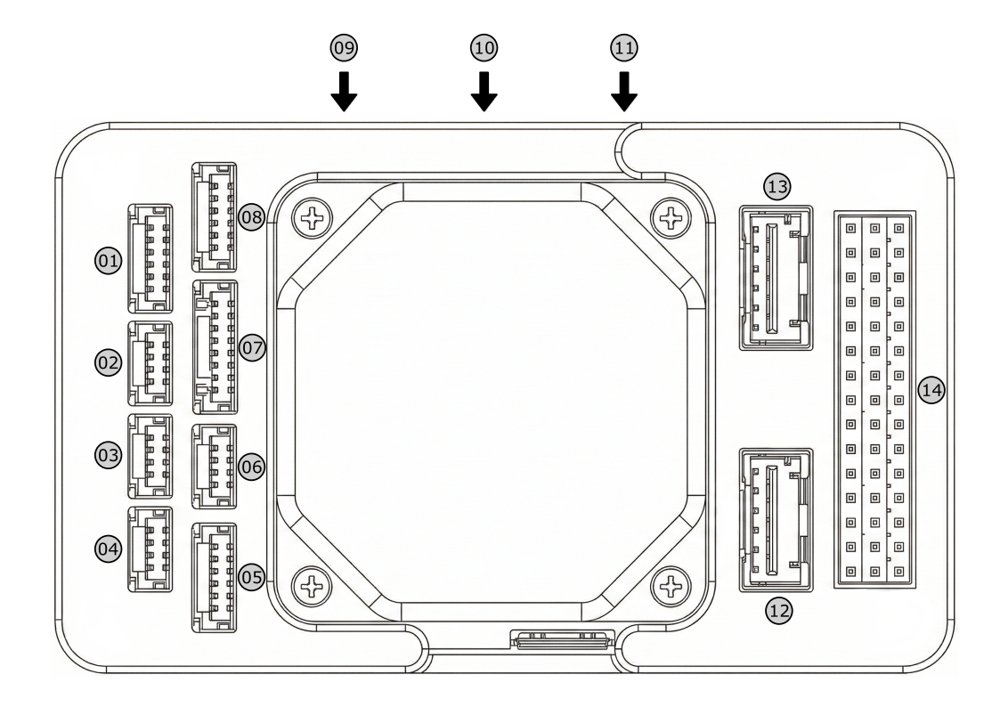

# GOKHAN IHA G-Pilot P1

<Badge type="tip" text="main (PX4 v2.0)" />

::: warning
PX4 does not manufacture this (or any) autopilot.
Contact the [manufacturer](https://gokhaniha.com/) for hardware support or compliance issues.
:::

The [G-Pilot P1](https://gokhaniha.com/urun/g-pilot) is a flight controller from GOKHAN IHA based on an STM32H753 FMU and a dedicated I/O failsafe co-processor.
It provides redundant inertial sensors, redundant barometers, onboard heating for the IMUs, and 14 PWM outputs.


::: info
This flight controller is [manufacturer supported](../flight_controller/autopilot_manufacturer_supported.md).
:::

## Specifications {#specifications}

### Processor {#processor}

- **Main FMU processor:** [STM32H753](https://www.st.com/en/microcontrollers-microprocessors/stm32h753vi.html) (Arm Cortex-M7 at 400 MHz, 2 MB flash, 1 MB RAM)
- **IO processor:** STM32F100 failsafe co-processor (PX4IO)

### Sensors {#sensors}

- **IMU:** 2x [InvenSense ICM-20649](https://www.invensense.tdk.com/en-us/products/motion-tracking/6-axis/icm-20649) (SPI1, SPI4), [InvenSense ICM-20602](https://www.invensense.tdk.com/en-us/products/motion-tracking/6-axis/icm-20602) (SPI4)
- **Barometer:** 2x MS5611 (SPI1, SPI4)
- **Magnetometer:** [PNI RM3100](https://www.pnicorp.com/rm3100/) (SPI4)
- **Heater:** IMU heating controlled by the IO processor, targeting 55 °C by default (set using [HEATER1_TEMP](../advanced_config/parameter_reference.md#HEATER1_TEMP)).

### Interfaces {#interfaces}

- **PWM outputs:** 8 `MAIN` outputs from the IO processor and 6 `AUX` outputs from the FMU
- **Serial ports:** 5 (`TELEM1`, `TELEM2`, `GPS1`, `GPS2`, `SERIAL5`), two with hardware flow control
- **I2C buses:** 2, both external
- **CAN buses:** 2 (DroneCAN)
- **Analog input:** 1 (`ADC`)
- **USB:** Yes (USB-C)
- **RC input:** Yes: PPM, S.Bus, Spektrum/DSM, ST24 and SUMD through the IO processor. S.Bus output is also available.
- **Parameter storage:** FRAM
- **SD card:** microSD slot
- **Other:** safety button and LED, buzzer and processor status LED, SWD debug/programming port

### Electrical Data {#electrical_data}

- **Input voltage:** 4.7 V to 5.3 V on `POWER1` and `POWER2`
- **Power monitoring:** 2 analog power inputs, with voltage and current sensing
- **MAIN PWM output signal level:** 3.3 V

### Mechanical Data {#mechanical_data}

- **Dimensions:** 57 mm x 95.8 mm x 37.3 mm
- **Weight:** approximately 130 g
- **Operating temperature:** -40 °C to 85 °C

## Where to Buy {#store}

The G-Pilot P1 can be purchased from the [GOKHAN IHA store](https://shop.gokhaniha.com/urun/15/gpilot-p1-otopilot).

## Pinouts {#pinouts}

Connectors use JST-GH 1.25 mm pitch, except for the Molex Clik-Mate `POWER1` and `POWER2` connectors.




## Power {#power}

`POWER1` and `POWER2` accept 4.7 V to 5.3 V DC and provide redundant power inputs.
Each port provides analog voltage and current sensing; the analog sensing inputs must not exceed 3.3 V.

::: warning
The servo rail is not powered by `POWER1` or `POWER2` and must be supplied externally.
:::

The included GBRICK LV power module can be connected to either power input, or to both inputs for redundant power.
PX4 presets the voltage divider ([BAT1_V_DIV](../advanced_config/parameter_reference.md#BAT1_V_DIV), [BAT2_V_DIV](../advanced_config/parameter_reference.md#BAT2_V_DIV)) to `12.02` and the amps per volt ([BAT1_A_PER_V](../advanced_config/parameter_reference.md#BAT1_A_PER_V), [BAT2_A_PER_V](../advanced_config/parameter_reference.md#BAT2_A_PER_V)) to `39.877` for both inputs.
To recalibrate voltage and current monitoring in _QGroundControl_, see [Battery Estimation Tuning](../config/battery.md).

## PWM Outputs {#pwm_outputs}

The G-Pilot P1 has 14 PWM outputs: 8 `MAIN` outputs from the IO processor (labelled `MAIN1`–`MAIN8` on the servo rail) and 6 `AUX` outputs from the FMU (labelled `AUX1`–`AUX6`).

The outputs are arranged in five timer groups.
All outputs within the same group must use the same output protocol and rate.

| Output group | Outputs  | Timer | Supported protocols |
| ------------ | -------- | ----- | ------------------- |
| Main 1       | MAIN 1-2 | TIM2  | PWM                 |
| Main 2       | MAIN 3-4 | TIM4  | PWM                 |
| Main 3       | MAIN 5-8 | TIM3  | PWM                 |
| Aux 1        | AUX 1-4  | TIM1  | PWM, DShot          |
| Aux 2        | AUX 5-6  | TIM4  | PWM, DShot          |

DShot is only supported on the `AUX` outputs: the IO processor can't output DShot.

All six `AUX` outputs also support [bidirectional DShot](../peripherals/dshot.md#bidirectional-dshot-telemetry).

`AUX5` can instead be used as a PWM input (for example, for a PWM Lidar-Lite); it is then unavailable as an output.

The MAIN PWM output signal level is fixed at 3.3 V in the current PX4 configuration.
The servo rail is externally powered; the flight controller only monitors its voltage.

## Telemetry Radios (Optional) {#telemetry}

[Telemetry radios](../telemetry/index.md) may be used to communicate with and control a vehicle in flight from a ground station (for example, you can direct the UAV to a particular position, or upload a new mission).

The vehicle-based radio should be connected to `TELEM1` or `TELEM2`.
If the radio is connected to `TELEM1`, no further configuration is required.
The other radio is connected to your ground station computer or mobile device (usually by USB).

## SD Card (Optional) {#sd_card}

The G-Pilot P1 has a microSD card slot, which is used for flight logs.
For more information see [SD Cards (Removable Memory)](../getting_started/px4_basic_concepts.md#sd-cards-removable-memory).

## Serial Port Mapping {#serial_port_mapping}

| UART   | Device     | Port    | Flow Control |
| ------ | ---------- | ------- | ------------ |
| USART2 | /dev/ttyS0 | TELEM1  | Yes          |
| USART3 | /dev/ttyS1 | TELEM2  | Yes          |
| UART4  | /dev/ttyS2 | GPS1    | No           |
| USART6 | /dev/ttyS3 | PX4IO   | No           |
| UART7  | /dev/ttyS4 | SERIAL5 | No           |
| UART8  | /dev/ttyS5 | GPS2    | No           |

`SERIAL5` is selected as `TELEM 3` in PX4 serial port parameters (for example [MAV_1_CONFIG](../advanced_config/parameter_reference.md#MAV_1_CONFIG)).

::: info
The `TX_n`/`RX_n` labels in the connector pinout follow the ArduPilot `SERIALn` numbering (`1` = `TELEM1`, `2` = `TELEM2`, `3` = `GPS1`, `4` = `GPS2`, `5` = `SERIAL5`), not the STM32 UART numbers in the table above.
:::

## Building Firmware {#building_firmware}

::: tip
Most users will not need to build this firmware!
It is pre-built and automatically installed by [_QGroundControl_](../config/firmware.md) when appropriate hardware is connected.
:::

To [build PX4](../dev_setup/building_px4.md) for this target:

```sh
make gokhaniha_gpilot-p1_default
```

Do not flash firmware built for another flight controller.

## Debug Port {#debug_port}

The FMU [SWD interface](../debug/swd_debug.md) is on the `DBG` port, a 4-pin JST-GH connector carrying `GND`, `FMU_RESET`, `FMU_SWCLK` and `FMU_SWDIO` (see [Pinouts](#pinouts)).
This port does not follow the [Pixhawk Debug Mini](../debug/swd_debug.md#pixhawk-debug-mini) or [Pixhawk Debug Full](../debug/swd_debug.md#pixhawk-debug-full) standards.

The board has no serial [PX4 System Console](../debug/system_console.md) port.
Use the [MAVLink Shell](../debug/mavlink_shell.md) to access the console.

## Assembly {#assembly}

The controller is supplied with a GBRICK LV power module, buzzer/LED module, CAN/I2C expander, and cables.
Use the included cables and the connector drawings above when connecting peripherals.

The manufacturer recommends installing the controller with the supplied vibration-damping foam.

### Radio Control {#radio_control}

A remote control (RC) radio system is required if you want to manually control your vehicle (PX4 does not require a radio system for autonomous flight modes).
You will need to [select a compatible transmitter/receiver](../getting_started/rc_transmitter_receiver.md) and then bind them so that they communicate (read the instructions that come with your specific transmitter/receiver).

The `RCIN` input on the servo rail is connected to the STM32F100 IO processor (PX4IO).
It supports the protocols in the [`px4io` protocol list](../modules/modules_driver.md#px4io) (PPM, S.BUS, DSM, ST24, SUMD), with no configuration required.
PWM receivers (one wire per channel) must be connected through a [PPM encoder](../getting_started/rc_transmitter_receiver.md#connecting-receivers).

CRSF (including ExpressLRS) receivers must instead be connected to an FMU serial port, such as `TELEM2`.
Map CRSF to that port by setting [RC_CRSF_PRT_CFG](../advanced_config/parameter_reference.md#RC_CRSF_PRT_CFG).
Note that only one protocol can be active on a port.

### GPS & Compass {#gps_compass}

PX4 supports GPS modules connected to the GPS ports listed below.
The module should be [mounted on the frame](../assembly/mount_gps_compass.md) as far away from other electronics as possible, with the direction marker pointing towards the front of the vehicle.

The GPS ports are:

- `GPS1` (8-pin JST-GH): GPS UART, compass I2C, safety button, and safety LED
- `GPS2` (6-pin JST-GH): GPS UART and compass I2C

The G-Pilot P1 includes an onboard RM3100 compass.
The internal compass can be affected by electromagnetic interference, so mount the controller away from high-current wiring, power modules, and other sources of magnetic interference.
Use an external compass when the vehicle installation prevents reliable calibration of the internal sensor.

## Package Contents {#package_contents}

- G-Pilot P1 flight controller
- GBRICK LV power module
- Buzzer and LED module
- CAN/I2C expander
- Vibration-damping foam set
- I2C/buzzer cables
- CAN cable
- GPS cables
- Power cable
- Telemetry cable
- USB-C cable

## Further Information {#further_information}

- [GOKHAN IHA](https://gokhaniha.com/)
