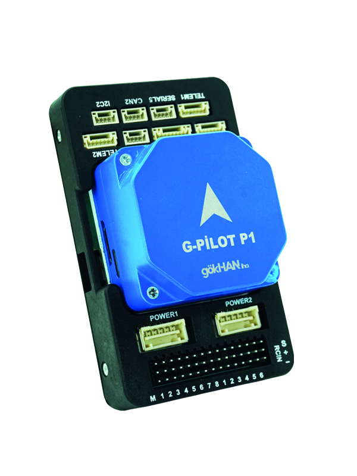
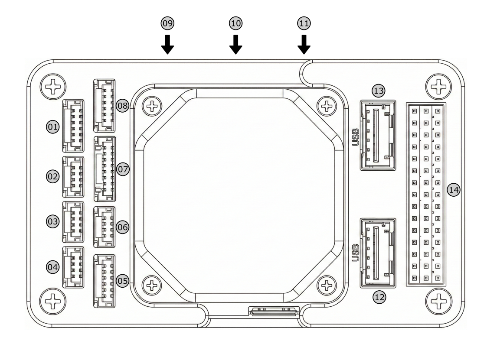
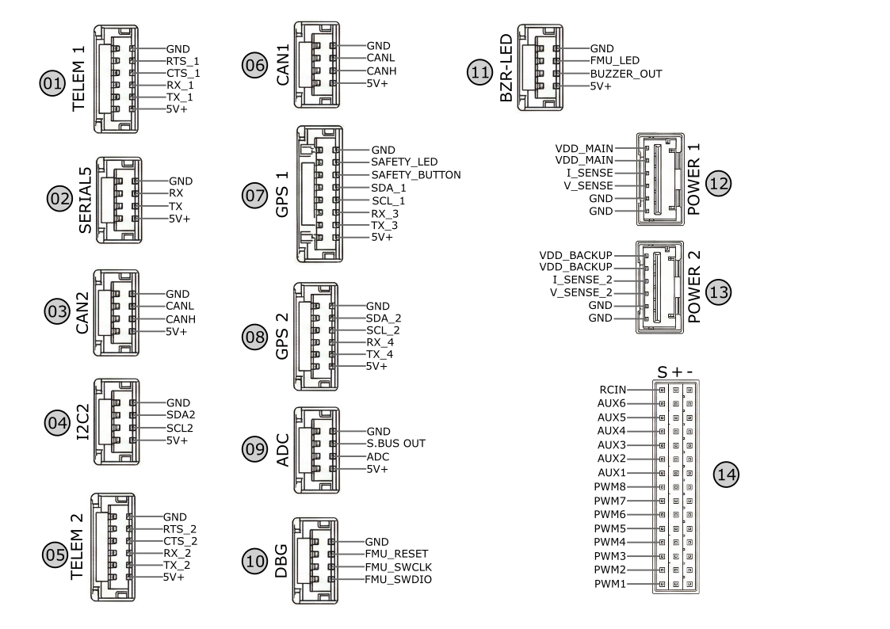
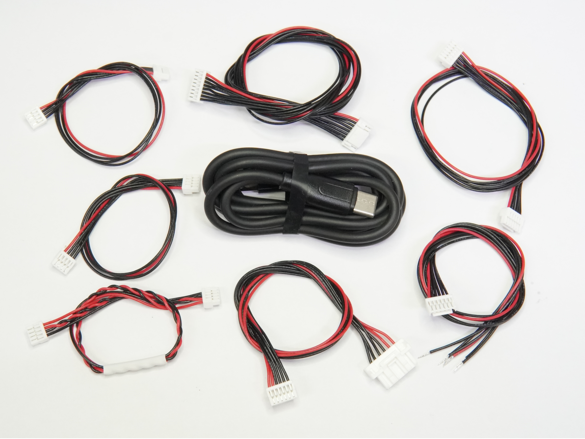

# GOKHAN IHA G-Pilot P1 Flight Controller

::: warning
PX4 does not manufacture this (or any) autopilot. Contact the [manufacturer](https://gokhaniha.com/) for hardware support or compliance issues.
:::

The G-Pilot P1 is a flight controller from GOKHAN IHA based on an STM32H753 FMU and a dedicated I/O failsafe co-processor. It provides redundant inertial sensors, redundant barometers, onboard heating for the IMUs, and 14 PWM outputs.

::: info
This flight controller is listed as [manufacturer supported](../flight_controller/autopilot_manufacturer_supported.md). The manufacturer is responsible for maintaining PX4 compatibility and providing hardware support.
:::

## Key Features

- STM32H753 FMU processor running at 400 MHz.
- STM32F100 failsafe co-processor.
- Triple-redundant IMU system with vibration isolation and temperature control.
- Dual barometers and an onboard RM-3100 compass.
- 14 PWM outputs: 8 from the I/O co-processor and 6 from the FMU.
- Redundant power inputs with analog voltage and current sensing.
- Two DroneCAN ports, two I2C ports, and five serial ports.
- microSD card for flight logs.
- External safety button, status LED, and high-power buzzer.

## Where to Buy

Contact [GOKHAN IHA](https://gokhaniha.com/) for product availability and reseller information.

## Assembly and Setup

The controller is supplied with a GBRICK LV power module, buzzer/LED module, CAN/I2C expander, and cables. Use the included cables and the connector drawings below when connecting peripherals.

The manufacturer recommends installing the controller with the supplied vibration-damping foam. The internal compass can be affected by electromagnetic interference; an external compass may be preferable depending on the vehicle installation.

## Specifications

- **FMU processor:** STM32H753, 32-bit Arm Cortex-M7, 400 MHz, 1 MB RAM, 2 MB flash
- **I/O processor:** STM32F100 failsafe co-processor
- **Sensors:**
  - Accelerometer/gyroscope: 2x ICM-20649 and 1x ICM-20602
  - Barometric pressure sensor: 2x MS5611
  - Compass: RM-3100
- **IMU heating:** Default operating temperature of 45 C; the temperature control is configurable by firmware.
- **Operating temperature:** -40 C to 85 C
- **Dimensions:** 57 mm x 95.8 mm x 37.3 mm
- **Weight:** approximately 130 g
- **Servo rail voltage:** 3.3 V or 5 V, selectable for the I/O PWM outputs

## Interfaces

- 14 PWM outputs
  - Main outputs 1-8 from the I/O co-processor
  - Auxiliary outputs 9-14 from the FMU
- S.Bus receiver input and S.Bus output
- Spektrum/DSM receiver input
- 5 serial ports, including two with hardware flow control
- 2 I2C ports
- 2 DroneCAN ports
- 1 SPI port
- 1 analog input
- Safety button and LED
- Buzzer and processor status LED
- SWD debug/programming port
- USB-C port
- microSD card slot

## Pinouts

Connectors use JST-GH 1.25 mm pitch, except for the Molex Clik-Mate POWER1 and POWER2 connectors.

## Serial Port Mapping

| UART | Connector | Typical use | Hardware flow control |
|------|-----------|-------------|-----------------------|
| USB | USB-C | USB connection | No |
| USART2 | TELEM1 | Telemetry | Yes |
| USART3 | TELEM2 | Telemetry | Yes |
| UART4 | GPS1 | GPS | No |
| UART8 | GPS2 | GPS | No |
| UART7 | USER | User peripheral | No |

The physical port assignment and firmware device names may vary between PX4 board configurations. Check the serial device mapping provided with the PX4 firmware for the board before configuring a peripheral.

## PWM Outputs

The outputs are arranged in five timer groups. Outputs in one group must use the same output protocol.

| Output group | Channels | Timer | Supported protocols |
|--------------|----------|-------|---------------------|
| Main 1 | 1, 2 | TIM2 | PWM, DShot |
| Main 2 | 3, 4 | TIM4 | PWM, DShot |
| Main 3 | 5, 6, 7, 8 | TIM3 | PWM, DShot |
| Aux 1 | 9, 10, 11, 12 | TIM1 | PWM, DShot |
| Aux 2 | 13, 14 | TIM4 | PWM, DShot |

The I/O PWM output voltage is selectable between 3.3 V and 5 V. The FMU auxiliary outputs use the FMU servo supply and are not affected by the I/O output voltage selector. Verify the required voltage for the connected ESCs or servos before powering the vehicle.

## Power

POWER1 and POWER2 accept 4.7 V to 5.3 V DC and provide redundant power inputs. Each port provides analog voltage and current sensing; the analog sensing inputs must not exceed 3.3 V.

The included GBRICK LV power module can be connected to either power input, or to both inputs for redundant power. Configure battery voltage and current monitoring in QGroundControl using the calibration information supplied with the power module and the PX4 battery configuration documentation.

## RC Input

The dedicated receiver input supports S.Bus and Spektrum/DSM receivers. For bidirectional serial receiver protocols such as CRSF or ELRS, connect the receiver to a suitable serial port and configure that port in QGroundControl according to the receiver documentation.

## Compass

The G-Pilot P1 includes an onboard RM-3100 compass. Mount the controller away from high-current wiring, power modules, and other sources of magnetic interference. Use an external compass when the vehicle installation prevents reliable calibration of the internal sensor.

## PX4 Firmware

PX4 firmware is normally installed and updated with [QGroundControl](../config/firmware.md). The G-Pilot P1 firmware target and update procedure must be supplied and maintained by the manufacturer. Do not flash firmware built for another flight controller.

If a G-Pilot P1 target is added to the PX4 source tree, the target name and build command should be documented here together with the corresponding release that first supports it.

## Package Contents

- G-Pilot P1 flight controller
- GBRICK LV power module
- Buzzer and LED module
- CAN/I2C expander
- Vibration-damping foam set
- I2C/buzzer cables
- CAN cable
- GPS cables
- Power cable
- Telemetry cable
- USB-C cable

## Further Information

- [GOKHAN IHA](https://gokhaniha.com/)
- [PX4 Manufacturer-Supported Autopilots](../flight_controller/autopilot_manufacturer_supported.md)
