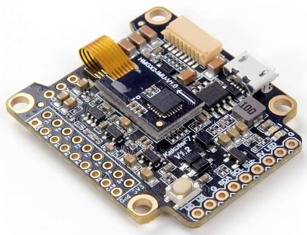
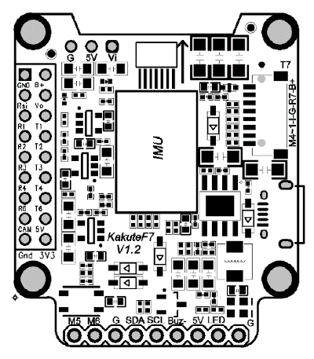
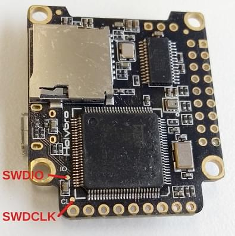
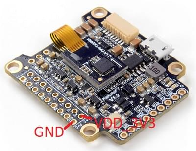

# Holybro Kakute F7 (Discontinued)

<Badge type="info" text="Discontinued" />

:::warning
PX4 does not manufacture this (or any) autopilot.
Contact the [manufacturer](https://holybro.com/) for hardware support or compliance issues.
:::

The _Kakute F7_ from Holybro is a flight controller board designed for racers.



::: info
This flight controller is [manufacturer supported](../flight_controller/autopilot_manufacturer_supported.md).
:::

## Key Features

- Main System-on-Chip: [STM32F745VGT6](https://www.st.com/en/microcontrollers-microprocessors/stm32f745vg.html)
  - CPU: 216 MHz ARM Cortex M7 with single-precision FPU
  - RAM: 320 KB SRAM
  - FLASH: 1 MB
- Standard racer form factor: 36x36 mm with standard 30.5 mm hole pattern
- ICM20689 Accel / Gyro (Soft-mounted)
- BMP280 Baro
- microSD (for logging)
- 6 UARTs
- 1 I2C bus
- 6 PWM outputs
- Built-in OSD chip (AB7456 via SPI)

## Where to Buy

The board can be bought from one of the following shops (for example):

- [getfpv](https://www.getfpv.com/holybro-kakute-f7-tekko32-f3-metal-65a-4-in-1-esc-combo.html)

:::tip
The _Kakute F7_ is designed to work with the _Tekko32_ 4-in-1 ESC and they can be bought in combination.
:::

## Connectors and Pins

This is the silkscreen for the _Kakute F7_, showing the top of the board:



| Pin      | Function                                                             | PX4 default         |
| -------- | -------------------------------------------------------------------- | ------------------- |
| B+       | Battery positive voltage (2S-6S)                                     |                     |
| 5V       | 5V output (2A max)                                                   |                     |
| VO       | Video output to video transmitter                                    |                     |
| VI       | Video input from FPV camera                                          |                     |
| G or GND | Ground                                                               |                     |
| SDA, SCL | I2C connection (for peripherals)                                     |                     |
| R1, T1   | UART1 RX and TX                                                      | TELEM1              |
| R2, T2   | UART2 RX and TX                                                      | TELEM2              |
| R3, T3   | UART3 RX and TX                                                      | NuttX debug console |
| R4, T4   | UART4 RX and TX                                                      | GPS1                |
| R6, T6   | UART6 RX and TX                                                      | RC port             |
| R7, T7   | UART7 RX and TX (RX is located in the plug for use with 4-in-1 ESCs) | DShot telemetry     |
| LED      | WS2182 addressable LED signal wire (not tested)                      |                     |
| Buz-     | Piezo buzzer negative leg (Connect buzzer positive leg to 5V pad)    |                     |
| 3V3      | 3.3V output (200 mA max)                                             |                     |
| M1 to M4 | Motor signal outputs (located in plug for use in 4-in-1 ESCs)        |                     |
| M5, M6   | Additional motor signal outputs (located on side of board)           |                     |
| RSI      | Analog RSSI (0-3.3V) input from receiver                             |                     |
| Boot     | Bootloader button                                                    |                     |

<a id="bootloader"></a>

## PX4 Bootloader Update

The board comes pre-installed with [Betaflight](https://github.com/betaflight/betaflight/wiki).
Before PX4 firmware can be installed, the _PX4 bootloader_ must be flashed.
Download the [kakutef7_bl.hex](https://github.com/PX4/PX4-user_guide/raw/main/assets/flight_controller/kakutef7/kakutef7_bl_0b3fbe2da0.hex) bootloader binary and read [this page](../advanced_config/bootloader_update_from_betaflight.md) for flashing instructions.

## Building Firmware

To [build PX4](../dev_setup/building_px4.md) for this target:

```
make holybro_kakutef7_default
```

## Installing PX4 Firmware

The firmware can be installed in any of the normal ways:

- Build and upload the source
  ```
  make holybro_kakutef7_default upload
  ```
- [Load the firmware](../config/firmware.md) using _QGroundControl_.
  You can use either pre-built firmware or your own custom firmware.

## Configuration

If you use a 4-in-1 ESC with Betaflight/Cleanflight motor assignment you can use the [Actuator](../config/actuators.md) configuration UI to set the motor ordering appropriately.

In addition to the [basic configuration](../config/index.md), the following parameters are important:

| Parameter                                                            | Setting                                                                                                                 |
| -------------------------------------------------------------------- | ----------------------------------------------------------------------------------------------------------------------- |
| [SYS_HAS_MAG](../advanced_config/parameter_reference.md#SYS_HAS_MAG) | This should be disabled since the board does not have an internal mag. You can enable it if you attach an external mag. |

## Serial Port Mapping

| UART   | Device     | Port                  |
| ------ | ---------- | --------------------- |
| USART1 | /dev/ttyS0 | TELEM1                |
| USART2 | /dev/ttyS1 | TELEM2                |
| USART3 | /dev/ttyS2 | Debug Console         |
| UART4  | /dev/ttyS3 | GPS1                  |
| USART6 | /dev/ttyS4 | RC SBUS               |
| UART7  | /dev/ttyS5 | ESC telemetry (DShot) |

<!-- Note: Got ports using https://github.com/PX4/PX4-user_guide/pull/672#issuecomment-598198434 -->

## Debug Port

### System Console

UART3 RX and TX are configured for use as the [System Console](../debug/system_console.md).

### SWD

The [SWD interface](../debug/swd_debug.md) (JTAG) pins are:

- `SWCLK`: Test Point 2 (Pin 72 on the CPU)
- `SWDIO`: Test Point 3 (Pin 76 on CPU)
- `GND`: As marked on board
- `VDD_3V3`: As marked on board

These are shown below.

 
