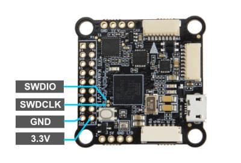

# Holybro Kakute H7

<Badge type="tip" text="PX4 v1.13" />

:::warning
PX4 does not manufacture this (or any) autopilot.
Contact the [manufacturer](https://holybro.com/) for hardware support or compliance issues.
:::

The [Holybro Kakute H7](https://holybro.com/products/kakute-h7) is full of features including dual plug-and-play 4in1 ESC ports, HD camera plug, barometer, OSD, 6x UARTs, full Blackbox MicroSD card slot, 5V and 9V BEC, easy soldering layout, and much more.

The Kakute H7 builds upon the best features of its predecessor, the [Kakute F7](../flight_controller/kakutef7.md), and further improves on hardware components and layout.
Dual plug'n'play 4-in-1 ESC connectors simplify support for x8 and Octocopter configurations, keeping assembly simple and clean.

The board also has an on-board barometer, LED & buzzer pad, and I2C pad (SDA & SCL) for external GPS/Magnetometers.


::: info
This flight controller is [manufacturer supported](../flight_controller/autopilot_manufacturer_supported.md).
:::

## Key Features

- MCU: STM32H743 32-bit processor running at 480 MHz
- IMU: MPU6000
- Barometer: BMP280
- OSD: AT7456E
- Onboard Bluetooth chip: Disabled with PX4
- 2x JST-SH1.0_8pin port (For Single or 4in1 ESCs, x8/Octocopter plug & play compatible)
- 1x JST-GH1.25_6pin port (For HD System like Caddx Vista & Air Unit)
- Battery input voltage: 2S - 8S
- BEC 5V 2A Cont.
- BEC 9V 1.5A Cont.
- Mounting: 30.5 x 30.5mm/Φ4mm hole with Φ3mm Grommets
- Dimensions: 35x35mm
- Weight: 8g

## Where to Buy

The board can be bought from one of the following shops (for example):

- [Holybro](https://holybro.com/products/kakute-h7)

:::tip
The _Kakute H7_ is designed to work with the _Tekko32_ 4-in-1 ESC and they can be bought in combination.
:::

## Connectors and Pins

This is the silkscreen for the _Kakute H7_, showing the top of the board:


| Pin      | Function                                                          | PX4 default         |
| -------- | ----------------------------------------------------------------- | ------------------- |
| B+       | Battery positive voltage (2S-8S)                                  |                     |
| SDA, SCL | I2C connection (for peripherals)                                  |                     |
| 5V       | 5V output (2A max)                                                |                     |
| 3V3      | 3.3V output (0.25A max)                                           |                     |
| VI       | Video input from FPV camera                                       |                     |
| VO       | Video output to video transmitter                                 |                     |
| CAM      | To camera OSD control                                             |                     |
| G or GND | Ground                                                            |                     |
| RSI      | Analog RSSI (0-3.3V) input from receiver                          |                     |
| R1, T1   | UART1 RX and TX                                                   | TELEM1              |
| R3, T3   | UART3 RX and TX                                                   | NuttX debug console |
| R4, T4   | UART4 RX and TX                                                   | GPS1                |
| R6, T6   | UART6 RX and TX (R6 also located in the GH plug)                  | RC port             |
| R7       | UART7 RX (RX is located in the plugs for use with 4-in-1 ESCs)    | DShot telemetry     |
| LED      | WS2182 addressable LED signal wire (not tested)                   |                     |
| Z-       | Piezo buzzer negative leg (Connect buzzer positive leg to 5V pad) |                     |
| M1 to M4 | Motor signal outputs (located in plug for use in 4-in-1 ESCs)     |                     |
| M5 to M8 | Motor signal outputs (located in plug for use in 4-in-1 ESCs)     |                     |
| Boot     | Bootloader button                                                 |                     |


## PX4 Bootloader Update {#bootloader}

The board comes pre-installed with [Betaflight](https://github.com/betaflight/betaflight/wiki).
Before PX4 firmware can be installed, the _PX4 bootloader_ must be flashed.
Download the [kakuteh7_bl.hex](https://github.com/PX4/PX4-user_guide/raw/main/assets/flight_controller/kakuteh7/holybro_kakuteh7_bootloader.hex) bootloader binary and read [this page](../advanced_config/bootloader_update_from_betaflight.md) for flashing instructions.

## Building Firmware

To [build PX4](../dev_setup/building_px4.md) for this target:

```sh
make holybro_kakuteh7_default
```

## Installing PX4 Firmware

The firmware can be installed in any of the normal ways:

- Build and upload the source

  ```sh
  make holybro_kakuteh7_default upload
  ```

- [Load the firmware](../config/firmware.md) using _QGroundControl_.
  You can use either pre-built firmware or your own custom firmware.

::: info
If you are loading the pre-built firmware via QGroundcontrol, you must use QGC Daily or QGC version newer than 4.1.7.
:::

## PX4 Configuration

In addition to the [basic configuration](../config/index.md), the following parameters are important:

| Parameter                                                            | Setting                                                                                                                 |
| -------------------------------------------------------------------- | ----------------------------------------------------------------------------------------------------------------------- |
| [SYS_HAS_MAG](../advanced_config/parameter_reference.md#SYS_HAS_MAG) | This should be disabled since the board does not have an internal mag. You can enable it if you attach an external mag. |

## Serial Port Mapping

| UART   | Device     | Port                  |
| ------ | ---------- | --------------------- |
| USART1 | /dev/ttyS0 | TELEM1                |
| USART2 | /dev/ttyS1 | TELEM2                |
| USART3 | /dev/ttyS2 | Debug Console         |
| UART4  | /dev/ttyS3 | GPS1                  |
| USART6 | /dev/ttyS4 | RC SBUS               |
| UART7  | /dev/ttyS5 | ESC telemetry (DShot) |

### Using TELEM2 (USART2)

The `TELEM2` port (USART2) has no exposed solder pads as it is intended for use with Bluetooth telemetry (this does not work with PX4).

You can expose the solder pads and use the port by removing the two resistors marked with an X.
No other configuration should be required.


## Debug Port

### System Console

UART3 RX and TX are configured for use as the [System Console](../debug/system_console.md).

### SWD

The [SWD interface](../debug/swd_debug.md) (JTAG) pins are:

- `SWCLK`: Test Point 2 (Pin 72 on the CPU)
- `SWDIO`: Test Point 3 (Pin 76 on CPU)
- `GND`: As marked on board
- `VDD_3V3`: As marked on board

These are shown below.


