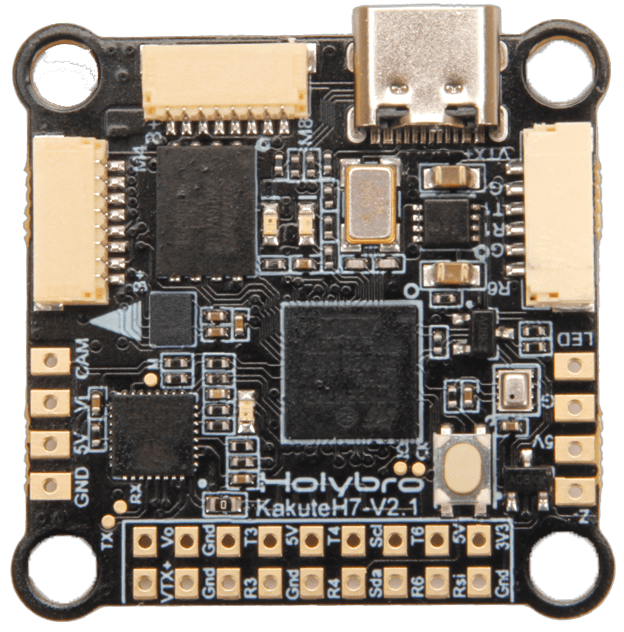

# Holybro Kakute H7 V2

:::warning
PX4 does not manufacture this (or any) autopilot.
Contact the [manufacturer](https://holybro.com/) for hardware support or compliance issues.
:::

The [Holybro Kakute H7 V2](https://holybro.com/collections/autopilot-flight-controllers/products/kakute-h7-v2) flight controller is full of features including integrated Bluetooth, HD camera plug, dual plug-and-play 4in1 ESC ports, 9V VTX ON/OFF Pit Switch, barometer, OSD, 6x UARTs, 128MB Flash for Logging (not supported with PX4 yet), 5V and 9V BEC, and bigger soldering pad with easy layout and much more.

The Kakute H7v2 builds upon the best features of its predecessor, the [Kakute F7](../flight_controller/kakutef7.md), and the [Kakute H7](../flight_controller/kakuteh7.md).

The board also has an on-board barometer, LED & buzzer pad, and I2C pad (SDA & SCL) for external GPS/magnetometers.

 

::: info
This flight controller is [manufacturer supported](../flight_controller/autopilot_manufacturer_supported.md).
:::

## Key Features

- MCU: STM32H743 32-bit processor running at 480 MHz
- IMU: BMI270
- Barometer: BMP280
- OSD: AT7456E
- Onboard Bluetooth chip: Disabled with PX4
- VTX On/Off Pit Switch: Not used with PX4
- 6x UARTs (1,2,3,4,6,7; UART2 is used for Bluetooth telemetry)
- 9x PWM Outputs (8 Motor Outputs, 1 LED)
- 2x JST-SH1.0_8pin port (For Single or 4in1 ESCs, x8/Octocopter plug & play compatible)
- 1x JST-GH1.5_6pin port (For HD System like Caddx Vista & Air Unit)
- Battery input voltage: 2S-8S
- BEC 5V 2A Cont.
- BEC 9V 1.5A Cont.
- Mounting: 30.5 x 30.5mm/Φ4mm hole with Φ3mm Grommets
- Dimensions: 35x35mm
- Weight: 8g

## Where to Buy

The board can be bought from one of the following shops (for example):

- [Holybro](https://holybro.com/products/kakute-h7-v2)

:::tip
The _Kakute H7v2_ is designed to work with the _Tekko32_ 4-in-1 ESC and they can be bought in combination.
:::

## Connectors and Pins

| Pin      | Function                                                          | PX4 default         |
| -------- | ----------------------------------------------------------------- | ------------------- |
| B+       | Battery positive voltage (2S-8S)                                  |                     |
| VTX+     | 9V Output                                                         |                     |
| SDA, SCL | I2C connection (for peripherals)                                  |                     |
| 5V       | 5V output (2A max)                                                |                     |
| 3V3      | 3.3V output (0.25A max)                                           |                     |
| VI       | Video input from FPV camera                                       |                     |
| VO       | Video output to video transmitter                                 |                     |
| CAM      | To camera OSD control                                             |                     |
| G or GND | Ground                                                            |                     |
| RSI      | Analog RSSI (0-3.3V) input from receiver                          |                     |
| R1, T1   | UART1 RX and TX                                                   | TELEM1              |
| R3, T3   | UART3 RX and TX                                                   | NuttX debug console |
| R4, T4   | UART4 RX and TX                                                   | GPS1                |
| R6, T6   | UART6 RX and TX (R6 also located in the GH plug)                  | RC port             |
| R7       | UART7 RX (RX is located in the plugs for use with 4-in-1 ESCs)    | DShot telemetry     |
| LED      | WS2182 addressable LED signal wire (not tested)                   |                     |
| Z-       | Piezo buzzer negative leg (Connect buzzer positive leg to 5V pad) |                     |
| M1 to M4 | Motor signal outputs (located in plug for use in 4-in-1 ESCs)     |                     |
| M5 to M8 | Motor signal outputs (located in plug for use in 4-in-1 ESCs)     |                     |
| Boot     | Bootloader button                                                 |                     |

<a id="bootloader"></a>

## PX4 Bootloader Update

The board comes pre-installed with [Betaflight](https://github.com/betaflight/betaflight/wiki).
Before the PX4 firmware can be installed, the _PX4 bootloader_ must be flashed.
Download the [holybro_kakuteh7v2_bootloader.hex](https://github.com/PX4/PX4-user_guide/raw/main/assets/flight_controller/kakuteh7v2/holybro_kakuteh7v2_bootloader.hex) bootloader binary and read [this page](../advanced_config/bootloader_update_from_betaflight.md) for flashing instructions.

## Building Firmware

To [build PX4](../dev_setup/building_px4.md) for this target:

```
make holybro_kakuteh7v2_default
```

## Installing PX4 Firmware

::: info
KakuteH7v2 is supported with PX4 master & PX4 v1.14 or newer. If you are loading the pre-built firmware via QGroundcontrol, you must use QGC Daily or QGC version newer than 4.1.7.
Prior to that release you will need to manually build and install the firmware.
:::

Firmware can be manually installed in any of the normal ways:

- Build and upload the source:

  ```
  make holybro_kakuteh7v2_default upload
  ```

- [Load the firmware](../config/firmware.md) using _QGroundControl_.
  You can use either pre-built firmware or your own custom firmware.

::: info
KakuteH7v2 is supported with PX4 main and v1.14 or newer.
:::

## PX4 Configuration

In addition to the [basic configuration](../config/index.md), the following parameters are important:

| Parameter                                                            | Setting                                                                                                                 |
| -------------------------------------------------------------------- | ----------------------------------------------------------------------------------------------------------------------- |
| [SYS_HAS_MAG](../advanced_config/parameter_reference.md#SYS_HAS_MAG) | This should be disabled since the board does not have an internal mag. You can enable it if you attach an external mag. |

## Serial Port Mapping

| UART   | Device     | Port                  |
| ------ | ---------- | --------------------- |
| USART1 | /dev/ttyS0 | TELEM1                |
| USART3 | /dev/ttyS2 | Debug Console         |
| UART4  | /dev/ttyS3 | GPS1                  |
| USART6 | /dev/ttyS4 | RC SBUS               |
| UART7  | /dev/ttyS5 | ESC telemetry (DShot) |

## Debug Port

### System Console

UART3 RX and TX are configured for use as the [System Console](../debug/system_console.md).

### SWD

The [SWD interface](../debug/swd_debug.md) (JTAG) pins are:

- `SWCLK`: Test Point 2 (Pin 72 on the CPU)
- `SWDIO`: Test Point 3 (Pin 76 on CPU)
- `GND`: As marked on board
- `VDD_3V3`: As marked on board
