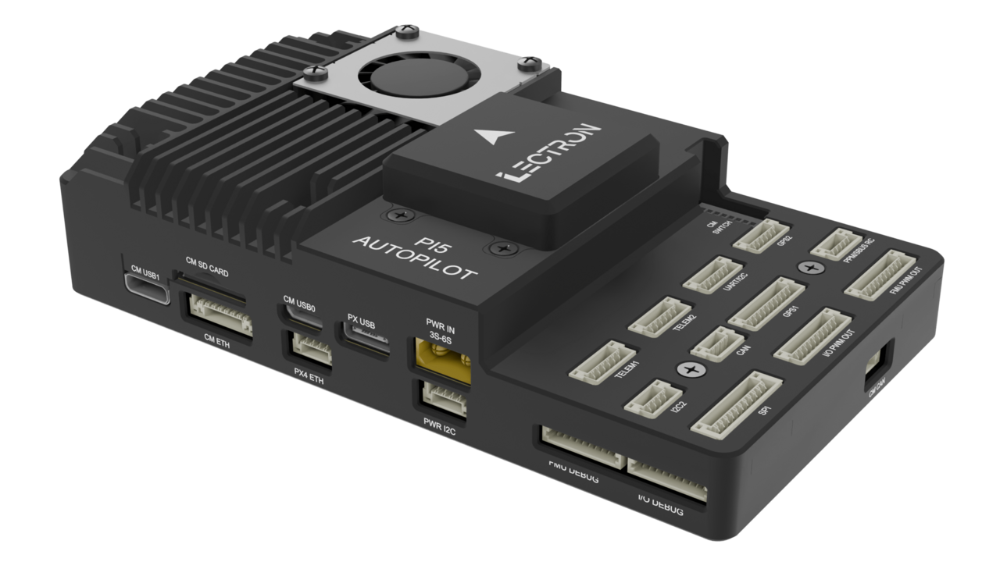
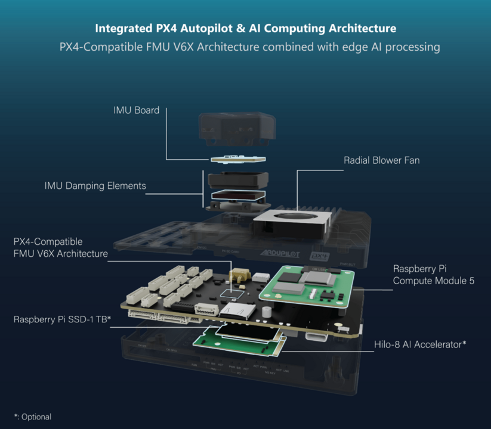
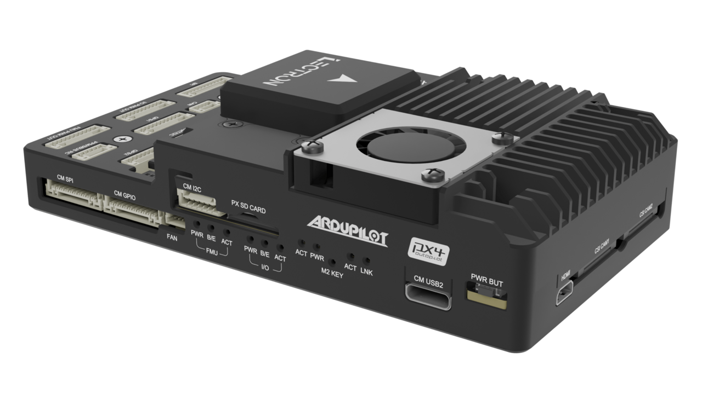
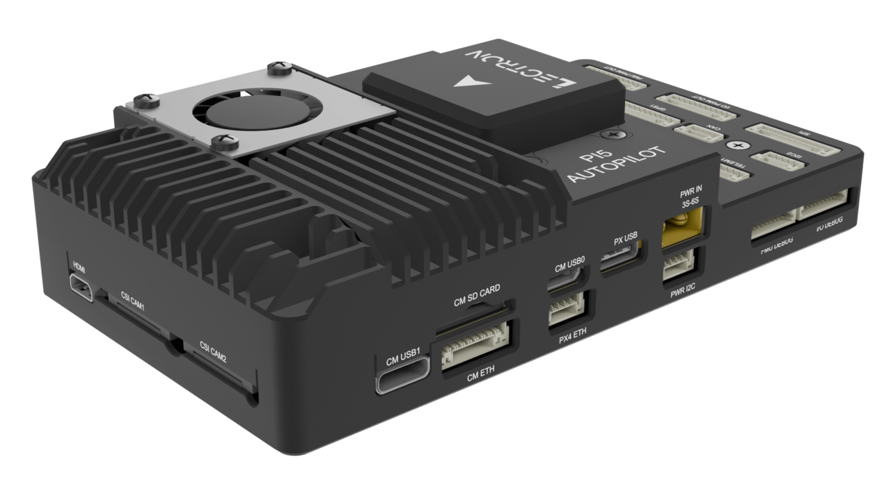

# Lectron Pi5 Autopilot

<Badge type="tip" text="main (PX4 v2.0)" />

::: warning
PX4 does not manufacture this (or any) autopilot.
Contact the [manufacturer](https://lectrontech.com/contact-us/) for hardware support or compliance issues.
:::

The _Lectron Pi5 Autopilot_ is an integrated flight control and companion computing platform designed for advanced autonomous systems.
It combines a Pixhawk® FMUv6X-compatible flight controller with a Raspberry Pi Compute Module 5 (CM5) on a single unified board, maintaining a clear separation between safety-critical real-time control and high-level computing workloads.



It is based on the [Pixhawk® Autopilot FMUv6X Standard](https://github.com/pixhawk/Pixhawk-Standards/blob/master/DS-012%20Pixhawk%20Autopilot%20v6X%20Standard.pdf), [Autopilot Bus Standard](https://github.com/pixhawk/Pixhawk-Standards/blob/master/DS-010%20Pixhawk%20Autopilot%20Bus%20Standard.pdf), and [Connector Standard](https://github.com/pixhawk/Pixhawk-Standards/blob/master/DS-009%20Pixhawk%20Connector%20Standard.pdf).

## Introduction

The Lectron Pi5 Autopilot is designed by [Lectron](https://lectrontech.com/) with the STM32H753 (FMU) and STM32F103 (IO) processors embedded directly on the board - unlike modular systems, these processors are not removable or interchangeable. The FMU follows the Pixhawk® FMUv6X open standard with triple-redundant IMUs and dual barometers on separate buses, enabling seamless sensor failover. An independent STM32F103 IO processor handles R/C and PWM outputs in isolation from the main FMU core.

The board is designed following the [Pixhawk Autopilot Bus (PAB) standard](https://github.com/pixhawk/Pixhawk-Standards/blob/master/DS-010%20Pixhawk%20Autopilot%20Bus%20Standard.pdf) and the official Raspberry Pi CM5 hardware design guidelines - all CM5-side external connectivity is fully implemented in accordance with those guidelines. Alongside the CM5 slot, the board integrates three dedicated subsystems:

- **Power system:** A shared regulated 5 V rail serves both the FMU and CM5, with reverse polarity protection, overcurrent limiting, and INA238-based voltage monitoring.
- **Ethernet system:** The FMU uses an onboard LAN8742AI PHY for a dedicated 100-Mbps link via JST 4-pin connector; the CM5 connects to a separate 1-Gbps capable Ethernet port via a JST 8-pin connector.
- **Protection system:** Short-circuit sensing on power rails, isolated sensor domains with per-sensor power control, and an 8-position DIP switch for boot mode, WiFi/Bluetooth disable, and power control configuration (for CM5).

## Key Design Points

- High-performance STM32H753 FMU processor (Arm Cortex-M7, 480 MHz)
- STM32F103 IO processor for R/C and PWM output handling
- Triple redundancy: 3x IMU sensors & 2x barometers on separate buses
- Isolated sensor domains with independent power control per sensor set
- Integrated Raspberry Pi Compute Module 5 (CM5)
- Dedicated 100-Mbps FMU Ethernet (LAN8742AI PHY) and 1-Gbps CM5 Ethernet (with onboard magnetics)
- M.2 Key-M (2230/2242) slot for NVMe SSD or AI accelerator
- 8-position DIP switch for boot mode and peripheral configuration
- Reverse polarity protection and shared power regulation bus
- INA238 onboard voltage monitoring

## Processors & Sensors

### FMU

- **FMU Processor:** STM32H753IIK6TR
  - 32-bit Arm® Cortex®-M7, 480 MHz, 2 MB flash, 1 MB RAM
- **IO Processor:** STM32F103
  - 32-bit Arm® Cortex®-M3, 72 MHz, 64 KB SRAM
- **Onboard sensors (FMU board)**
  - Accel/Gyro: ICM-42670-P (SPI)
  - Barometer: BMP390 (I2C)
  - FRAM (SPI)
  - EEPROM (I2C)
- **Sensor board (IMU-01, only with Lectron Pi5 Autopilot bundle)**
  - Accel/Gyro: ICM-42670-P (SPI)
  - Accel/Gyro: BMI270 (SPI)
  - Barometer: BMP390 (I2C)
  - Magnetometer: BMM350 (I2C)
  - EEPROM (I2C)

### Companion Computer

- **Supported module:** Raspberry Pi Compute Module 5 (CM5 / CM5 Lite)
- **Connection:** CM5 board-to-board connector

## Electrical Data

- **Power input:** 12-26 VDC (3S-6S LiPo), XT30 connector
- **Overcurrent protection:** 5 A maximum
- **FMU & CM5 shared rail:** 5 V (combined regulated bus)
- **Per-port output limit:** 1.5 A total across FMU and CM5 peripheral 5 V rails
- **Protection:** reverse polarity, overcurrent
- **Voltage monitoring:** INA238 (I2C)
- **Servo sensing limit:** 16 VDC

## Interfaces

**FMU side:**

- 8x FMU (AUX) PWM outputs - DShot capable
- 8x IO (MAIN) PWM outputs
- RC input: PPM, S.BUS
- RSSI analog input
- S.BUS output
- DSM not supported
- 2x GPS ports
  - GPS-1 (full): UART + I2C + safety switch + LED + buzzer (10-pin JST-GH)
  - GPS-2 (basic): UART + I2C (6-pin JST-GH)
- 2x TELEM serial ports with hardware flow control (UART7, UART5)
  - TELEM3 (USART2) bridged by default to CM5 UART3
- 1x UART4 + I2C3 (combined external port)
- 1x I2C2 (external)
- 1x SPI6 with 2x chip-select and 2x data-ready lines (11-pin JST-GH)
- 1x CAN bus
- 1x USB 2.0 Type-C (FMU)
- Micro SD card slot
- 1x 4-pin JST-GH Ethernet port - 100 Mbps (LAN8742AI PHY)
- FMU debug port + IO debug port (10-pin SM10B-SRSS, SWD + UART)

**CM5 side:**

- 2x CSI camera interfaces (22-pin FFC, 0.5 mm pitch, 4-lane MIPI)
- UART2 (combined on GPIO/UART connector)
- I2C-1, I2C-3 (combined on I2C connector)
- SPI1 with 3x chip-select (CAN controller, external, BMI270)
- GPIO22-GPIO27 (10-pin SM10B-GHS, 3.3 V logic)
- 4x PWM (combined on SPI/PWM connector)
- 1x CAN (MCP2515 via SPI1-CS0)
- 2x USB 3.0 Type-C
- 1x USB 2.0 Micro (debug / CM5 flashing)
- 1x Micro HDMI
- 1x 8-pin 1-Gbps Ethernet port
- M.2 Key-M 2230/2242 (PCIe Gen2 x1) - NVMe SSD or Hailo-8 AI accelerator
- 8-position DIP switch (WiFi/BT disable, boot mode, power control)
- 4-pin JST fan connector (with tacho)

## Where to Buy {#store}

Order from [Lectron Technology](https://lectrontech.com/pi5autopilot/).

## Assembly

The Lectron Pi5 Autopilot ships as a kit. Assembly requires the following components:

- CM5-FMU baseboard
- Raspberry Pi Compute Module 5 (CM5 or CM5 Lite)
- MicroSD card(s)
- M2 M-Key Module (2230/2242 Hailo/SSD optional)
- Bottom case
- Top case (heatsink + fan)
- IMU sensor board (IMU-01)
- Fasteners: 4× M2×4 mm (IMU board), 5× M2×10 mm (case)

**Assembly order:**

For full photo-illustrated steps see the [Lectron Pi5 Assembly Guide](https://lectronuser.github.io/Lectron-Doc-Center/md/raspberry/assembly/).

## Serial Port Mapping

| UART   | Device     | Port                                        |
| ------ | ---------- | ------------------------------------------- |
| USART1 | /dev/ttyS0 | GPS1 - GPS, Mag, Buzzer, Safety Switch, LED |
| USART2 | /dev/ttyS1 | TELEM3 - bridged to CM5 UART3 by default    |
| UART3  | /dev/ttyS2 | FMU Debug Console                           |
| UART4  | /dev/ttyS3 | UART4 & I2C3 (external)                     |
| UART5  | /dev/ttyS4 | TELEM2 - hardware flow control              |
| USART6 | /dev/ttyS5 | IO Chip (STM32F103 communication)           |
| UART7  | /dev/ttyS6 | TELEM1 - hardware flow control              |
| UART8  | /dev/ttyS7 | GPS2 - GPS, Mag                             |

## PWM Outputs

The board has 16 PWM outputs: 8 IO (MAIN) outputs driven by the STM32F103C8T6 IO co-processor and 8 FMU (AUX) outputs driven by the STM32H753IIK6 FMU.

### IO — STM32F103C8T6

IO outputs support PWM only. [DShot](../peripherals/dshot.md) is not supported on any IO output. All outputs within the same timer group must use the same protocol and update rate.

| IO Channel | MCU Pin | Timer / Channel | DShot |
| ---------- | ------- | --------------- | ----- |
| IO_CH 1    | PA0     | TIM2_CH1        | No    |
| IO_CH 2    | PA1     | TIM2_CH2        | No    |
| IO_CH 3    | PB8     | TIM4_CH3        | No    |
| IO_CH 4    | PB9     | TIM4_CH4        | No    |
| IO_CH 5    | PA6     | TIM3_CH1        | No    |
| IO_CH 6    | PA7     | TIM3_CH2        | No    |
| IO_CH 7    | PB0     | TIM3_CH3        | No    |
| IO_CH 8    | PB1     | TIM3_CH4        | No    |

### FMU — STM32H753IIK6

FMU_CH 1–6 support [DShot](../peripherals/dshot.md) and [Bidirectional DShot](../peripherals/dshot.md#bidirectional-dshot-telemetry). FMU_CH 7–8 do not support DShot (TIM12 has no DMA). All outputs within the same timer group must use the same protocol and update rate.

| FMU Channel | MCU Pin | Timer / Channel | DShot |
| ----------- | ------- | --------------- | ----- |
| FMU_CH 1    | PI0     | TIM5_CH4        | Yes   |
| FMU_CH 2    | PH12    | TIM5_CH3        | Yes   |
| FMU_CH 3    | PH11    | TIM5_CH2        | Yes   |
| FMU_CH 4    | PH10    | TIM5_CH1        | Yes   |
| FMU_CH 5    | PD13    | TIM4_CH2        | Yes   |
| FMU_CH 6    | PD14    | TIM4_CH3        | Yes   |
| FMU_CH 7    | PH6     | TIM12_CH1       | No    |
| FMU_CH 8    | PH9     | TIM12_CH2       | No    |

## Building Firmware

```sh
make lectron_pi5-autopilot_default
```

## Loading Firmware

### CM5 Operating System

- For CM5 installation guide and application see the [Lectron Pi5 Autopilot, CM5 Installation Guide](https://lectronuser.github.io/Lectron-Doc-Center/md/raspberry/setup/#cm5-installation)

### FMU Firmware (STM32CubeProgrammer)

- For FMU installation guide and application see the [Lectron Pi5 Autopilot, FMU Installation Guide](https://lectronuser.github.io/Lectron-Doc-Center/md/raspberry/setup/#fmu-firmware-installation)

## Debug Port {#debug_port}

The [PX4 System Console](../debug/system_console.md) and [SWD interface](../debug/swd_debug.md) run on the **FMU Debug** port (UART3 / `/dev/ttyS2`).

The pinouts and connector comply with the [Pixhawk Debug Full](../debug/swd_debug.md#pixhawk-debug-full) interface defined in the [Pixhawk Connector Standard](https://github.com/pixhawk/Pixhawk-Standards/blob/master/DS-009%20Pixhawk%20Connector%20Standard.pdf) (JST SM10B-SRSS connector).

| Pin      | Signal            | Volt  |
| -------- | ----------------- | ----- |
| 1 (red)  | `FMU VDD`         | +3.3V |
| 2 (blk)  | Console TX (OUT)  | +3.3V |
| 3 (blk)  | Console RX (IN)   | +3.3V |
| 4 (blk)  | `SWDIO`           | +3.3V |
| 5 (blk)  | `SWDCLK`          | +3.3V |
| 6 (blk)  | SPI6_SCK_EXTERNAL | +3.3V |
| 7 (blk)  | NFC GPIO          | +3.3V |
| 8 (blk)  | PH11              | +3.3V |
| 9 (blk)  | nRST              | +3.3V |
| 10 (blk) | `GND`             | GND   |

## Supported Platforms / Airframes

Any multicopter, fixed-wing, rover, or boat that can be controlled with standard RC servos or Futaba S.BUS servos.
The complete set of supported configurations can be seen in the [Airframes Reference](../airframes/airframe_reference.md).

## Diagrams/Images





## Further Information

- [Lectron Pi5 Autopilot Documentation](https://lectronuser.github.io/Lectron-Doc-Center/md/raspberry/) (Lectron)
- [Pinout and Connector Details](https://lectronuser.github.io/Lectron-Doc-Center/md/raspberry/pinout/)
- [Assembly Guide](https://lectronuser.github.io/Lectron-Doc-Center/md/raspberry/assembly/)
- [Firmware Installation Guide](https://lectronuser.github.io/Lectron-Doc-Center/md/raspberry/setup/#fmu-firmware-installation)
- [FMU <-> CM5 Communication](https://lectronuser.github.io/Lectron-Doc-Center/md/raspberry/fmu-cm5-comm/)
- [CM5 GPIO Guide](https://lectronuser.github.io/Lectron-Doc-Center/md/raspberry/cm5-gpio/)
- [Camera Setup](https://lectronuser.github.io/Lectron-Doc-Center/md/raspberry/cam1-setup/)
- [Hailo-8 AI Accelerator Integration](https://lectronuser.github.io/Lectron-Doc-Center/md/raspberry/hailo-setup/)
- [RealSense Integration](https://lectronuser.github.io/Lectron-Doc-Center/md/raspberry/realsense-setup/)
- [Pixhawk Autopilot FMUv6X Standard](https://github.com/pixhawk/Pixhawk-Standards/blob/master/DS-012%20Pixhawk%20Autopilot%20v6X%20Standard.pdf)
- [Pixhawk Autopilot Bus Standard](https://github.com/pixhawk/Pixhawk-Standards/blob/master/DS-010%20Pixhawk%20Autopilot%20Bus%20Standard.pdf)
- [Pixhawk Connector Standard](https://github.com/pixhawk/Pixhawk-Standards/blob/master/DS-009%20Pixhawk%20Connector%20Standard.pdf)
