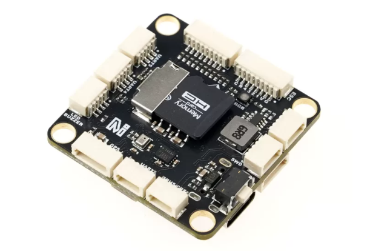
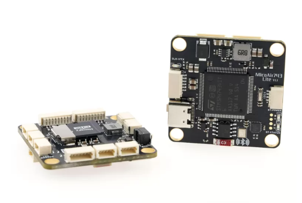
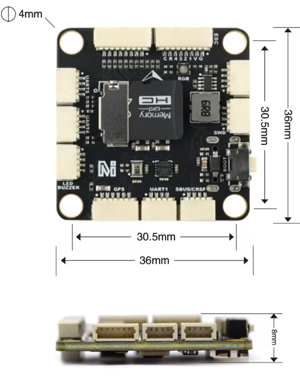
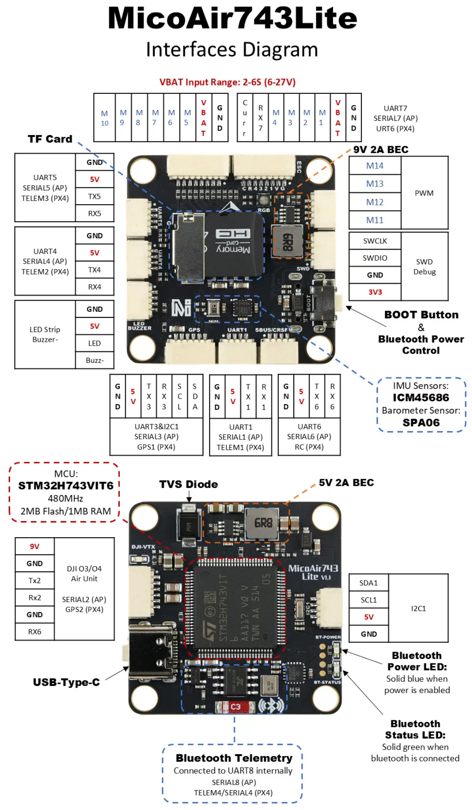
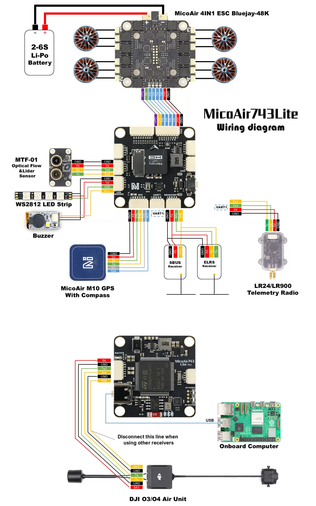

# MicoAir743-Lite

:::warning
PX4 does not manufacture this (or any) autopilot.
Contact the [manufacturer](https://micoair.com/) for hardware support or compliance issues.
:::

MicoAir743-Lite is an ultra-high performance H743 flight controller with an unbeatable price, featuring the ICM45686 IMU sensor and integrated Bluetooth telemetry.

Equipped with a high-performance H7 processor, the MicoAir743-Lite features a compact form factor and a convenient SH1.0 connector for easy wiring, and, when paired with Bluetooth telemetry, allows convenient debugging with a phone or PC.

## MicoAir743-Lite (v1.1)





## Quick Summary

### Processors & Sensors

- FMU Processor: STM32H743
  - 32 Bit Arm® Cortex®-M7, 480MHz, 2MB flash memory, 1MB RAM
- On-board sensors
  - Accel/Gyro: ICM-45686 (with BalancedGyro™ Technology)
  - Barometer: SPA06
- On-board Bluetooth Telemetry
  - Connected to UART8 internally, baudrate 115200
  - Connecting to QGC (PC or Android phone) via Bluetooth
- Other Characteristics:
  - Operating & storage temperature: -20 ~ 85°c

### Interfaces

- 8 UART (TELEM / GPS / RC)
- 14 PWM outputs （10 supports DShot）
- Support multiple RC inputs (SBUS / CRSF / DSM)
- 1 GPS port
- 1 I2C port
- 2 ADC port2 (VBAT, Current)
- 1 DJI O3/O4 VTX connector
- 1 MicroSD Card Slot
- 1 USB Type-C

### Electrical data

- VBAT Input:
  - 2\~6S (6\~27V)
- USB Power Input:
  - 4.75\~5.25V
- BEC Output:
  - 5V 2A (for controller, receiver, GPS, optical flow or other devices)
  - 9V 2A (for video transmitter, camera)

### Mechanical data

 - Mounting: 30.5 x 30.5mm, Φ4mm
 - Dimensions: 36 x 36 x 8 mm
 - Weight: 10g



## Where to Buy

Order from [MicoAir Tech Store](https://store.micoair.com/product/micoair743-lite/).

## Pinouts

Pinouts definition can be found in the [MicoAir743-Lite_pinout.xlsx](../../assets/flight_controller/micoair743-lite/MicoAir743-Lite_pinout.xlsx) file.

## Serial Port Mapping

| UART   | Device     | Port          |
| ------ | ---------- | ------------- |
| USART1 | /dev/ttyS0 | TELEM1        |
| USART2 | /dev/ttyS1 | GPS2          |
| USART3 | /dev/ttyS2 | GPS1          |
| UART4  | /dev/ttyS3 | TELEM2        |
| UART5  | /dev/ttyS4 | TELEM3        |
| USART6 | /dev/ttyS5 | RC            |
| UART7  | /dev/ttyS6 | URT6          |
| UART8  | /dev/ttyS7 | TELEM4        |

## Interfaces Diagram



## Sample Wiring Diagram



## Building Firmware

:::tip
Most users will not need to build this firmware!
It is pre-built and automatically installed by _QGroundControl_ when appropriate hardware is connected.
:::

To [build PX4](../dev_setup/building_px4.md) for this target:

```
make micoair_h743-lite_default
```

## Supported Platforms / Airframes

Any multicopter / airplane / rover or boat that can be controlled with normal RC servos or Futaba S-Bus servos.
The complete set of supported configurations can be seen in the [Airframes Reference](../airframes/airframe_reference.md).

## Peripherals

- [MicoAir Telemetry Radio Modules](https://micoair.com/radio_telemetry/)
- [MicoAir Optical & Range Sensor](https://micoair.com/optical_range_sensor/)
- [MicoAir GPS](https://micoair.com/gps/)
- [MicoAir ESC Modules](https://micoair.com/esc/)

## Further info

- [MicoAir Tech.](https://micoair.com/)
- [Details about MicoAir743-Lite](https://micoair.com/flightcontroller_micoair743lite/)
- [QGroundControl Download and Install](https://docs.qgroundcontrol.com/Stable_V5.0/en/qgc-user-guide/getting_started/download_and_install.html)
