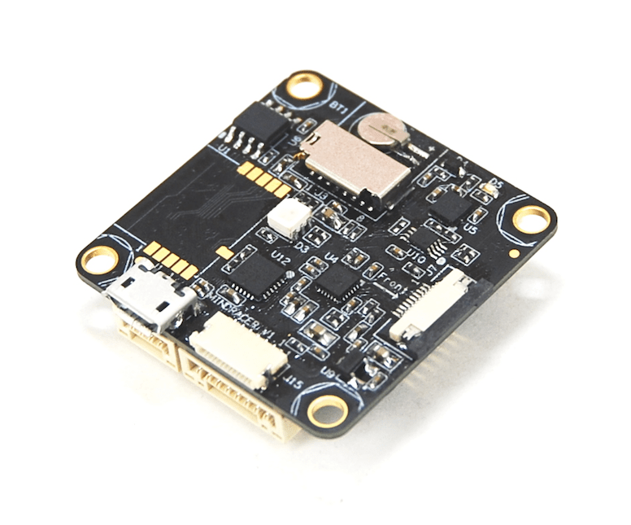
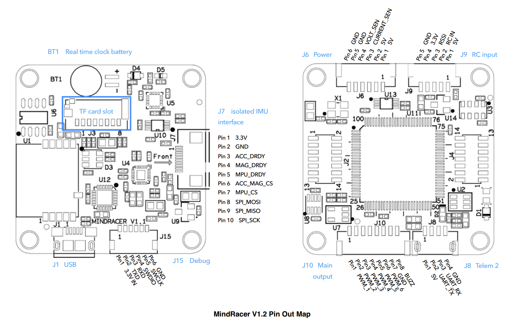
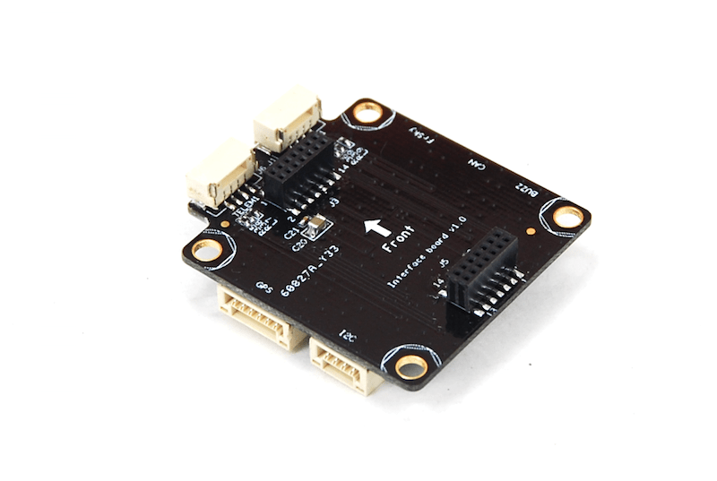

# MindRacer Hardware

:::warning
PX4 does not manufacture this (or any) autopilot.
Contact the [manufacturer](http://mindpx.net) for hardware support or compliance issues.
:::

The AirMind<sup>&reg;</sup> [MindRacer](http://mindpx.net) series is a fully stackable flight _platform_ for miniature UAVs.
The platform currently has two RTF vehicles: [MindRacer 210](../complete_vehicles_mc/mindracer210.md) and [NanoMind 110](../complete_vehicles_mc/nanomind110.md).



::: info
This flight controller is [manufacturer supported](../flight_controller/autopilot_manufacturer_supported.md).
:::

## Quick Summary

MindRacer is a fully stackable flight platform for miniature UAVs.
Based on [MindPX](../flight_controller/mindpx.md), _MindRacer_ further scales down in formfactor while focused on providing modularity.
MindRacer is a _platform_ rather than a flight controller.

MindRacer implements the SEP (soldering-elimination-port) and WEP (wiring-elimination-protocol) concepts.
Before SEP and WEP, soldering and wiring are always the major pain and efficiency killer during UAV manufacturing and tuning.

::: info
The main hardware documentation is [here](http://mindpx.net/assets/accessories/mindracer_spec_v1.2.pdf).
:::

- Ultra mini size, weight ~6g
- High performance STM32F427 168MHz floating point processor, super fast throttle response
- Support OneShot ESC
- Support PPM/SBUS/DSM radio receivers, support D.Port/S.Port/Wifi telemetry
- On board flight data recorder
- Support IMU isolation
- DroneCode<sup>&reg;</sup> standard compliance connector

|                    Item                    |                      Description                      |
| :----------------------------------------: | :---------------------------------------------------: |
|        Flight controller/Processor         |                       F427VIT6                        |
|                   Weight                   |                          ~6g                          |
|                 Dimension                  |                        35x35mm                        |
|                PWM Outputs                 |                       maximum 6                       |
|                    IMU                     |                         10DOF                         |
|               IMU isolation                |                     YES/Optional                      |
|               Radio Receiver               |             S.BUS/PPM/DSM/DSM2/DSMX/SUMD              |
|                 Telemetry                  | FrSky<sup>&reg;</sup> D.Port, S.Port, Wifi, 3DR radio |
| On board TF card for flight data recording |                          YES                          |
|            OneShot ESC Support             |                          YES                          |
|              Expansion Slots               |                      2x7(pin)x2                       |
|          On board Real time clock          |                          YES                          |
|                 Connector                  |      JST GH(compliance with DroneCode standard)       |

## Quick Start

### Pin-out Map



### How to Build

:::tip
Most users will not need to build this firmware!
It is pre-built and automatically installed by _QGroundControl_ when appropriate hardware is connected.
:::

To [build PX4](../dev_setup/building_px4.md) for this target:

```
make airmind_mindpx-v2_default
```

### Companion PC Connection

MindRacer has an attached Adapt IO board.



MindRacer has a built-in UART-to-USB converter.
To connect a companion computer, stack MindRacer on an interface board, and connect the companion computer to the USB port on the interface board.

And the max BAUD rate is the same with px4 family, which is up to 921600.

### User Guide

::: info
The user guide is [here](http://mindpx.net/assets/accessories/mindracer_user_guide_v1.2.pdf)
:::

## Where to Buy

MindRacer is available at [AirMind Store](http://drupal.xitronet.com/?q=catalog).
You can also find MindRacer at Amazon<sup>&reg;</sup> or eBay<sup>&reg;</sup>.

## Support

Please visit http://www.mindpx.org for more information.
Or you can send email to [support@mindpx.net](mailto::support@mindpx.net) for any inquiries or help.
