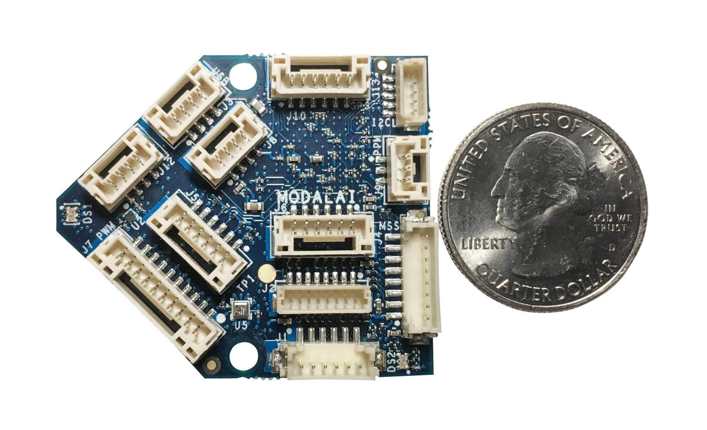
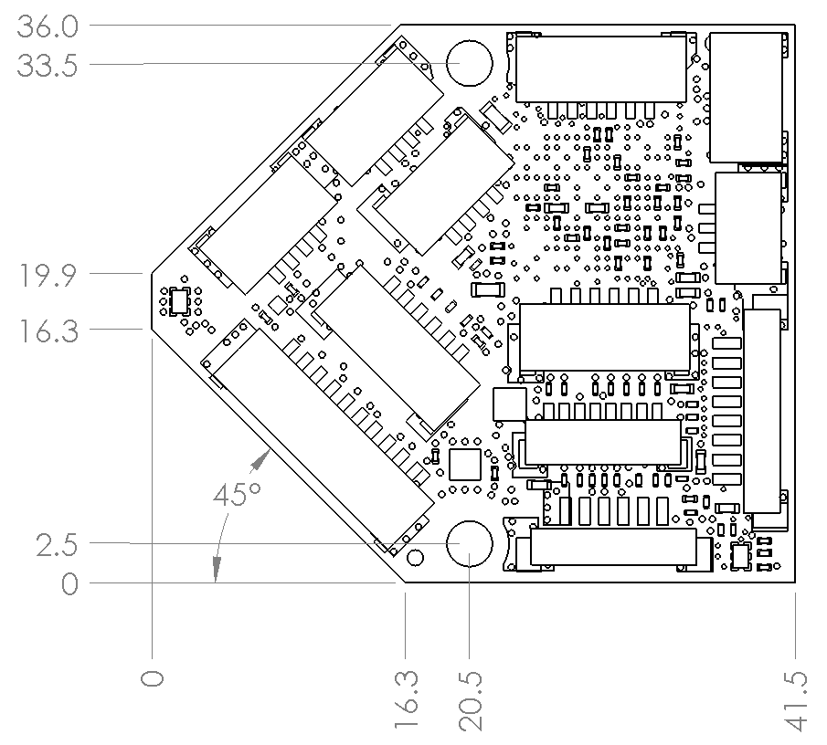
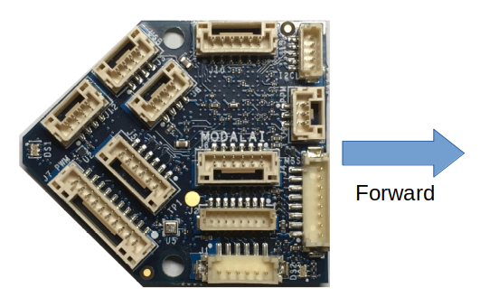
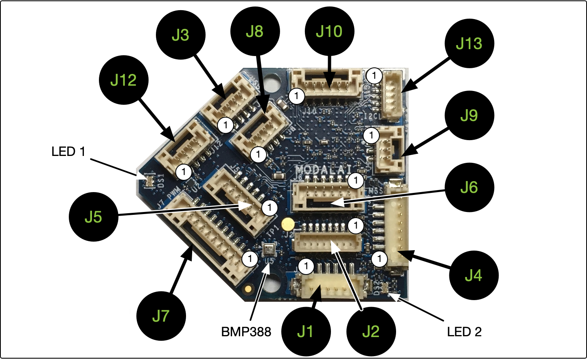
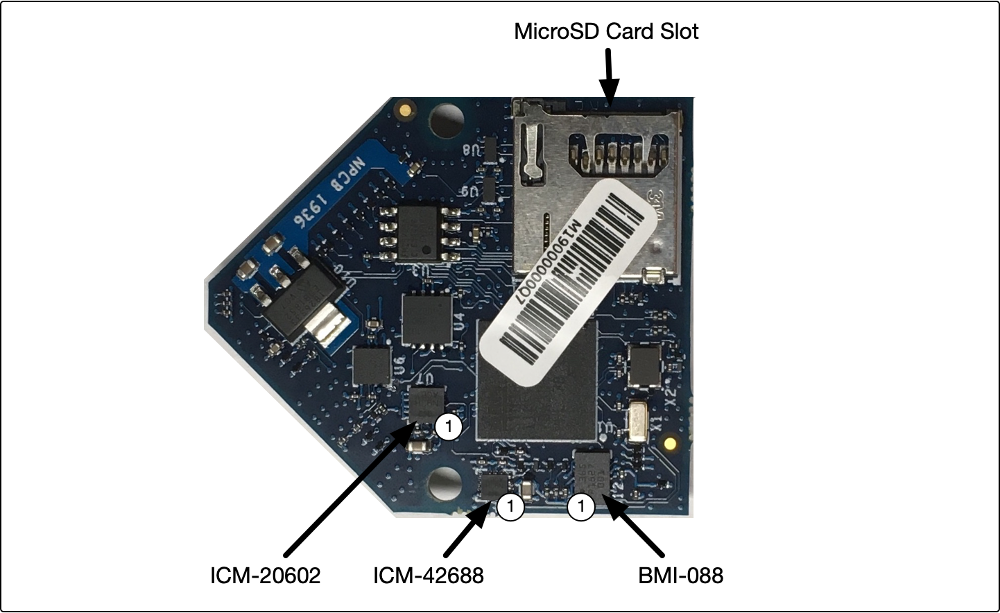

# ModalAI Flight Core v1

<Badge type="tip" text="PX4 v1.11" />

:::warning
PX4 does not manufacture this (or any) autopilot.
Contact the [manufacturer](https://forum.modalai.com/) for hardware support or compliance issues.
:::

The ModalAI [Flight Core v1](https://modalai.com/flight-core) ([Datasheet](https://docs.modalai.com/flight-core-datasheet)) is a flight controller for PX4, made in the USA.
The Flight Core can be paired with ModalAI [VOXL](https://modalai.com/voxl) ([Datasheet](https://docs.modalai.com/voxl-datasheet/)) for obstacle avoidance and GPS-denied navigation, or used independently as a standalone flight controller.



Flight Core is identical to the PX4 Flight Controller portion of [VOXL Flight](https://www.modalai.com/voxl-flight) ([Datasheet](https://docs.modalai.com/voxl-flight-datasheet/)) which integrates the VOXL Companion Computer and Flight Core into a single PCB.

::: info
This flight controller is [manufacturer supported](../flight_controller/autopilot_manufacturer_supported.md).
:::

## Specification

| Feature          | Details                                                          |
| :--------------- | :--------------------------------------------------------------- |
| Weight           | 6 g                                                              |
| MCU              | 216MHz, 32-bit ARM M7 [STM32F765II][stm32f765ii]                 |
| Memory           | 256Kb FRAM                                                       |
|                  | 2Mbit Flash                                                      |
|                  | 512Kbit SRAM                                                     |
| Firmware         | [PX4][px4]                                                       |
| IMUs             | [ICM-20602][icm-20602] (SPI1)                                    |
|                  | ICM-42688 (SPI2)                                                 |
|                  | [BMI088][bmi088] (SPI6)                                          |
| Barometer        | [BMP388][bmp388] (I2C4)                                          |
| Secure Element   | [A71CH][a71ch] (I2C4)                                            |
| microSD Card     | [Information on supported cards](../dev_log/logging.md#sd-cards) |
| Inputs           | GPS/Mag                                                          |
|                  | Spektrum                                                         |
|                  | Telemetry                                                        |
|                  | CAN bus                                                          |
|                  | PPM                                                              |
| Outputs          | 6 LEDs (2xRGB)                                                   |
|                  | 8 PWM Channels                                                   |
| Extra Interfaces | 3 serial ports                                                   |
|                  | I2C                                                              |
|                  | GPIO                                                             |

::: info
More detailed hardware documentation can be found [here](https://docs.modalai.com/flight-core-datasheet/).
:::

<!-- reference links for table above (improve layout) -->
[stm32f765ii]: https://www.st.com/en/microcontrollers-microprocessors/stm32f765ii.html
[bmp388]: https://www.bosch-sensortec.com/products/environmental-sensors/pressure-sensors/bmp388/
[icm-20602]: https://www.invensense.com/products/motion-tracking/6-axis/icm-20602/
[bmi088]: https://www.bosch-sensortec.com/bst/products/all_products/bmi088_1
[px4]: https://github.com/PX4/PX4-Autopilot/tree/main/boards/modalai/fc-v1
[a71ch]: https://www.nxp.com/products/security-and-authentication/authentication/plug-and-trust-the-fast-easy-way-to-deploy-secure-iot-connections:A71CH

## Dimensions



## PX4 Firmware Compatibility

_Flight Core v1_ is fully compatible with the official PX4 Firmware from PX4 v1.11.

ModalAI maintains a [branched PX4 version](https://github.com/modalai/px4-firmware/tree/modalai-1.11) for PX4 v1.11.
This includes UART ESC support and improvements in VIO and VOA that are planned to be upstreamed.

More information about the firmware can be found [here](https://docs.modalai.com/flight-core-firmware/).

## QGroundControl Support

This board supported in QGroundControl 4.0 and later.

## Availability

- [Flight Core Complete Kit](https://modalai.com/flight-core)
- [Flight Core integrated with VOXL Companion Computer on a single PCB](https://modalai.com/flight-core)
- [Flight Core integrated with VOXL Companion Computer and Obstacle Avoidance Cameras (VOXL Flight Deck)](https://modalai.com/flight-deck) ([Datasheet](https://docs.modalai.com/voxl-flight-deck-platform-datasheet/))
- [Flight Core assembled with VOXL and cameras](https://shop.modalai.com/products/voxl-flight-deck-r1)

## Quick Start

### Orientation

The diagram below shows the recommended orientation, which corresponds to `ROTATION_NONE` starting with PX4 v1.11.



### Connectors

Detailed information about the pinouts can be found [here](https://docs.modalai.com/flight-core-datasheet-connectors).



| Connector | Summary                                                    |
| --------- | ---------------------------------------------------------- |
| J1        | VOXL Communications Interface Connector (TELEM2)           |
| J2        | Programming and Debug Connector                            |
| J3        | USB Connector                                              |
| J4        | UART2, UART ESC (TELEM3)                                   |
| J5        | Telemetry Connector (TELEM1)                               |
| J6        | VOXL-Power Management Input / Expansion                    |
| J7        | 8-Channel PWM Output Connector                             |
| J8        | CAN Bus Connector                                          |
| J9        | PPM RC In                                                  |
| J10       | External GPS & Magnetometer Connector                      |
| J12       | RC input, Spektrum/SBus/UART Connector                     |
| J13       | I2C Display (Spare Sensor Connector) / Safety Button Input |



### User Guide

The full user guide is available [here](https://docs.modalai.com/flight-core-manual/).

### How to Build

To [build PX4](../dev_setup/building_px4.md) for this target:

```
make modalai_fc-v1
```

## Serial Port Mapping

| UART   | Device     | Port                                     |
| ------ | ---------- | ---------------------------------------- |
| USART1 | /dev/ttyS0 | GPS1 (J10)                               |
| USART2 | /dev/ttyS1 | TELEM3 (J4)                              |
| USART3 | /dev/ttyS2 | Debug Console (J2)                       |
| UART4  | /dev/ttyS3 | Expansion UART (J6)                      |
| UART5  | /dev/ttyS4 | TELEM2, Primary VOXL Communications (J1) |
| USART6 | /dev/ttyS5 | RC (J12)                                 |
| UART7  | /dev/ttyS6 | TELEM1 (J5)                              |
| UART8  | /dev/ttyS7 | N/A                                      |

<!-- Note: Got ports using https://github.com/PX4/PX4-user_guide/pull/672#issuecomment-598198434 -->

## Support

Please visit the [ModalAI Forum](https://forum.modalai.com/category/10/flight-core) for more information.
