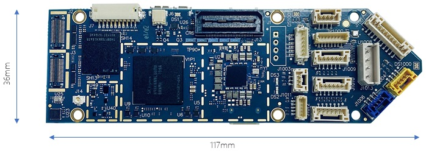

# ModalAI VOXL Flight

<Badge type="tip" text="PX4 v1.11" />

:::warning
PX4 does not manufacture this (or any) autopilot.
Contact the [manufacturer](https://forum.modalai.com/) for hardware support or compliance issues.
:::

The ModalAI [VOXL Flight](https://modalai.com/voxl-flight) ([Datasheet](https://docs.modalai.com/voxl-flight-datasheet)) is one of the first computing platforms to combine the power and sophistication of Snapdragon with the flexibility and ease of use of PX4 on an STM32F7.
Made in the USA, VOXL Flight supports obstacle avoidance and GPS-denied (indoor) navigation fused with a PX4 flight controller on a single PCB.


::: info
This flight controller is [manufacturer supported](../flight_controller/autopilot_manufacturer_supported.md).
:::

## Specifications

### System

| Feature | Details |
| :------ | :------ |
| Weight  | 26 g    |

### Companion Computer

| Feature               | Details                                                                                                                                                                                                                                                            |
| :-------------------- | :----------------------------------------------------------------------------------------------------------------------------------------------------------------------------------------------------------------------------------------------------------------- |
| Base Operation System | Linux Yocto Jethro with 3.18 kernel. Additional Linux Operating Systems can be used by running Docker on VOXL, details [here](https://docs.modalai.com/docker-on-voxl/)                                                                                            |
| Compute               | Qualcomm Snapdragon 821 w/ 4GB LPDDR4 1866MHz, Snapdragon 821 [Datasheet](https://developer.qualcomm.com/download/sd820e/qualcomm-snapdragon-820e-processor-apq8096sge-device-specification.pdf), [Docs](https://developer.qualcomm.com/hardware/apq-8096sg/tools) |
| CPU                   | Quad-core CPU up to 2.15GHz                                                                                                                                                                                                                                        |
| GPU                   | Adreno 530 GPU at 624MHz                                                                                                                                                                                                                                           |
| Compute DSP           | Hexagon compute DSP (cDSP) 825MHz                                                                                                                                                                                                                                  |
| Sensor DSP            | Hexagon sensor DSP (sDSP) 700MHz                                                                                                                                                                                                                                   |
| Video                 | 4k30 Video Capture h.264/5 w/ 720p FPV                                                                                                                                                                                                                             |
| Camera Interfaces     | Support for MIPI-CSI2, USB UVC, HDMI                                                                                                                                                                                                                               |
| Wi-Fi                 | Pre-certified Wi-Fi module [QCNFA324 FCC ID:PPD-QCNFA324](https://fccid.io/PPD-QCNFA324), QCA6174A modem, 802.11ac 2x2 Dual-band, Bluetooth 4.2 (dual-mode)                                                                                                        |
| 4G LTE                | [Optional add-on module](https://www.modalai.com/collections/voxl-add-ons/products/voxl-lte)                                                                                                                                                                       |
| Microhard pDDL        | [Optional add-on module](https://www.modalai.com/collections/voxl-add-ons/products/voxl-microhard-modem-usb-hub)                                                                                                                                                   |
| GNSS                  | WGR7640 10Hz                                                                                                                                                                                                                                                       |
| I/O                   | 1x USB3.0 OTG (ADB port), 1x USB2.0 (expansion port), 2x UART, 3x I2C, additional GPIO and SPI can be configured                                                                                                                                                   |
| Storage               | 32GB (UFS 2.0), Micro SD Card                                                                                                                                                                                                                                      |
| Software              | Docker, OpenCV 2.4.11, 3.4.6, 4.2, ROS Indigo, Qualcomm Machine Vision SDK, see [GitLab](https://gitlab.com/voxl-public) for lots of open source examples!                                                                                                         |
| IMUs                  | ICM-42688 (SPI10), ICM-20948 (SPI1)                                                                                                                                                                                                                                |
| Barometer             | BMP280                                                                                                                                                                                                                                                             |

### Flight Controller

| Feature          | Details                                                          |
| :--------------- | :--------------------------------------------------------------- |
| MCU              | 216MHz, 32-bit ARM M7 [STM32F765II][stm32f765ii]                 |
| Memory           | 256Kb FRAM                                                       |
|                  | 2Mbit Flash                                                      |
|                  | 512Kbit SRAM                                                     |
| Firmware         | [PX4][px4]                                                       |
| IMUs             | [ICM-20602][icm-20602] (SPI1)                                    |
|                  | ICM-42688 (SPI2)                                                 |
|                  | [BMI088][bmi088] (SPI6)                                          |
| Barometer        | [BMP388][bmp388] (I2C4)                                          |
| Secure Element   | [A71CH][a71ch] (I2C4)                                            |
| microSD Card     | [Information on supported cards](../dev_log/logging.md#sd-cards) |
| Inputs           | GPS/Mag                                                          |
|                  | Spektrum                                                         |
|                  | Telemetry                                                        |
|                  | CAN bus                                                          |
|                  | PPM                                                              |
| Outputs          | 6 LEDs (2xRGB)                                                   |
|                  | 8 PWM Channels                                                   |
| Extra Interfaces | 3 serial ports                                                   |
|                  | I2C                                                              |
|                  | GPIO                                                             |

<!-- reference links for above table (improve layout) -->

[stm32f765ii]: https://www.st.com/en/microcontrollers-microprocessors/stm32f765ii.html
[px4]: https://github.com/PX4/PX4-Autopilot/tree/main/boards/modalai/fc-v1
[icm-20602]: https://www.invensense.com/products/motion-tracking/6-axis/icm-20602/
[bmi088]: https://www.bosch-sensortec.com/bst/products/all_products/bmi088_1
[bmp388]: https://www.bosch-sensortec.com/products/environmental-sensors/pressure-sensors/bmp388/
[a71ch]: https://www.nxp.com/products/security-and-authentication/authentication/plug-and-trust-the-fast-easy-way-to-deploy-secure-iot-connections:A71CH

::: info
More detailed hardware documentation can be found [here](https://docs.modalai.com/voxl-flight-datasheet/).
:::

## Dimensions



[3D STEP File](https://storage.googleapis.com/modalai_public/modal_drawings/M0019_VOXL-Flight.zip)

## PX4 Firmware Compatibility

_VOXL Flight_ is fully compatible with the official PX4 Firmware from PX4 v1.11.

ModalAI maintains a [branched PX4 version](https://github.com/modalai/px4-firmware/tree/modalai-1.11) for PX4 v1.11.
This includes UART ESC support and improvements in VIO and VOA that are planned to be upstreamed.

More information about the firmware can be found [here](https://docs.modalai.com/flight-core-firmware/).

## QGroundControl Support

This board supported in QGroundControl 4.0 and later.

## Availability

- [VOXL Flight Complete Kit](https://modalai.com/voxl-flight)
- [VOXL Flight Board](https://www.modalai.com/products/voxl-flight?variant=31707275362355) (only)
- [VOXL Flight integrated with Obstacle Avoidance Cameras (VOXL Flight Deck)](https://modalai.com/flight-deck) ([Datasheet](https://docs.modalai.com/voxl-flight-deck-platform-datasheet/))
- [VOXL Flight in a ready to fly VOXL m500 Development Drone](https://www.modalai.com/collections/development-drones/products/voxl-m500) ([Datasheet](https://docs.modalai.com/voxl-m500-reference-drone-datasheet/))

## Quick Start

A quickstart from the vendor is located [here](https://docs.modalai.com/voxl-flight-quickstart/).

### voxl-vision-px4

The VOXL Flight runs [voxl-vision-px4](https://gitlab.com/voxl-public/modal-pipe-architecture/voxl-vision-px4) on the companion computer portion of the hardware serving as a sort of MAVLink proxy.
For details, the source code is available [here](https://gitlab.com/voxl-public/modal-pipe-architecture/voxl-vision-px4)

### Connectors

Detailed information about the pinouts can be found [here](https://docs.modalai.com/voxl-flight-datasheet-connectors/).

#### Top


_Note: 1000 Series connectors accessible from the STM32/PX4_

| Connector | Summary                                | Used By                           |
| --------- | -------------------------------------- | --------------------------------- |
| J2        | Hires 4k Image Sensor (CSI0)           | Snapdragon - Linux                |
| J3        | Stereo Image Sensor (CSI1)             | Snapdragon - Linux                |
| J6        | Cooling Fan Connector                  | Snapdragon - Linux                |
| J7        | BLSP6 (GPIO) and BLSP9 (UART)          | Snapdragon - Linux                |
| J13       | Expansion B2B                          | Snapdragon - Linux                |
| J14       | Integrated GNSS Antenna Connection     | Snapdragon - Linux                |
| J1001     | Programming and Debug/UART3            | STM32 - PX4                       |
| J1002     | UART ESC, UART2/TELEM3                 | STM32 - PX4                       |
| J1003     | PPM RC In                              | STM32 - PX4                       |
| J1004     | RC Input, Spektrum/SBus/UART6          | STM32 - PX4                       |
| J1006     | USB 2.0 Connector (PX4/QGroundControl) | STM32 - PX4                       |
| J1007     | 8-Channel PWM/DShot Output             | STM32 - PX4                       |
| J1008     | CAN Bus                                | STM32 - PX4                       |
| J1009     | I2C3, UART4                            | STM32 - PX4                       |
| J1010     | Telemetry (TELEM1)                     | STM32 - PX4                       |
| J1011     | I2C2, Safety Button Input              | STM32 - PX4                       |
| J1012     | External GPS & Mag, UART1, I2C1        | STM32 - PX4                       |
| J1013     | Power Input, I2C3                      | STM32 - PX4 (powers whole system) |

#### Bottom


_Note: 1000 Series connectors accessible from the STM32/PX4_

| Connector      | Summary                                 | Used By                     |
| -------------- | --------------------------------------- | --------------------------- |
| J4             | Tracking/Optic Flow Image Sensor (CSI2) | Snapdragon - Linux          |
| J8             | USB 3.0 OTG                             | Snapdragon - Linux, **adb** |
| J10            | BLSP7 UART and I2C off-board            | Snapdragon - Linux          |
| J11            | BLSP12 UART and I2C off-board           | Snapdragon - Linux          |
| VOXL microSD   |                                         | Snapdragon - Linux          |
| PX4 microSD    | 32Gb Max                                | STM32 - PX4                 |
| Wi-Fi Antennas | Included                                | Snapdragon - Linux          |

### User Guide

The full user guide is available [here](https://docs.modalai.com/voxl-flight-quickstart).

### How to Build

To [build PX4](../dev_setup/building_px4.md) for this target:

```
make modalai_fc-v1
```

## Serial Port Mapping

_Note: mappings shown are for the PX4 controlled interfaces only_

| UART   | Device     | Port                                    |
| ------ | ---------- | --------------------------------------- |
| USART1 | /dev/ttyS0 | GPS1 (J1012)                            |
| USART2 | /dev/ttyS1 | TELEM3 (J1002)                          |
| USART3 | /dev/ttyS2 | Debug Console (J1001)                   |
| UART4  | /dev/ttyS3 | Expansion UART (J6)                     |
| UART5  | /dev/ttyS4 | UART between PX4 and Companion Computer |
| USART6 | /dev/ttyS5 | RC (J1004)                              |
| UART7  | /dev/ttyS6 | TELEM1 (J1010)                          |
| UART8  | /dev/ttyS7 | N/A                                     |

<!-- Note: Got ports using https://github.com/PX4/PX4-user_guide/pull/672#issuecomment-598198434 -->

## Support

Please visit the [ModalAI Forum](https://forum.modalai.com/category/8/voxl-flight) for more information.
