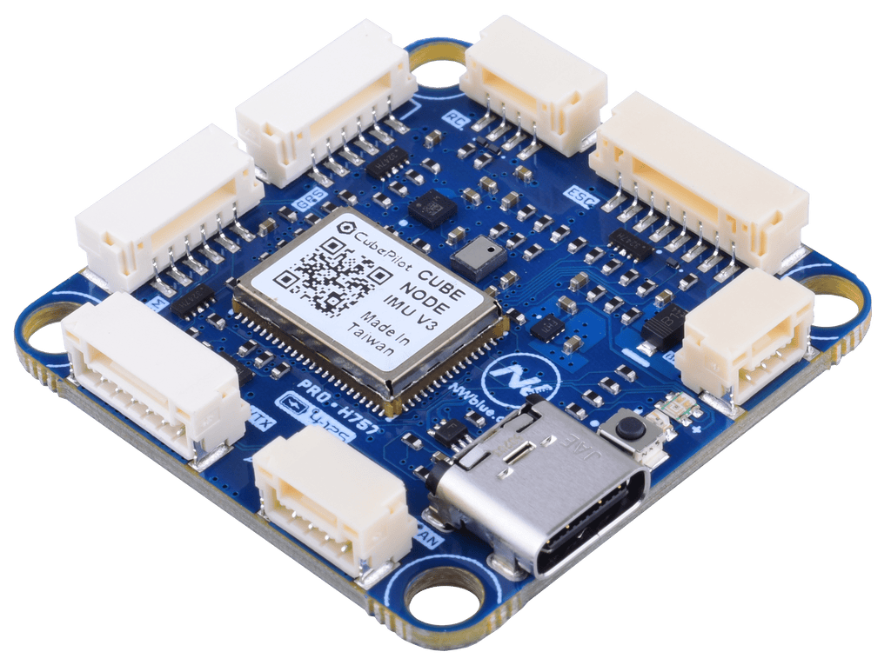

# NWBlue Pro H757

<Badge type="tip" text="PX4 v1.18" />

:::warning
PX4 does not manufacture this (or any) autopilot. Contact the manufacturer for hardware support or compliance issues.
:::

The _NWBlue Pro H757_ is a 36 x 36 mm FPV flight controller built around a [CubePilot CubeNode H757](https://docs.cubepilot.org/user-guides/cubenode/pin-descriptions) module carrying an STM32H757 microcontroller.



::: info
This flight controller is [manufacturer supported](../flight_controller/autopilot_manufacturer_supported.md).
:::

## Where to Buy {#store}

Order from [NWBlue](https://nwblue.com/products/pro-h757-fpv-flight-controller) (US).

## Specifications {#specifications}

- **Processor**
  - **Main FMU processor:** STM32H757 (32-bit Arm® Cortex®-M7 at 480 MHz, 2 MB Flash, 1 MB RAM), on a CubePilot CubeNode module
- **Sensors**
  - **IMU:** [InvenSense ICM-45686](https://invensense.tdk.com/products/motion-tracking/6-axis/icm-45686/) (SPI3, inside the CubeNode module)
  - **Barometer:** [Infineon DPS368](https://www.infineon.com/part/DPS368) (SPI3)
  - **Magnetometer:** [ST IIS2MDC](https://www.st.com/en/mems-and-sensors/iis2mdc.html) (I2C3, internal)
- **Interfaces**
  - **PWM outputs:** 9, [DShot](../peripherals/dshot.md) and [Bidirectional DShot](../peripherals/dshot.md#bidirectional-dshot-telemetry) capable
  - **Serial ports:** 6 (`TELEM1`, `TELEM2`, `TELEM3`, `GPS1`, `RC`, and a spare receive-only port on the VTX connector)
  - **I2C buses:** 1 external (on the `GPS` connector, for an external compass) and 1 internal (magnetometer)
  - **CAN buses:** 1 ([DroneCAN](../dronecan/index.md))
  - **USB:** USB-C
  - **RC input:** Yes, on a dedicated `RC` connector
  - **SD card:** MicroSD slot (SDMMC2)
  - **Other:** buzzer output (external components required), RGB status LED, SWD
- **Electrical data**
  - **Input voltage:** 4S to 12S LiPo on the `ESC` connector (`VBAT`)
  - **5 V output:** 3.5 A, current limited, shared by the `RC`, `GPS`, `TELEM` and `CAN` connectors
  - **10 V / 12 V output:** 3.5 A, on the `VTX` and `Power Out` connectors
  - **Power monitoring:** battery voltage through an onboard 21:1 divider; battery current from an external current sensor wired to the `ESC` connector
- **Mechanical data**
  - **Dimensions:** 36 x 36 x 18 mm (including connectors)
  - **Mounting pattern:** 30.5 x 30.5 mm
  <!-- TODO: weight, not published by the manufacturer -->

## Manufacturer Documentation

Connector pinouts, wiring diagrams and mechanical drawings are in the [NWBlue Pro H757 documentation](https://docs.nwblue.com/nw-blue/products/autopilots/proh757/overview).
3D models are available on the [3D Models](https://docs.nwblue.com/nw-blue/products/autopilots/proh757/3d-models) page.

## Building Firmware

::: tip
Most users will not need to build this firmware.
It is pre-built and automatically installed by _QGroundControl_ when appropriate hardware is connected.
:::

To [build PX4](../dev_setup/building_px4.md) for this target from source:

```sh
make nwblue_pro-h757_default
```

## Radio Control {#radio_control}

A remote control (RC) radio system is required if you want to _manually_ control your vehicle (PX4 does not require a radio system for autonomous flight modes).

You will need to [select a compatible transmitter/receiver](../getting_started/rc_transmitter_receiver.md) and then _bind_ them so that they communicate (read the instructions that come with your specific transmitter/receiver).

<!-- RC is wired directly to the FMU (UART4, /dev/ttyS2). There is no IO board. -->

The `RC` connector is wired directly to the FMU (UART4) and powered from the 5 V rail.
PX4 autodetects receivers on this port that use S.BUS, S.BUS2, Spektrum DSM / DSM2 / DSM-X, Yuneec ST24, Graupner SUMD, CRSF, or GHST.
PPM is not supported: the RC pins have no capture channel on the timer that PX4 uses for PPM decoding.

Both TX and RX are broken out, so CRSF and GHST telemetry back to the transmitter works over the same cable.

## GPS & Compass {#gps_compass}

The `GPS` connector carries `GPS1` (UART8) together with the external I2C bus for a compass.
The module should be [mounted on the frame](../assembly/mount_gps_compass.md) as far away from other electronics as possible, with the direction marker pointing towards the front of the vehicle.

## Pinout

The full pinout with connector locations is on the [manufacturer's pinout page](https://docs.nwblue.com/nw-blue/products/autopilots/proh757/pinout).

### ESC

| Pin | Signal                    |
| --- | ------------------------- |
| 1   | VBAT in (4S to 12S)       |
| 2   | GND                       |
| 3   | Current sense             |
| 4   | ESC telemetry (USART1 RX) |
| 5   | Output 1                  |
| 6   | Output 2                  |
| 7   | Output 3                  |
| 8   | Output 4                  |

### PWM AUX

| Pin | Signal   |
| --- | -------- |
| 1   | Output 5 |
| 2   | Output 6 |
| 3   | Output 7 |
| 4   | Output 8 |
| 5   | Output 9 |
| 6   | GND      |

### RC (UART4)

| Pin | Signal |
| --- | ------ |
| 1   | 5V     |
| 2   | TX     |
| 3   | RX     |
| 4   | GND    |

### GPS (UART8)

| Pin | Signal |
| --- | ------ |
| 1   | 5V     |
| 2   | TX     |
| 3   | RX     |
| 4   | SCL    |
| 5   | SDA    |
| 6   | GND    |

### TELEM1 (UART7)

| Pin | Signal |
| --- | ------ |
| 1   | 5V     |
| 2   | TX     |
| 3   | RX     |
| 4   | NC     |
| 5   | NC     |
| 6   | GND    |

### VTX (USART6)

| Pin | Signal      |
| --- | ----------- |
| 1   | 10V / 12V   |
| 2   | GND         |
| 3   | TX (USART6) |
| 4   | RX (USART6) |
| 5   | RX (USART2) |
| 6   | GND         |

### CAN

| Pin | Signal |
| --- | ------ |
| 1   | 5V     |
| 2   | CAN_H  |
| 3   | CAN_L  |
| 4   | GND    |

### Power Out

| Pin | Signal    |
| --- | --------- |
| 1   | VBAT out  |
| 2   | GND       |
| 3   | 10V / 12V |

### SWD

| Pin | Signal |
| --- | ------ |
| 1   | 3.3V   |
| 2   | SWDIO  |
| 3   | SWCLK  |
| 4   | GND    |

## Serial Port Mapping

| UART   | Device     | PX4 Default | Connector | Pins (TX / RX) |
| ------ | ---------- | ----------- | --------- | -------------- |
| USART1 | /dev/ttyS0 | TEL3        | ESC       | — / PB7        |
| USART2 | /dev/ttyS1 | —           | VTX       | — / PA3        |
| UART4  | /dev/ttyS2 | RC          | RC        | PA0 / PB8      |
| USART6 | /dev/ttyS3 | TEL2        | VTX       | PC6 / PC7      |
| UART7  | /dev/ttyS4 | TEL1        | TELEM1    | PE8 / PE7      |
| UART8  | /dev/ttyS5 | GPS1        | GPS       | PE1 / PE0      |

No port has flow control.
USART1 and USART2 are receive-only: only the RX pin is broken out.

TEL3 is the ESC telemetry input and is configured for it by default ([DSHOT_TEL_CFG](../advanced_config/parameter_reference.md#DSHOT_TEL_CFG) = `103`).

## PWM Outputs

The board provides 9 PWM outputs, all of which support [DShot](../peripherals/dshot.md).
Outputs 1 to 4 are on the `ESC` connector, outputs 5 to 9 on the `PWM AUX` connector.

The outputs are split across 4 timer groups:

| Outputs    | Timer  |
| ---------- | ------ |
| 1, 2, 3, 4 | Timer1 |
| 5, 6       | Timer4 |
| 7, 8       | Timer3 |
| 9          | Timer2 |

All outputs within the same group must use the same protocol and update rate.

[Bidirectional DShot](../peripherals/dshot.md#bidirectional-dshot-telemetry) works on every output except output 6.
That output is TIM4_CH4, and the STM32H7 DMAMUX has no request line for it, so the capture DMA needed for the ESC response cannot be set up.
Use output 6 for plain DShot or PWM.

## OSD

There is no analog OSD chip on this board, so analog video cannot be overlaid.
An HD VTX can render the OSD itself over MSP DisplayPort: connect it to the VTX connector (USART6, TEL2) and set [MSP_OSD_CONFIG](../advanced_config/parameter_reference.md#MSP_OSD_CONFIG) to `102`.
See [OSD](../peripherals/osd.md) for details.

The port is not claimed by default, so it can be used for MAVLink or any other protocol instead.

## Battery Monitoring

The board is powered from the `ESC` connector.
The voltage divider is set by default ([BAT1_V_DIV](../advanced_config/parameter_reference.md#BAT1_V_DIV) = `21.0`).

Current sensing is fed from the ESC connector, so [BAT1_A_PER_V](../advanced_config/parameter_reference.md#BAT1_A_PER_V) depends on the current sensor in use and has to be [calibrated](../config/battery.md).

## Debug Port

There is no dedicated debug UART.
The system console and MAVLink both run over USB.
SWD is broken out for use with a debugger.

<a id="bootloader"></a>

## PX4 Bootloader Update

Boards that ship without the PX4 bootloader must have it flashed before PX4 firmware can be installed.
Download the [nwblue_pro-h757_bootloader.bin](https://github.com/PX4/PX4-Autopilot/blob/main/boards/nwblue/pro-h757/extras/nwblue_pro-h757_bootloader.bin) bootloader binary and follow the [DFU Bootloader Update](../advanced_config/bootloader_update_from_betaflight.md#dfu-bootloader-update) instructions.

Once the PX4 bootloader is flashed, firmware can be installed normally via _QGroundControl_.
