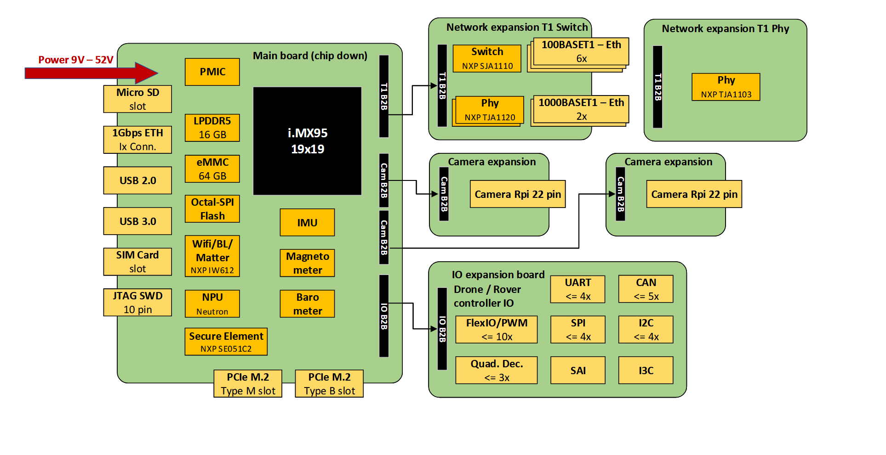
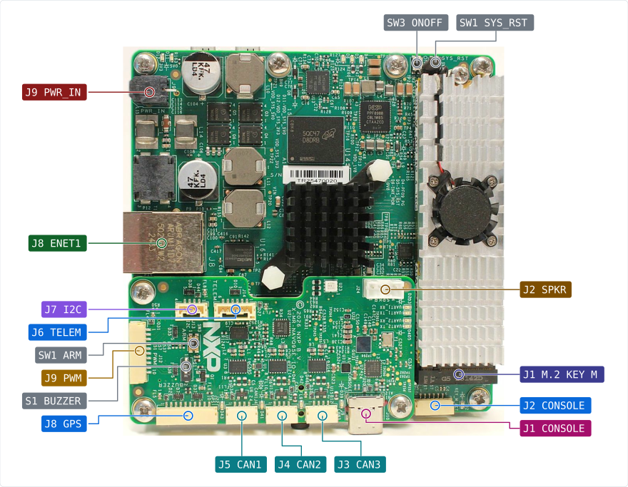
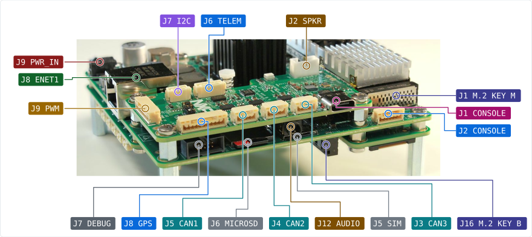
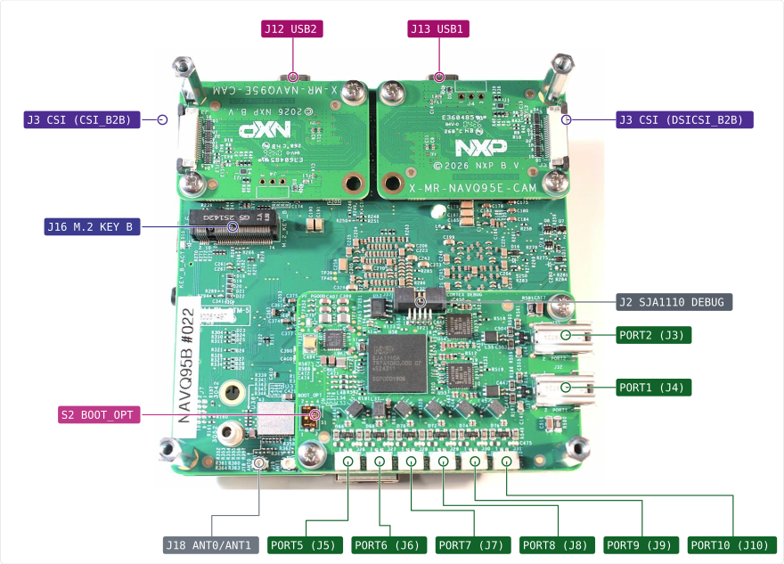

# NXP MR-NavQ95

<Badge type="tip" text="PX4 main" />

::: warning
PX4 does not manufacture this (or any) autopilot.
Contact the [manufacturer](https://www.nxp.com) for hardware support (https://community.nxp.com/) or compliance issues.
:::

The _MR-NavQ95_ is a vehicle computer reference design designed around the NXP i.MX95 developed by NXP Mobile Robotics.
Linux runs on the Cortex-A55 cores, and PX4 runs on the Cortex-M7 real-time core, started by MCUboot from the on-board NOR flash.
The two sides talk over RPMsg: PX4 keeps its parameters, dataman and logs on a filesystem served by Linux, and exposes its shell and a MAVLink link as virtual ttys on the Linux side.



Because the i.MX 95 is an applications processor, the Linux side is a full companion computer rather than just a storage and telemetry bridge.
It brings the parts of a mobile robotics stack that do not belong on a flight controller:

- Up to 6x Arm Cortex-A55 application cores running Linux, next to the Cortex-M7 real-time core used by PX4 and a Cortex-M33 for boot and system control
- eIQ Neutron NPU for on-device machine learning, for example object detection, segmentation or visual navigation, without an external accelerator
- Image Signal Processor with multiple MIPI-CSI inputs, so several cameras (for example a stereo pair plus an RGB camera) can be attached at once
- Arm Mali GPU and hardware H.264/H.265 encode and decode for video streaming and recording
- Audio subsystem (SAI, microphone array support) for voice interaction and acoustic sensing
- Networking: a gigabit RJ45 port straight off the SoC, plus an XFI interface that by default feeds an on-board NXP SJA1110 TSN switch for automotive-style multi-drop vehicle networks; the XFI lane can instead be routed to an SFP+ cage module for fibre or higher-speed copper links
- PCIe, USB and an on-board Wi-Fi/Bluetooth module for links to the ground station and to other vehicles

::: info
Only the Cortex-M7 side is PX4.
All of the above is available to the application running on Linux, which talks to PX4 over the RPMsg MAVLink link described below.
:::

::: info
This flight controller is [manufacturer supported](../flight_controller/autopilot_manufacturer_supported.md).
:::

## Key Features

- **SoC:** NXP i.MX 95, PX4 on the Arm® Cortex®-M7 core (800 MHz)
- **IMU:** TDK InvenSense ICM-45686 and Bosch BMI088, on separate SPI buses
- **Magnetometer:** Bosch BMM350
- **Barometer:** Bosch BMP581
- **Interfaces:**
  - 3x UARTs for PX4 (GPS, telemetry with flow control, RC)
  - 3x CAN FD (FlexCAN): two for PX4, DroneCAN capable, and one for Linux
  - External I2C
  - 8x PWM outputs, all [DShot](../peripherals/dshot.md) capable
  - Ethernet on the Linux side: gigabit RJ45, and an XFI interface populated with an SJA1110 TSN switch by default or with an SFP+ cage module
  - RPMsg links to Linux: shell, two MAVLink links, storage

Hardware details, schematics and the pinout of every connector are in the [MR-NAVQ95 repository](https://github.com/NXP-Robotics/MR-NAVQ95).

## Board Layout







Drawings for the individual connectors are in the [MR-NAVQ95 repository](https://github.com/NXP-Robotics/MR-NAVQ95).

## Where to Buy

See the [MR-NAVQ95 repository](https://github.com/NXP-Robotics/MR-NAVQ95) for availability.

## Serial Port Mapping

| UART    | Device     | PX4 Port                                         |
| ------- | ---------- | ------------------------------------------------ |
| LPUART2 | /dev/ttyS1 | RC (or NSH console over the IO board USB serial) |
| LPUART5 | /dev/ttyS4 | GPS1                                             |
| LPUART7 | /dev/ttyS6 | TEL1 (hardware flow control)                     |

LPUART2 is the M7 console port: it reaches the CP2105 USB serial bridge on the IO board (J1 CONSOLE, `ttyUSB1` on a Linux host) and the main board J2 CONSOLE header (pins 4 and 5).
It is the RC input by default, and the board configuration ("LPUART2" under MR-NavQ95 board options in `make nxp_mr-navq95_default boardconfig`) can run an NSH console on it instead.
An RC receiver (CRSF, ELRS, SBUS) connects to J2 CONSOLE: pin 1 is 5 V, pin 4 is UART2 RX (receiver TX), pin 5 is UART2 TX (receiver RX, only needed for bidirectional protocols such as CRSF telemetry) and pin 6 is GND.
UART2 TX is also the BT_MODE1 boot strap, so nothing may drive that line while the board resets.

::: warning
With LPUART2 used for RC, do not connect a PC to the second CP2105 port (`ttyUSB1`) of the IO board USB CONSOLE connector.
Its transmitter shares the line with the RC receiver and interferes with the RC UART.
:::

### PWM Outputs

The 8 outputs are in 4 groups:

- Outputs 1-3 in group 1 (TPM3)
- Outputs 4-5 in group 2 (TPM4)
- Outputs 6-7 in group 3 (TPM5)
- Output 8 in group 4 (TPM6)

Output 8 (GPIO_IO23, J9 pin 9) can be turned into the GPS buzzer output under "GPIO_IO23" in the board configuration, which enables the tone alarm driver.
The buzzer only sounds with switch S1 closed.

All outputs support PWM and [DShot](../peripherals/dshot.md).
Each group's protocol is set with the corresponding `PWM_MAIN_TIMx` parameter.

## Linux Side

The Linux side must run the NavQ95 BSP built from [imx-manifest-navq95](https://github.com/NXP-Robotics/imx-manifest-navq95).
It provides the RPMsg links PX4 depends on:

| Linux device     | PX4 side                  | Purpose                                                          |
| ---------------- | ------------------------- | ---------------------------------------------------------------- |
| `/dev/ttynsh`    | NSH console               | PX4 shell (the system console)                                   |
| `/dev/ttyproxy`  | `mavlink` in onboard mode | MAVLink at 921600 baud for the companion                         |
| `/dev/ttymavmin` | `mavlink` in minimal mode | Second MAVLink link at 115200 baud (flags in `rc.board_mavlink`) |
| `/dev/ttyros`    | none                      | Reserved for a future ROS/uXRCE-DDS link, unused today           |

PX4 has no local storage.
`/fs/rpmsg` on the PX4 side is an RPMsg filesystem (rpmsgfs) served by Linux, and it holds the parameters, dataman and the flight logs.

::: warning
This means PX4 depends on Linux for parameter storage: the parameters are only readable and writable once the Linux side has booted and the rpmsgfs server is running.
Keeping the parameters on the on-board octal flash instead, so the M7 is self-contained, is still work in progress (see [Current Status](#current-status)).
:::

### MAVLink and QGroundControl

There is no telemetry radio in the path by default: the MAVLink link leaves the board over the network.

The onboard-mode `mavlink` instance on PX4 shows up on Linux as `/dev/ttyproxy`.
The BSP hands that device to [mavlink-router](https://github.com/mavlink-router/mavlink-router), which runs as a service and republishes the stream on the network, so several clients can use the same link at the same time:

```
PX4 (M7)  --RPMsg-->  /dev/ttyproxy  -->  mavlink-router  -->  UDP/TCP on Wi-Fi or Ethernet
```

[QGroundControl](../getting_started/px4_basic_concepts.md#qgc) connects to that endpoint over either the on-board Wi-Fi or the Ethernet port, and on-board software (MAVSDK, ROS 2 via the uXRCE-DDS bridge, or a camera or mission application) can attach to further endpoints in parallel.
The endpoints and ports are set in the mavlink-router configuration shipped with the BSP (`/etc/mavlink-router/`); see the [NavQ95 BSP manifest](https://github.com/NXP-Robotics/imx-manifest-navq95) for the defaults and how to add your ground station IP.

::: tip
If QGroundControl does not find the vehicle, check that the RPMsg links came up on Linux (`ls /dev/ttyproxy`) and that mavlink-router is running (`systemctl status mavlink-router`) before looking at PX4.
:::

## Building Firmware

To [build PX4](../dev_setup/building_px4.md) for this target:

```sh
make nxp_mr-navq95_default
```

The build writes two images:

- `build/nxp_mr-navq95_default/nxp_mr-navq95_default.bin`, the plain binary.
- `build/nxp_mr-navq95_default/nxp_mr-navq95_default.signed.bin`, the plain binary wrapped with the MCUboot header and SHA256 trailer by `imgtool`.
  This is the image MCUboot boots from slot0.

The MCUboot header size, slot size and alignment are set in `default.px4board` (`CONFIG_BOARD_MCUBOOT_IMGTOOL_ARGS`) and match the on-board MCUboot, which is built with `CONFIG_BOOT_SIGNATURE_TYPE_NONE`.
`imgtool` is installed by the PX4 setup scripts (`Tools/setup/requirements.txt`); if it is missing, the build warns and skips the signed image.

The `ddr` label (`make nxp_mr-navq95_ddr`) runs from SDRAM and is loaded by Linux instead of MCUboot, so it has no signed image.

### Signing With a Key

The default image carries only a SHA256 and boots on an MCUboot built with `CONFIG_BOOT_SIGNATURE_TYPE_NONE`.
For an MCUboot that verifies signatures, generate a key, pass it in the environment when configuring the build, and bake the matching public key into MCUboot:

```sh
python3 -m imgtool.main keygen -k navq95-signing.pem -t ecdsa-p256
BOARD_MCUBOOT_KEY=/path/to/navq95-signing.pem make nxp_mr-navq95_default
python3 -m imgtool.main getpub -k navq95-signing.pem   # for the MCUboot build
```

The key type must match the MCUboot signature type (`ecdsa-p256`, `rsa-2048`, `rsa-3072` or `ed25519`).
The key is read when CMake configures, so changing it needs a fresh build directory.
Keep the private key out of the repository.

## Installing PX4 Firmware

::: info
MCUboot boots PX4 from slot0 reliably, but the update path is still a developer flow over SWD.
A convenient field update (image upload through Linux into slot1 and a MCUboot swap) is not in place yet; see [Current Status](#current-status).
:::

The firmware is flashed into MCUboot slot0 over SWD with pyOCD.
Mainline pyOCD has no i.MX 95 support; use the NXP-Robotics fork, branch `pr-imx95`, which adds the `mimx95_*` targets and the NOR flash algorithm:

```sh
git clone https://github.com/NXP-Robotics/pyOCD -b pr-imx95
cd pyOCD
python3 -m pip install .
```

Set the boot switches and power the board as described in the [NavQ95 manifest README](https://github.com/NXP-Robotics/imx-manifest-navq95#flash-nor-flash-image), then:

```sh
pyocd flash -e sector -a 0x28020000 -t mimx95_cm7_mx25um -f 20M \
  -O vtor=0x28020800 build/nxp_mr-navq95_default/nxp_mr-navq95_default.signed.bin
pyocd reset -t mimx95_cm33 -f 20M
```

- `-a 0x28020000` is slot0. pyOCD would otherwise default to the start of the flash region (`0x28000000`), which is MCUboot's own partition.
- `-O vtor=0x28020800` is slot0 plus the 0x800 byte header, i.e. the application vector table.
  pyOCD's CM7 reset on this SoC is a core-only restart: it writes VTOR, loads MSP/PC from that table and resumes, so the application starts directly without going through MCUboot.
- The debugger-initiated reset after flashing (`pyocd reset -t mimx95_cm33`) does not chain-load slot0: MCUboot stays in its serial-recovery loop ("Unable to find bootable image") even though the image in slot0 is valid.
  Power-cycle the board to boot PX4 from slot0.

## Debug Port

The PX4 [system console](../debug/system_console.md) is `/dev/ttynsh` on the Linux side; there is no dedicated console UART.
The M7 core is reachable over the on-board SWD/JTAG probe through pyOCD (`pyocd gdb -t mimx95_cm7_mx25um`).

## Current Status

The MR-NavQ95 is a reference design under active development, and the PX4 port is not feature complete.
Known gaps at the time of writing:

- **Firmware update.**
  MCUboot in the NOR flash boots the signed PX4 image from slot0, but the only supported way to get an image in there is SWD with pyOCD.
  There is no Linux-side updater or serial-recovery flow yet, so updating PX4 still needs a debug probe and the boot switches set for flashing.
- **Parameter and log storage.**
  Parameters, dataman and logs live on the RPMsg filesystem served by Linux.
  Moving the parameter storage to the on-board octal (NOR) flash, so that PX4 can boot and arm independently of the Linux side, is in progress.
- **Virtual Ethernet for PX4.**
  All networking is handled by Linux today; PX4 reaches the network only indirectly through the RPMsg MAVLink tty and mavlink-router.
  A VSI (virtual station interface) network driver for PX4/NuttX is in progress, which would give PX4 its own virtual Ethernet interface on the shared MAC.
  With that in place, MAVLink over UDP, [uXRCE-DDS](../middleware/uxrce_dds.md), [Zenoh-pico](../middleware/zenoh.md) and native ROS 2 publishing can run directly from the M7 instead of being proxied by Linux.
- **Reboot.**
  The `reboot` command, `MAV_CMD_PREFLIGHT_REBOOT_SHUTDOWN` and the reboot QGroundControl requests after calibration or airframe selection do not restart the M7 yet; power-cycle the board instead.
  An M7 reset through the i.MX 95 System Manager is planned.
- **Vehicle ID.**
  PX4 reports the i.MX 95 ECID (electronic chip ID) read from the fuse shadow block as its UUID.
  It is stable per chip but differs from the ELE unique ID that Linux reports.
- **PWM timing and input capture.**
  Output group 1 (TPM3) runs from a 133 MHz clock root and OneShot is not supported yet; the PWM timing code is being reworked, and PWM input capture is not available.
- **Defaults may change.**
  Port assignments, PWM groups and board defaults can still change as the design and the BSP evolve; check the board files and the BSP manifest against the version you are running.

## Further Information

- [MR-NAVQ95 hardware repository](https://github.com/NXP-Robotics/MR-NAVQ95)
- [NavQ95 Linux BSP manifest](https://github.com/NXP-Robotics/imx-manifest-navq95)
