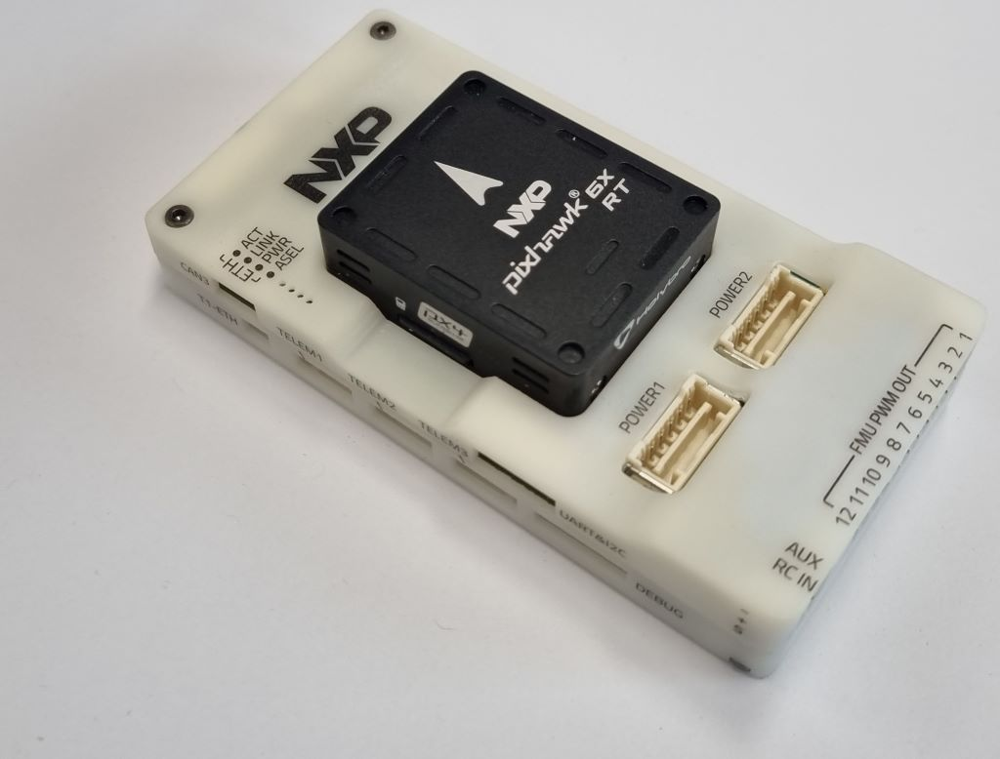
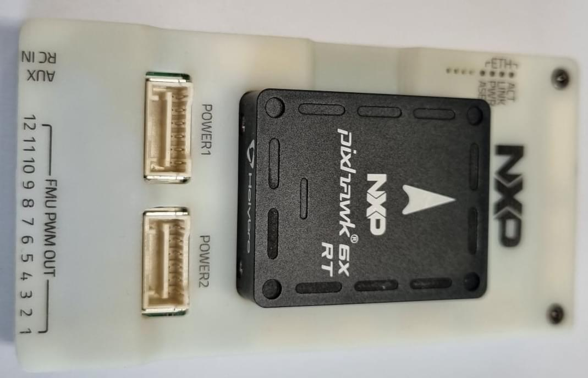
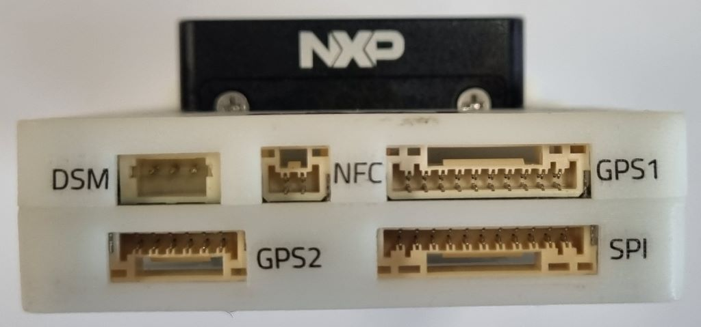
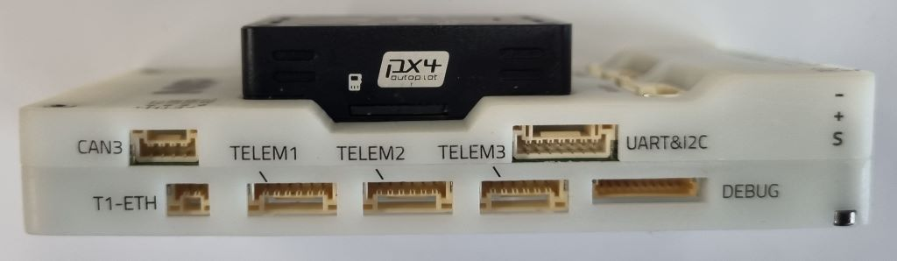
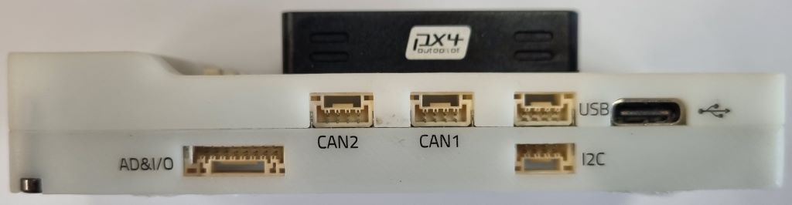

# NXP MR-VMU-RT1176 Flight Controller

<Badge type="tip" text="PX4 v1.15" />

:::warning
PX4 does not manufacture this (or any) autopilot.
Contact the [manufacturer](https://www.nxp.com) for hardware support (https://community.nxp.com/) or compliance issues.
:::

The _MR-VMU-RT1176_ reference design is based on the [Pixhawk<sup>&reg;</sup> FMUv6X-RT open standard](https://github.com/pixhawk/Pixhawk-Standards/blob/master/DS-020%20Pixhawk%20Autopilot%20v6X-RT%20Standard.pdf), the latest update to the successful family of Pixhawk<sup>&reg;</sup> flight controllers.

This is NXP's open source _reference design_ for using FMUv6X-RT, and was designed and made in collaboration with industry partners<sup>&reg;</sup>, NXP's mobile robotics team and the PX4 team.
As a reference/evaluation design, it is intended to be replicated, modified or integrated in production volume by others.
It has already gone through all FCC/CE ROHS REACH UKCA, EMI/RFI ESD certifications and is available globally
Several 3rd party manufacturers (such as Holybro.com) provide this or derivative commercial products.



The board includes the same FMU module found on Pixhawk 6X-RT paired with an NXP-based carrier board.
The carrier board offers 100Base-T1 (two-wire) automotive ethernet, an NFC antenna (Connected to SE051), and a third CAN bus.
It also removes the IO processor to enable 12 PWM ports, with 8 providing Dshot capability.

This board takes advantage of multiple Pixhawk​​® open standards, such as the FMUv6X-RT Standard, [Autopilot Bus Standard](https://github.com/pixhawk/Pixhawk-Standards/blob/master/DS-010%20Pixhawk%20Autopilot%20Bus%20Standard.pdf), and [Connector Standard](https://github.com/pixhawk/Pixhawk-Standards/blob/master/DS-009%20Pixhawk%20Connector%20Standard.pdf).
Equipped with a high performance NXP i.mx RT1176 dual core Processor, modular design, triple redundancy, temperature-controlled IMU board, isolated sensor domains, delivering incredible performance, reliability, and flexibility.

:::tip
This autopilot is [supported](../flight_controller/autopilot_pixhawk_standard.md) by the PX4 maintenance and test teams.
:::

## Introduction

Inside the MR-VMU-RT1176, you can find an NXP i.MX RT1176, paired with sensor technology from Bosch®, InvenSense®, giving you flexibility and reliability for controlling any autonomous vehicle, suitable for both academic and commercial applications.

The Pixhawk® 6X-RT's i.MX RT1176 Crossover dual-core MCU contain an Arm® Cortex®-M7 core running up to 1GHz and Arm® Cortex®-M4 core running up to 400MHz, has 2MB SRAM and external XIP Flash with 64MB.
The PX4 Autopilot takes advantage of the increased processing power and RAM.
Thanks to this increased processing power, developers can be more productive and efficient with their development work, allowing for complex algorithms and models.

The FMUv6X-RT open standard includes high-performance, low-noise IMUs on board, designed for better stabilization.
Triple-redundant IMU & double-redundant barometer on separate buses.
When PX4 detects a sensor failure, the system seamlessly switches to another to maintain flight control reliability.

An independent LDO powers every sensor set with independent power control.
A vibration isolation System to filter out high-frequency vibration and reduce noise to ensure accurate readings, allowing vehicles to reach better overall flight performances.

External sensor bus (SPI5) has two chip select lines and data-ready signals for additional sensors and payload with SPI-interface, and with an integrated Microchip Ethernet PHY, high-speed communication with mission computers via ethernet is now possible.

The MR-VMU-RT1176 reference design is perfect for developers at corporate research labs, startups, academics (research, professors, students), and commercial application that like to try out T1 (2 wire) automotive ethernet.

Note that since it is a reference design, this _particular_ board is not produced in high volume.
Similar variants will be available from our licensees.

## Key Design Points

- High performance [NXP i.MX RT1170 1GHz Crossover MCU](https://www.nxp.com/products/processors-and-microcontrollers/arm-microcontrollers/i-mx-rt-crossover-mcus/i-mx-rt1170-1-ghz-crossover-mcu-with-arm-cortex-cores:i.MX-RT1170) with Arm® Cortex® cores
- Hardware secure element [NXP EdgeLock SE051](https://www.nxp.com/products/security-and-authentication/authentication/edgelock-se051-proven-easy-to-use-iot-security-solution-with-support-for-updatability-and-custom-applets:SE051).
  This is an extension to the widely trusted EdgeLock SE050 Plug & Trust secure element family, supports applet updates in the field and delivers proven security certified to CC EAL 6+, with AVA_VAN.5 up to the OS level, for strong protection against the most recent attack scenarios.
  This can be used, for example, to securely store operator ID or certificates.
- Modular flight controller: separated IMU, FMU, and Base system connected by a 100-pin & a 50-pin Pixhawk® Autopilot Bus connector.
- Redundancy: 3x IMU sensors & 2x Barometer sensors on separate buses
- Triple-redundancy domains: Completely isolated sensor domains with separate buses and separate power control
- Newly designed vibration isolation system to filter out high frequency vibration and reduce noise to ensure accurate readings
- 100Base-T1 2-Wire Ethernet interface for high-speed mission computer integration
- IMUs are temperature-controlled by onboard heating resistors, allowing optimum working temperature of IMUs&#x20;

### Processors & Sensors

- FMU Processor: NXP i.MX RT1176
  - 32 Bit Arm® Cortex®-M7, 1GHz
  - 32 Bit Arm® Cortex®-M4, 400MHz secondary core
  - 64MB external flash memory
  - 2MB RAM
- NXP EdgeLock SE051 hardware secure element
  - IEC62443-4-2 certified for the applicable requirements
  - 46 kB user memory with personalization options to go up to 104 kB
  - Groundbreaking CC EAL6+ certified solution for IoT deployments
  - AES and 3DES encryption and decryption
- On-board sensors
  - Accel/Gyro: ICM-20649 or BMI088
  - Accel/Gyro: ICM-42688-P
  - Accel/Gyro: ICM-42670-P
  - Mag: BMM150
  - Barometer: 2x BMP388

### Electrical data

- Voltage Ratings:
  - Max input voltage: 6V
  - USB Power Input: 4.75\~5.25V
  - Servo Rail Input: 0\~36V
- Current Ratings:
  - `TELEM1` output current limiter: 1.5A
  - All other port combined output current limiter: 1.5A

### Mechanical data

- Dimensions
  - Flight Controller Module: 38.8 x 31.8 x 14.6mm
  - Standard Baseboard: 50 x 96 x 16.7mm
- Weight
  - Flight Controller Module: 23g
  - Standard Baseboard: 51g

### Interfaces

- 12 PWM servo outputs, 8 with D-SHOT
- R/C input for Spektrum / DSM
- Dedicated R/C input for PPM and S.Bus input
- Dedicated analog / PWM RSSI input and S.Bus output
- 4 general purpose serial ports:
  - 3 with full flow control
  - 1 with separate 1.5A current limit (Telem1)
  - 1 with I2C and additional GPIO line for external NFC reader
- 2 GPS ports
  - 1 full GPS plus Safety Switch Port
  - 1 basic GPS port
- 1 I2C port
- 1 Ethernet port
  - Transformerless Applications
  - 100Mbps
- 1 SPI bus
  - 2 chip select lines
  - 2 data-ready lines
  - 1 SPI SYNC line
  - 1 SPI reset line
- 3 CAN Buses for CAN peripheral (2 currently supported by PX4)
  - CAN Bus has individual silent controls or ESC RX-MUX control
- 2 Power input ports with SMBus
- 1 AD & IO port
- 2 additional analog input
- 1 PWM/Capture input
- 2 Dedicated debug and GPIO lines

- Other Characteristics:
  - Operating & storage temperature: -40 ~ 85°c

## Where to Buy

Order from [NXP](https://www.nxp.com).

## Assembly/Setup

Wiring is similar to the [Holybro Pixhawk 6X](../flight_controller/pixhawk6x.md#connections) and other boards that follow the [Pixhawk Connector Standard](https://github.com/pixhawk/Pixhawk-Standards/blob/master/DS-009%20Pixhawk%20Connector%20Standard.pdf).

<!-- TBD - provide sample wiring diagram. -->

## Connections

_MR-VMU-RT1176_ connectors (following [Pixhawk Connector Standard](https://github.com/pixhawk/Pixhawk-Standards/blob/master/DS-009%20Pixhawk%20Connector%20Standard.pdf))






For more information see:

- [NXP MR-VMU-RT1176 Baseboard Connections](https://nxp.gitbook.io/vmu-rt1176/production-v1-carrier-board-connectors) (nxp.gitbook.io)

## Pinouts

[NXP MR-VMU-RT1176 Baseboard Pinout](https://nxp.gitbook.io/vmu-rt1176/pin-out) (nxp.gitbook.io)

Notes:

- The [camera capture pin](../camera/fc_connected_camera.md#camera-capture-configuration) (`PI0`) is pin 2 on the AD&IO port, marked above as `FMU_CAP1`.

## Serial Port Mapping

| UART   | Device     | Port     |
| ------ | ---------- | -------- |
| UART1  | /dev/ttyS0 | Debug    |
| UART3  | /dev/ttyS1 | GPS      |
| UART4  | /dev/ttyS2 | TELEM1   |
| UART5  | /dev/ttyS3 | GPS2     |
| UART6  | /dev/ttyS4 | PX4IO    |
| UART8  | /dev/ttyS5 | TELEM2   |
| UART10 | /dev/ttyS6 | TELEM3   |
| UART11 | /dev/ttyS7 | External |

<!--
## Dimensions

TBD
-->

## Voltage Ratings

_MR-VMU-RT1176_ can be triple-redundant on the power supply if three power sources are supplied.
The three power rails are: **POWER1**, **POWER2** and **USB**.
The **POWER1** & **POWER2** ports on the MR-VMU-RT1176 uses the 6 circuit [2.00mm Pitch CLIK-Mate Wire-to-Board PCB Receptacle](https://www.molex.com/molex/products/part-detail/pcb_receptacles/5024430670).

### Normal Operation Maximum Ratings

Under these conditions all power sources will be used in this order to power the system:

1. **POWER1** and **POWER2** inputs (4.9V to 5.5V)
1. **USB** input (4.75V to 5.25V)

### Absolute Maximum Ratings

Under these conditions the system will not draw any power (will not be operational), but will remain intact.

1. **POWER1** and **POWER2** inputs (operational range 4.1V to 5.7V, 0V to 10V undamaged)
1. **USB** input (operational range 4.1V to 5.7V, 0V to 6V undamaged)
1. Servo input: VDD_SERVO pin of **FMU PWM OUT** and **I/O PWM OUT** (0V to 42V undamaged)

### Voltage monitoring

Digital I2C battery monitoring is enabled by default (see [Quickstart > Power](../assembly/quick_start_pixhawk6x.md#power)).

::: info
Analog battery monitoring via an ADC is not supported on this particular board, but may be supported in variations of this flight controller with a different baseboard.
:::

## Building Firmware

:::tip
Most users will not need to build this firmware!
It is pre-built and automatically installed by _QGroundControl_ when appropriate hardware is connected.
:::

To [build PX4](../dev_setup/building_px4.md) for this target:

```sh
make px4_fmu-v6xrt_default
```

## Debug Port {#debug_port}

The [PX4 System Console](../debug/system_console.md) and [SWD interface](../debug/swd_debug.md) run on the **FMU Debug** port.

The pinouts and connector comply with the [Pixhawk Debug Full](../debug/swd_debug.md#pixhawk-debug-full) interface defined in the [Pixhawk Connector Standard](https://github.com/pixhawk/Pixhawk-Standards/blob/master/DS-009%20Pixhawk%20Connector%20Standard.pdf) interface (JST SM10B connector).

| Pin      | Signal           | Volt  |
| -------- | ---------------- | ----- |
| 1 (red)  | `Vtref`          | +3.3V |
| 2 (blk)  | Console TX (OUT) | +3.3V |
| 3 (blk)  | Console RX (IN)  | +3.3V |
| 4 (blk)  | `SWDIO`          | +3.3V |
| 5 (blk)  | `SWCLK`          | +3.3V |
| 6 (blk)  | `SWO`            | +3.3V |
| 7 (blk)  | NFC GPIO         | +3.3V |
| 8 (blk)  | PH11             | +3.3V |
| 9 (blk)  | nRST             | +3.3V |
| 10 (blk) | `GND`            | GND   |

For information about using this port see:

- [SWD Debug Port](../debug/swd_debug.md)
- [PX4 System Console](../debug/system_console.md) (Note, the FMU console maps to USART3).

## Peripherals

- [Digital Airspeed Sensor](https://holybro.com/products/digital-air-speed-sensor)
- [Telemetry Radio Modules](https://holybro.com/collections/telemetry-radios?orderby=date)
- [Rangefinders/Distance sensors](../sensor/rangefinders.md)

## Supported Platforms / Airframes

Any multicopter / airplane / rover or boat that can be controlled with normal RC servos or Futaba S-Bus servos.
The complete set of supported configurations can be seen in the [Airframes Reference](../airframes/airframe_reference.md).

## Further info

- [Update Pixhawk 6X-RT Bootloader](../advanced_config/bootloader_update_v6xrt.md)
- [Pixhawk 6X Wiring QuickStart](../assembly/quick_start_pixhawk6x.md)
- [PM02D Power Module](../power_module/holybro_pm02d.md)
- [PM03D Power Module](../power_module/holybro_pm03d.md)
- [Pixhawk FMUv6X-RT open standard](https://github.com/pixhawk/Pixhawk-Standards/blob/master/DS-020%20Pixhawk%20Autopilot%20v6X-RT%20Standard.pdf)
- [Pixhawk Autopilot Bus Standard](https://github.com/pixhawk/Pixhawk-Standards/blob/master/DS-010%20Pixhawk%20Autopilot%20Bus%20Standard.pdf).
- [Pixhawk Connector Standard](https://github.com/pixhawk/Pixhawk-Standards/blob/master/DS-009%20Pixhawk%20Connector%20Standard.pdf).
