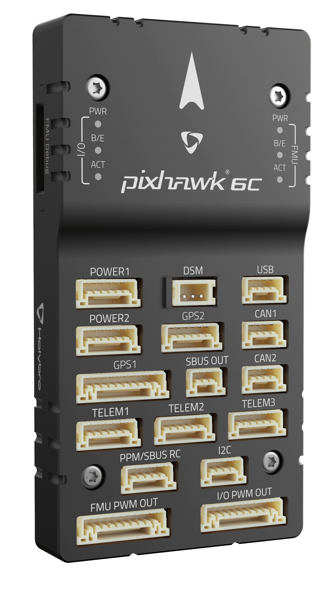

# Holybro Pixhawk 6C

:::warning
PX4 does not manufacture this (or any) autopilot.
Contact the [manufacturer](https://holybro.com/) for hardware support or compliance issues.
:::

_Pixhawk 6C_<sup>&reg;</sup> is the latest update to the successful family of Pixhawk® flight controllers designed and made in collaboration with Holybro<sup>&reg;</sup> and the PX4 team.

It is equipped with a high performance H7 Processor, and comes with IMU redundancy, temperature-controlled IMU board, and cost effective design, delivering incredible performance and reliability.
It complies with the Pixhawk [Connector Standard](https://github.com/pixhawk/Pixhawk-Standards/blob/master/DS-009%20Pixhawk%20Connector%20Standard.pdf).



:::tip
This autopilot is [supported](../flight_controller/autopilot_pixhawk_standard.md) by the PX4 maintenance and test teams.
:::

## Introduction

The Pixhawk® 6C is the latest update to the successful family of Pixhawk® flight controllers.

Inside the Pixhawk® 6C, you can find an STMicroelectronics® based STM32H743, paired with sensor technology from Bosch® & InvenSense®, giving you flexibility and reliability for controlling any autonomous vehicle, suitable for both academic and commercial applications.

The Pixhawk® 6C's H7 microcontroller contain the Arm® Cortex®-M7 core running up to 480 MHz, has 2MB flash memory and 1MB RAM. Thanks to the updated processing power, developers can be more productive and efficient with their development work, allowing for complex algorithms and models.

The Pixhawk 6C includes high-performance, low-noise IMUs on board, designed to be cost effective while having IMU redundancy. A vibration isolation System to filter out high-frequency vibration and reduce noise to ensure accurate readings, allowing vehicles to reach better overall flight performances.

The Pixhawk® 6C is perfect for developers at corporate research labs, startups, academics (research, professors, students), and commercial application.

**Key Design Points**

- High performance STM32H743 Processor with more computing power & RAM
- New cost-effective design with low-profile form factor
- Newly designed integrated vibration isolation system to filter out high frequency vibration and reduce noise to ensure accurate readings
- IMUs are temperature-controlled by onboard heating resistors, allowing optimum working temperature of IMUs&#x20;

# Technical Specification

### **Processors & Sensors**

- FMU Processor: STM32H743&#x20;
  - 32 Bit Arm® Cortex®-M7, 480MHz, 2MB memory, 1MB SRAM&#x20;
- IO Processor: STM32F103
  - &#x20;32 Bit Arm® Cortex®-M3, 72MHz, 64KB SRAM&#x20;
- On-board sensors&#x20;
  - &#x20;Accel/Gyro: ICM-42688-P&#x20;
  - Accel/Gyro: BMI055&#x20;
  - Mag: IST8310&#x20;
  - Barometer: MS5611

### **Electrical data**

- Voltage Ratings:
  - Max input voltage: 6V
  - USB Power Input: 4.75\~5.25V
  - Servo Rail Input: 0\~36V
- Current Ratings:
  - TELEM1 Max output current limiter: 1.5A
  - All other port combined output current limiter: 1.5A

### **Mechanical data**

- Dimensions: 84.8 \* 44 \* 12.4 mm
- Weight: 59.3g

### **Interfaces**

- 16- PWM servo outputs (8 from IO, 8 from FMU)
- 3 general purpose serial ports
  - TELEM1 - Full flow control, separate 1.5A current limit
  - TELEM2 - Full flow control
  - TELEM3
- 2 GPS ports
  - GPS1 - Full GPS port (GPS plus safety switch)
  - GPS2 - Basic GPS port
- 1 I2C port
  - Supports dedicated I2C calibration EEPROM located on sensor module
- 2 CAN Buses
  - CAN Bus has individual silent controls or ESC RX-MUX control
- 2 Debug ports:
  - FMU Debug
  - I/O Debug
- Dedicated R/C input for Spektrum / DSM and S.BUS, CPPM, analog / PWM RSSI
- Dedicated S.BUS output
- 2 Power input ports (Analog)

- Other Characteristics:
  - Operating & storage temperature: -40 ~ 85°c

## Where to Buy

Order from [Holybro](https://holybro.com/products/pixhawk-6c).

## Assembly/Setup

The [Pixhawk 6C Wiring Quick Start](../assembly/quick_start_pixhawk6c.md) provides instructions on how to assemble required/important peripherals including GPS, Power Module etc.

## Pinouts

- [Holybro Pixhawk 6C Pinout](https://docs.holybro.com/autopilot/pixhawk-6c/pixhawk-6c-pinout)

## Serial Port Mapping

| UART   | Device     | Port          |
| ------ | ---------- | ------------- |
| USART1 | /dev/ttyS0 | GPS1          |
| USART2 | /dev/ttyS1 | TELEM3        |
| USART3 | /dev/ttyS2 | Debug Console |
| UART5  | /dev/ttyS3 | TELEM2        |
| USART6 | /dev/ttyS4 | PX4IO         |
| UART7  | /dev/ttyS5 | TELEM1        |
| UART8  | /dev/ttyS6 | GPS2          |

## Dimensions

- [Pixhawk 6C Dimensions](https://docs.holybro.com/autopilot/pixhawk-6c/dimensions)

## Voltage Ratings

_Pixhawk 6C_ can be triple-redundant on the power supply if three power sources are supplied. The three power rails are: **POWER1**, **POWER2** and **USB**.

**Normal Operation Maximum Ratings**

Under these conditions all power sources will be used in this order to power the system:

1. **POWER1** and **POWER2** inputs (4.9V to 5.5V)
1. **USB** input (4.75V to 5.25V)

**Absolute Maximum Ratings**

Under these conditions the system will not draw any power (will not be operational), but will remain intact.

1. **POWER1** and **POWER2** inputs (operational range 4.1V to 5.7V, 0V to 10V undamaged)
1. **USB** input (operational range 4.1V to 5.7V, 0V to 6V undamaged)
1. Servo input: VDD_SERVO pin of **FMU PWM OUT** and **I/O PWM OUT** (0V to 42V undamaged)

**Voltage monitoring**

Pixhawk 6C uses analog power modules.

Holybro makes various analog [power modules](../power_module/index.md) for different needs:

- [PM02 Power Module](../power_module/holybro_pm02.md)
- [PM06 Power Module](../power_module/holybro_pm06_pixhawk4mini_power_module.md)
- [PM07 Power Module](../power_module/holybro_pm07_pixhawk4_power_module.md)

## Building Firmware

:::tip
Most users will not need to build this firmware!
It is pre-built and automatically installed by _QGroundControl_ when appropriate hardware is connected.
:::

To [build PX4](../dev_setup/building_px4.md) for this target:

```
make px4_fmu-v6c_default
```

<a id="debug_port"></a>

## Debug Port

The [PX4 System Console](../debug/system_console.md) and [SWD interface](../debug/swd_debug.md) run on the **FMU Debug** port.

The pinouts and connector comply with the [Pixhawk Debug Full](../debug/swd_debug.md#pixhawk-debug-full) interface defined in the [Pixhawk Connector Standard](https://github.com/pixhawk/Pixhawk-Standards/blob/master/DS-009%20Pixhawk%20Connector%20Standard.pdf) interface (JST SM10B connector).

| Pin      | Signal           | Volt  |
| -------- | ---------------- | ----- |
| 1 (red)  | `Vtref`          | +3.3V |
| 2 (blk)  | Console TX (OUT) | +3.3V |
| 3 (blk)  | Console RX (IN)  | +3.3V |
| 4 (blk)  | `SWDIO`          | +3.3V |
| 5 (blk)  | `SWCLK`          | +3.3V |
| 6 (blk)  | `SWO`            | +3.3V |
| 7 (blk)  | NFC GPIO         | +3.3V |
| 8 (blk)  | PH11             | +3.3V |
| 9 (blk)  | nRST             | +3.3V |
| 10 (blk) | `GND`            | GND   |

For information about using this port see:

- [SWD Debug Port](../debug/swd_debug.md)
- [PX4 System Console](../debug/system_console.md) (Note, the FMU console maps to USART3).

## Peripherals

- [Digital Airspeed Sensor](https://holybro.com/products/digital-air-speed-sensor)
- [Telemetry Radio Modules](https://holybro.com/collections/telemetry-radios?orderby=date)
- [Rangefinders/Distance sensors](../sensor/rangefinders.md)

## Supported Platforms / Airframes

Any multicopter / airplane / rover or boat that can be controlled with normal RC servos or Futaba S-Bus servos.
The complete set of supported configurations can be seen in the [Airframes Reference](../airframes/airframe_reference.md).

## Further info

- [Holybro Docs](https://docs.holybro.com/) (Holybro)
- [Pixhawk 6C Wiring QuickStart](../assembly/quick_start_pixhawk6c.md)
- [PM02 Power Module](../power_module/holybro_pm02.md)
- [PM06 Power Module](../power_module/holybro_pm06_pixhawk4mini_power_module.md)
- [PM07 Power Module](../power_module/holybro_pm07_pixhawk4_power_module.md)
- [FMUv6C reference design pinout](https://docs.google.com/spreadsheets/d/1FcmWRKd6zjdz3-cnjEDYEmANKZOFzNSc/edit?usp=sharing&ouid=113251442407318461574&rtpof=true&sd=true).
- [Pixhawk Connector Standard](https://github.com/pixhawk/Pixhawk-Standards/blob/master/DS-009%20Pixhawk%20Connector%20Standard.pdf).
