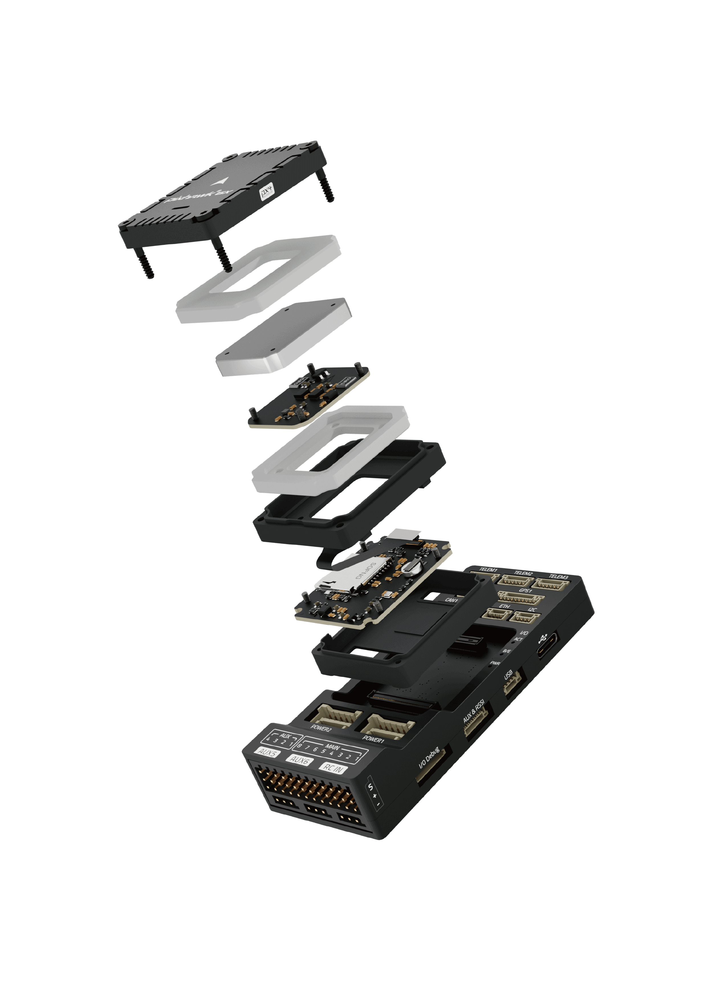

# Holybro Pixhawk 6X

:::warning
PX4 does not manufacture this (or any) autopilot.
Contact the [manufacturer](https://holybro.com/) for hardware support or compliance issues.
:::

_Pixhawk 6X_<sup>&reg;</sup> is the latest update to the successful family of Pixhawk® flight controllers designed and made in collaboration with Holybro<sup>&reg;</sup> and the PX4 team.

It is based on the [Pixhawk​​® Autopilot FMUv6X Standard](https://github.com/pixhawk/Pixhawk-Standards/blob/master/DS-012%20Pixhawk%20Autopilot%20v6X%20Standard.pdf), [Autopilot Bus Standard](https://github.com/pixhawk/Pixhawk-Standards/blob/master/DS-010%20Pixhawk%20Autopilot%20Bus%20Standard.pdf), and [Connector Standard](https://github.com/pixhawk/Pixhawk-Standards/blob/master/DS-009%20Pixhawk%20Connector%20Standard.pdf).

Equipped with a high-performance H7 Processor, modular design, triple redundancy, temperature-controlled IMU board, and isolated sensor domains, delivering incredible performance, reliability, and flexibility.

### Pixhawk 6X (Rev 8)



#### Pixhawk 6X (Rev 3/4, discontinued)

 

### Pixhawk 6X Baseboards Options

:::: tabs

::: tab Standard v2A


:::

::: tab Standard v2B


:::

::: tab Mini


:::

::: tab Jetson Baseboard


:::

::: tab CM4 Baseboard


:::

::::

:::tip
This autopilot is [supported](../flight_controller/autopilot_pixhawk_standard.md) by the PX4 maintenance and test teams.
:::

## Introduction

Inside the Pixhawk®​ 6X, you can find an STMicroelectronics​® based STM32H753, paired with sensor technology from Bosch®​​, InvenSense®​,​ giving you flexibility and reliability for controlling any autonomous vehicle, suitable for both academic and commercial applications.

The Pixhawk® 6X's H7 microcontroller contain the Arm® Cortex®-M7 core running up to 480 MHz, has 2MB flash memory and 1MB RAM. The PX4 Autopilot takes advantage of the increased power and RAM. Thanks to the updated processing power, developers can be more productive and efficient with their development work, allowing for complex algorithms and models.

The FMUv6X open standard includes high-performance, low-noise IMUs on board, designed for better stabilization. Triple redundant IMU & double redundant barometer on separate buses. When the PX4 Autopilot detects a sensor failure, the system seamlessly switches to another to maintain flight control reliability.

An independent LDO powers every sensor set with independent power control. A vibration isolation System to filter out high-frequency vibration and reduce noise to ensure accurate readings, allowing vehicles to reach better overall flight performances.

External sensor bus (SPI5) has two chip select lines and data-ready signals for additional sensors and payload with SPI-interface, and with an integrated Microchip Ethernet PHY, high-speed communication with mission computers via ethernet is now possible.

The Pixhawk®​ 6X is perfect for developers at corporate research labs, startups, academics (research, professors, students), and commercial applications.

## Key Design Points

- High-performance STM32H753 Processor
- Modular flight controller: separated IMU, FMU, and Base system connected by a 100-pin & a 50-pin Pixhawk®​ Autopilot Bus connector.
- Redundancy: 3x IMU sensors & 2x Barometer sensors on separate buses
- Triple redundancy domains: Completely isolated sensor domains with separate buses and separate power control
- Newly designed vibration isolation system to filter out high-frequency vibration and reduce noise to ensure accurate readings
- Ethernet interface for high-speed mission computer integration
- IMUs are temperature-controlled by onboard heating resistors, allowing optimum working temperature of IMUs&#x20;

### Processors & Sensors

- FMU Processor: STM32H753
  - 32 Bit Arm® Cortex®-M7, 480MHz, 2MB flash memory, 1MB RAM
- IO Processor: STM32F100
  - 32 Bit Arm® Cortex®-M3, 24MHz, 8KB SRAM
- On-board sensors (Shipping Currently, Rev 8)
  - Accel/Gyro: 3x ICM-45686 (with BalancedGyro™ Technology)
  - Barometer: ICP20100 & BMP388
  - Mag: BMM150
- On-board sensors (Rev 3/4, discontinued)
  - Accel/Gyro: ICM-20649 or BMI088
  - Accel/Gyro: ICM-42688-P
  - Accel/Gyro: ICM-42670-P
  - Mag: BMM150
  - Barometer: 2x BMP388

### Electrical data

- Voltage Ratings:
  - Max input voltage: 6V
  - USB Power Input: 4.75\~5.25V
  - Servo Rail Input: 0\~36V
- Current Ratings:
  - `TELEM1` output current limiter: 1.5A
  - All other port combined output current limiter: 1.5A

### Mechanical data

- Dimensions
  - Flight Controller Module: 38.8 x 31.8 x 14.6mm
  - Standard Baseboard: 52.4 x 103.4 x 16.7mm
  - Mini Baseboard: 43.4 x 72.8 x 14.2 mm
- Weight
  - Flight Controller Module: 23g
  - Standard Baseboard: 51g
  - Mini Baseboard: 26.5g

### Interfaces

- 16- PWM servo outputs
- R/C input for Spektrum / DSM
- Dedicated R/C input for PPM and S.Bus input
- Dedicated analog / PWM RSSI input and S.Bus output
- 4 general purpose serial ports
  - 3 with full flow control
  - 1 with separate 1.5A current limit (Telem1)
  - 1 with I2C and additional GPIO line for external NFC reader
- 2 GPS ports
  - 1 full GPS plus Safety Switch Port
  - 1 basic GPS port
- 1 I2C port
- 1 Ethernet port
  - Transformerless Applications
  - 100Mbps
- 1 SPI bus
  - 2 chip select lines
  - 2 data-ready lines
  - 1 SPI SYNC line
  - 1 SPI reset line
- 2 CAN Buses for CAN peripheral
  - CAN Bus has individual silent controls or ESC RX-MUX control
- 2 Power input ports with SMBus

  - 1 AD & IO port
  - 2 additional analog input
  - 1 PWM/Capture input
  - 2 Dedicated debug and GPIO lines

- Other Characteristics:
  - Operating & storage temperature: -40 ~ 85°c

## Where to Buy

Order from [Holybro](https://holybro.com/products/pixhawk-6x).

## Assembly/Setup

The [Pixhawk 6X Wiring Quick Start](../assembly/quick_start_pixhawk6x.md) provides instructions on how to assemble required/important peripherals including GPS, Power Module etc.

## Connections

Sample Wiring Diagram


## Pinouts

- [Holybro Pixhawk Baseboard Pinout](https://docs.holybro.com/autopilot/pixhawk-6x/pixhawk-baseboard-pinout)
- [Holybro Pixhawk Mini-Baseboard Pinout](https://docs.holybro.com/autopilot/pixhawk-6x/pixhawk-mini-baseboard-pinout)
- [Holybro Pixhawk Jetson Baseboard](https://docs.holybro.com/autopilot/pixhawk-baseboards/pixhawk-jetson-baseboard)
- [Holybro Pixhawk RPi CM4 Baseboard](https://docs.holybro.com/autopilot/pixhawk-baseboards/pixhawk-rpi-cm4-baseboard)

Notes:

- The [camera capture pin](../camera/fc_connected_camera.md#camera-capture-configuration) (`PI0`) is pin 2 on the AD&IO port, marked above as `FMU_CAP1`.

## Serial Port Mapping

| UART   | Device     | Port          |
| ------ | ---------- | ------------- |
| USART1 | /dev/ttyS0 | GPS           |
| USART2 | /dev/ttyS1 | TELEM3        |
| USART3 | /dev/ttyS2 | Debug Console |
| UART4  | /dev/ttyS3 | UART4 & I2C   |
| UART5  | /dev/ttyS4 | TELEM2        |
| USART6 | /dev/ttyS5 | PX4IO/RC      |
| UART7  | /dev/ttyS6 | TELEM1        |
| UART8  | /dev/ttyS7 | GPS2          |

## Dimensions

[Pixhawk 6X Dimensions](https://docs.holybro.com/autopilot/pixhawk-6x/dimensions)

## Voltage Ratings

_Pixhawk 6X_ can be triple-redundant on the power supply if three power sources are supplied. The three power rails are: **POWER1**, **POWER2** and **USB**.
The **POWER1** & **POWER2** ports on the Pixhawk 6X uses the 6 circuit [2.00mm Pitch CLIK-Mate Wire-to-Board PCB Receptacle](https://www.molex.com/molex/products/part-detail/pcb_receptacles/5024430670).

**Normal Operation Maximum Ratings**

Under these conditions, all power sources will be used in this order to power the system:

1. **POWER1** and **POWER2** inputs (4.9V to 5.5V)
1. **USB** input (4.75V to 5.25V)

**Absolute Maximum Ratings**

Under these conditions, the system will not draw any power (will not be operational) but will remain intact.

1. **POWER1** and **POWER2** inputs (operational range 4.1V to 5.7V, 0V to 10V undamaged)
1. **USB** input (operational range 4.1V to 5.7V, 0V to 6V undamaged)
1. Servo input: VDD_SERVO pin of **FMU PWM OUT** and **I/O PWM OUT** (0V to 42V undamaged)

**Voltage monitoring**

Digital I2C battery monitoring is enabled by default (see [Quickstart > Power](../assembly/quick_start_pixhawk6x.md#power)).

::: info
Analog battery monitoring via an ADC is not supported on this particular board but may be supported in variations of this flight controller with a different baseboard.
:::

## Building Firmware

:::tip
Most users will not need to build this firmware!
It is pre-built and automatically installed by _QGroundControl_ when appropriate hardware is connected.
:::

To [build PX4](../dev_setup/building_px4.md) for this target:

```
make px4_fmu-v6x_default
```

<a id="debug_port"></a>

## Debug Port

The [PX4 System Console](../debug/system_console.md) and [SWD interface](../debug/swd_debug.md) run on the **FMU Debug** port.

The pinouts and connector comply with the [Pixhawk Debug Full](../debug/swd_debug.md#pixhawk-debug-full) interface defined in the [Pixhawk Connector Standard](https://github.com/pixhawk/Pixhawk-Standards/blob/master/DS-009%20Pixhawk%20Connector%20Standard.pdf) interface (JST SM10B connector).

| Pin      | Signal           | Volt  |
| -------- | ---------------- | ----- |
| 1 (red)  | `Vtref`          | +3.3V |
| 2 (blk)  | Console TX (OUT) | +3.3V |
| 3 (blk)  | Console RX (IN)  | +3.3V |
| 4 (blk)  | `SWDIO`          | +3.3V |
| 5 (blk)  | `SWCLK`          | +3.3V |
| 6 (blk)  | `SWO`            | +3.3V |
| 7 (blk)  | NFC GPIO         | +3.3V |
| 8 (blk)  | PH11             | +3.3V |
| 9 (blk)  | nRST             | +3.3V |
| 10 (blk) | `GND`            | GND   |

For information about using this port see:

- [SWD Debug Port](../debug/swd_debug.md)
- [PX4 System Console](../debug/system_console.md) (Note, the FMU console maps to USART3).

## Peripherals

- [Telemetry Radio Modules](https://holybro.com/collections/telemetry-radios?orderby=date)
- [Rangefinders/Distance sensors](../sensor/rangefinders.md)
- [Holybro Sensors](https://holybro.com/collections/sensors)
- [Holybro GPS & RTK Systems](https://holybro.com/collections/gps-rtk-systems)
- [Power Modules & PDBs](https://holybro.com/collections/power-modules-pdbs)

## Supported Platforms / Airframes

Any multicopter / airplane / rover or boat that can be controlled with normal RC servos or Futaba S-Bus servos.
The complete set of supported configurations can be seen in the [Airframes Reference](../airframes/airframe_reference.md).

## Further info

- [Holybro Docs](https://docs.holybro.com/) (Holybro)
- [Pixhawk 6X Wiring QuickStart](../assembly/quick_start_pixhawk6x.md)
- [Pixhawk Autopilot FMUv6X Standard](https://github.com/pixhawk/Pixhawk-Standards/blob/master/DS-012%20Pixhawk%20Autopilot%20v6X%20Standard.pdf).
- [Pixhawk Autopilot Bus Standard](https://github.com/pixhawk/Pixhawk-Standards/blob/master/DS-010%20Pixhawk%20Autopilot%20Bus%20Standard.pdf).
- [Pixhawk Connector Standard](https://github.com/pixhawk/Pixhawk-Standards/blob/master/DS-009%20Pixhawk%20Connector%20Standard.pdf).
