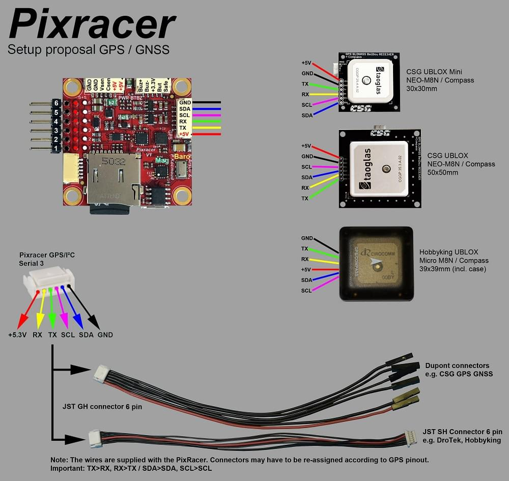
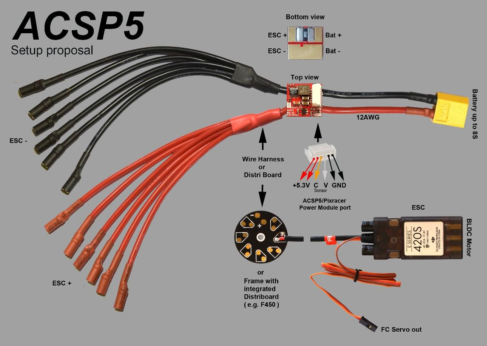
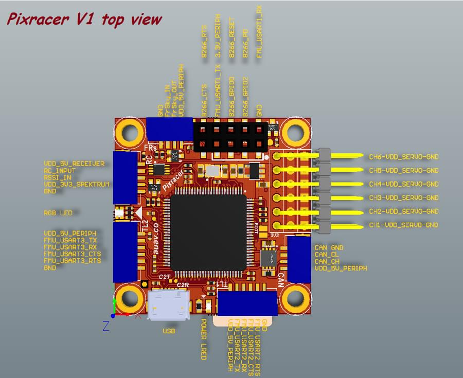
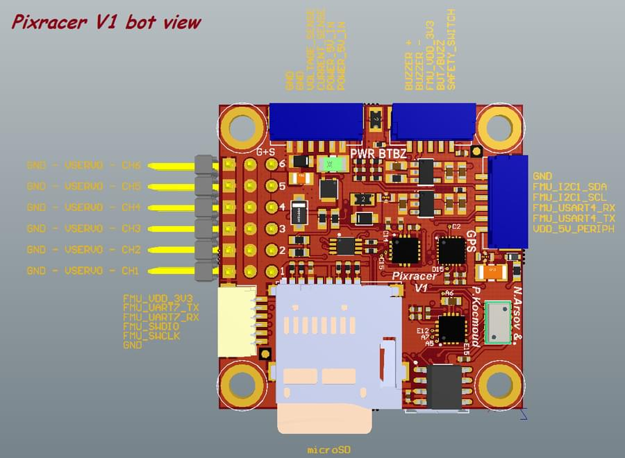
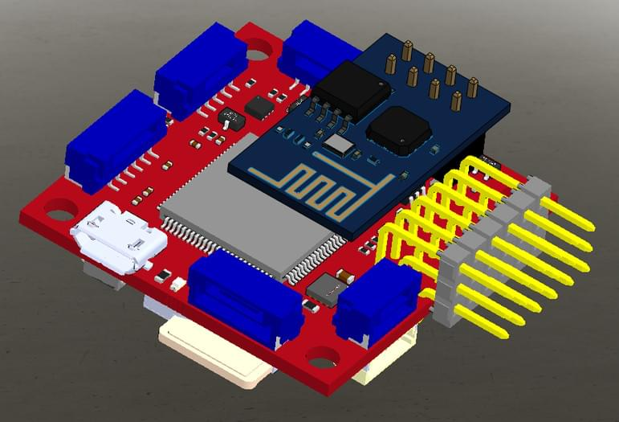

# mRo Pixracer

:::warning
PX4 does not manufacture this (or any) autopilot.
Contact the [manufacturer](https://store.mrobotics.io/) for hardware support or compliance issues.
:::

The Pixhawk<sup>&reg;</sup> XRacer board family is optimized for small racing quads and planes.
In contrast to [Pixfalcon](../flight_controller/pixfalcon.md) and [Pixhawk](../flight_controller/pixhawk.md) it has in-built WiFi, new sensors, convenient full servo headers, CAN and supports 2M flash.


:::tip
This autopilot is [supported](../flight_controller/autopilot_pixhawk_standard.md) by the PX4 maintenance and test teams.
:::

## Key Features

- Main System-on-Chip: [STM32F427VIT6 rev.3](http://www.st.com/web/en/catalog/mmc/FM141/SC1169/SS1577/LN1789)
  - CPU: 180 MHz ARM Cortex<sup>&reg;</sup> M4 with single-precision FPU
  - RAM: 256 KB SRAM (L1)
- Standard FPV form factor: 36x36 mm with standard 30.5 mm hole pattern
- Invensense<sup>&reg;</sup> ICM-20608 Accel / Gyro (4 KHz) / MPU9250 Accel / Gyro / Mag (4 KHz)
- HMC5983 magnetometer with temperature compensation
- Measurement Specialties MS5611 barometer
- JST GH connectors
- microSD (logging)
- Futaba S.BUS and S.BUS2 / Spektrum DSM2 and DSMX / Graupner SUMD / PPM input / Yuneec ST24
- FrSky<sup>&reg;</sup> telemetry port
- OneShot PWM out (configurable)
- Optional: Safety switch and buzzer

## Where to Buy

Pixracer is available from the [mRobotics.io](https://store.mrobotics.io/mRo-PixRacer-R15-Official-p/m10023a.htm).

Accessories include:

- [Digital airspeed sensor](https://hobbyking.com/en_us/hkpilot-32-digital-air-speed-sensor-and-pitot-tube-set.html)
- [Hobbyking<sup>&reg;</sup> OSD + EU Telemetry (433 MHz)](https://hobbyking.com/en_us/micro-hkpilot-telemetry-radio-module-with-on-screen-display-osd-unit-433mhz.html)

## Kit

The Pixracer is designed to use a separate avionics power supply. This is necessary to avoid current surges from motors or ESCs to flow back to the flight controller and disturb its delicate sensors.

- Power module (with voltage and current sensing)
- I2C splitter (supporting AUAV, Hobbyking and 3DR<sup>&reg;</sup> peripherals)
- Cable kit for all common peripherals

## Wifi (no USB required)

One of the main features of the board is its ability to use Wifi for flashing new firmware, system setup and in-flight telemetry.
This frees it of the need of any desktop system.

- [ESP8266 Wifi](../telemetry/esp8266_wifi_module.md)
- [Custom ESP8266 MAVLink firmware](https://github.com/dogmaphobic/mavesp8266)

::: info
Firmware upgrade is not yet enabled over WiFi (it is supported by the default bootloader but not yet enabled).
Setup and telemetry are supported.
:::

## Assembly

See the [Pixracer Wiring Quickstart](../assembly/quick_start_pixracer.md)

## Wiring Diagrams


::: info
If using `TELEM2` for an external telemetry module you will need to configure it as a MAVLink serial port.
For more information see: [Pixracer Wiring Quickstart > External Telemetry](../assembly/quick_start_pixracer.md#external-telemetry)
:::







## Connectors

All connectors follow the [Pixhawk connector standard](https://pixhawk.org/pixhawk-connector-standard/).
Unless noted otherwise all connectors are JST GH.

## Pinouts







#### TELEM1, TELEM2+OSD ports

| Pin     | Signal    | Volt  |
| ------- | --------- | ----- |
| 1 (red) | VCC       | +5V   |
| 2 (blk) | TX (OUT)  | +3.3V |
| 3 (blk) | RX (IN)   | +3.3V |
| 4 (blk) | CTS (IN)  | +3.3V |
| 5 (blk) | RTS (OUT) | +3.3V |
| 6 (blk) | GND       | GND   |

#### GPS port

| Pin     | Signal   | Volt  |
| ------- | -------- | ----- |
| 1 (red) | VCC      | +5V   |
| 2 (blk) | TX (OUT) | +3.3V |
| 3 (blk) | RX (IN)  | +3.3V |
| 4 (blk) | I2C1 SCL | +3.3V |
| 5 (blk) | I2C1 SDA | +3.3V |
| 6 (blk) | GND      | GND   |

#### FrSky Telemetry / SERIAL4

| Pin     | Signal   | Volt  |
| ------- | -------- | ----- |
| 1 (red) | VCC      | +5V   |
| 2 (blk) | TX (OUT) | +3.3V |
| 3 (blk) | RX (IN)  | +3.3V |
| 4 (blk) | GND      | GND   |

#### RC Input (accepts PPM / S.BUS / Spektrum / SUMD / ST24)

| Pin     | Signal  | Volt  |
| ------- | ------- | ----- |
| 1 (red) | VCC     | +5V   |
| 2 (blk) | RC IN   | +3.3V |
| 3 (blk) | RSSI IN | +3.3V |
| 4 (blk) | VDD 3V3 | +3.3V |
| 5 (blk) | GND     | GND   |

#### CAN

| Pin     | Signal | Volt |
| ------- | ------ | ---- |
| 1 (red) | VCC    | +5V  |
| 2 (blk) | CAN_H  | +12V |
| 3 (blk) | CAN_L  | +12V |
| 4 (blk) | GND    | GND  |

#### POWER

| Pin     | Signal  | Volt  |
| ------- | ------- | ----- |
| 1 (red) | VCC     | +5V   |
| 2 (blk) | VCC     | +5V   |
| 3 (blk) | CURRENT | +3.3V |
| 4 (blk) | VOLTAGE | +3.3V |
| 5 (blk) | GND     | GND   |
| 6 (blk) | GND     | GND   |

#### SWITCH

| Pin     | Signal         | Volt  |
| ------- | -------------- | ----- |
| 1 (red) | SAFETY         | GND   |
| 2 (blk) | !IO_LED_SAFETY | GND   |
| 3 (blk) | VCC            | +3.3V |
| 4 (blk) | BUZZER-        | -     |
| 5 (blk) | BUZZER+        | -     |

#### Debug Port

The pinouts and connector comply with the [Pixhawk Debug Mini](../debug/swd_debug.md#pixhawk-debug-mini) interface defined in the [Pixhawk Connector Standard](https://github.com/pixhawk/Pixhawk-Standards/blob/master/DS-009%20Pixhawk%20Connector%20Standard.pdf) (JST SM06B connector).

| Pin     | Signal           | Volt  |
| ------- | ---------------- | ----- |
| 1 (red) | VCC TARGET SHIFT | +3.3V |
| 2 (blk) | CONSOLE TX (OUT) | +3.3V |
| 3 (blk) | CONSOLE RX (IN)  | +3.3V |
| 4 (blk) | SWDIO            | +3.3V |
| 5 (blk) | SWCLK            | +3.3V |
| 6 (blk) | GND              | GND   |

For information about using this port see:

- [SWD Debug Port](../debug/swd_debug.md)
- [PX4 System Console](../debug/system_console.md) (Note, the FMU console maps to UART7).

## Serial Port Mapping

| UART   | Device     | Port                  |
| ------ | ---------- | --------------------- |
| UART1  | /dev/ttyS0 | WiFi (ESP8266)        |
| USART2 | /dev/ttyS1 | TELEM1 (flow control) |
| USART3 | /dev/ttyS2 | TELEM2 (flow control) |
| UART4  |            |
| UART7  | CONSOLE    |
| UART8  | SERIAL4    |

<!-- Note: Got ports using https://github.com/PX4/PX4-user_guide/pull/672#issuecomment-598198434 -->

## Schematics

The reference is provided as: [Altium Design Files](https://github.com/AUAV-OpenSource/FMUv4-PixRacer)

The following PDF files are provided for _convenience only_:

- [pixracer-rc12-12-06-2015-1330.pdf](https://github.com/PX4/PX4-user_guide/raw/main/assets/flight_controller/pixracer/pixracer-rc12-12-06-2015-1330.pdf)
- [pixracer-r14.pdf](https://github.com/PX4/PX4-user_guide/raw/main/assets/flight_controller/pixracer/pixracer-r14.pdf) - R14 or RC14 is printed next to the SDCard socket

## Building Firmware

:::tip
Most users will not need to build this firmware!
It is pre-built and automatically installed by _QGroundControl_ when appropriate hardware is connected.
:::

To [build PX4](../dev_setup/building_px4.md) for this target:

```
make px4_fmu-v4_default
```

## Configuration

[Compass calibration](../config/compass.md) should be done with USB disconnected.
This is always recommended, but is necessary on Pixracer because the USB connection produces particularly large levels of magnetic interference.

Configuration is otherwise the same as for other boards.

## Credits

This design was created by Nick Arsov and Phillip Kocmoud and architected by Lorenz Meier, David Sidrane and Leonard Hall.
