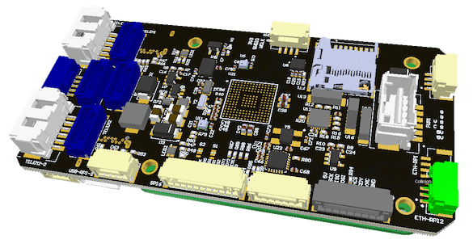
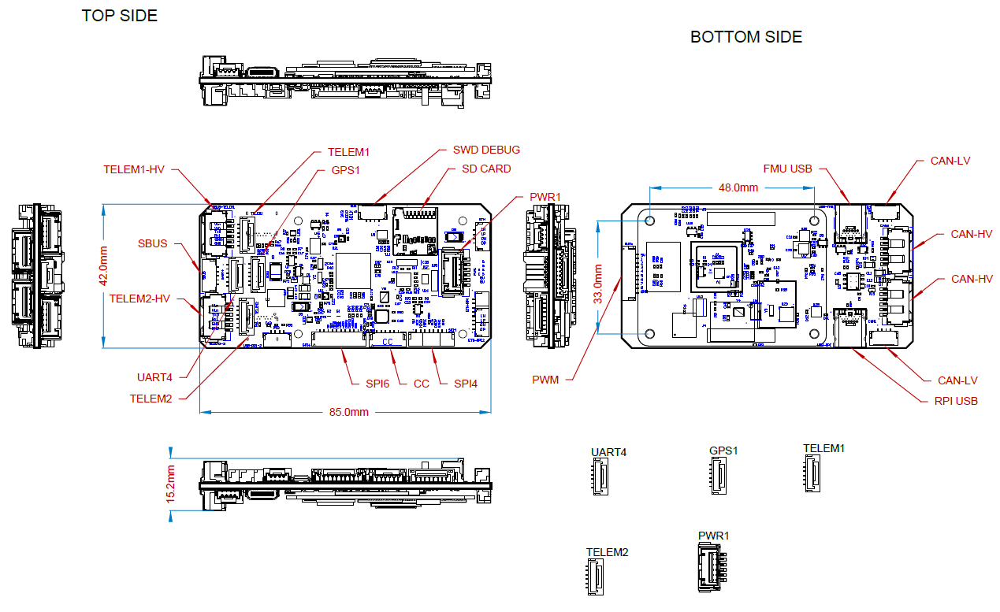

# RaccoonLab FMUv6X Autopilot

:::warning
PX4 does not manufacture this (or any) autopilot.
Contact the [manufacturer](https://raccoonlab.co) for hardware support or compliance issues.
:::

The [RaccoonLab FMUv6X](https://docs.raccoonlab.co/guide/autopilot/RCLv6X.html) flight controller is based on the following Pixhawk​® standards: [Pixhawk Autopilot FMUv6X Standard](https://github.com/pixhawk/Pixhawk-Standards/blob/master/DS-012%20Pixhawk%20Autopilot%20v6X%20Standard.pdf), [Autopilot Bus Standard](https://github.com/pixhawk/Pixhawk-Standards/blob/master/DS-010%20Pixhawk%20Autopilot%20Bus%20Standard.pdf), and [Connector Standard](https://github.com/pixhawk/Pixhawk-Standards/blob/master/DS-009%20Pixhawk%20Connector%20Standard.pdf).

Equipped with a high-performance H7 Processor, modular design, triple redundancy, temperature-controlled IMU board, and isolated sensor domains, it delivers exceptional performance, reliability, and flexibility.
At RaccoonLab, we focus on DroneCAN and Cyphal-based onboard control system buses.
Our autopilot is part of a larger DroneCAN and Cyphal ecosystem, making it an ideal choice for next-generation intelligent vehicles.



RaccoonLab offers versatile HATs for both Raspberry Pi and NVIDIA Jetson Xavier NX, enhancing connectivity and functionality.
The [Jetson Xavier NX HAT](https://docs.raccoonlab.co/guide/nx_hat/) is designed to integrate the CAN bus with the Jetson Xavier NX, enabling access to Cyphal and DroneCAN protocols.
The [Raspberry Pi CM4 HAT](https://docs.raccoonlab.co/guide/rpi_hat/) provides robust features, including CAN bus connectivity, an LTE modem, internal voltage measurement, SWD debugging for other MCUs, and UART communication with PX4 over MAVLINK.
These HATs expand the capabilities of devices, making them ideal for advanced robotics and UAV applications.

:::tip
This autopilot is [supported](../flight_controller/autopilot_pixhawk_standard.md) by the PX4 maintenance and test teams.
:::

## Key Design Points

- High performance STM32H753 Processor
- Modular flight controller: separated IMU, FMU, and Base system connected by a 100-pin & a 50-pin Pixhawk Autopilot Bus connector.
- Redundancy: 3x IMU sensors & 2x Barometer sensors on separate buses
- Triple redundancy domains: Completely isolated sensor domains with separate buses and separate power control
- Newly designed vibration isolation system to filter out high frequency vibration and reduce noise to ensure accurate readings
- Ethernet interface for high-speed mission computer integration

## Processors & Sensors

- FMU Processor: STM32H753
  - 32 Bit Arm Cortex-M7, 480MHz, 2MB flash memory, 1MB RAM
- IO Processor: STM32F100
  - 32 Bit Arm Cortex-M3, 24MHz, 8KB SRAM
- On-board sensors
  - Accel/Gyro: ICM-20649 or BMI088
  - Accel/Gyro: ICM-42688-P
  - Accel/Gyro: ICM-42670-P
  - Mag: BMM150
  - Barometer: 2x BMP388

## Electrical data

- Voltage Ratings:
  - Max input voltage: 36V
  - USB Power Input: 4.75\~5.25V
  - Servo Rail Input: 0\~36V
- Current Ratings:
  - `TELEM1` output current limiter: 1.5A
  - All other port combined output current limiter: 1.5A

## Mechanical data

- Dimensions
  - Flight Controller Module: 38.8 x 31.8 x 14.6mm
  - Standard Baseboard: 52.4 x 103.4 x 16.7mm
  - Mini Baseboard: 43.4 x 72.8 x 14.2 mm
- Weight
  - Flight Controller Module: 23g
  - Standard Baseboard: 51g
  - Mini Baseboard: 26.5g

3D model can be downloaded on [GrabCAD](https://grabcad.com/library/raccoonlab-autopilot-1).



## Interfaces

- 16- PWM servo outputs
- R/C input for Spektrum / DSM
- Dedicated R/C input for PPM and S.Bus input
- Dedicated analog / PWM RSSI input and S.Bus output
- 4 general purpose serial ports
  - 3 with full flow control
  - 1 with separate 1.5A current limit (`TELEM1`)
  - 1 with I2C and additional GPIO line for external NFC reader
- 2 GPS ports
  - 1 full GPS plus Safety Switch Port
  - 1 basic GPS port
- 1 I2C port
- 1 Ethernet port
  - Transformerless Applications
  - 100Mbps
- 1 SPI bus
  - 2 chip select lines
  - 2 data-ready lines
  - 1 SPI SYNC line
  - 1 SPI reset line
- 2 CAN Buses for CAN peripheral
  - CAN Bus has individual silent controls or ESC RX-MUX control
- 2 Power input ports with SMBus
  - 1 AD & IO port
  - 2 additional analog input
  - 1 PWM/Capture input
  - 2 Dedicated debug and GPIO lines

## Serial Port Mapping

| UART   | Device     | Port          |
| ------ | ---------- | ------------- |
| USART1 | /dev/ttyS0 | GPS           |
| USART2 | /dev/ttyS1 | TELEM3        |
| USART3 | /dev/ttyS2 | Debug Console |
| UART4  | /dev/ttyS3 | UART4 & I2C   |
| UART5  | /dev/ttyS4 | TELEM2        |
| USART6 | /dev/ttyS5 | PX4IO/RC      |
| UART7  | /dev/ttyS6 | TELEM1        |
| UART8  | /dev/ttyS7 | GPS2          |

## Voltage Ratings

_RaccoonLab FMUv6X_ can be triple-redundant on the power supply if three power sources are supplied.
The three power rails are: **POWER1**, **POWER2** and **USB**.
The **POWER1** & **POWER2** ports on the RaccoonLab FMUv6X uses the 6 circuit [2.00mm Pitch CLIK-Mate Wire-to-Board PCB Receptacle](https://www.molex.com/molex/products/part-detail/pcb_receptacles/5024430670).

**Normal Operation Maximum Ratings**

Under these conditions all power sources will be used in this order to power the system:

1. **POWER1** and **POWER2** inputs (4.9V to 5.5V)
2. **USB** input (4.75V to 5.25V)

:::tip
The manufacturer [RaccoonLab Docs](https://docs.raccoonlab.co/guide/autopilot/RCLv6X.html) are the canonical reference for the RaccoonLab FMUv6X Autopilot.
They should be used by preference as they contain the most complete and up to date information.
:::

## Where to Buy

[RaccoonLab Store](https://raccoonlab.co/store)

[Cyphal store](https://cyphal.store)

## Building Firmware

:::tip
Most users will not need to build this firmware!
It is pre-built and automatically installed by _QGroundControl_ when appropriate hardware is connected.
:::

To [build PX4](../dev_setup/building_px4.md) for this target:

```sh
make px4_fmu-v6x_default
```

## Supported Platforms / Airframes

Any multicopter / airplane / rover or boat that can be controlled with normal RC servos or Futaba S-Bus servos.
The complete set of supported configurations can be seen in the [Airframes Reference](../airframes/airframe_reference.md).

## Further info

- [Pixhawk Autopilot FMUv6X Standard](https://github.com/pixhawk/Pixhawk-Standards/blob/master/DS-012%20Pixhawk%20Autopilot%20v6X%20Standard.pdf)
- [Pixhawk Autopilot Bus Standard](https://github.com/pixhawk/Pixhawk-Standards/blob/master/DS-010%20Pixhawk%20Autopilot%20Bus%20Standard.pdf)
- [Pixhawk Connector Standard](https://github.com/pixhawk/Pixhawk-Standards/blob/master/DS-009%20Pixhawk%20Connector%20Standard.pdf)
- [RaccoonLab docs](http://docs.raccoonlab.co)
