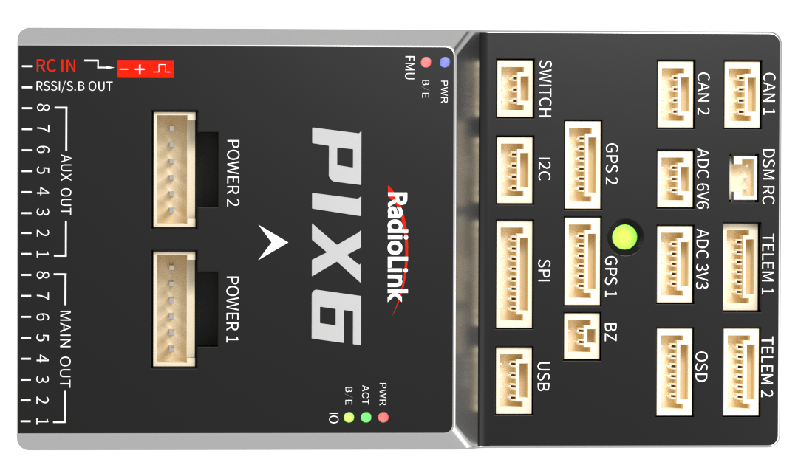
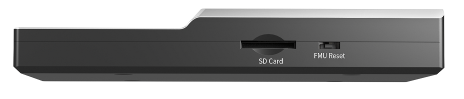
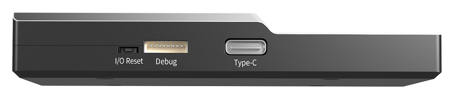
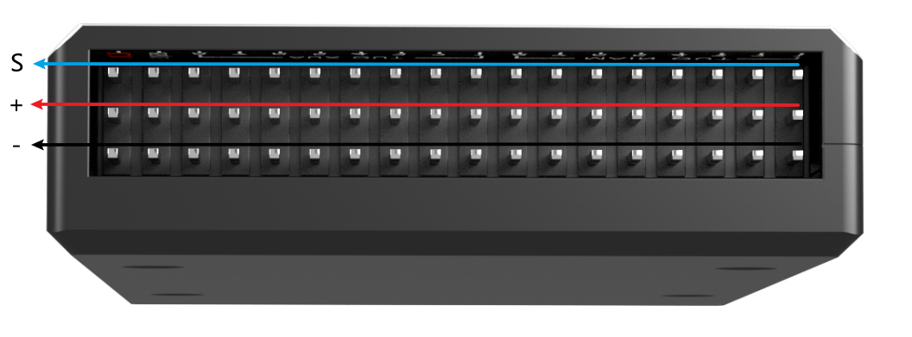
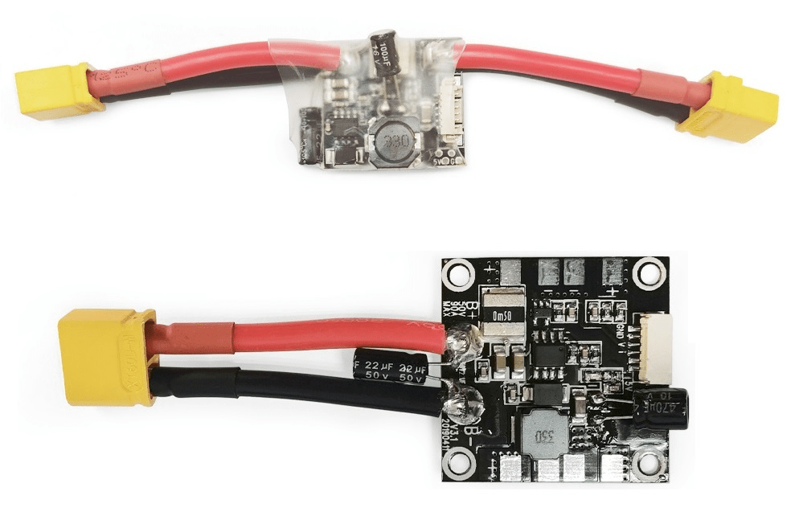

# RadiolinkPIX6 Flight Controller

<Badge type="tip" text="main (planned for: PX4 v1.17)" />

:::warning
PX4 does not manufacture this (or any) autopilot.
Contact the [manufacturer](https://radiolink.com.cn/) for hardware support or compliance issues.
:::

The autopilot is recommended for commercial systems integration, but is also suitable for academic research and any other use.


The Radiolink PIX6 is a high-performance flight controller.
Featuring STM32F7 CPU, vibration isolation of IMUs, redundant IMUs, integrated OSD chip, IMU heating, and DShot.

::: info
This flight controller is [manufacturer supported](../flight_controller/autopilot_manufacturer_supported.md).
:::

## Quick Summary

- Processor
  - 32-bit ARM Cortex M7 core with DPFPU - STM32F765VIT6
  - 216 MHz/512 KB RAM/2 MB Flash
  - 32-bit IOMCU co-processor - STM32F100
  - 32KB FRAM - FM25V02A
  - AT7456E OSD
- Sensors
  - Bosh BMI088 IMU (accel, gyro)
  - InvenSense ICM-42688 IMU (accel, gyro)
  - SPA06 barometer
  - IST8310 magnetometer
- Power
  - SMBUS/I2C Power Module Inputs (I2C)
  - voltage and current monitor inputs (Analog)
- Interfaces
  - 16 PWM Outputs with independent power rail for external power source
  - 5x UART serial ports, 2 with HW flow control
  - Camera Input and Video Output
  - PPM/SBUS input, DSM/SBUS input
  - RSSI (PWM or voltage) input
  - I2C, SPI, 2x CAN, USB
  - 3.3V and 6.6V ADC inputs
  - Buzzer and Safety Switch
  - microSD card
- Weight and Dimensions:
  - Weight 80g
  - Size 94mm x 51.5mm x 14.5mm

## Where to Buy

[Radiolink Amazon](https://www.radiolink.com.cn/pix6_where_to_buy)（International users）

[Radiolink Taobao](https://item.taobao.com/item.htm?spm=a21dvs.23580594.0.0.1d292c1bNMdSqV&ft=t&id=815993357068&skuId=5515756705284)（China Mainland user）

## Connector assignments

### Top View



### Left View



### Right View



### Rear View



## Pinouts

Unless noted otherwise all connectors are JST GH.

### TELEM1, TELEM2 ports

| Pin | Signal  | Volt  |
| --- | ------- | ----- |
| 1   | VCC     | +5V   |
| 2   | TX(OUT) | +3.3V |
| 3   | RX(IN)  | +3.3V |
| 4   | CTS     | +3.3V |
| 5   | RTS     | +3.3V |
| 6   | GND     | GND   |

### OSD

| Pin | Signal | Volt  |
| --- | ------ | ----- |
| 1   | GND    | GND   |
| 2   | VOUT   | +3.3V |
| 3   | VCC    | +5V   |
| 4   | GND    | GND   |
| 5   | VCC    | +5V   |
| 6   | VIN    | +3.3V |

### I2C port

| Pin | Signal | Volt            |
| --- | ------ | --------------- |
| 1   | VCC    | +5V             |
| 2   | SCL    | +3.3V (pullups) |
| 3   | SDA    | +3.3V (pullups) |
| 4   | GND    | GND             |

### CAN1, CAN2 ports

| Pin | Signal | Volt |
| --- | ------ | ---- |
| 1   | VCC    | +5V  |
| 2   | CAN_H  | +12V |
| 3   | CAN_L  | +12V |
| 4   | GND    | GND  |

### GPS1 port

| Pin | Signal  | Volt  |
| --- | ------- | ----- |
| 1   | VCC     | +5V   |
| 2   | TX(OUT) | +3.3V |
| 3   | RX(IN)  | +3.3V |
| 4   | SCL     | +3.3V |
| 5   | SDA     | +3.3V |
| 6   | GND     | GND   |

### GPS2 Port

| Pin | Signal  | Volt  |
| --- | ------- | ----- |
| 1   | VCC     | +5V   |
| 2   | TX(OUT) | +3.3V |
| 3   | RX(IN)  | +3.3V |
| 4   | SCL     | +3.3V |
| 5   | SDA     | +3.3V |
| 6   | GND     | GND   |

### SPI

| Pin | Signal    | Volt  |
| --- | --------- | ----- |
| 1   | VCC       | +5V   |
| 2   | SPI_SCK   | +3.3V |
| 3   | SPI_MISO  | +3.3V |
| 4   | SPI_MOSI  | +3.3V |
| 5   | !SPI_NSS1 | +3.3V |
| 6   | !SPI_NSS2 | +3.3V |
| 7   | DRDY      | +3.3V |
| 8   | GND       | GND   |

### POWER1 (HY2.0-6P)

Port for analog power monitors.

| Pin | Signal  | Volt        |
| --- | ------- | ----------- |
| 1   | VCC     | +5V         |
| 2   | VCC     | +5V         |
| 3   | CURRENT | up to +3.3V |
| 4   | VOLTAGE | up to +3.3V |
| 5   | GND     | GND         |
| 6   | GND     | GND         |

### POWER2 (HY2.0-6P)

Port for digital (I2C) power monitor.

| Pin | Signal | Volt  |
| --- | ------ | ----- |
| 1   | VCC    | +5V   |
| 2   | VCC    | +5V   |
| 3   | SCL    | +3.3V |
| 4   | SDA    | +3.3V |
| 5   | GND    | GND   |
| 6   | GND    | GND   |

### ADC 3.3V

| Pin | Signal  | Volt        |
| --- | ------- | ----------- |
| 1   | VCC     | +5V         |
| 2   | ADC IN1 | up to +3.3V |
| 3   | GND     | GND         |
| 4   | ADC IN2 | up to +3.3v |
| 5   | GND     | GND         |

### ADC 6.6V

| Pin | Signal | Volt       |
| --- | ------ | ---------- |
| 1   | VCC    | +5V        |
| 2   | ADC IN | up to 6.6V |
| 3   | GND    | GND        |

### USB remote port

| Pin | Signal  | Volt  |
| --- | ------- | ----- |
| 1   | USB VDD | +5V   |
| 2   | DM      | +3.3V |
| 3   | DP      | +3.3V |
| 4   | GND     | GND   |

### SWITCH

| Pin | Signal         | Volt  |
| --- | -------------- | ----- |
| 1   | VCC            | +3.3V |
| 2   | !IO_LED_SAFETY | GND   |
| 3   | SAFETY         | GND   |

### Buzzer port

| Pin | Signal  | Volt |
| --- | ------- | ---- |
| 1   | VCC     | +5V  |
| 2   | BUZZER- | +5V  |

### Spektrum/DSM Port (PH1.25-3P)

| Pin | Signal | Volt  |
| --- | ------ | ----- |
| 1   | VCC    | +3.3V |
| 2   | GND    | GND   |
| 3   | Signal | +3.3V |

### Debug port (SH1.0-8P)

| Pin | Signal    | Volt  |
| --- | --------- | ----- |
| 1   | VCC       | +5V   |
| 2   | FMU_SWCLK | +3.3V |
| 3   | FMU_SWDIO | +3.3V |
| 4   | TX(UART7) | +3.3V |
| 5   | RX(UART7) | +3.3V |
| 6   | IO_SWCLK  | +3.3V |
| 7   | IO_SWDIO  | +3.3V |
| 8   | GND       | GND   |

## Building Firmware

To [build PX4](../dev_setup/building_px4.md) for this target:

```sh
make radiolink_PIX6_default
```

## Installing PX4 Firmware

The firmware can be installed in any of the normal ways:

- Build and upload the source

  ```sh
  make radiolink_PIX6_default upload
  ```

- [Load the firmware](../config/firmware.md) using _QGroundControl_.
  You can use either pre-built firmware or your own custom firmware.

  ::: info
  At time of writing the only pre-built software is `PX4 main` (see [Installing PX4 Main, Beta or Custom Firmware](../config/firmware.md#installing-px4-main-beta-or-custom-firmware)).
  Release builds will be supported for PX4 v1.17 and later.
  :::

## PX4 Configuration

In addition to the [basic configuration](../config/index.md), the following parameters are important:

| Parameter                                                            | Setting                                                                                                                 |
| -------------------------------------------------------------------- | ----------------------------------------------------------------------------------------------------------------------- |
| [SYS_HAS_MAG](../advanced_config/parameter_reference.md#SYS_HAS_MAG) | This should be disabled since the board does not have an internal mag. You can enable it if you attach an external mag. |

### Powering the PIX6

The PIX6 has 2 dedicated power monitor ports, each with a 6 pin connector.
One is the Analog power monitor (`POWER1`), and the others is the I2C power monitor (`POWER2`).

The power module that comes with the flight controller with a wide voltage input range of 2-12S (7.4-50.4V), a maximum detection current of 90A (single ESC maximum detection current is 22.5A), a BEC output voltage of 5.3±0.2V, and a BEC output current of 2A.



The PIX6 also supports power modules from other manufacturers, such as [holybro_pm02d](../power_module/holybro_pm02d.md).

## Recommended Accessories

### GPS Modules

Radiolink manufactures a variety of high-performance GPS，Dual Anti-interference Technology Worry-free of UAV High-power Image Transmission, High-Voltage Lines, or Other Strong Signal Interference.

The PIX6 has 2 dedicated GPS ports, `GPS1` and `GPS2`, each with a 6 pin connector.

Recommended modules include:

- [Radiolink SE100](https://radiolink.com.cn/se100)
- [Radiolink TS100](https://radiolink.com.cn/ts100v2)
- [Radiolink RTK F9P](https://radiolink.com.cn/rtk_f9p)

## Serial Port Mapping

| UART   | Device     | Port                  |
| ------ | ---------- | --------------------- |
| UART1  | /dev/ttyS0 | GPS1                  |
| USART2 | /dev/ttyS1 | TELEM1 (flow control) |
| USART3 | /dev/ttyS2 | TELEM2 (flow control) |
| UART4  | /dev/ttyS3 | GPS2                  |
| UART7  | /dev/ttyS4 | Debug Console         |
| UART8  | /dev/ttyS5 | PX4IO                 |

## Analog inputs

The Radiolink PIX6 has 3 analog inputs, one 6V tolerant and two 3.3V tolerant.

- ADC Pin12 -> ADC 6.6V Sense
- ADC Pin4 -> ADC IN1 3.3V Sense
- ADC Pin13 -> ADC IN2 3.3V Sense

## Radio Control

A [Radio Control (RC)](../getting_started/rc_transmitter_receiver.md) system is required if you want to _manually_ control your vehicle (PX4 does not require a radio system for autonomous flight modes).

You will need to [select a compatible transmitter/receiver](../getting_started/rc_transmitter_receiver.md) and then _bind_ them so that they communicate (read the instructions that come with your specific transmitter/receiver).

- Spektrum/DSM receivers connect to the **DSM/SBUS RC** input.
- PPM or SBUS receivers connect to the **RC IN** input port.
- CRSF receiver must be wired to a spare port (UART) on the Flight Controller.
  Then you can bind the transmitter and receiver together.

#### CRSF Parameter Configuration

[Find and set](../advanced_config/parameters.md) the following parameters:

1. Set [RC_CRSF_PRT_CFG](../advanced_config/parameter_reference.md#RC_CRSF_PRT_CFG) to the port that is connected to the CRSF receiver (such as `TELEM1`).

   This [configures the serial port](../peripherals/serial_configuration.md) to use the CRSF protocol.
   Note that some serial ports may already have a [default serial port mapping](../peripherals/serial_configuration.md#default-serial-port-configuration) or [default MAVLink serial port mapping](../peripherals/mavlink_peripherals.md#default-mavlink-ports) that you will have to un-map before you can assign the port to CRSF.
   For example, if you want to use `TELEM1` or `TELEM2` you first need to modify [MAV_0_CONFIG](../advanced_config/parameter_reference.md#MAV_0_CONFIG) or [MAV_1_CONFIG](../advanced_config/parameter_reference.md#MAV_1_CONFIG) to stop setting those ports.

   There is no need to set the baud rate for the port, as this is configured by the driver.

1. Enable [RC_CRSF_TEL_EN](../advanced_config/parameter_reference.md#RC_CRSF_TEL_EN) to activate Crossfire telemetry.

For more information about selecting a radio system, receiver compatibility, and binding your transmitter/receiver pair, see: [Remote Control Transmitters & Receivers](../getting_started/rc_transmitter_receiver.md).
