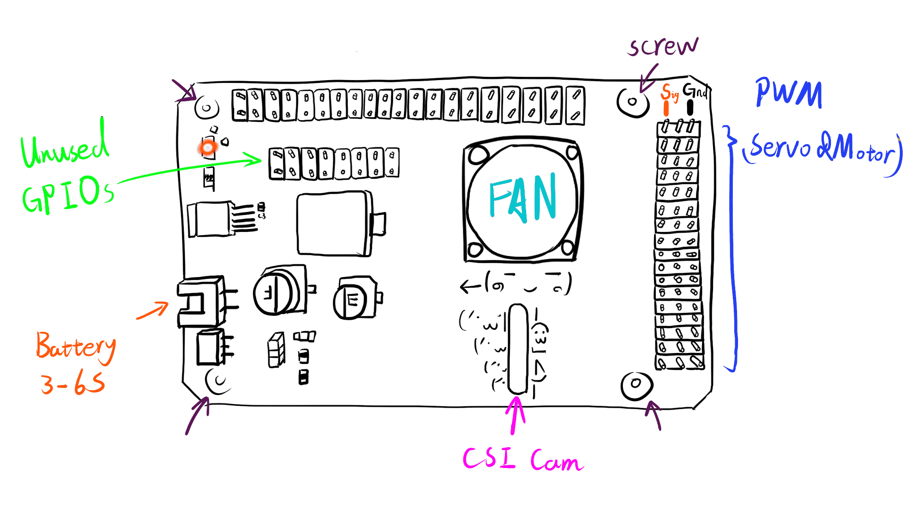

# RPi PilotPi Shield

<LinkedBadge type="warning" text="Experimental" url="../flight_controller/autopilot_experimental.html"/>

:::warning
PX4 does not manufacture this (or any) autopilot.
Contact the [manufacturer](mailto:lhf2613@gmail.com) for hardware support or compliance issues.
:::

The _PilotPi_ shield is a fully functional solution to run PX4 autopilot directly on Raspberry Pi.
It is designed to be a low-cost but highly scalability platform with continuous updates from both Linux and PX4 sides.
No proprietary driver is required, as all components have upstream support from RPi and PX4 community.
PCB and schematic are open source as well.

## Quick Summary

- Supported RPi boards:
  - Raspberry Pi 2B/3B/3B+/4B
- Supported OS:
  - Raspberry Pi OS
  - Ubuntu Server (armhf/arm64)
- Accelerometer / Gyro:
  - ICM42688P
- Magnetometer:
  - IST8310
- Barometer:
  - MS5611
- PWM:
  - PCA9685
- ADC:
  - ADS1115
- Power:
  - 3~6S battery with built-in voltage sensing.
  - Power the Pi through USB cable
- Availability: _preparing for shipping_

## Connectivity

Shield provides:

- 16x PWM outputting channels
- GPS connector
- Telemetry connector
- External I2C bus connector (**Note:** conflicts with CSI camera)
- RC input port (SBUS)
- 3x ADC channels range 0~5V
- 2\*8 2.54mm unused GPIO connector

Direct accessible from RPi:

- 4x USB connector
- CSI connector(**Note:** conflict with external I2C bus)
- etc.

## Recommended Wiring

## Pinout

:::warning
It still uses old GH1.25 connectors.
Wiring is compatible with Pixhawk 2.4.8
:::

### Connectors

#### GPS connector

Mapped to `/dev/ttySC0`

| Pin | Signal | Volt |
| --- | ------ | ---- |
| 1   | VCC    | +5V  |
| 2   | TX     | +3v3 |
| 3   | RX     | +3v3 |
| 4   | NC     | +3v3 |
| 5   | NC     | +3v3 |
| 6   | GND    | GND  |

#### Telemetry connector

Mapped to `/dev/ttySC1`

| Pin | Signal | Volt |
| --- | ------ | ---- |
| 1   | VCC    | +5V  |
| 2   | TX     | +3v3 |
| 3   | RX     | +3v3 |
| 4   | CTS    | +3v3 |
| 5   | RTS    | +3v3 |
| 6   | GND    | GND  |

#### External I2C connector

Mapped to `/dev/i2c-0`

| Pin | Signal | Volt          |
| --- | ------ | ------------- |
| 1   | VCC    | +5V           |
| 2   | SCL    | +3v3(pullups) |
| 3   | SDA    | +3v3(pullups) |
| 4   | GND    | GND           |

#### RC & ADC2/3/4

RC is mapped to `/dev/ttyAMA0` with signal inverter switch on RX line.

| Pin | Signal | Volt     |
| --- | ------ | -------- |
| 1   | RC     | +3V3~+5V |
| 2   | VCC    | +5V      |
| 3   | GND    | GND      |

- ADC1 is internally connected to voltage divider for battery voltage monitoring.
- ADC2 is left unused.
- ADC3 can be connected to an analog airspeed sensor.
- ADC4 has a jumper cap between ADC and VCC, to monitor system voltage level.

| Pin | Signal | Volt   |
| --- | ------ | ------ |
| 1   | ADCx   | 0V~+5V |
| 2   | VCC    | +5V    |
| 3   | GND    | GND    |

::: info
ADC3 & 4 have an alternative VCC source
When 'Vref' switch is on, 'VCC' pin is driven by REF5050.
:::

#### Unused GPIO available on top of the board

| Shield Pin | BCM | WiringPi | RPi Pin |
| ---------- | --- | -------- | ------- |
| 1          | 3V3 | 3v3      | 3V3     |
| 2          | 5V  | 5V       | 5V      |
| 3          | 4   | 7        | 7       |
| 4          | 14  | 15       | 8       |
| 5          | 17  | 0        | 11      |
| 6          | 27  | 2        | 13      |
| 7          | 22  | 3        | 15      |
| 8          | 23  | 4        | 16      |
| 9          | 7   | 11       | 26      |
| 10         | 5   | 21       | 29      |
| 11         | 6   | 22       | 31      |
| 12         | 12  | 26       | 32      |
| 13         | 13  | 23       | 33      |
| 14         | 16  | 27       | 36      |
| 15         | 26  | 25       | 37      |
| 16         | GND | GND      | GND     |

### Switches

#### RC Inverter

This switch will decide the signal polarity of RX line: `UART_RX = SW xor RC_INPUT`

- On: suitable with SBUS (signal inverted)
- Off: preserved

#### Vref

ADC 3 & 4 will have VCC driven by:

- Vref output from REF5050 if on
- 5V pin directly from RPi if off

#### Boot Mode

This switch is connected to Pin22(BCM25).
System rc script will check its value and decide whether PX4 should start alongside with system booting or not.

- On: start PX4 automatically
- Off: don' t start PX4

## Developer Quick Start

Refer to specific instructions for the OS running on your RPi:

- [Raspberry Pi OS Lite (armhf)](raspberry_pi_pilotpi_rpios.md)
- [Ubuntu Server (arm64 & armhf)](raspberry_pi_pilotpi_ubuntu_server.md)
