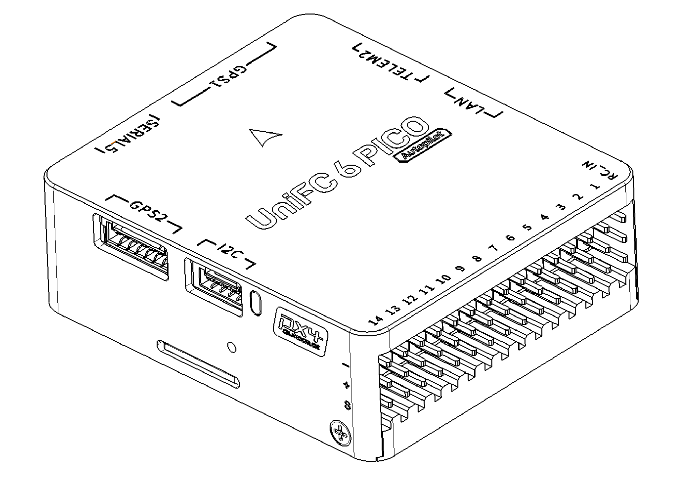

# SIYI UniFC 6 PICO

<Badge type="tip" text="PX4 main (v2.0)" />

::: warning
PX4 does not manufacture this (or any) autopilot.
Contact the [manufacturer](https://siyi.biz/) for hardware support or compliance issues.
:::

The _SIYI UniFC 6 PICO_ is a flight controller designed by SIYI Technology.
It features high-performance sensors, dual CAN bus, Ethernet connectivity, and extensive I/O options.



::: info
This flight controller is [manufacturer supported](../flight_controller/autopilot_manufacturer_supported.md).
:::

## Key Features

- **MCU:** STM32H743II (32 Bit Arm® Cortex®-M7, 480 MHz, 2MB Flash, 1MB RAM)
- **IMU (Dual):** TDK InvenSense ICM-45686 (primary, SPI4) + Bosch BMI088 accel/gyro (secondary, SPI1)
- **Barometer (Dual):** InvenSense ICP201XX (internal at address 0x63, external at address 0x64)
- **Magnetometer:** iSentek IST8310
- **Interfaces:**
  - 6x UARTs (including GPS, telemetry, and RC ports)
  - 2x CAN (DroneCAN / UAVCAN)
  - 4x I²C (2 external, 2 internal)
  - 1x dedicated RC Input (SBUS / DSM / SUMD)
  - 14x PWM outputs (DShot-capable)
  - SDMMC1 4-bit Micro-SD slot (high-speed logging)
  - Ethernet (RMII, LAN8742A PHY)
  - USB
  - Onboard safety button
- **Power:**
  - Single analog battery voltage/current channel (BAT1)
  - Voltage sensing up to 14S LiPo by default
  - On-board BECs for peripheral power (consult manufacturer for exact rail specifications)

## Where to Buy

Order from [SIYI](https://siyi.biz/).

## Physical / Mechanical

- Weight: 37.9g
- Dimensions: 49.0 x 42.6 x 16.2mm
- Operating temperature: -20 ~ 85°C

## Specifications

### Processors & Sensors

- **FMU Processor:** STM32H743II
  - 32 Bit Arm® Cortex®-M7, 480 MHz
  - 2MB Flash, 1MB RAM
- **On-board Sensors:**
  - Accel/Gyro 1: TDK InvenSense ICM-45686 (SPI4)
  - Accel/Gyro 2: Bosch BMI088 (SPI1)
  - Barometer 1: InvenSense ICP201XX (I²C3, address `0x63`)
  - Barometer 2: InvenSense ICP201XX (I²C2, address `0x64`)
  - Compass: iSentek IST8310 (I²C3, address `0x0E`)

### Power Configuration

The board provides **one analog battery monitoring channel**:

- **BAT1** - Battery voltage and current sensed on `ADC1_INP6` (voltage, PF12) and `ADC1_INP2` (current, PF11).

The channel feeds PX4's standard analog battery driver with a default 18.181 voltage divider and 36.366 A/V current ratio, supporting up to 14S LiPo batteries out of the box.

## Connectors & Pinouts

The following image shows the port connection details, including RC, UARTs, CAN, I2C, PWM, and LAN connections.


The board exposes the following connectors and solder pads:

- `TELEM1` (6-pin) - primary MAVLink radio link (USART2)
- `TELEM2` (6-pin) - companion computer / secondary MAVLink (USART6)
- `GPS1` (10-pin JST-GH) - UBX / NMEA GPS (USART1)
- `GPS2` (6-pin) - secondary GPS (UART4)
- `USART3` (4-pin) - generic auxiliary UART breakout (USART3)
- `RCIN` (3-pin) - SBUS / DSM / SUMD receiver input (UART8)
- `CAN1` (4-pin) - FDCAN1 (DroneCAN / UAVCAN)
- `CAN2` (4-pin) - FDCAN2 (DroneCAN / UAVCAN)
- `I2C` (4-pin) - external I²C
- `PWM` - 14 PWM outputs (M1–M14)
- `LAN` (4-pin) - Ethernet (RMII data channels only)

### Standard Serial Port Mapping

| Physical UART | PCB Silk Label | PX4 Slot (QGC) | Default Usage           |
| ------------- | -------------- | -------------- | ----------------------- |
| USART1        | `GPS1`         | GPS 1          | GPS                     |
| USART2        | `TELEM1`       | TELEM 1        | MAVLink (Primary)       |
| USART3        | `USART3`       | TELEM 3        | User Auxiliary          |
| UART4         | `GPS2`         | GPS 2          | Secondary GPS           |
| USART6        | `TELEM2`       | TELEM 2        | MAVLink (Companion)     |
| UART8         | `RCIN`         | RC             | RC Input (SBUS/DSM/SUMD)|

### Debug Port

The NSH console is exposed over USB CDC out of the box and is available via QGroundControl's MAVLink Console.

### RC Input

RC Input is mapped to **UART8** through the dedicated `RCIN` connector.

Only the receive line (`RX8`) is broken out, so the port supports:

- Single-wire SBUS (inverted)
- Spektrum DSM
- Graupner SUMD

Configure the receiver protocol with the relevant `RC_*_PRT_CFG` parameter from QGroundControl, pointing it at the `RC` slot.

### PWM Output Groups

The 14 PWM outputs are organized into four timer groups. Channels in the same group must use the same output rate and DShot mode:

| Group | Timer | Channels |
| ----- | ----- | -------- |
| 1     | TIM1  | M1–M4    |
| 2     | TIM4  | M5–M8    |
| 3     | TIM5  | M9–M12   |
| 4     | TIM12 | M13–M14  |

Channels within the same group need to use the same output rate.
If any channel in a group uses DShot then all channels in the group need to use DShot.

### Ethernet

The board features an Ethernet port with RMII interface (LAN8742A PHY).
Only the four RMII data channels are broken out to external pins: RMII_RXD0, RMII_RXD1, RMII_TXD0, RMII_TXD1.
Other RMII signals (REF_CLK, CRS_DV, MDC, MDIO) are connected internally to the onboard PHY chip.
MAVLink is pre-configured on Ethernet interface (MAV_2_CONFIG set to 1000).

## Building / Loading Firmware

::: tip
Most users will not need to build this firmware (from PX4 v2.0).
It is pre-built and automatically installed by _QGroundControl_ when appropriate hardware is connected.
:::

To [build PX4](../dev_setup/building_px4.md) for this target from source:

```sh
make siyi_unifc-6-pico_default
```

Initial firmware flashing can be done over USB via QGroundControl.
The bootloader status don't follows the standard generic PX4 LED indications (Green = Bootloader / Error, Blue = Active / Activity, Red = Powered).
