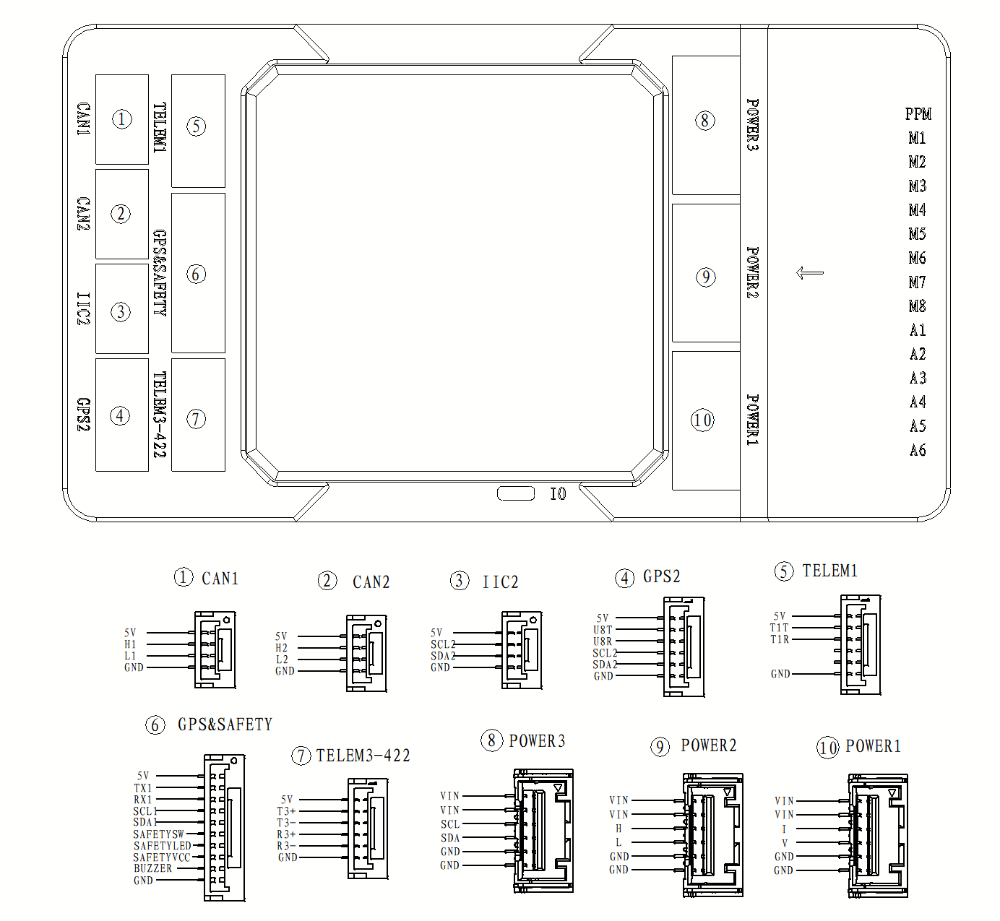
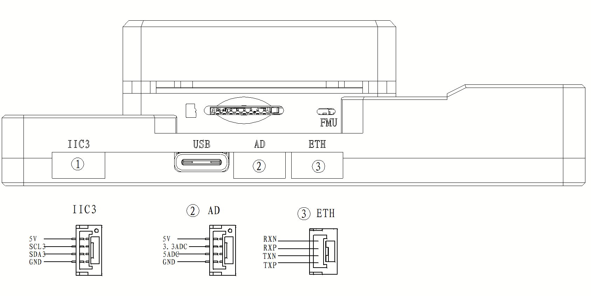
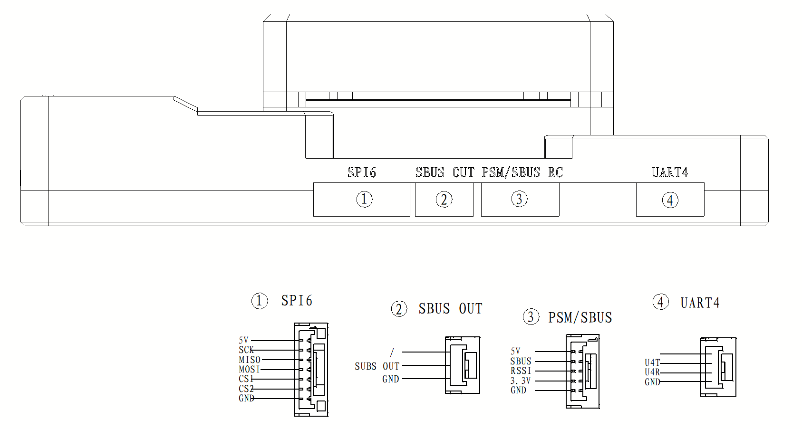

# Svehicle E2

:::warning
PX4 does not manufacture this (or any) autopilot.
:::

The _E2_ is an advanced autopilot manufactured by Svehicle<sup>&reg;</sup>.

The autopilot is recommended for commercial system integration but is also suitable for academic research and any other applications.


The E2 brings you ultimate performance, stability, and reliability in every aspect.

::: info
These flight controllers are [manufacturer supported](../flight_controller/autopilot_manufacturer_supported.md).
:::

### Processors & Sensors

- FMU Processor: STM32H753IIK6
  - 32 Bit Arm® Cortex®-M7, 480MHz, 2MB flash memory, 1MB RAM
- IO Processor: STM32F103
  - 32 Bit Arm® Cortex®-M3, 72MHz, 20KB SRAM
- On-board sensors
  - Accel/Gyro: BMI088
  - Accel/Gyro: ICM-42688-P
  - Accel/Gyro: ICM-20649
  - Mag: RM3100
  - Barometer: 2x ICP-20100

### Interfaces

- 14x PWM Servo Outputs
- 1x Dedicated R/C Input for Spektrum / DSM and S.Bus
- 1x Analog/PWM RSSI Input
- 2x TELEM Ports (with full flow control)
- 1x UART4 Port
- 2x GPS Ports
  - 1x Full GPS plus Safety Switch Port (GPS1)
  - 1x Basic GPS Port (with I2C, GPS2)
- 1x USB Port (TYPE-C)
- 1x Ethernet Port
  - Transformerless application
  - 100Mbps
- 3x I2C Bus Ports
- 1x SPI Bus
  - 1x Chip Select Line
  - 1x Data Ready Line
  - 1x SPI Reset Line
- 2x CAN Ports
- 3x Power Input Ports
  - ADC Power Input
  - I2C Power Input
  - DroneCAN/UAVCAN Power Input
- 2x AD Ports
  - Analog Input (3.3V)
  - Analog Input (6.6V - not supported by PX4)
- 1x Dedicated Debug Port
  - FMU Debug

## Purchase Channels

Order from [Svehicle](https://svehicle.cn/).

## Serial Port Mapping

| UART   | Device     | Port          |
| ------ | ---------- | ------------- |
| USART1 | /dev/ttyS0 | GPS           |
| USART2 | /dev/ttyS1 | TELEM3        |
| USART3 | /dev/ttyS2 | Debug Console |
| UART4  | /dev/ttyS3 | UART4         |
| UART5  | /dev/ttyS4 | TELEM2        |
| USART6 | /dev/ttyS5 | PX4IO/RC      |
| UART7  | /dev/ttyS6 | TELEM1        |
| UART8  | /dev/ttyS7 | GPS2          |

## PWM Output

The E2-Plus flight controller supports up to 14 PWM outputs.
First 8 outputs (labelled M1 to M8) are controlled by a dedicated STM32F103 IOMCU controller.
The remaining 6 outputs (labelled 9 to 16) are the "auxiliary" outputs. These are directly attached to the STM32H753 FMU controller .

The 14 PWM outputs are:

M1 - M8 are connected to the IOMCU
A1 - A6 are connected to the FMU

M1 - M8 support DShot and are in 3 groups:

- M1, M2 in group 1
- M3, M4 in group 2
- M5, M6, M7, M8 in group 3

The 6 FMU PWM outputs are in 2 groups:

A1 - A4 are in one group.
A5, A6 are in a 2nd group.

Channels within the same group need to use the same output rate. If any channel in a group uses DShot then all channels in the group need to use DShot.

### Electrical data

- Voltage Ratings:
  - Max input voltage: 5.7V
  - USB Power Input: 4.75\~5.25V
  - Servo Rail Input: 0\~9.9V
- Current Ratings:
  - TELEM1 and GPS2 combined output current limiter: 1.5A
  - All other port combined output current limiter: 1.5A

## Battery Monitoring

The board has connectors for 3 power monitors. The board is configure by default for a DroneCAN power monitor, and also has analog power monitor defaults configured which is enabled. The default PDB included with the E2+ is DroneCAN and must be connected to Power 2. If using a analog power monitor, battery voltage is on pin 6 and current on pin 9 and this should be connected to Power 1.

## Building Firmware

:::tip
Most users do not need to build this firmware!
It is pre-built and installed automatically by _QGroundControl_ when the appropriate hardware is connected.
:::

To [build PX4](../dev_setup/building_px4.md) for this target, execute:

```
make svehicle_e2_default
```

## Debug Port

The [PX4 System Console](../debug/system_console.md) and [SWD Interface](../debug/swd_debug.md) operate on the **FMU Debug** port.

| Pin      | Signal           | Volt  |
| -------- | ---------------- | ----- |
| 1 (red)  | 5V+              | +5V   |
| 2 (blk)  | DEBUG TX (OUT)   | +3.3V |
| 3 (blk)  | DEBUG RX (IN)    | +3.3V |
| 4 (blk)  | FMU_SWDIO        | +3.3V |
| 5 (blk)  | FMU_SWCLK        | +3.3V |
| 6 (blk)  | GND              | GND   |

For information about using this port see:

- [SWD Debug Port](../debug/swd_debug.md)
- [PX4 System Console](../debug/system_console.md) (Note, the FMU console maps to USART3).







## Supported Platforms / Airframes

Any multirotor/airplane/rover or boat that can be controlled using normal RC servos or Futaba S-Bus servos. The complete set of supported configurations can be found in the [Airframe Reference](../airframes/airframe_reference.md).
