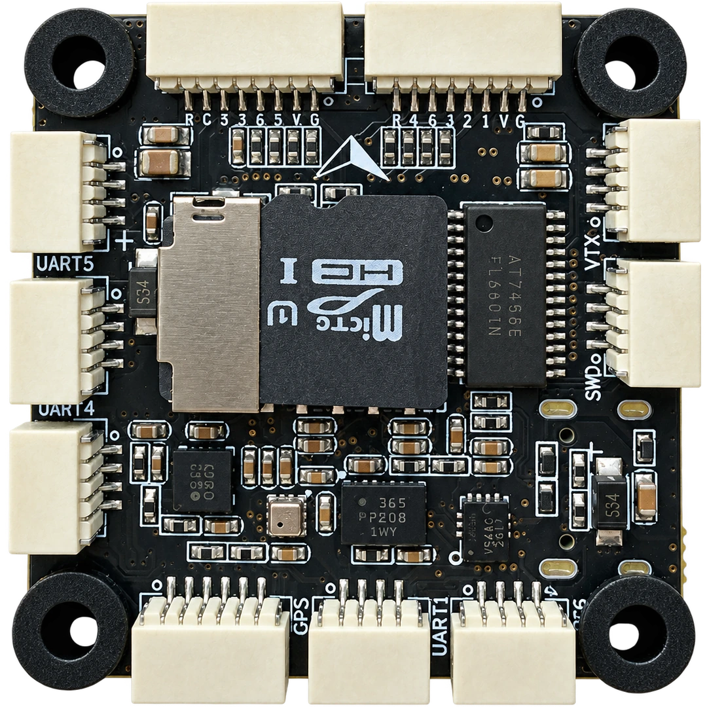
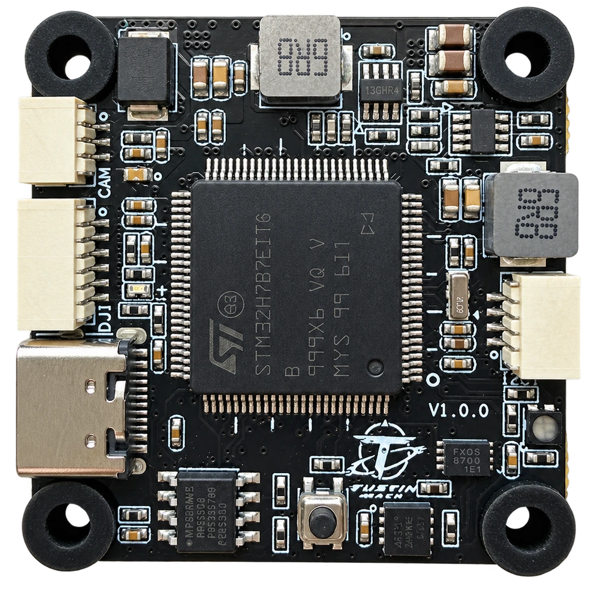

# Tustin MACH

<Badge type="tip" text="PX4 main" />

::: warning
PX4 does not manufacture this (or any) autopilot.
Contact [Tustin Dynamics](https://tustindynamics.com/products/tustin-mach) for hardware support or compliance issues.
:::

The _Tustin MACH_ is a compact flight controller manufactured by Tustin Dynamics for small UAVs and research platforms.
It uses an STM32H743 processor, two IMUs, eight motor outputs, CAN, and onboard analogue video OSD.

::: info
This flight controller is [manufacturer supported](../flight_controller/autopilot_manufacturer_supported.md).
:::

## Specifications

| Component                 | Specification                                     |
| ------------------------- | ------------------------------------------------- |
| Processor                 | STM32H743VIT6, Arm Cortex-M7, 480 MHz, 2 MB flash |
| Accelerometers/gyroscopes | Bosch BMI088 and InvenSense ICM-45686             |
| Magnetometer              | IST8310                                           |
| Barometer                 | ICP201xx                                          |
| Parameter storage         | FM25V02A FRAM                                     |
| Identity storage          | 24LC64 EEPROM for the unique product identifier   |
| Flight logging            | microSD card                                      |
| Motor/servo outputs       | 8 PWM/DShot outputs                               |
| Expansion                 | 1 CAN bus, external I2C1, serial ports            |
| Video                     | AT7456E analogue OSD and serial MSP OSD support   |
| USB                       | USB Type-C                                        |
| Board size                | 36 × 36 mm; 8 mm overall height                   |
| Mounting                  | 30.5 × 30.5 mm pattern, 4 mm holes                |
| Weight                    | 10 g                                              |

## Purchase

Order from the manufacturer's [Taobao listing](https://item.taobao.com/item.htm?id=1084736032551).
See the [Tustin MACH product page](https://tustindynamics.com/products/tustin-mach) for hardware details and availability.

## Pinouts

The following connector views and signal order are from the [manufacturer's pinout reference](https://tustindynamics.com/zh/products/tustin-mach).
All signal connectors use SH1.0 (1.0 mm pitch); USB uses a Type-C connector.
Read horizontal connectors from left to right and vertical connectors from top to bottom, with the board oriented as shown in the corresponding image.
The order below describes the board connectors, not the view into a mating cable plug.

### Connector Side



| Connector           | Signal Order                                        |
| ------------------- | --------------------------------------------------- |
| M5–M8 ESC           | `RX7`, `CUR`, `M8`, `M7`, `M6`, `M5`, `VBAT`, `GND` |
| M1–M4 ESC           | `RX7`, `CUR`, `M4`, `M3`, `M2`, `M1`, `VBAT`, `GND` |
| TELEM3 (UART5)      | `GND`, `5V`, `TX5`, `RX5`                           |
| TELEM2 (UART4)      | `GND`, `5V`, `TX4`, `RX4`                           |
| CAN                 | `5V`, `CANH`, `CANL`, `GND`                         |
| VTX                 | `TX2`, `VIDEO_OUT`, `GND`, `12V`                    |
| SWD                 | `SWCLK`, `SWDIO`, `GND`, `3V3`                      |
| GPS1 (UART3 + I2C1) | `5V`, `TX3`, `RX3`, `SCL`, `SDA`, `GND`             |
| TELEM1 (UART1)      | `GND`, `5V`, `TX1`, `RX1`                           |
| RC (UART6)          | `GND`, `5V`, `TX6`, `RX6`                           |

### Controller Side



| Connector        | Signal Order                             |
| ---------------- | ---------------------------------------- |
| CAM              | `VIDEO_IN`, `GND`, `12V`                 |
| GPS2 / DJI O3/O4 | `12V`, `GND`, `TX2`, `RX2`, `GND`, `RX6` |
| I2C1             | `GND`, `SDA`, `SCL`, `5V`                |

USB Type-C provides power, firmware upload, and USB communication.

### Shared Signals

- Both ESC headers connect to the same UART7 receive signal (`RX7`) and current-sense input (`CUR`).
  They are not independent telemetry or current-sense inputs.
- The RC and GPS2/DJI connectors share UART6 `RX6`.
  Connect only one receiver output to this signal.
- VTX `TX2` and the GPS2/DJI serial interface share USART2.
  Configure that serial port for the connected device.
- GPS1 and the I2C1 connector share external I2C bus 1.

## Power

The ESC headers accept a 3–8S battery supply on `VBAT`.
USB can power the flight controller for setup and firmware installation.

::: warning
The power pins are not interchangeable.
CAM, VTX, and GPS2/DJI provide 12V; general peripheral connectors provide 5V; SWD exposes 3.3V.
In particular, the connector called `GPS2` in PX4 is the 12V DJI connector: do not connect a 5V-only GNSS module to its power pin.
Check both voltage and signal order before connecting peripherals or an ESC cable.
:::

The default analogue battery settings use a voltage divider of 21.0 and a current scale of 40 A/V.
Set the battery cell count and calibrate voltage/current measurement for the connected power hardware using [Power Setup](../config/battery.md).

## Serial Port Mapping

| Hardware | NuttX Device   | PX4 Port Selection | Board Connection                   |
| -------- | -------------- | ------------------ | ---------------------------------- |
| USB      | `/dev/ttyACM0` | USB                | USB Type-C                         |
| USART1   | `/dev/ttyS0`   | TELEM 1            | TELEM1 / UART1                     |
| USART2   | `/dev/ttyS1`   | GPS 2              | GPS2 / DJI; `TX2` also on VTX      |
| USART3   | `/dev/ttyS2`   | GPS 1              | GPS1 / GPS                         |
| UART4    | `/dev/ttyS3`   | TELEM 2            | TELEM2 / UART4                     |
| UART5    | `/dev/ttyS4`   | TELEM 3            | TELEM3 / UART5                     |
| USART6   | `/dev/ttyS5`   | RC                 | RC / UART6; `RX6` also on DJI      |
| UART7    | `/dev/ttyS6`   | UART 6             | ESC telemetry `RX7` (receive only) |

The PX4 selection `UART 6` refers to hardware UART7 on this board; it is separate from the RC port on USART6.
See [Serial Port Configuration](../peripherals/serial_configuration.md) to assign peripherals.

## PWM/DShot Outputs

All eight outputs are driven directly by the FMU and support [PWM and DShot](../peripherals/dshot.md).
They use the following timer groups:

| Outputs | Timer |
| ------- | ----- |
| M1–M4   | TIM1  |
| M5–M6   | TIM3  |
| M7–M8   | TIM4  |

Outputs in the same timer group must use the same protocol and rate.
Assign motor and servo functions in [Actuator Configuration](../config/actuators.md).

## Setup

1. Install PX4 using [Loading Firmware](../config/firmware.md).
   For a locally built image, select the custom firmware option and load `tustin_mach_default.px4`.
2. Connect the GNSS module to GPS1, the receiver to RC, and telemetry peripherals to the corresponding TELEM connectors, following the pinouts above.
3. Insert a microSD card for flight logging.
4. Complete [Basic Configuration](../config/index.md), including airframe selection, sensor calibration, radio setup, power setup, and actuator assignment.

### MS4525DO Airspeed Sensor

The `tustin_mach_default` firmware includes the MS4525DO differential-pressure driver.
To use an external I2C MS4525DO sensor:

1. Connect the sensor to external I2C1 (`GND`, `SDA`, `SCL`, `5V`), matching signals rather than cable colours.
   Use a sensor module rated for the connector's 5V supply.
   GPS1 exposes the same I2C bus.
2. Set [SENS_EN_MS4525DO](../advanced_config/parameter_reference.md#SENS_EN_MS4525DO) to `1` and reboot.
3. Complete [Airspeed Sensor Calibration](../config/airspeed.md).

The driver is included in the firmware but is disabled by default until the parameter is enabled.
After reboot, check sensor operation in the [MAVLink Console](../debug/mavlink_shell.md):

```sh
ms4525do status
listener differential_pressure
```

## Building Firmware

To [build PX4](../dev_setup/building_px4.md) for this board:

```sh
make tustin_mach_default
```

The firmware is written to `build/tustin_mach_default/tustin_mach_default.px4`.
The in-tree bootloader target is:

```sh
make tustin_mach_bootloader
```

## Debugging

The four-pin SWD connector exposes `SWCLK`, `SWDIO`, `GND`, and `3V3`.
See [SWD Debugging](../debug/swd_debug.md) for connecting a debug probe.
For a shell over USB, use the [MAVLink Console](../debug/mavlink_shell.md).
