# VOLOLAND NarinFC-H7

The NarinFC-H7 is an advanced flight controller family designed and produced by [VOLOLAND Inc.](https://vololand.com "VOLOLAND Inc.")

It uses a higher-performance STM32H7 processor and integrates industrial-grade sensors.

Compared with previous autopilots, it has better performance and higher reliability.

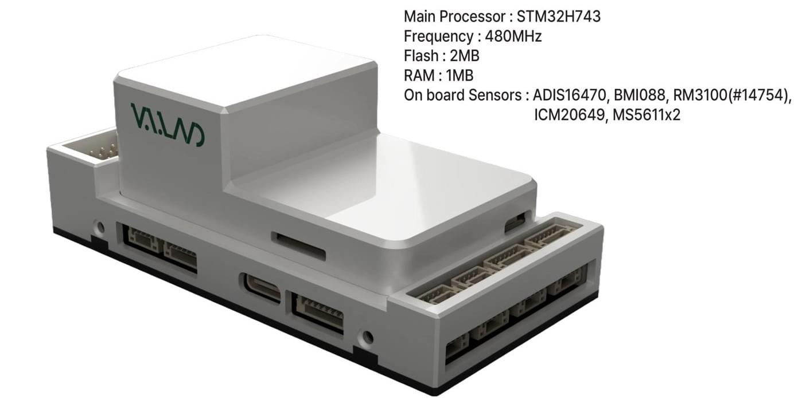

## Features/Specifications

**Processor**

- STM32H743

**Sensors**

- Accelerometer/Gyroscope: ADIS16470
- Accelerometer/Gyroscope: ICM-20649
  - Accelerometer/Gyroscope: BMI088
  - Magnetometer: RM3100
  - Barometer: MS5611\*2

**Interfaces**

- 14 PWM servo outputs
- Support multiple RC inputs (SBus / CPPM / DSM)
- Analog/PWM RSSI input
- 2 GPS ports (GPS and UART4 ports)
- 4 ⅹ I2C buses
- 2 ⅹ CAN bus ports
- 2 ⅹ Power ports
- 2 ⅹ ADC ports
- 1 ⅹ USB port

**Power**

- Power 4.3V ~ 5.4V
- USB Input 4.75V ~ 5.25V

**Size and Dimensions**

- 93.4mm x 46.4mm x 34.1mm
- 106g

## Where to Buy

[VOLOLAND Inc.](https://vololand.com "VOLOLAND Inc.")

## Outline Dimensions

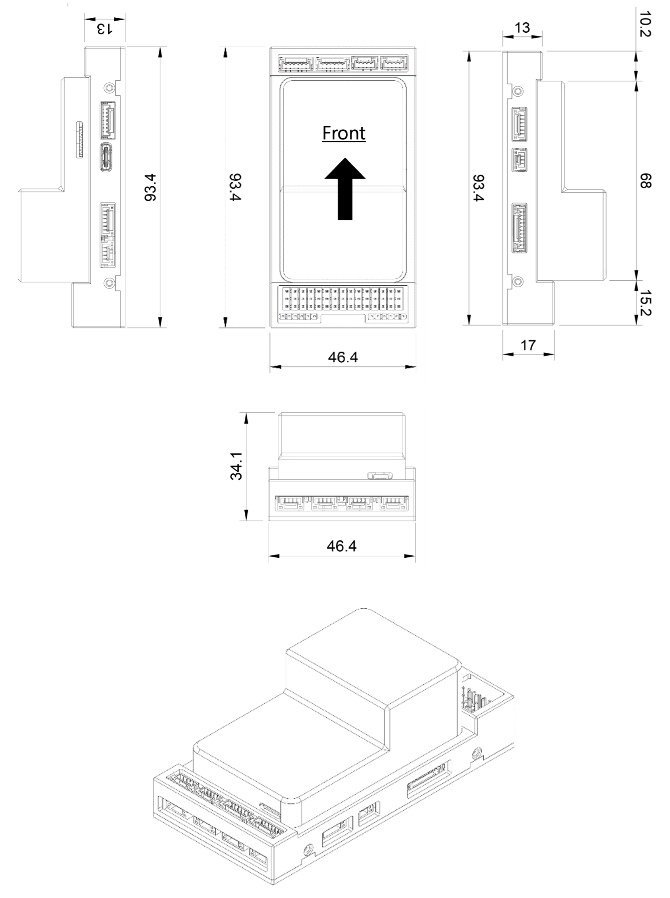

## Wiring Diagram

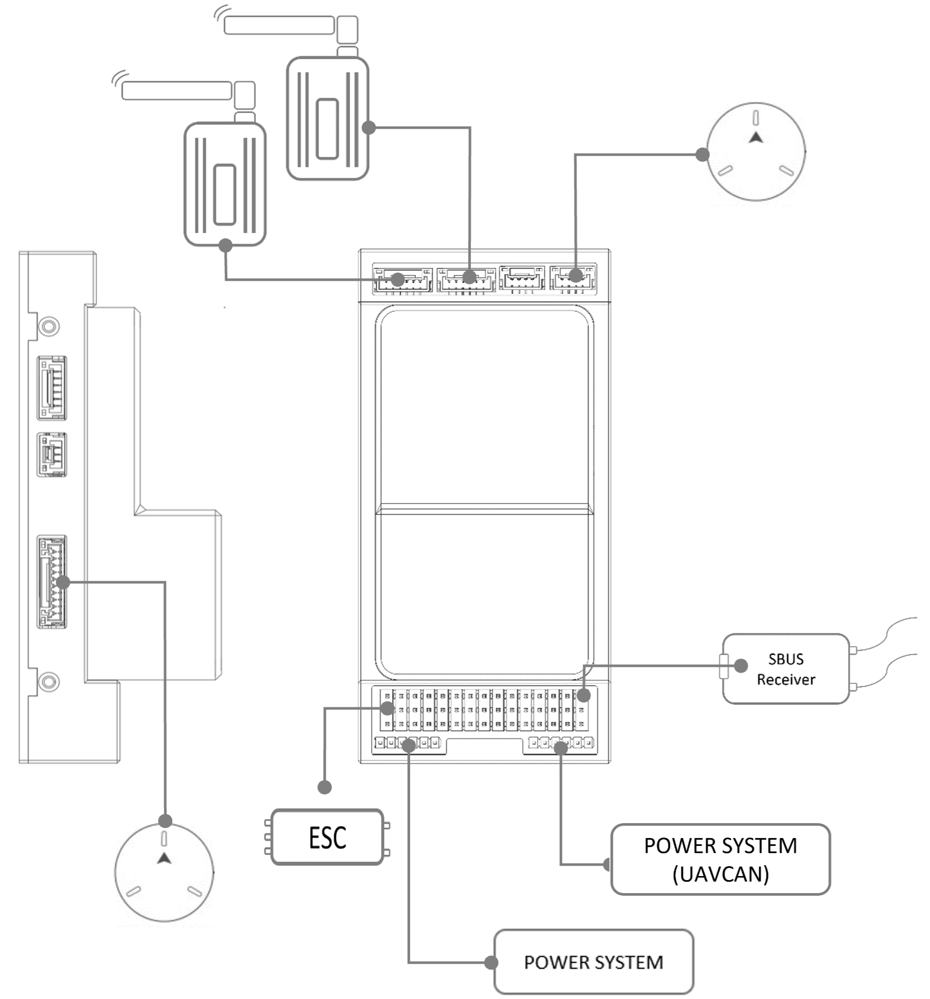

## Serial Port Mapping

UART corresponding to each SERIAL port, and its default protocol, are shown below:

| UART   | Serial  | Port                                                              |
| ------ | ------- | ----------------------------------------------------------------- |
| USB    | SERIAL0 | MAVLink2 default                                                  |
| USART2 | SERIAL1 | Telemetry1 (MAVLink2, DMA-enabled)                                |
| USART6 | SERIAL2 | Telemetry2 (MAVLink2, DMA-enabled)                                |
| USART1 | SERIAL3 | GPS1 (DMA-enabled)                                                |
| UART4  | SERIAL4 | GPS2                                                              |
| UART8  | SERIAL5 | User (not available except on custom carrier boards, DMA-enabled) |
| UART7  | SERIAL6 | DEBUG                                                             |
| USB2   | SERIAL7 | MAVLink2                                                          |

Serial protocols can be adjusted to personal preferences.

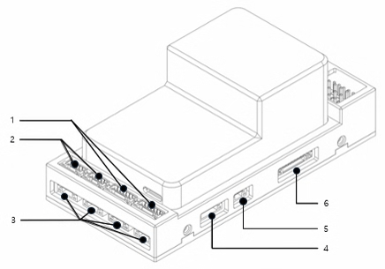

## Port Diagrams & Pin-outs

### TELEM1, TELEM2 Port

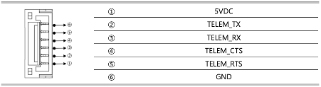

- JST GH 6P connector
- TELEMETRY Port

### CAN1, CAN2 Port

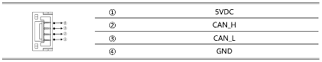

- JST GH 4P connector
- Communication Protocol: UAVCAN v0 (default), UAVCAN v1 (limited support)
- Power Supply: Typically provides 5V or 12V output
- Pin Configuration: Usually includes CAN_H, CAN_L, VCC, and GND

### I2C, I2C2, I2C3, I2C4 Port

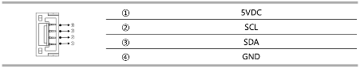

- JST GH 4P connector

### UART4 Port

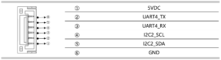

- JST GH 6P connector

### RSSI Port

- RSSI input

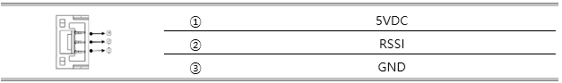

### GPS & Safety Port

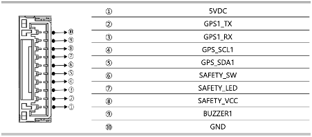

- JST GH 10P connector
- GPS NODMA

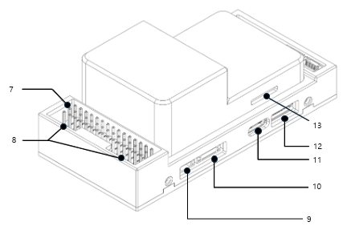

### PWM & RC_IN

The NarinFC-H7 supports up to 14 PWM outputs.
Outputs are grouped and all outputs within their group must be the same protocol.

- 2.54mm pitch DuPont connector
- RC_IN : Remote control receiver

### Power Input

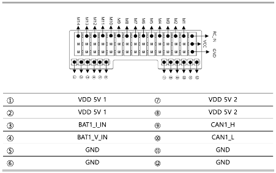

- 2mm pitch DuPont connector

### ADC Port

- ADC input

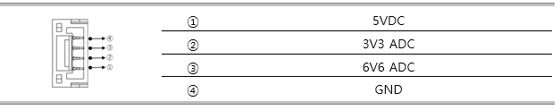

### DEBUG/UART7 Port

UART7(SERIAL6) is labeled DEBUG RX/TX below

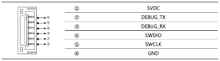

- JST GH 6P connector
- DEBUG NODMA

### USB Port

- USB C Type

### SPI Port

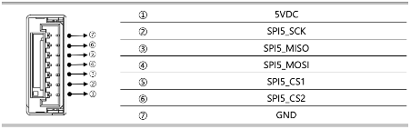

- JST GH 7P connector
- SPI Port

### SD CARD

- SD CARD

## PWM Output

The NarinFC-H7 supports up to 14 PWM outputs.
All outputs except M13 and M14 support DShot.
Outputs 1-8 support Bi-Directional DShot.

The 14 PWM outputs are in 4 groups:

- Outputs 1, 2, 3 and 4 in group1
- Outputs 5, 6, 7 and 8 in group2
- Outputs 9, 10, 11 and 12 in group3
- Outputs 13 and 14 in group4

ALL outputs within the same group need to use the same output rate and protocol.

## GPIOs

The 14 outputs can be used as GPIOs (relays, buttons, RPM etc).
To use them you need to set the output’s `SERVOx_FUNCTION` to -1.
See GPIOs page for more information.

The numbering of the GPIOs for use in the PIN parameters in PX4 is:

- PWM1(M1) 50
- PWM2(M2) 51
- PWM3(M3) 52
- PWM4(M4) 53
- PWM5(M5) 54
- PWM6(M6) 55
- PWM7(M7) 56
- PWM8(M8) 57
- PWM9(M9) 58
- PWM10(M10) 59
- PWM11(M11) 60
- PWM12(M12) 61
- PWM13(M13) 62
- PWM14(M14) 63

## Analog inputs

The NarinFC-H7 has 2 analog inputs, one 6V tolerant and one 3.3V tolerant

- ADC Pin16 -> BATT_VOLTAGE_SENS
- ADC Pin17 -> BATT_CURRENT_SENS
- ADC Pin14 -> BATT2_VOLTAGE_SENS
- ADC Pin2 -> BATT2_VOLTAGE_SENS
- ADC Pin4 -> SPARE1_ADC1(6.6V)
- ADC Pin18 -> SPARE2_ADC1(3.3V)
- ADC Pin6 -> RSSI_IN_ADC1(3.3V)
- ADC Pin8 -> VDD_5V_SENS
- ADC Pin11 -> SCALED_V3V3

## Loading Firmware

This board comes with PX4 firmware pre-installed and other vehicle/revision PX4 firmware can be loaded using most Ground Control Stations.

The board comes pre-installed with an PX4 bootloader, allowing the loading of `*.px4` firmware files with any PX4 compatible ground station, such as QGroundControl.
