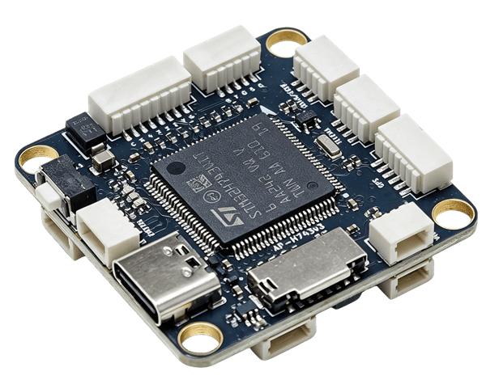
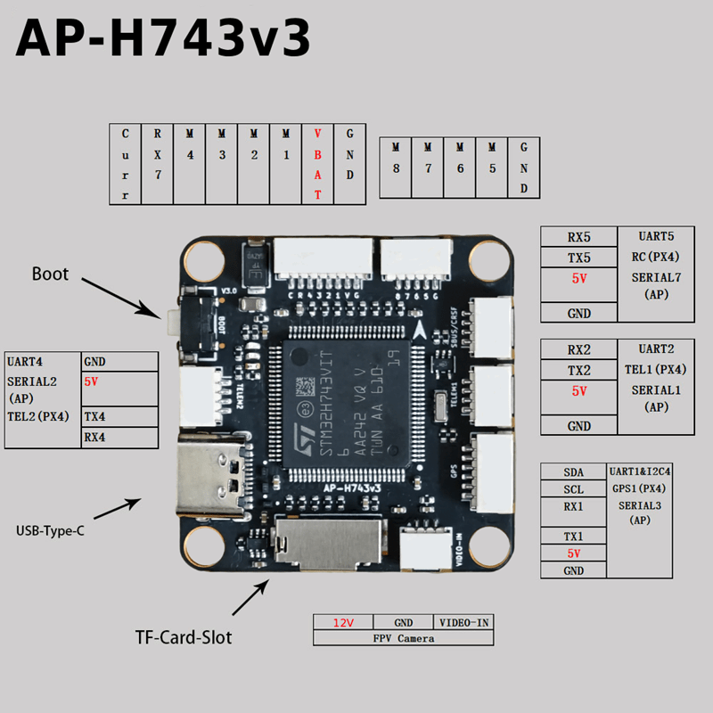
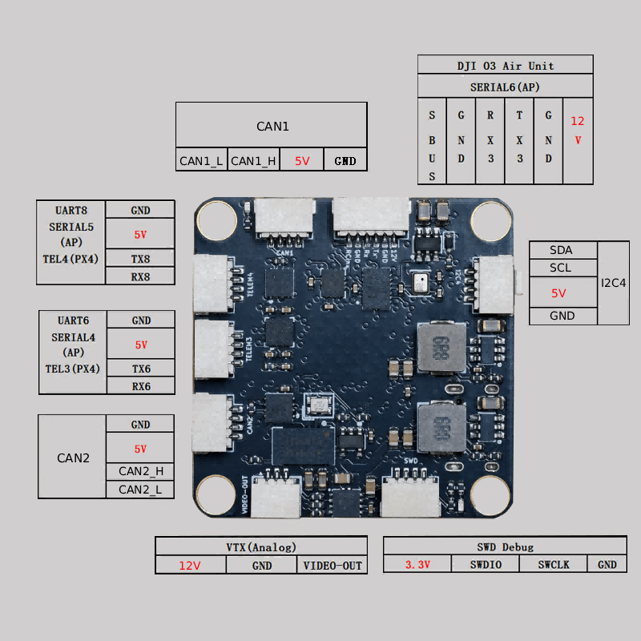
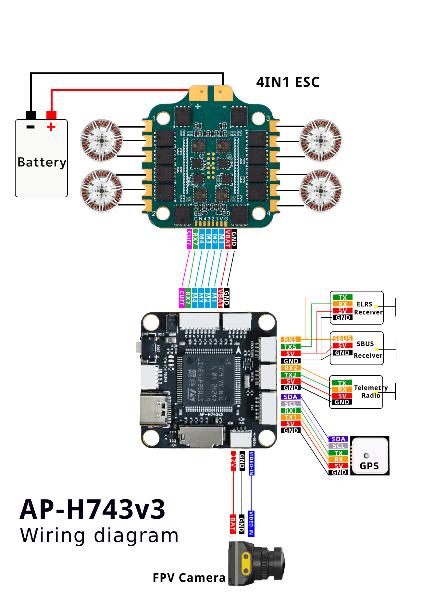
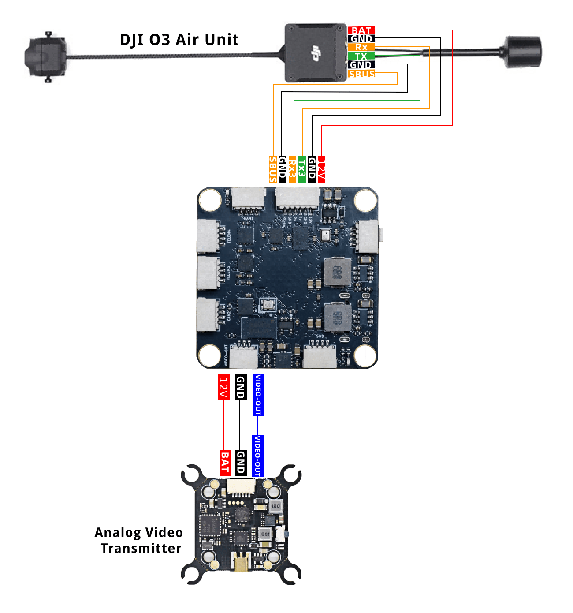

# AP-H743v3 Flight Controller

<Badge type="tip" text="main (PX4 v2.0)" />

::: warning
PX4 does not manufacture this (or any) autopilot.
:::

The AP-H743v3 is a flight controller designed and manufactured by [X-MAV](http://www.x-mav.cn/)



::: info
This flight controller is [manufacturer supported](../flight_controller/autopilot_manufacturer_supported.md).
:::

## Key Features

### Processors & Sensors

- FMU Processor: STM32H743 microcontroller
- On-board sensors
  - Accel/Gyro: BMI088/ICM45686 (dual IMUs)
  - Mag: QMC5883P
  - Barometer: SPA06
  - OSD: AT7456E

### Interfaces

- 8 UARTs
- 8 PWM outputs
- 2 CAN
- 1 I2C
- 1 SWD
- MicroSD Card Slot
- Support 2-8S(6-35V) Input
- 12V 2A BEC; 5V 2A BEC

### Mechanical

- Mounting: 30.5 x 30.5mm, Φ4mm
- Dimensions: 36 x 36 x 8 mm
- Weight: 9g

## Purchase Channels {#store}

**Purchase link**: [X-MAV Taobao Store](https://shop108812501.taobao.com/) (available in September 2026)

## Radio Control

A [Radio Control (RC) system](../getting_started/rc_transmitter_receiver.md) is required if you want to manually control your vehicle (PX4 does not require a radio system for autonomous flight modes).

The RC port is connected to the FMU and you can attach a receiver that uses the protocols `DSM`, `SBUS`, `CSRF`, `GHST`, or other protocol listed in [Radio Control modules](../modules/modules_driver_radio_control.md).
You will need to enable the protocol by setting the corresponding parameter `RC_xxxx_PRT_CFG`, such as [RC_CRSF_PRT_CFG](../advanced_config/parameter_reference.md#RC_CRSF_PRT_CFG) for a [CRSF receiver](../telemetry/crsf_telemetry.md).

## Interfaces Diagram

::: info
All the connectors used on the board are SH1.0
:::





## Sample Wiring Diagram




## Building Firmware

To [build PX4](../dev_setup/building_px4.md) for this target:

```sh
make x-mav_ap-h743v3_default
```

## Installing PX4 Firmware

The firmware can be installed in any of the normal ways:

- Build and upload the source

  ```sh
  make x-mav_ap-h743v3_default upload
  ```

- [Load the firmware](../config/firmware.md) using _QGroundControl_.
  You can use either pre-built firmware or your own custom firmware.

## Serial Port Mapping

| UART   | Device     | Port          |
| ------ | ---------- | ------------- |
| USART1 | /dev/ttyS0 | GPS1          |
| USART2 | /dev/ttyS1 | TELEM1        |
| USART3 | /dev/ttyS2 | EXT2          |
| UART4  | /dev/ttyS3 | TELEM2        |
| UART5  | /dev/ttyS4 | RC            |
| USART6 | /dev/ttyS5 | TELEM3        |
| UART7  | /dev/ttyS6 | ESC telemetry |
| UART8  | /dev/ttyS7 | TELEM4        |

## PWM Output

The AP-H743v3 supports up to 8 PWM outputs.

All the channels support DShot and BiDir DShot.

Outputs are grouped and every output within a group must use the same output protocol:

1, 2, 3, 4 are Group 1;

5, 6 are Group 2;

7, 8 are Group 3;

## Battery Monitoring

The board has an internal voltage sensor and connections on the ESC connector for an external current sensor input.
The voltage sensor can handle up to 8S LiPo batteries.

The default battery parameters are:

- BAT1_A_PER_V 17
- BAT1_N_CELLS 4
- BAT1_V_CHARGED 4.2
- BAT1_V_DIV 12.11
- BAT1_V_EMPTY 3.2

**Note**: These default multipliers are starting values. Since the current sensor is external (located on the ESC connector), you must adjust `BAT1_A_PER_V` according to your specific current sensor's characteristics.

## Supported Platforms / Airframes

Any multicopter / airplane / rover or boat that can be controlled with normal RC servos or Futaba S-Bus servos.
The complete set of supported configurations can be seen in the [Airframes Reference](../airframes/airframe_reference.md).

## Debug Port {#debug_port}

### SWD

The SWD interface is located on the **bottom side** of the board (see Back View above).
Pin definitions (from left to right):

| Pin | Signal |
| --- | ------ |
| 1   | VCC (3.3V) |
| 2   | SWDIO |
| 3   | SWCLK |
| 4   | GND |
