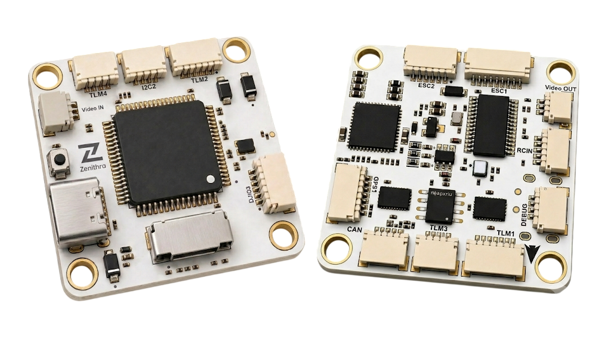
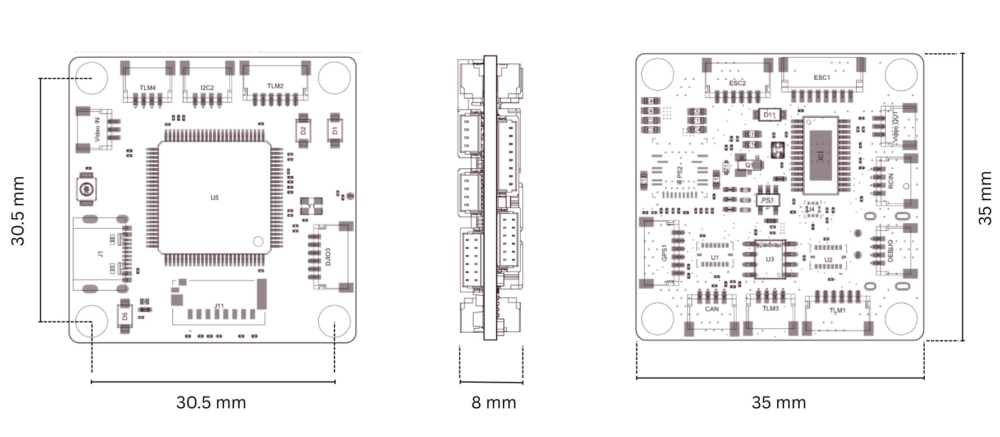
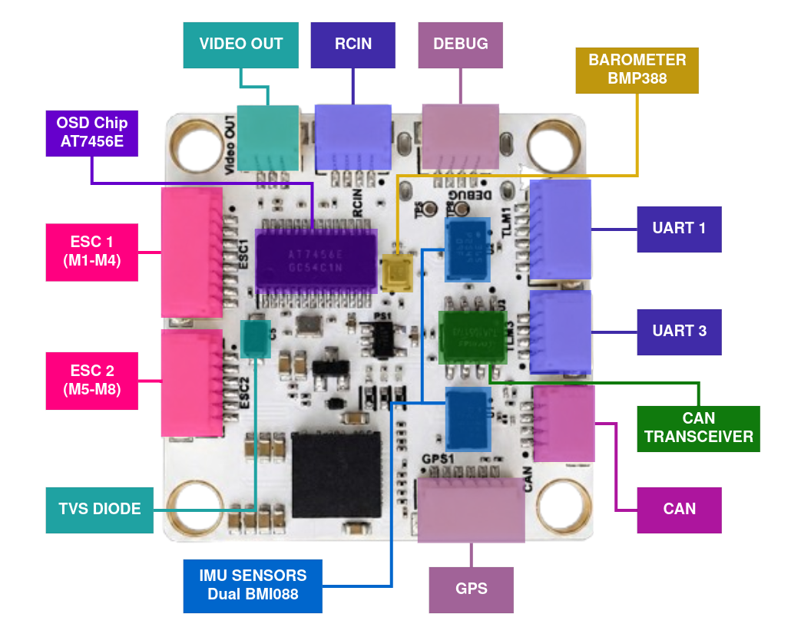
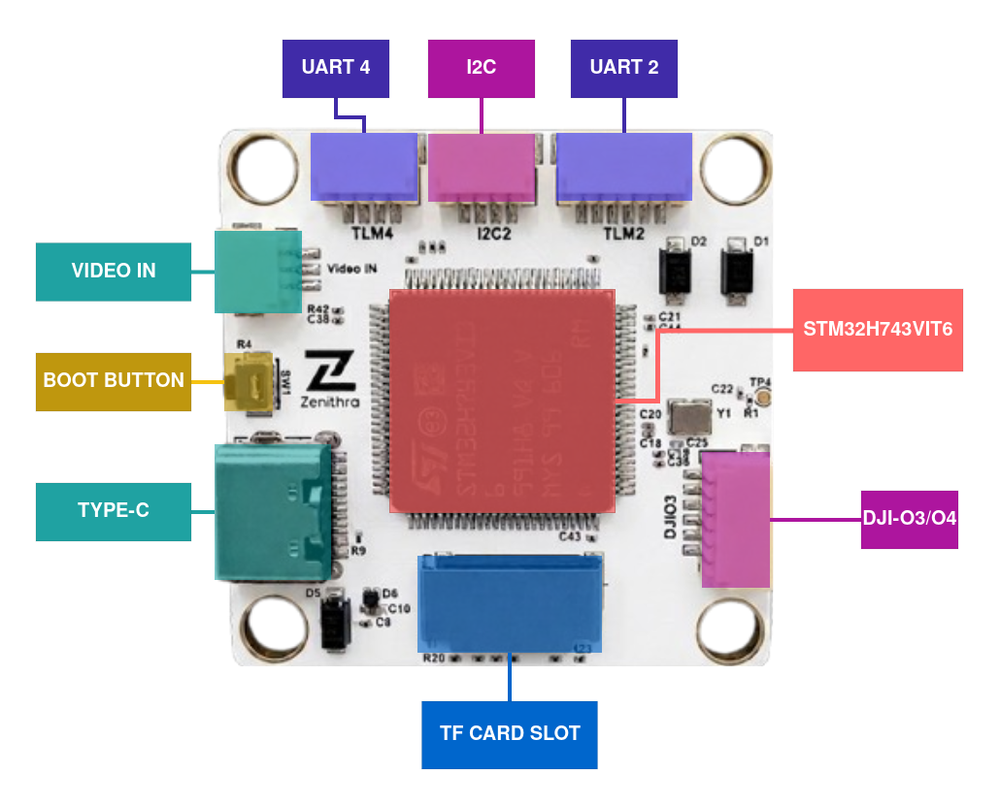
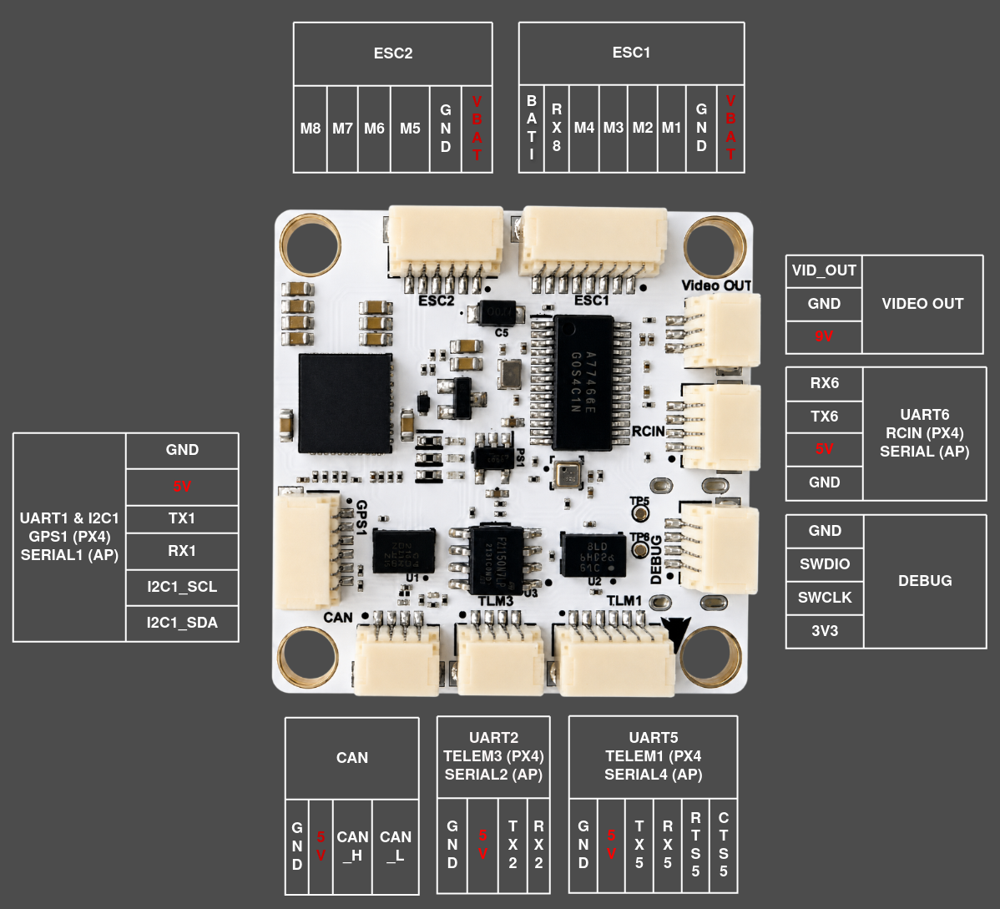
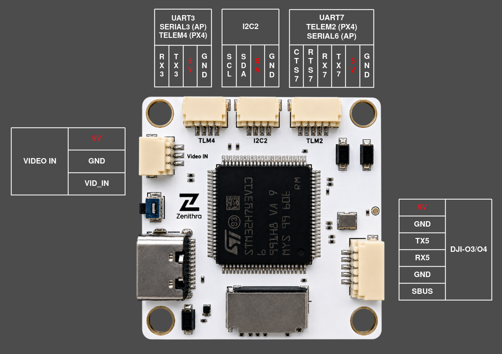

# ZenFC H743

<!-- TODO: set to the PX4 release this target first merges into -->
<Badge type="tip" text="PX4 main (v2.0)" />

::: warning
PX4 does not manufacture this (or any) autopilot.
Contact the [manufacturer](https://www.zenithratech.com/contact) for hardware support or compliance issues.
:::

The _ZenFC H743_ is a flight controller designed by Zenithra Tech.
It is built around the STM32H743 processor with dual Bosch BMI088 IMUs for sensor redundancy, an onboard barometer, and an integrated OSD.



::: info
This flight controller is [manufacturer supported](../flight_controller/autopilot_manufacturer_supported.md).
:::

## Key Features

- **MCU:**
  - STM32H743VIT6 (32-bit Arm® Cortex®-M7, 480 MHz)
- **IMU:**
  - 2x Bosch BMI088 (accel + gyro, independent SPI buses for redundancy)
- **Barometer:**
  - Bosch BMP388
- **OSD:**
  - Onboard AT7456E OSD chip
- **Interfaces:**
  - 7x UARTs
  - 1x CAN
  - 2x external I2C (I2C1 with GPS connector and dedicated I2C2 connector)
  - 8x PWM outputs (Dshot supported)
  - microSD card slot
  - 1x USB Type-C
- **Power:**
  - 2x ADC (V_BAT & current sense)
  - Battery Input range - 2S-6S
  - BEC Outputs
    - 9V 3A cont.
    - 5V 3A cont.

## Dimensions

- **Mounting:** 30.5 mm x 30.5 mm /Φ4mm hole
- **Dimensions:** 35mm x 35mm x 8mm
- **Weight:** 9g



## Where to Buy

Order from [Zenithra Tech](https://www.zenithratech.com/solutions/components).

## Flight Controller Layout





## Serial Port Mapping

| UART   | Device     | PX4 Port |
| ------ | ---------- | -------- |
| USART1 | /dev/ttyS0 | GPS1     |
| USART2 | /dev/ttyS1 | TEL3     |
| USART3 | /dev/ttyS2 | TEL4     |
| UART5  | /dev/ttyS3 | TEL1     |
| USART6 | /dev/ttyS4 | RC       |
| UART7  | /dev/ttyS5 | TEL2     |
| UART8  | /dev/ttyS6 | UART6    |

## Connectors & Pinout

Board uses JST SH connectors for all interfaces.





**Note** - SBus pin on DJI O3/O4 port is internally connected to RX6 (`RCIN`).

### PWM Outputs

The 8 outputs are in 3 groups:

- Outputs 1-4 in group1
- Outputs 5-6 in group2
- Outputs 7-8 in group3

**Note**:
- All outputs support PWM and [DShot](../peripherals/dshot.md) protocol.
  Outputs 1-6 and 8 support "bidirectional DShot" (or "BDShot") telemetry.
- Outputs 1-4 default to DShot300 ([PWM_MAIN_TIM0](../advanced_config/parameter_reference.md#PWM_MAIN_TIM0) = `-4`); outputs 5-6 and 7-8 default to PWM at 400 Hz.
- Each group's protocol can be changed independently using the corresponding `PWM_MAIN_TIMx` parameter, including to [Bidirectional DShot](../peripherals/dshot.md#bidirectional-dshot-telemetry) (BDShot) for ESC telemetry.

### Debug Port

This board does not configure a dedicated UART as a system console.
Use the [MAVLink Shell](../debug/mavlink_shell.md) over USB for console/NSH access using QGroundControl.

**SWD**

The board features a [**4-pin SWD Debug**](../debug/swd_debug.md) interface (3V3 / SWCLK / SWDIO / GND) for hardware debugging.


## Radio Control

A [Radio Control (RC) system](../getting_started/rc_transmitter_receiver.md) is required if you want to manually control your vehicle (PX4 does not require a radio system for autonomous flight modes).
See [Radio Control modules](../modules/modules_driver_radio_control.md) for the list of supported protocols.

RC input is mapped to **USART6** (`/dev/ttyS4`, `RC` port).
The port supports both single-wire inverted SBUS and full-duplex protocols with telemetry return (such as CRSF), and the receiver protocol is auto-detected by default ([RC_INPUT_PROTO](../advanced_config/parameter_reference.md#RC_INPUT_PROTO) = `-1`).

## PX4 Configuration

In addition to the [basic configuration](../config/index.md), the following
parameter is important:

| Parameter                                                            | Setting                                                                                                    |
| -------------------------------------------------------------------- | ---------------------------------------------------------------------------------------------------------- |
| [SYS_HAS_MAG](../advanced_config/parameter_reference.md#SYS_HAS_MAG) | Disabled by default since the board has no internal magnetometer. Enable it if you attach an external mag. |

## Building Firmware

To [build PX4](../dev_setup/building_px4.md) for this target:

```sh
make zenfc_h743_default
```

## Installing PX4 Firmware

The firmware can be installed in any of the normal ways:

- Build and upload the source:

  ```sh
  make zenfc_h743_default upload
  ```

- [Load the firmware](../config/firmware.md) using _QGroundControl_.
  You can use either pre-built firmware or your own custom firmware.

The board uses the standard PX4 bootloader, so it follows the same generic LED indications as most other boards (Red = Bootloader/Error, Blue = Active/Activity, Green = Powered).

## Further info

- [Zenithra Tech](https://www.zenithratech.com/contact)
