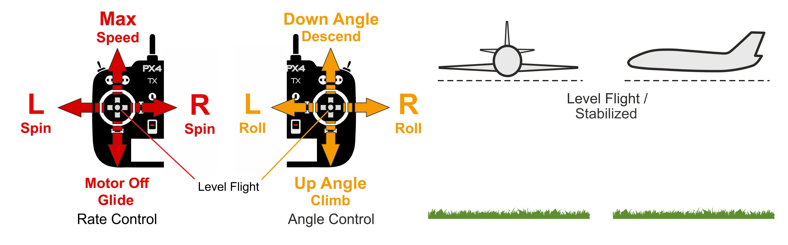

# Stabilized Mode (Fixed-Wing)

&nbsp;

_Stabilized mode_ is a manual mode were centering the sticks levels the vehicle attitude (roll and pitch) and maintains the horizontal posture.

::: info
_Stabilized mode_ is similar to [Altitude mode](../flight_modes_fw/altitude.md) in that releasing the sticks levels the vehicle, but unlike altitude mode it does not maintain altitude or heading.
It is much easier to fly than [Manual mode](../flight_modes_fw/manual.md) because you can't roll or flip it, and if needed it is easy to level the vehicle (by centering the control sticks).
:::

The vehicle climbs/descends based on pitch and throttle input and performs a [coordinated turn](https://en.wikipedia.org/wiki/Coordinated_flight) if the roll stick is non-zero.
Roll and pitch are angle controlled (you can't roll upside down or loop).

The vehicle will glide if the throttle is lowered to 0% (motor stops).
In order to perform a turn the command must be held throughout the maneuver because if the roll is released the plane will stop turning and level itself (the same is true for pitch commands).

The yaw stick can be used to increase/reduce the yaw rate of the vehicle in turns.
If left at center the controller does the turn coordination by itself, meaning that it will apply the necessary yaw rate for the current roll angle to perform a smooth turn.

The diagram below shows the mode behaviour visually (for a [mode 2 transmitter](../getting_started/rc_transmitter_receiver.md#transmitter_modes)).

## Technical Description

Manual mode where centered roll/pitch sticks levels vehicle attitude.
The vehicle course and altitude are not maintained, and can drift due to wind.

- Centered Roll/Pitch/Yaw sticks (inside deadband) put vehicle into straight and level flight.
  The vehicle course and altitude are not maintained, and can drift due to wind.
- Roll stick controls roll angle.
  Autopilot will maintain <a href="https://en.wikipedia.org/wiki/Coordinated_flight">coordinated flight</a>.
- Pitch stick controls pitch angle around the defined offset [FW_PSP_OFF](../advanced_config/parameter_reference.md#FW_PSP_OFF)
- Throttle stick controls throttle directly.
- Yaw stick adds an additional yaw rate setpoint (added to the one calculated by the autopilot to maintain coordinated flight).
  Can be used to manually change the side slip of the vehicle.
- Manual control input is required (such as RC control, joystick).

## Parameters

The mode is affected by the following parameters:

| Parameter                                                                                          | Description                                                                    |
| -------------------------------------------------------------------------------------------------- | ------------------------------------------------------------------------------ |
| [FW_MAN_P_MAX](../advanced_config/parameter_reference.md#FW_MAN_P_MAX)    | Max pitch for manual control in attitude stabilized mode. Default: 45 degrees. |
| [FW_MAN_R_MAX](../advanced_config/parameter_reference.md#FW_MAN_R_MAX)    | Max roll for manual control in attitude stabilized mode. Default: 45 degrees.  |
| [FW_MAN_YR_MAX](../advanced_config/parameter_reference.md#FW_MAN_YR_MAX) | Maximum manually added yaw rate . Default: 30 degrees per second.              |
| [FW_PSP_OFF](../advanced_config/parameter_reference.md#FW_PSP_OFF)          | Pitch setpoint offset (pitch at level flight). Default: 0 degrees.             |

<!-- this document needs to be extended -->
