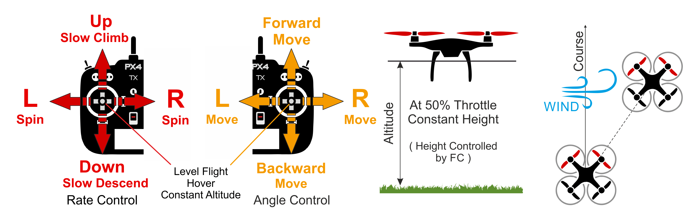

# Altitude Mode (Multicopter)

&nbsp;&nbsp;

_Altitude mode_ is a _relatively_ easy-to-fly RC mode in which roll and pitch sticks control vehicle movement in the left-right and forward-back directions (relative to the "front" of the vehicle), yaw stick controls rate of rotation over the horizontal plane, and throttle controls speed of ascent-descent.

When the sticks are released/centered the vehicle will level and maintain the current _altitude_.
If moving in the horizontal plane the vehicle will continue until any momentum is dissipated by wind resistance.
If the wind blows the aircraft will drift in the direction of the wind.

:::tip
_Altitude mode_ is the safest non-GPS manual mode for new fliers. It is just like [Stabilized](../flight_modes_mc/manual_stabilized.md) mode but additionally locks the vehicle altitude when the sticks are released.
:::

The diagram below shows the mode behaviour visually (for a [mode 2 transmitter](../getting_started/rc_transmitter_receiver.md#transmitter_modes)).

## Technical Summary

RC/manual mode like [Stabilized mode](../flight_modes_mc/manual_stabilized.md) but with _altitude stabilization_ (centred sticks level vehicle and hold it to fixed altitude).
The horizontal position of the vehicle can move due to wind (or pre-existing momentum).

- Centered sticks (inside deadband):
  - RPY sticks levels vehicle.
  - Throttle (~50%) holds current altitude steady against wind.
- Outside center:
  - Roll/Pitch sticks control tilt angle in respective orientations, resulting in corresponding left-right and forward-back movement.
  - Throttle stick controls up/down speed with a predetermined maximum rate (and movement speed in other axes).
  - Yaw stick controls rate of angular rotation above the horizontal plane.
- Takeoff:
  - When landed, the vehicle will take off if the throttle stick is raised above 62.5% percent (of the full range from bottom).
- Altitude is normally measured using a barometer, which may become inaccurate in extreme weather conditions.
  Vehicles that include a LIDAR/range sensor will be able to control altitude with greater reliability and accuracy.
- Manual control input is required (such as RC control, joystick).
  - Roll, Pitch: Assistance from autopilot to stabilize the attitude.
    Position of RC stick maps to the orientation of vehicle.
  - Throttle: Assistance from autopilot to hold position against wind.
  - Yaw: Assistance from autopilot to stabilize the attitude rate.
    Position of RC stick maps to the rate of rotation of vehicle in that orientation.

## Parameters

The mode is affected by the following parameters:

| Parameter                                                                                                   | Description                                                                                                                                                                                                                                                                                         |
| ----------------------------------------------------------------------------------------------------------- | --------------------------------------------------------------------------------------------------------------------------------------------------------------------------------------------------------------------------------------------------------------------------------------------------- |
| [MPC_Z_VEL_MAX_UP](../advanced_config/parameter_reference.md#MPC_Z_VEL_MAX_UP) | Maximum vertical ascent velocity. Default: 3 m/s.                                                                                                                                                                                                                                                   |
| [MPC_Z_VEL_MAX_DN](../advanced_config/parameter_reference.md#MPC_Z_VEL_MAX_DN) | Maximum vertical descent velocity. Default: 1 m/s.                                                                                                                                                                                                                                                  |
| `RCX_DZ`                                                                                 | RC dead zone for channel X. The value of X for throttle will depend on the value of [RC_MAP_THROTTLE](../advanced_config/parameter_reference.md#RC_MAP_THROTTLE). For example, if the throttle is channel 4 then [RC4_DZ](../advanced_config/parameter_reference.md#RC4_DZ) specifies the deadzone. |
| `MPC_XXXX`                                                                              | Most of the MPC_xxx parameters affect flight behaviour in this mode (at least to some extent). For example, [MPC_THR_HOVER](../advanced_config/parameter_reference.md#MPC_THR_HOVER) defines the thrust at which a vehicle will hover.                                                              |
