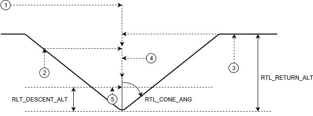

# Return Mode (Multicopter)

The _Return_ flight mode is used to _fly a vehicle to safety_ on an unobstructed path to a safe destination, where it can land.

Multicopters use a [home/rally point return type](../flight_modes/return.md#home-rally-point-return-type-rtl-type-0) by default.
In this return type vehicles ascend to a safe altitude above obstructions if needed, fly directly to the closest safe landing point (a rally point or the home position), descend to the "descent altitude", wait briefly, and then land.
The return altitude, descent altitude, and landing delay are normally set to conservative "safe" values, but can be changed if needed.

Multicopter supports the [other PX4 return types](../flight_modes/return.md#return-types-rtl-type), including mission landing, mission path and closest safe destination.
The default type is recommended.

::: info

- Mode is automatic - no user intervention is _required_ to control the vehicle.
- Mode requires a global 3d position estimate (from GPS or inferred from a [local position](../ros/external_position_estimation.md#enabling-auto-modes-with-a-local-position)).
  - Flying vehicles can't switch to this mode without global position.
  - Flying vehicles will failsafe if they lose the position estimate.
- Mode requires home position is set.
- Mode prevents arming (vehicle must be armed when switching to this mode).
- RC control switches can be used to change flight modes on any vehicle.
- RC stick movement will [by default](#COM_RC_OVERRIDE) change the vehicle to [Position mode](../flight_modes_mc/position.md) unless handling a critical battery failsafe.

<!-- https://github.com/PX4/PX4-Autopilot/blob/main/src/modules/commander/ModeUtil/mode_requirements.cpp -->

:::

## Technical Summary

Multicopters use the [home/rally point return type](../flight_modes/return.md#home-rally-point-return-type-rtl-type-0) by default.
For this return type the copter:

- Ascends to the [minimum return altitude](#minimum-return-altitude) (safely above any expected obstacles).
  The vehicle maintains its initial altitude if that is higher than the minimum return altitude.
- Flies via a direct constant-altitude path to the safe landing point, which will be the nearest of any rally points and the home position.
- On arrival at its destination, it rapidly descends to the "descent altitude" ([RTL_DESCEND_ALT](#RTL_DESCEND_ALT)).
- It waits for a configurable time ([RTL_LAND_DELAY](#RTL_LAND_DELAY)), which may be used for deploying landing gear.
- Then lands.

### Minimum Return Altitude

By default the _minimum return altitude_ is set using [RTL_RETURN_ALT](#RTL_RETURN_ALT), and the vehicle will just return at the higher of `RTL_RETURN_ALT` or the initial vehicle altitude.

The minimum return altitude can be further configured using [RTL_CONE_ANG](#RTL_CONE_ANG), which together with [RTL_RETURN_ALT](#RTL_RETURN_ALT) defines a half cone centered around the destination landing point.
The cone angle allows a lower minimum return altitude when the return mode is executed close to the destination.
This is useful when there are few obstacles near the destination, because it may reduce the minimum height that the vehicle needs to ascend before landing, and hence power consumption and time to land.

The cone affects the minimum return altitude if return mode is triggered within the cylinder defined by the maximum cone radius and `RTL_RETURN_ALT`: outside this cyclinder `RTL_RETURN_ALT` is used.
Inside the code the minimum return altitude is the intersection of the vehicle position with the cone, or `RTL_DESCEND_ALT` (whichever is higher).
In other words, the vehicle must always ascend to at least `RTL_DESCEND_ALT` if below that value.

For more information on this return type see [Home/Rally Point Return Type (RTL_TYPE=0)](../flight_modes/return.md#home-rally-point-return-type-rtl-type-0)

## Parameters

The RTL parameters are listed in [Parameter Reference > Return Mode](../advanced_config/parameter_reference.md#return-mode).

The parameters that are relevant to multicopter (assuming the [RTL_TYPE](../advanced_config/parameter_reference.md#RTL_TYPE) is set to 0) are listed below.

| Parameter                                                                                                | Description                                                                                                                                                                                                                                                                                                                                                      |
| -------------------------------------------------------------------------------------------------------- | ---------------------------------------------------------------------------------------------------------------------------------------------------------------------------------------------------------------------------------------------------------------------------------------------------------------------------------------------------------------- |
| [RTL_RETURN_ALT](../advanced_config/parameter_reference.md#RTL_RETURN_ALT)    | Return altitude in meters (default: 60m) when [RTL_CONE_ANG](../advanced_config/parameter_reference.md#RTL_CONE_ANG) is 0. If already above this value the vehicle will return at its current altitude.                                                                                                                                                          |
| [RTL_DESCEND_ALT](../advanced_config/parameter_reference.md#RTL_DESCEND_ALT) | Minimum return altitude and altitude at which the vehicle will slow or stop its initial descent from a higher return altitude (default: 30m)                                                                                                                                                                                                                     |
| [RTL_LAND_DELAY](../advanced_config/parameter_reference.md#RTL_LAND_DELAY)    | Time to hover at `RTL_DESCEND_ALT` before landing (default: 0.5s) -by default this period is short so that the vehicle will simply slow and then land immediately. If set to -1 the system will loiter at `RTL_DESCEND_ALT` rather than landing. The delay is provided to allow you to configure time for landing gear to be deployed (triggered automatically). |
| [RTL_MIN_DIST](../advanced_config/parameter_reference.md#RTL_MIN_DIST)          | Minimum horizontal distance from home position to trigger ascent to the return altitude specified by the "cone". If the vehicle is horizontally closer than this distance to home, it will return at its current altitude or `RTL_DESCEND_ALT` (whichever is higher) instead of first ascending to RTL_RETURN_ALT).                                              |
| [RTL_CONE_ANG](../advanced_config/parameter_reference.md#RTL_CONE_ANG)          | Half-angle of the cone that defines the vehicle RTL return altitude. Values (in degrees): 0, 25, 45, 65, 80, 90. Note that 0 is "no cone" (always return at `RTL_RETURN_ALT` or higher), while 90 indicates that the vehicle must return at the current altitude or `RTL_DESCEND_ALT` (whichever is higher).                                                     |
| [COM_RC_OVERRIDE](../advanced_config/parameter_reference.md#COM_RC_OVERRIDE) | Controls whether stick movement on a multicopter (or VTOL in MC mode) causes a mode change to [Position mode](../flight_modes_mc/position.md) (except when vehicle is handling a critical battery failsafe). This can be separately enabled for auto modes and for offboard mode, and is enabled in auto modes by default.                                       |
| [COM_RC_STICK_OV](../advanced_config/parameter_reference.md#COM_RC_STICK_OV) | The amount of stick movement that causes a transition to [Position mode](../flight_modes_mc/position.md) (if [COM_RC_OVERRIDE](#COM_RC_OVERRIDE) is enabled).                                                                                                                                                                                                    |

## See Also

- [Return Mode (Generic)](../flight_modes/return.md)
- [Return Mode (Fixed-Wing)](../flight_modes_fw/return.md)
- [Return Mode (VTOL)](../flight_modes_vtol/return.md)
