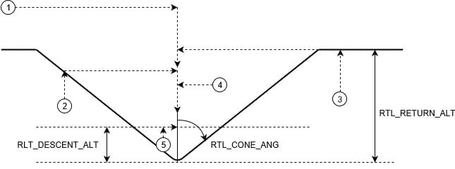

# Return Mode (Multicopter)

The _Return_ flight mode is used to _fly a vehicle to safety_ on an unobstructed path to a safe destination, where it can land.

Multicopters use a [home/rally point return type](../flight_modes/return.md#home_return) by default.
In this return type vehicles ascend to a safe altitude above obstructions if needed, fly to the closest safe landing point (a rally point or the home position) via the shortest horizontal [geofence-aware path](../flight_modes/return.md#geofence_awareness), descend to the "descent altitude", wait briefly, and then land.
The return altitude, descent altitude, and landing delay are normally set to conservative "safe" values, but can be changed if needed.

Multicopter supports the [other PX4 return types](../flight_modes/return.md#return_types), including mission landing, mission path and closest safe destination.
The default type is recommended.

::: info

- Mode is automatic - no user intervention is _required_ to control the vehicle.
- Mode requires a global 3d position estimate (from GPS or inferred from a [local position](../ros/external_position_estimation.md#enabling-auto-modes-with-a-local-position)).
  - Flying vehicles can't switch to this mode without global position.
  - Flying vehicles will failsafe if they lose the position estimate.
- Mode requires home position is set.
- Mode prevents arming (vehicle cannot be armed while this mode is selected).
- RC control switches can be used to change flight modes on any vehicle.
- Stick movement will [by default](#MAN_OVERRIDE_SPD) change the vehicle to [Position mode](../flight_modes_mc/position.md) unless prevented by the active failsafe state.

<!-- https://github.com/PX4/PX4-Autopilot/blob/main/src/modules/commander/ModeUtil/mode_requirements.cpp -->

:::

## Technical Summary

Multicopters use the [home/rally point return type](../flight_modes/return.md#home_return) by default. ([RTL_TYPE=0](../advanced_config/parameter_reference.md#RTL_TYPE)).
For this return type the copter:

- Ascends to the [minimum return altitude](#minimum-return-altitude) (safely above any expected obstacles).
  The vehicle maintains its initial altitude if that is higher than the minimum return altitude.
- Flies via a constant-altitude path to the safe landing point, which will be the nearest of any rally points and the home position.
  The path is chosen to be the shortest horizontal [geofence-aware path](../flight_modes/return.md#geofence_awareness).
- On arrival at its destination, it rapidly descends to the "descent altitude" ([RTL_DESCEND_ALT](#RTL_DESCEND_ALT)).
- It waits for a configurable time ([RTL_LAND_DELAY](#RTL_LAND_DELAY)), which may be used for deploying landing gear.
- Then lands.

### Minimum Return Altitude

By default the _minimum return altitude_ is set using [RTL_RETURN_ALT](#RTL_RETURN_ALT), and the vehicle will just return at the higher of `RTL_RETURN_ALT` or the initial vehicle altitude.

The minimum return altitude can be further configured using [RTL_CONE_ANG](#RTL_CONE_ANG) and [RTL_MIN_DIST](#RTL_MIN_DIST), which together with [RTL_RETURN_ALT](#RTL_RETURN_ALT) define a half cone centered around the destination landing point.
Within `RTL_MIN_DIST` of the destination, the return altitude is calculated from the cone geometry rather than set directly to `RTL_RETURN_ALT`, allowing a lower minimum return altitude when close to the destination.
This is useful when there are few obstacles near the destination, as it may reduce the height the vehicle needs to ascend before landing, and hence power consumption and time to land.

The cone affects the minimum return altitude if return mode is triggered within the cylinder defined by the maximum cone radius ([RTL_MIN_DIST](#RTL_MIN_DIST)) and `RTL_RETURN_ALT`: outside this cylinder `RTL_RETURN_ALT` is used.
Inside the cone, the vehicle returns at an altitude calculated from the cone geometry, up to `RTL_RETURN_ALT`.
After reaching the destination, it descends to `RTL_DESCEND_ALT` (if above that altitude) before landing or loitering.

For more information on this return type see [Home/Rally Point Return Type (RTL_TYPE=0)](../flight_modes/return.md#home_return)

## Parameters

The RTL parameters are listed in [Parameter Reference > Return Mode](../advanced_config/parameter_reference.md#return-mode).

The parameters that are relevant to multicopter (assuming the [RTL_TYPE](../advanced_config/parameter_reference.md#RTL_TYPE) is set to 0) are listed below.

| Parameter                                                                                                   | Description                                                                                                                                                                                                                                                                                                                                                                                                                                                                                   |
| ----------------------------------------------------------------------------------------------------------- | --------------------------------------------------------------------------------------------------------------------------------------------------------------------------------------------------------------------------------------------------------------------------------------------------------------------------------------------------------------------------------------------------------------------------------------------------------------------------------------------- |
| [RTL_RETURN_ALT](../advanced_config/parameter_reference.md#RTL_RETURN_ALT)       | Return altitude in meters (default: 60m) when [RTL_CONE_ANG](../advanced_config/parameter_reference.md#RTL_CONE_ANG) is 0. If already above this value the vehicle will return at its current altitude.                                                                                                                                                                                                                                                                                       |
| [RTL_DESCEND_ALT](../advanced_config/parameter_reference.md#RTL_DESCEND_ALT)    | Altitude above the destination used for the final descent before landing or loitering (default: 30m).                                                                                                                                                                                                                                                                                                                                                                                         |
| [RTL_LAND_DELAY](../advanced_config/parameter_reference.md#RTL_LAND_DELAY)       | Time to hover at `RTL_DESCEND_ALT` before landing (default: 0.5s) - by default this period is short so that the vehicle will simply slow and then land immediately. If set to -1 the system will loiter at `RTL_DESCEND_ALT` rather than landing. The delay is provided to allow you to configure time for landing gear to be deployed (triggered automatically).                                                                                                                             |
| [RTL_MIN_DIST](../advanced_config/parameter_reference.md#RTL_MIN_DIST)             | Within this distance from the home position, the return altitude is calculated from the "cone" rather than directly from `RTL_RETURN_ALT`.                                                                                                                                                                                                                                                                                                                                                    |
| [RTL_CONE_ANG](../advanced_config/parameter_reference.md#RTL_CONE_ANG)             | Half-angle of the cone that defines the vehicle RTL return altitude. Values (in degrees): `0`, `25`, `45`, `65`, `80`, `90`. Note that `0` is "no cone" (always return at `RTL_RETURN_ALT` or higher), while `90` indicates an almost vertical cone, so the vehicle generally returns at its current altitude when close to the destination. The return altitude may still be constrained to avoid flying too low while approaching the destination.                                          |
| [MAN_OVERRIDE_SPD](../advanced_config/parameter_reference.md#MAN_OVERRIDE_SPD) | Speed (normalized stick travel per second) above which moving the sticks controlling a multicopter (or VTOL in hover) gives control back to the pilot by switching to [Position mode](../flight_modes_mc/position.md) (or Altitude mode if position is unavailable). At the default value of 1 a half-stick movement in ~0.5 s triggers it; lower is more sensitive. A stick held statically has zero speed and will not trigger. Set to -1 to disable. <Badge type="tip" text="PX4 v1.18" /> |

## See Also

- [Return Mode (Generic)](../flight_modes/return.md)
- [Return Mode (Fixed-Wing)](../flight_modes_fw/return.md)
- [Return Mode (VTOL)](../flight_modes_vtol/return.md)
