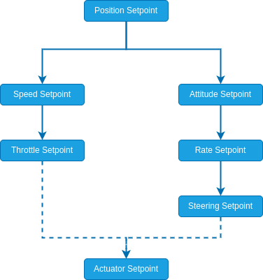

# Apps & API
The rover modules have been tested and integrated with a subset of the available [Apps & API](../middleware/index.md) methods. \
We specifically provide guides for using [ROS 2](../ros2/index.md) to interface a companion computer with PX4 via [uXRCE-DDS](../middleware/uxrce_dds.md).

| Method                                                    | Description                                                                                                                                       |
| --------------------------------------------------------- | ------------------------------------------------------------------------------------------------------------------------------------------------- |
| (Recommended) [PX4 ROS 2 Interface](#px4-ros-2-interface) | Register a custom mode and publish [RoverSetpointTypes](../ros2/px4_ros2_control_interface.md#experimental-rover-setpoints).                      |
| [ROS 2 Offboard Control](#ros-2-offboard-control)         | Use the PX4 internal [Offboard Mode](../flight_modes/offboard.md) and publish messages defined in [dds_topics.yaml](../middleware/dds_topics.md). |

## PX4 ROS 2 Interface
We recommend the use of the [PX4 ROS 2 Interface Library](../ros2/px4_ros2_interface_lib.md) which allows you to register a custom drive mode and exposes [RoverSetpointTypes](../ros2/px4_ros2_control_interface.md#experimental-rover-setpoints). By using these setpoints instead of directly the PX4 internal rover setpoints, you are guaranteed to send valid control inputs to your vehicle and the control flags are automatically set for you.
Additionally, registering a custom drive mode instead of using [ROS 2 Offboard Control](#ros-2-offboard-control) provides all the advantages listed [here](#) (TODO add advantages list).

To get familiar with this method, read through the guide for the [PX4 ROS 2 Interface Library](../ros2/px4_ros2_interface_lib.md) and have a look at the example for rover that can be found here TODO add link

## ROS 2 Offboard Control
[ROS 2 Offboard Control](../ros2/offboard_control.md) uses the PX4 internal [Offboard Mode](../flight_modes/offboard.md). All topics specified in [dds_topics.yaml](../middleware/dds_topics.md) can be subscribed/published to. However, the rover modules do not support all of these topics (see [Supported Setpoints](#supported-setpoints)).
Unlike the [RoverSetpointTypes](../ros2/px4_ros2_control_interface.md#experimental-rover-setpoints) exposed through the [PX4 ROS 2 Interface](#px4-ros-2-interface), there is no guarantee that the published setpoints lead to a valid control input and the correct control mode flags must be set through [OffboardControlMode](../msg_docs/OffboardControlMode.md). This requries a deeper understanding of PX4 and the structure of the rover modules. \
For general information on setting up offboard mode read through [Offboard Mode](../flight_modes/offboard.md) and then consult [Supported Setpoints](#supported-setpoints).

### Supported Setpoints

The following setpoints are supported by the rover modules

| Category                         | Usage                   | Setpoints                                                                                                                                                                                                                                                                                                                                                                  |
| -------------------------------- | ----------------------- | -------------------------------------------------------------------------------------------------------------------------------------------------------------------------------------------------------------------------------------------------------------------------------------------------------------------------------------------------------------------------- |
| (Recommended) Rover Setpoints    | General rover control   | [RoverPositionSetpoint](../msg_docs/RoverPositionSetpoint.md), [RoverSpeedSetpoint](../msg_docs/RoverSpeedSetpoint.md), [RoverAttitudeSetpoint](../msg_docs/RoverAttitudeSetpoint.md), [RoverRateSetpoint](../msg_docs/RoverRateSetpoint.md), [RoverThrottleSetpoint](../msg_docs/RoverThrottleSetpoint.md), [RoverSteeringSetpoint](../msg_docs/RoverSteeringSetpoint.md) |
| Actuator Setpoints               | Direct actuator control | [ActuatorMotors](../msg_docs/ActuatorMotors.md), [ActuatorServos](../msg_docs/ActuatorServos.md)                                                                                                                                                                                                                                                                           |
| (Deprecated) Trajectory Setpoint | General vehicle control | [TrajectorySetpoint](../msg_docs/TrajectorySetpoint.md)                                                                                                                                                                                                                                                                                                                    |

#### Rover Setpoints

The rover modules use a hierarchical structure to propogate setpoints:

The "highest" setpoint that is provided will be used within the PX4 rover modules to generate the setpoints that are below it (Overriding them!).
With this hierarchy there are clear rules for providing a valid control input:

- Provide a position setpoint **or**
- One of the setpoints on the "left" (speed **or** throttle) **and** one of the setpoints on the "right" (attitude, rate **or** steering). All combinations of "left" and "right" setpoints are valid.

The following are all valid setpoint combinations and their respective control flags that must be set trough [OffboardControlMode](../msg_docs/OffboardControlMode.md) (set all others to _false_). Additionally, for some combinations we require certain setpoints to be published with `NAN` values s.t. the setpoints of interest are not overridden by the rover module (due to the hierearchy above). \
&check; are the relevant setpoints we publish, and &cross; are the setpoint that need to be published with `NAN` values.

| Setpoint Combination | Control Flag      | [RoverPositionSetpoint](../msg_docs/RoverPositionSetpoint.md) | [RoverSpeedSetpoint](../msg_docs/RoverSpeedSetpoint.md) | [RoverThrottleSetpoint](../msg_docs/RoverThrottleSetpoint.md) | [RoverAttitudeSetpoint](../msg_docs/RoverAttitudeSetpoint.md) | [RoverRateSetpoint](../msg_docs/RoverRateSetpoint.md) | [RoverSteeringSetpoint](../msg_docs/RoverSteeringSetpoint.md) |
| -------------------- | ----------------- | ------------------------------------------------------------- | ------------------------------------------------------- | ------------------------------------------------------------- | ------------------------------------------------------------- | ----------------------------------------------------- | ------------------------------------------------------------- |
| Position             | position          | &check;                                                       |                                                         |                                                               |                                                               |                                                       |                                                               |
| Speed + Attitude     | velocity          |                                                               | &check;                                                 |                                                               | &check;                                                       |                                                       |                                                               |
| Speed + Rate         | velocity          |                                                               | &check;                                                 |                                                               | &cross;                                                       | &check;                                               |                                                               |
| Speed + Steering     | velocity          |                                                               | &check;                                                 |                                                               | &cross;                                                       | &cross;                                               | &check;                                                       |
| Throttle + Attitude  | attitude          |                                                               |                                                         | &check;                                                       | &check;                                                       |                                                       |                                                               |
| Throttle + Rate      | body_rate         |                                                               |                                                         | &check;                                                       |                                                               | &check;                                               |                                                               |
| Throttle + Steering  | thrust_and_torque |                                                               |                                                         | &check;                                                       |                                                               |                                                       | &check;                                                       |

::: note
If you intend to use the rover setpoints, we recommend using the [PX4 ROS 2 Interface](#px4-ros-2-interface) instead since it simplifies the publishing of these setpoints.
:::

#### Actuator Setpoints

The actuators can be direclty controlled using [ActuatorMotors](../msg_docs/ActuatorMotors.md) and [ActuatorServos](../msg_docs/ActuatorServos.md). In [OffboardControlMode](../msg_docs/OffboardControlMode.md) set `direct_actuator` to _true_ and all other flags to _false_.

::: note
This bypasses the rover modules including any limits on steering rates or accelerations and the inverse kinematics step. We recommend using [RoverSteeringSetpoint](../msg_docs/RoverSteeringSetpoint.md) and [RoverThrottleSetpoint](../msg_docs/RoverThrottleSetpoint.md) instead for low level control (see [Rover Setpoints](#rover-setpoints)).
:::

#### (Deprecated) Trajectory Setpoint

::: warning
The [Rover Setpoints](#rover-setpoints) are a replacement for the [TrajectorySetpoint](../msg_docs/TrajectorySetpoint.md) and we highly recommend using those instead as they have a well defined behaviour and offer more flexibility and options.
:::

The rover modules support the _position_, _velocity_ and _yaw_ fields of the [TrajectorySetpoint](../msg_docs/TrajectorySetpoint.md). However, only one of the fields is active at a time and is defined by the flags of [OffboardControlMode](../msg_docs/OffboardControlMode.md):

| Control Mode Flag | Active Trajectory Setpoint Field |
| ----------------- | -------------------------------- |
| position          | position                         |
| velocity          | velocity                         |
| attitude          | yaw                              |

::: note
Ackermann rovers do not support the yaw setpoint.
:::
